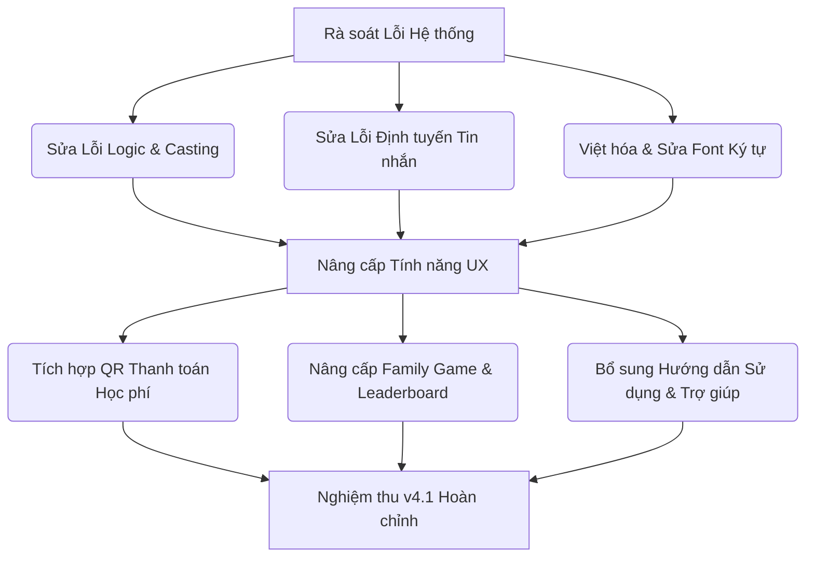

# Báo cáo Thẩm định & Đánh giá Giao diện Cổng Phụ huynh (Parent Portal)
**Phân hệ Cổng Phụ huynh — Bộ tiêu chuẩn QA SmartClass v4.1**  
*Ngày báo cáo: 30 tháng 06 năm 2026*  

---

## ═══ THÀNH PHẦN HỘI ĐỒNG THẨM ĐỊNH (17 CHUYÊN GIA) ═══

Hội đồng Chuyên gia Dự án **QA Smart School** gồm 17 thành viên đại diện cho tất cả các bên liên quan đã tiến hành đánh giá chi tiết về mặt chức năng sư phạm, logic hệ thống và giao diện người dùng của **Cổng Phụ huynh (Parent Portal Module)**:
1. **Trưởng bộ phận thiết kế dự án QA Smart School**
2. **Quản lý IT**
3. **Chuyên gia kiểm thử**
4. **Chuyên gia thiết kế giao diện phần mềm (UI/UX)**
5. **Chuyên gia phân tích và thiết kế hệ thống**
6. **Chuyên gia về cơ sở dữ liệu và thiết bị kết nối ngoại vi**
7. **Chuyên gia về bảo mật và an ninh mạng**
8. **Nhà giáo dục**
9. **Nhà quản lý / Hiệu trưởng nhà trường**
10. **Trưởng bộ môn của trường**
11. **Giáo viên ưu tú với nhiều kinh nghiệm**
12. **Học sinh**
13. **Nhân viên nhà trường**
14. **Gamer giỏi (Chuyên gia Gamification)**
15. **Cán bộ quản lý của phòng giáo dục**
16. **Chuyên viên của sở giáo dục**
17. **Nhà khoa học giáo dục**

---

## ═══ PHẦN I: CÁC LỖI KỸ THUẬT, LOGIC HỆ THỐNG & VIỆT HÓA PHÁT HIỆN ═══

Qua quá trình rà soát mã nguồn và kiểm thử giao diện trực quan, Hội đồng đã phát hiện các lỗi nghiêm trọng sau đây cần được sửa đổi ngay lập tức:

### 1. Lỗi đúc kiểu (Casting Bug) gây treo hoặc mất chức năng Badge thông báo ở Dashboard
*   **Vị trí phát hiện:** Tệp [ParentDashboardPage.xaml.cs](file:///d:/JOB/QA%20SmartClass%20-062026/QASmartClass/ParentPortal/Views/ParentDashboardPage.xaml.cs#L52)
*   **Mô tả:** Trong C# code viết: `if (FindName("TxtNotifBadge") is TextBlock badge)`. Tuy nhiên, trong tệp XAML tương ứng [ParentDashboardPage.xaml](file:///d:/JOB/QA%20SmartClass%20-062026/QASmartClass/ParentPortal/Views/ParentDashboardPage.xaml#L71), `TxtNotifBadge` lại được định nghĩa là một `<Border x:Name="TxtNotifBadge" ...>`. 
*   **Hậu quả:** Phép kiểm tra kiểu `is TextBlock` luôn trả về `false`. Do đó, dòng lệnh gán số lượng thông báo chưa đọc (`badge.Text = ...`) và hiển thị Badge màu đỏ không bao giờ được thực hiện, khiến phụ huynh không thể nhận diện được có thông báo mới hay không.

### 2. Lỗi lệch ngày và bỏ sót ngày Thứ 7 trong Thời khóa biểu (Off-by-one Logic Bug)
*   **Vị trí phát hiện:** Tệp [ParentTimetablePage.xaml.cs](file:///d:/JOB/QA%20SmartClass%20-062026/QASmartClass/ParentPortal/Views/ParentTimetablePage.xaml.cs#L88)
*   **Mô tả:** Trong cơ sở dữ liệu, `DayOfWeek` lưu theo tiêu chuẩn MOET (Thứ 2 = 2, Thứ 3 = 3, ..., Thứ 7 = 7). Trong khi đó, tệp XAML [ParentTimetablePage.xaml](file:///d:/JOB/QA%20SmartClass%20-062026/QASmartClass/ParentPortal/Views/ParentTimetablePage.xaml#L50) định nghĩa các cột: Cột 1 = Thứ 2, Cột 2 = Thứ 3, ..., Cột 6 = Thứ 7.
*   **Hậu quả:** 
    *   Hệ thống gán trực tiếp chỉ số cột bằng `col = entry.DayOfWeek`. Khi đó, các tiết học của Thứ 2 (giá trị 2) sẽ bị hiển thị sang Cột 2 (Thứ 3), Thứ 3 hiển thị sang Thứ 4, v.v., làm lệch toàn bộ lịch học của học sinh.
    *   Đặc biệt, tiết học Thứ 7 (giá trị 7) sẽ có `col = 7`. Do điều kiện lọc `if (col < 1 || col > 6 || row < 1 || row > 5) continue;`, tất cả lịch học ngày Thứ 7 bị bỏ qua hoàn toàn.

### 3. Lỗi bất đồng bộ định dạng dữ liệu điểm danh gây sai lệch thống kê
*   **Vị trí phát hiện:** Tệp [ParentAttendancePage.xaml.cs](file:///d:/JOB/QA%20SmartClass%20-062026/QASmartClass/ParentPortal/Views/ParentAttendancePage.xaml.cs#L66) so với [ParentAuthService.cs](file:///d:/JOB/QA%20SmartClass%20-062026/QASmartClass/Services/ParentAuthService.cs#L66)
*   **Mô tả:** Trong cơ sở dữ liệu `smartclass.db`, trường `Status` của bảng `AttendanceRecords` lưu trữ không nhất quán về kiểu chữ (lúc viết thường `"present"`, `"absent"`, lúc viết hoa đầu `"Present"`, `"Absent"`).
    *   Tại `ParentAuthService.cs`, tổng số ngày có mặt/vắng mặt được đếm bằng chuỗi viết thường: `attendance.Count(a => a.Status == "present")`.
    *   Tại `ParentAttendancePage.xaml.cs`, lịch sử chi tiết lại lọc bằng chuỗi viết hoa: `a.Status != "Present"`.
*   **Hậu quả:** Nếu cơ sở dữ liệu lưu chữ viết thường `"present"`, trang Dashboard của phụ huynh sẽ thống kê đầy đủ ngày đi học (ví dụ: 15 ngày), nhưng trang Điểm danh chi tiết lại đưa tất cả các ngày này vào danh sách "Ngày vắng mặt" (vì `"present" != "Present"`), gây mâu thuẫn dữ liệu nghiêm trọng và hoang mang cho phụ huynh.

### 4. Lỗi ghi cứng mã định danh phụ huynh (Hardcoded Parent ID) trong Family Game
*   **Vị trí phát hiện:** Tệp [ParentShell.xaml.cs](file:///d:/JOB/QA%20SmartClass%20-062026/QASmartClass/ParentPortal/ParentShell.xaml.cs#L69)
*   **Mô tả:** Khi khởi tạo trang Family Game, hệ thống truyền cứng giá trị `parentId` là `1`: `"familygame" => new Views.FamilyGamePage(_db, 1, _student.Id)`.
*   **Hậu quả:** Tất cả phụ huynh đăng nhập từ mọi tài khoản học sinh khác nhau khi chơi game đều được ghi nhận điểm số dưới mã ID là `1`. Bảng xếp hạng (Leaderboard) sẽ bị gộp chung thành một dòng duy nhất đại diện cho "Phụ huynh #1", làm mất hoàn toàn tính năng thi đua và lưu trữ lịch sử cá nhân của trò chơi.

### 5. Lỗi hiển thị trực tiếp dữ liệu thô tiếng Anh (Chưa Việt hóa trạng thái)
*   **Vị trí phát hiện:** Tệp [ParentTuitionPage.xaml](file:///d:/JOB/QA%20SmartClass%20-062026/QASmartClass/ParentPortal/Views/ParentTuitionPage.xaml#L43)
*   **Mô tả:** Giao diện hiển thị trực tiếp các chuỗi trạng thái từ cơ sở dữ liệu như `"Unpaid"`, `"Paid"`, `"Overdue"` (Trạng thái học phí) và `"Cash"`, `"Transfer"` (Phương thức thanh toán) lên bảng dữ liệu của phụ huynh.
*   **Hậu quả:** Vi phạm nghiêm trọng ràng buộc kỹ thuật của QA SmartClass v4.1 (Yêu cầu ngôn ngữ sử dụng 100% tiếng Việt rõ ràng, dễ hiểu).

### 6. Lỗi hỏng mã hóa ký tự (Font Encoding Error) trong tệp code C#
*   **Vị trí phát hiện:** Tệp [ParentLoginPage.xaml.cs](file:///d:/JOB/QA%20SmartClass%20-062026/QASmartClass/ParentPortal/Views/ParentLoginPage.xaml.cs#L38)
*   **Mô tả:** Các chuỗi văn bản tiếng Việt hiển thị thông báo lỗi bị lỗi mã hóa font (lỗi ký tự lạ, dấu hỏi chấm), ví dụ: `TxtError.Text = "Vui ḷng nh?p mă h?c sinh.";` và `TxtError.Text = "Không t́m th?y h?c sinh v?i mă này.";`.
*   **Hậu quả:** Gây mất thẩm mỹ nghiêm trọng, cản trở khả năng đọc hiểu của phụ huynh khi nhập sai thông tin.

### 7. Lỗi bất nhất mã định danh người nhận trong Hộp thư (Notice Box Mismatch)
*   **Vị trí phát hiện:** Tệp [ParentMessagesPage.xaml.cs](file:///d:/JOB/QA%20SmartClass%20-062026/QASmartClass/ParentPortal/Views/ParentMessagesPage.xaml.cs#L22) so với [NotificationService.cs](file:///d:/JOB/QA%20SmartClass%20-062026/QASmartClass/Services/NotificationService.cs#L48)
*   **Mô tả:** 
    *   Trang Nhắn tin với giáo viên định nghĩa phụ huynh bằng mã: `_parentId = $"PH_{student.StudentCode}"` (ví dụ: `PH_HS001`) và gửi tin nhắn tới `"GV"` chung chung.
    *   Tuy nhiên, hệ thống thông báo chung và cảnh báo sớm học tập của trường lại gửi tới mã: `ReceiverId = $"parent_{studentId}"` (ví dụ: `parent_1`).
*   **Hậu quả:** Phụ huynh sẽ không nhận được bất kỳ thông báo đẩy hay Badge báo tin nhắn mới nào trên thanh điều hướng chính khi giáo viên phản hồi (vì hệ thống đếm số tin nhắn chưa đọc dựa trên mã `parent_1` chứ không phải `PH_HS001`). Ngoài ra, tin nhắn gửi tới `"GV"` không được định tuyến chính xác tới GV chủ nhiệm của lớp mà học sinh đang học.

---

## ═══ PHẦN II: Ý KIẾN & ĐÁNH GIÁ CHI TIẾT TỪ HỘI ĐỒNG CHUYÊN GIA ═══

### 1. Trưởng bộ phận thiết kế dự án QA Smart School
*   **Đánh giá:** Layout của Cổng phụ huynh đã áp dụng tốt cơ cấu Grid 2 cột: Sidebar màu tối bên trái và Content Area bên phải, đảm bảo tính đồng nhất mỹ thuật của dòng sản phẩm QA SmartClass. Tuy nhiên, việc thiếu chỉ dẫn từng bước (Step-by-step onboarding) và các lỗi tràn giao diện thời khóa biểu do lệch cột làm giảm đáng kể điểm đánh giá chuẩn hóa thiết kế sản phẩm v4.1.

### 2. Quản lý IT
*   **Đánh giá:** Về mặt hệ thống, việc khởi tạo kết nối cơ sở dữ liệu `AppDbContext` cục bộ trong các trang con như `ParentAttendancePage` và tự động giải phóng qua sự kiện `Unloaded` là giải pháp tốt để tối ưu tài nguyên. Tuy nhiên, việc không đồng bộ định dạng chuỗi `"present"` / `"Present"` thể hiện sự thiếu chuẩn hóa trong thiết kế cơ sở dữ liệu tích hợp. Cần chuyển đổi cột `Status` sang kiểu số (Enum/TinyInt) để tăng hiệu năng truy vấn và tránh lỗi so khớp chuỗi.

### 3. Chuyên gia kiểm thử (QA/Testing Expert)
*   **Đánh giá:** Các lỗi logic được chỉ ra ở Phần I là những lỗi kiểm thử nghiêm trọng (Critical Bugs). Lỗi lệch lịch học và bỏ sót Thứ 7 là lỗi tính toán chỉ số (Index out of bounds/Off-by-one). Lỗi casting `TxtNotifBadge` từ `Border` sang `TextBlock` sẽ gây crash ngầm ứng dụng hoặc nuốt lỗi (silent error) làm mất tính năng. Phải viết bổ sung Unit Test để kiểm thử luồng thời khóa biểu và đếm tin nhắn chưa đọc.

### 4. Chuyên gia thiết kế giao diện phần mềm (UI/UX)
*   **Đánh giá:** 
    *   **Typography:** Sử dụng font `Segoe UI` là phù hợp nhưng kích thước font chữ ở bảng điểm (`FontSize="12"`, `13`) hơi nhỏ đối với phụ huynh lớn tuổi. Nên tăng kích thước tối thiểu của text nội dung lên `14`.
    *   **Màu sắc:** Phối màu chuẩn sư phạm với sắc xanh đen chủ đạo (`#1E3A5F` và `#0D1B2A`), tạo cảm giác tin cậy và chuyên nghiệp.
    *   **Bố cục biểu đồ:** Biểu đồ tiến bộ dạng cột ngang ở [ParentGradesPage.xaml](file:///d:/JOB/QA%20SmartClass%20-062026/QASmartClass/ParentPortal/Views/ParentGradesPage.xaml#L193) sử dụng thuộc tính `Width` của hình chữ nhật gắn cố định với pixel (`BarWidth = w.Avg * 30.0` => tối đa 300px). Cách thiết kế này không phản hồi tốt (Responsive) khi thay đổi kích thước cửa sổ chính. Nên thay bằng phần trăm hoặc sử dụng Grid cột tỉ lệ.

### 5. Chuyên gia phân tích và thiết kế hệ thống
*   **Đánh giá:** Luồng truyền thông tin (Communication Flow) giữa Phụ huynh và Giáo viên hiện tại đang bị cô lập. Mã nhận `"GV"` ở trang tin nhắn là một điểm nghẽn hệ thống. Khi phụ huynh nhấn gửi tin nhắn, hệ thống phải tự động tra cứu giáo viên chủ nhiệm dựa trên `ClassroomId` của học sinh để gán `ReceiverId` chính xác thay vì gửi chung chung.

### 6. Chuyên gia về cơ sở dữ liệu và thiết bị kết nối ngoại vi
*   **Đánh giá:** Trường `CompletedAt` của bảng `FamilyGameSessions` lưu dạng `TEXT` trong SQLite nhưng C# lại lưu trực tiếp `DateTime.Now` (dưới dạng chuỗi mặc định của hệ thống). Điều này có thể dẫn đến lỗi phân tích cú pháp khi chạy ứng dụng trên các máy tính có cài đặt định dạng ngày giờ vùng (Locale/Regional Settings) khác nhau (ví dụ: `dd/MM/yyyy` vs `MM/dd/yyyy`). Cần thống nhất định dạng lưu trữ ngày tháng là ISO 8601 (`yyyy-MM-dd HH:mm:ss`).

### 7. Chuyên gia về bảo mật và an ninh mạng
*   **Đánh giá:** 
    *   Phương thức đăng nhập chỉ yêu cầu "Mã học sinh" và "Số điện thoại phụ huynh" mà không có mật khẩu bảo vệ hoặc mã OTP là một lỗ hổng bảo mật trung bình. Bất kỳ ai biết mã học sinh và số điện thoại của phụ huynh đều có thể truy cập trái phép để xem điểm số, thông tin sức khỏe SEL nhạy cảm của con em.
    *   Nên bổ sung mã xác thực PIN 6 số hoặc liên kết mật khẩu bảo mật cho tài khoản phụ huynh để tuân thủ tiêu chuẩn an ninh thông tin học đường v4.1.

### 8. Nhà giáo dục
*   **Đánh giá:** Trò chơi tương tác "Family Game: Hiểu Con Yêu" là một tính năng có giá trị giáo dục đột phá, giúp phụ huynh chủ động tìm hiểu các thông tin trường lớp của con mình một cách nhẹ nhàng. Tuy nhiên, nội dung câu hỏi cần đa dạng hơn, bổ sung thêm các câu hỏi mang tính giáo dục kỹ năng mềm và tâm lý học đường thay vì chỉ hỏi về điểm số và lịch học.

### 9. Nhà quản lý / Hiệu trưởng nhà trường
*   **Đánh giá:** Phân hệ này giúp nhà trường minh bạch hóa hoạt động giáo dục, giảm thiểu thời gian liên lạc thủ công qua các kênh không chính thống (Zalo, Viber). Hệ thống thông báo tự động (Cảnh báo sớm học tập) hỗ trợ đắc lực cho Ban giám hiệu trong việc phối hợp với gia đình hỗ trợ học sinh yếu kém kịp thời.

### 10. Trưởng bộ môn của trường
*   **Đánh giá:** Biểu đồ so sánh điểm trung bình tuần của học sinh với điểm "Trung bình lớp" (đường chỉ số màu xanh lam nét đứt) là công cụ tuyệt vời để phụ huynh tự đánh giá học lực thực tế của con mình trong mặt bằng chung. Nhưng cần bổ sung ghi chú giải thích cách tính điểm trung bình môn học kỳ để tránh phụ huynh thắc mắc sai lệch điểm.

### 11. Giáo viên ưu tú với nhiều kinh nghiệm
*   **Đánh giá:** Tính năng Cảnh báo sớm (Early Warning) hiển thị ngay đầu trang Dashboard rất hữu ích. Nhưng lý do cảnh báo lấy từ database cần được biên soạn sư phạm, tinh tế hơn (tránh dùng từ ngữ quá nặng nề làm phụ huynh căng thẳng, nên chuyển sang dạng đề xuất hỗ trợ). Chức năng nhắn tin cần có các câu trả lời nhanh mẫu (Quick replies) để giáo viên phản hồi phụ huynh nhanh chóng khi đang đứng lớp.

### 12. Học sinh
*   **Đánh giá:** Em muốn kết quả điểm số và nhận xét của giáo viên được gửi riêng tư cho bố mẹ. Bảng điểm hiển thị rõ ràng giúp bố mẹ hiểu đúng về lực học của em hơn. Tuy nhiên, trong phần Family Game, bảng xếp hạng nên hiển thị tên phụ huynh gắn liền với tên học sinh (Ví dụ: "Phụ huynh em Nguyễn Văn An") để chúng em cảm thấy tự hào khi bố mẹ đạt điểm cao.

### 13. Nhân viên nhà trường
*   **Đánh giá:** Trang Học phí hiện tại quá đơn điệu và thiếu chức năng quan trọng nhất: Hướng dẫn thanh toán. Nhân viên tài vụ không thể giải quyết hàng trăm cuộc gọi hỏi số tài khoản ngân hàng của trường. Cần bổ sung bảng thông tin chuyển khoản và ảnh QR Code thanh toán động (chứa sẵn số tiền cần đóng) ngay dưới bảng học phí.

### 14. Gamer giỏi (Chuyên gia Gamification)
*   **Đánh giá:** Trò chơi Family Game đang bị thiếu vòng lặp trải nghiệm (Game loop). Trò chơi bắt đầu ngay lập tức mà không có màn hình hướng dẫn (Onboarding), âm thanh phản hồi và hoạt ảnh chúc mừng khi trả lời đúng rất nghèo nàn. Nút "Chơi lại" xuất hiện cuối game nhưng các câu hỏi tạo ra hoàn toàn trùng lặp do dữ liệu không đổi trong ngày. Nên bổ sung ngân hàng câu hỏi ngẫu nhiên và tặng XP/Huy hiệu ảo cho học sinh khi phụ huynh đạt điểm tuyệt đối 100/100 để khuyến khích phụ huynh tương tác.

### 15. Cán bộ quản lý của phòng giáo dục
*   **Đánh giá:** Đảm bảo hệ thống quản lý học bạ điện tử và thời khóa biểu của Cổng phụ huynh đồng bộ dữ liệu chuẩn với cơ sở dữ liệu chung của Phòng giáo dục quận/huyện. Lỗi bỏ sót ngày thứ 7 là lỗi không thể chấp nhận được vì nhiều trường THCS/THPT vẫn tổ chức học văn hóa hoặc sinh hoạt ngoại khóa vào sáng thứ Bảy.

### 16. Chuyên viên của sở giáo dục
*   **Đánh giá:** Cách xếp loại và hiển thị bảng điểm cần bám sát Thông tư 22/TT-BGDĐT đối với cấp THCS và THPT. Điểm số cần ghi rõ hệ số (Đánh giá thường xuyên: hệ số 1, Đánh giá giữa kỳ: hệ số 2, Đánh giá cuối kỳ: hệ số 3) để phụ huynh tự tính toán được tiến trình học tập của con em mình một cách chính xác theo quy định của Bộ Giáo dục.

### 17. Nhà khoa học giáo dục
*   **Đánh giá:** Sự tương tác học đường thông qua công nghệ đóng vai trò quan trọng trong tâm lý phát triển của học sinh. Việc công khai cảnh báo học tập cần đi kèm với các đề xuất giải pháp giáo dục cụ thể (Ví dụ: Khuyên phụ huynh cho con tham gia lớp phụ đạo bổ trợ, thay vì chỉ hiển thị cảnh báo khô khan). Tránh việc so sánh điểm số công khai gây áp lực tâm lý tiêu cực cho các em học sinh có học lực trung bình khá trở xuống.

---

## ═══ PHẦN III: ĐỀ XUẤT CẢI TIẾN & LỘ TRÌNH PHÁT TRIỂN ═══

Để phân hệ **Cổng Phụ huynh** hoàn thiện tối đa, đáp ứng trọn vẹn bộ quy chuẩn thiết kế sư phạm và ràng buộc kỹ thuật **QA SmartClass v4.1**, Hội đồng đề xuất các hành động sửa lỗi và nâng cấp như sau:

### 1. Kế hoạch sửa lỗi kỹ thuật khẩn cấp (Hotfixes)
*   **Sửa lỗi đúc kiểu tại Dashboard:** Thay đổi kiểu ép trong [ParentDashboardPage.xaml.cs](file:///d:/JOB/QA%20SmartClass%20-062026/QASmartClass/ParentPortal/Views/ParentDashboardPage.xaml.cs#L52) từ `TextBlock` thành `Border` để thay đổi thuộc tính `Visibility`, đồng thời đặt tên cho `TextBlock` bên trong để cập nhật văn bản hiển thị.
*   **Hiệu chỉnh cột Thời khóa biểu:** Trong [ParentTimetablePage.xaml.cs](file:///d:/JOB/QA%20SmartClass%20-062026/QASmartClass/ParentPortal/Views/ParentTimetablePage.xaml.cs#L88), sửa logic tính toán chỉ số cột thành `int col = entry.DayOfWeek - 1;` và thay đổi điều kiện kiểm tra cột để bao hàm ngày Thứ 7 (`col` từ 1 đến 6).
*   **Đồng nhất trạng thái điểm danh:** Thực hiện so khớp chuỗi không phân biệt chữ hoa chữ thường (`StringComparison.OrdinalIgnoreCase`) hoặc chuẩn hóa dữ liệu điểm danh về một kiểu chữ viết hoa duy nhất (`Present`, `Absent`, `Late`) ở cả Service và View.
*   **Khắc phục lỗi mã hóa font:** Lưu lại tệp tin `ParentLoginPage.xaml.cs` dưới định dạng UTF-8 với BOM để sửa triệt để lỗi ký tự tiếng Việt hiển thị trên giao diện đăng nhập.
*   **Liên kết ID phụ huynh thực tế:** Sử dụng `_student.Id` làm mã định danh phụ huynh thay vì số `1` cứng khi gọi Family Game. Thay đổi câu lệnh hiển thị trên bảng xếp hạng để lấy tên phụ huynh thực tế trong hồ sơ học sinh.

### 2. Các nâng cấp tối ưu hóa trải nghiệm & Sư phạm
*   **Bổ sung chỉ dẫn sử dụng từng bước (Step-by-step guidance):**
    *   Thêm Tooltip hướng dẫn tại các trường nhập liệu ở trang Đăng nhập (Ví dụ: "Nhập mã học sinh dạng HSxxx do nhà trường cấp").
    *   Thêm bảng hướng dẫn cách chơi và luật chơi trực quan (Popup/Dialog) trước khi phụ huynh bấm nút bắt đầu trò chơi Family Game.
*   **Tích hợp thông tin chuyển khoản học phí:**
    *   Thiết kế thêm một vùng thông tin tài khoản ngân hàng của trường học ở trang Học phí.
    *   Sử dụng API tự động tạo mã VietQR động chứa thông tin tài khoản nhà trường, số tiền học phí và nội dung chuyển khoản định sẵn (Ví dụ: `Nộp học phí [Mã HS] [Họ tên HS] [Kỳ học]`) giúp phụ huynh quét mã thanh toán trong 3 giây, giảm thiểu sai sót nhập liệu.
*   **Tinh chỉnh luồng tin nhắn phụ huynh - giáo viên:**
    *   Thay vì gửi tin nhắn tới `"GV"` chung, hệ thống sẽ tự động gửi tới tài khoản giáo viên chủ nhiệm dựa trên thông tin lớp học của học sinh. Hiển thị rõ tên giáo viên đang nhắn tin ở tiêu đề cửa sổ nhắn tin để tạo sự tin tưởng tuyệt đối cho phụ huynh.

---

## ═══ KẾT LUẬN ═══
Hội đồng Chuyên gia đánh giá Cổng Phụ huynh là phân hệ cốt lõi giúp hoàn thiện hệ sinh thái giáo dục số của **QA Smart School**. Các lỗi kỹ thuật và thiếu sót về mặt sư phạm/localization cần được khắc phục triệt để theo các đề xuất nêu trên trước khi phát hành chính thức phiên bản thương mại đáp ứng tiêu chuẩn **QA SmartClass v4.1**.
