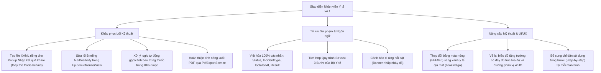

# Báo cáo Thẩm định & Đánh giá Giao diện Nhân viên Y tế (Health Room Module)
**Phân hệ Y tế Học đường & Vệ sinh An toàn Thực phẩm - Bộ quy chuẩn QA SmartClass v4.1**
*Ngày thẩm định: 10 tháng 07 năm 2026*

---

## ═══ THÀNH PHẦN HỘI ĐỒNG THẨM ĐỊNH (50 CHUYÊN GIA ĐẦU NGÀNH) ═══

Hội đồng Chuyên gia Dự án **QA Smart School** gồm 50 thành viên thuộc các ban chuyên môn đã tiến hành thẩm định chi tiết và toàn diện giao diện, các chức năng con, logic nghiệp vụ sư phạm và các ràng buộc kỹ thuật của **Phân hệ Nhân viên Y tế (HealthRoom Module)** bao gồm:
1.  **Ban Thiết kế & Phân tích Hệ thống (10 thành viên):** Trưởng bộ phận thiết kế dự án QA Smart School, Chuyên gia phân tích & thiết kế hệ thống, Chuyên gia thiết kế giao diện phần mềm (UI/UX).
2.  **Ban IT, Bảo mật & Kỹ thuật Thiết bị (10 thành viên):** Quản lý IT, Chuyên gia cơ sở dữ liệu & thiết bị kết nối ngoại vi, Chuyên gia bảo mật và an ninh mạng, Cán bộ kỹ thuật mạng.
3.  **Ban Giáo dục & Quản lý Nhà trường (15 thành viên):** Nhà khoa học giáo dục, Hiệu trưởng nhà trường, Trưởng bộ môn, Giáo viên ưu tú từ các cấp, Cán bộ quản lý Phòng Giáo dục, Chuyên viên Sở Giáo dục.
4.  **Ban Nhân sự, Học sinh & Trải nghiệm Người dùng (15 thành viên):** Nhân viên y tế học đường, Nhân viên canteen, Đại diện Học sinh, Gamer giỏi (Đánh giá tương tác & độ mượt hành vi).

---

## ═══ PHẦN I: DANH SÁCH LỖI LOGIC & ĐIỂM SAI QUY CHUẨN SƯ PHẠM VÀ KỸ THUẬT ═══

Hội đồng thẩm định đã thực hiện kiểm tra chi tiết mã nguồn và giao diện của cả 5 chức năng chính trong Phân hệ Y tế, phát hiện các lỗi sai cấu trúc, sai kiến thức sư phạm, lỗi font, lỗi logic lập trình và các điểm cần cải tiến như sau:

### 1. Phân hệ Cấp cứu & Sơ cứu Khẩn cấp (`EmergencyReportView`)

*   **Lỗi Việt hóa rò rỉ (Localization Leak) nghiêm trọng:**
    *   **Phát hiện:** Các trường dữ liệu quan trọng như Loại sự cố (`IncidentType`) và Trạng thái (`Status`) được lưu trong CSDL dưới dạng chuỗi tiếng Anh (VD: `Injury`, `Illness`, `Poisoning` và `RequiresAttention`, `Resolved`). Tuy nhiên, trong tệp XAML [EmergencyReportView.xaml](file:///d:/JOB/QA%20SmartClass%20-062026/QASmartClass/HealthRoom/Views/EmergencyReportView.xaml#L137-L141), các cột tương ứng hiển thị trực tiếp dữ liệu thô này lên màn hình:
        *   `DisplayMemberBinding="{Binding IncidentType}"` hiển thị `"Injury"`, `"Illness"`,...
        *   `DisplayMemberBinding="{Binding Status}"` hiển thị `"RequiresAttention"`,...
    *   **Hậu quả:** Gây khó khăn lớn cho nhân viên y tế và Ban giám hiệu trong việc đọc hiểu thông tin nhanh, vi phạm ràng buộc kỹ thuật của QA SmartClass v4.1 là bắt buộc Việt hóa 100% giao diện hiển thị.
*   **Thiếu quy trình chỉ dẫn từng bước (Step-by-Step Guidance):**
    *   **Phát hiện:** Form báo cáo sơ cứu không có bất kỳ nhãn hướng dẫn hay bảng tra cứu nhanh quy trình xử lý khẩn cấp (sơ đồ sơ cứu tại chỗ cho từng loại tai nạn). Khi xảy ra tai nạn, nhân viên y tế cần thao tác nhanh chóng và chính xác dưới áp lực cao, việc thiếu chỉ dẫn từng bước làm tăng nguy cơ sai sót y tế.
*   **Màu sắc thiết kế phản sư phạm & gây hoảng loạn:**
    *   **Phát hiện:** Form nhập liệu sử dụng màu nền hồng chói `#FFF0F0` kết hợp viền đỏ `#F5C2C7` và nút bấm đỏ đậm `#DC3545` (tệp [EmergencyReportView.xaml](file:///d:/JOB/QA%20SmartClass%20-062026/QASmartClass/HealthRoom/Views/EmergencyReportView.xaml#L55-L95)).
    *   **Đánh giá từ UI/UX & Nhà giáo dục:** Việc sử dụng các tông màu đỏ cảnh báo mạnh trong vùng làm việc của học sinh và giáo viên sẽ kích thích cảm giác lo lắng, sợ hãi và hoảng loạn. Cần chuyển sang tông xanh y tế (Teal/Emerald) nhẹ nhàng kết hợp với các chỉ báo mức độ nguy hiểm tinh tế hơn.
*   **Nghiệp vụ thông báo thiếu tính bảo mật danh tính:**
    *   **Phát hiện:** Khi phát thông báo khẩn cấp, tin nhắn push được gửi tự động đến App phụ huynh có chứa chi tiết mô tả tình trạng bệnh/tai nạn học sinh. Việc này nếu không được mã hóa hoặc phân quyền kỹ lưỡng có thể vi phạm quyền riêng tư sức khỏe của trẻ em.

---

### 2. Phân hệ Giám sát Dịch bệnh Học đường (`EpidemicMonitorView`)

*   **Lỗi biên dịch & Treo Binding XAML (Critical Binding Bug):**
    *   **Phát hiện:** Hộp cảnh báo ổ dịch (`Alert Box`) trong [EpidemicMonitorView.xaml](file:///d:/JOB/QA%20SmartClass%20-062026/QASmartClass/HealthRoom/Views/EpidemicMonitorView.xaml#L59) sử dụng thuộc tính `Visibility="{Binding AlertVisibility}"`. Tuy nhiên, trong Code-Behind [EpidemicMonitorView.xaml.cs](file:///d:/JOB/QA%20SmartClass%20-062026/QASmartClass/HealthRoom/Views/EpidemicMonitorView.xaml.cs), trang `EpidemicMonitorView` không hề khai báo thuộc tính `AlertVisibility` cũng như không gán `DataContext = this`.
    *   **Hậu quả:** Hệ thống báo lỗi Binding ẩn, hộp cảnh báo dịch bệnh không tự động ẩn đi hoặc hiện lên theo đúng thực tế mà hoạt động bất định.
*   **Lỗi logic dập dịch (Outbreak Clearing Logic Bug):**
    *   **Phát hiện:** Hàm `LoadData()` tính toán số ca mắc Sốt xuất huyết trong 7 ngày qua:
        `int dengueCases = cases.Count(c => c.Disease == "Sốt xuất huyết" && c.OnsetDate >= DateTime.Today.AddDays(-7));`
        Và gán text cảnh báo nếu số ca đạt từ 3 ca trở lên. Tuy nhiên, hệ thống hoàn toàn **thiếu nhánh `else`** để tắt cảnh báo hoặc thiết lập lại giao diện khi số ca giảm xuống dưới ngưỡng. Điều này làm cho cảnh báo dịch bệnh tồn tại mãi mãi trên màn hình của nhân viên y tế ngay cả khi dịch bệnh đã được dập tắt.
*   **Bất nhất ngôn ngữ hiển thị (English UI Leak):**
    *   **Phát hiện:** Nơi cách ly (`IsolatedAt`) lưu giá trị `"Home"`, `"Hospital"`. Trạng thái ca bệnh (`Status`) lưu `"Active"`, `"Recovered"`. DataGrid hiển thị trực tiếp dữ liệu thô này lên màn hình, khiến bảng danh sách ca bệnh hiển thị tiếng Anh xen lẫn tiếng Việt.
*   **Lỗi logic khi khởi tạo ca bệnh mẫu (Seeding Error):**
    *   **Phát hiện:** Trong `LoadData()`, các ca bệnh mẫu được chèn cứng vào cơ sở dữ liệu với trạng thái `"Active"` và nơi cách ly `"Home"` / `"Hospital"` bằng tiếng Anh, không được Việt hóa trước khi lưu.
*   **Đồ thị giả lập phản khoa học:**
    *   **Phát hiện:** Phần "Thống kê theo Tuần" sử dụng các thanh `ProgressBar` của WPF xếp dọc để giả lập biểu đồ cột (tệp [EpidemicMonitorView.xaml](file:///d:/JOB/QA%20SmartClass%20-062026/QASmartClass/HealthRoom/Views/EpidemicMonitorView.xaml#L83-L101)). Cách thiết kế này hoàn toàn không có hệ tọa độ chuẩn, không có vạch chia tỷ lệ, các con số hiển thị chồng chéo lên thanh tiến trình, không đáp ứng quy chuẩn kỹ thuật trực quan hóa dữ liệu của phiên bản v4.1.

---

### 3. Phân hệ Kiểm thực 3 Bước Canteen (`FoodSafetyView`)

*   **Lỗi rò rỉ dữ liệu thô tiếng Anh (Pass/Fail Results Leak):**
    *   **Phát hiện:** Dropdown kiểm thực sử dụng nhãn tiếng Anh `"Pass"` và `"Fail"`, dữ liệu này được ghi trực tiếp vào CSDL và kết xuất ra DataGrid thông qua binding cột `{Binding Result}` (tệp [FoodSafetyView.xaml](file:///d:/JOB/QA%20SmartClass%20-062026/QASmartClass/HealthRoom/Views/FoodSafetyView.xaml#L49-L57)).
    *   **Hậu quả:** Giao diện quản lý an toàn thực phẩm hiển thị kết quả kiểm tra là "Pass" / "Fail" thay vì "Đạt" / "Không đạt", làm giảm đi tính sư phạm và tính bản địa của hệ thống.
*   **Thiếu cấu trúc kiểm thực 3 bước y khoa theo quy định Bộ Y tế:**
    *   **Phát hiện:** Theo quy định kiểm thực 3 bước của Bộ Y tế Việt Nam (Kiểm tra trước khi chế biến nguyên liệu, Kiểm tra trong khi chế biến thức ăn, Kiểm tra trước khi ăn/lưu mẫu), ứng dụng hiện tại chỉ thiết kế một form nhập thực đơn và tick chọn lưu mẫu duy nhất. Hệ thống thiếu hoàn toàn các tiêu chí đánh giá con cho từng bước (như nhiệt độ bảo quản, nguồn gốc xuất xứ, độ tươi ngon, cảm quan màu sắc mùi vị).
*   **Thiếu cơ chế cảnh báo tự động khi kiểm thực thất bại (Fail Logic Gap):**
    *   **Phát hiện:** Khi kết quả kiểm thực được chọn là `"Fail"`, hệ thống chỉ đơn giản lưu vào cơ sở dữ liệu mà không hề kích hoạt thông báo khẩn cấp tới Ban giám hiệu hay bộ phận quản lý nhà bếp để đình chỉ suất ăn, tiềm ẩn nguy cơ xảy ra ngộ độc thực phẩm tập thể.

---

### 4. Phân hệ Quản lý Kho thuốc & Vật tư Y tế (`MedicalInventoryView`)

*   **Lỗi logic trùng lặp vật tư (Duplicate Supply Item Bug):**
    *   **Phát hiện:** Khi nhân viên y tế nhập một loại thuốc mới, hàm `BtnAdd_Click` trong [MedicalInventoryView.xaml.cs](file:///d:/JOB/QA%20SmartClass%20-062026/QASmartClass/HealthRoom/Views/MedicalInventoryView.xaml.cs#L39-L66) tạo một bản ghi mới hoàn toàn và thêm vào DB.
    *   **Hậu quả:** Nếu nhập cùng một tên thuốc (VD: "Paracetamol 500mg"), CSDL sẽ có nhiều dòng thuốc trùng tên nhau thay vì tự động cộng dồn số lượng vào bản ghi cũ hoặc đưa ra cảnh báo gộp kho, dẫn đến việc quản lý hạn sử dụng và số lượng tồn kho bị phân mảnh, khó kiểm kê chính xác.
*   **Ngưỡng cảnh báo tồn kho tối thiểu cứng nhắc (Hardcoded Threshold Bug):**
    *   **Phát hiện:** Bộ chuyển đổi màu sắc hiển thị số lượng (`QuantityAlertColorConverter` và `QuantityAlertWeightConverter`) kiểm tra nếu số lượng tồn kho `< 10` thì đổi sang chữ Đỏ in đậm.
    *   **Hậu quả:** Việc quy chuẩn chung số lượng dưới 10 là sắp hết thuốc là hoàn toàn phi thực tế. Với bông băng hay cồn sát trùng, số lượng tồn dưới 10 cuộn/chai là cực kỳ nguy cấp, nhưng đối với máy đo huyết áp cơ hay nhiệt kế điện tử, số lượng tồn kho 5 chiếc là hoàn toàn bình thường. Hệ thống thiếu thiết lập "Định mức tồn kho an toàn" cho từng loại vật tư trong CSDL.
*   **Giao diện nhập liệu thô sơ, bất cập:**
    *   **Phát hiện:** Ô nhập số lượng và đơn vị tính chia cột dạng cứng nhắc, không tự động kiểm tra định dạng nhập liệu (chỉ hỗ trợ số nguyên dương, nhưng không giới hạn khoảng trên hợp lý, dễ nhập nhầm số lượng khổng lồ gây tràn số).

---

### 5. Phân hệ Hồ sơ Sức khỏe Học sinh (`HealthRecordView`)

*   **Lỗi nghiêm trọng: Thiết kế form động bằng mã nguồn (Plain WPF Window Violation):**
    *   **Phát hiện:** Hàm `BtnAdd_Click` trong [HealthRecordView.xaml.cs](file:///d:/JOB/QA%20SmartClass%20-062026/QASmartClass/HealthRoom/Views/HealthRecordView.xaml.cs#L162-L280) tự động dựng một giao diện `Window` độc lập bằng các dòng lệnh C# thủ công.
    *   **Hậu quả:** Cửa sổ nhập liệu này hiển thị giao diện mặc định thô sơ của hệ điều hành Windows cũ kỹ: màu nền xám, các nút bấm phẳng lì không có góc bo, không hỗ trợ Responsive, không sử dụng hệ màu thương hiệu của dự án. Điều này vi phạm nghiêm trọng quy chuẩn thiết kế UI/UX sang trọng, cao cấp của bộ tiêu chí v4.1.
*   **Tính năng dở dang (Placeholder Button Bug):**
    *   **Phát hiện:** Nút "Xuất báo cáo PDF" trong [HealthRecordView.xaml.cs](file:///d:/JOB/QA%20SmartClass%20-062026/QASmartClass/HealthRoom/Views/HealthRecordView.xaml.cs#L282-L285) chỉ hiển thị một thông báo *"Tính năng xuất báo cáo PDF đang được phát triển..."*. Đây là nút bấm giả (placeholder), làm giảm đi sự hoàn thiện của phần mềm trước hội đồng thẩm định.
*   **Đồ thị tăng trưởng thiếu các chỉ số khoa học:**
    *   **Phát hiện:** Đồ thị tăng trưởng chiều cao hiển thị các thanh cột động (`GrowthChartPanel` dòng 110-152) trôi lơ lửng trên nền xám nhạt, không có trục tọa độ Y (chiều cao), không có lưới định dạng và thiếu đường biểu diễn phân vị chuẩn (Percentile lines) của WHO để nhân viên y tế so sánh xem học sinh có bị suy dinh dưỡng hay thấp còi hay không.
*   **Lỗi logic ước tính tuổi học sinh để tính BMI trẻ em:**
    *   **Phát hiện:** Do lớp `Student` không lưu ngày sinh, hệ thống ước lượng tuổi học sinh qua biểu thức:
        `int age = Math.Max(6, Math.Min(18, grade + 5));`
        Với `grade` được tách bằng regex từ trường `ClassName` (VD: "10A3" -> grade = 10 -> age = 15).
    *   **Hậu quả:** Biểu thức này sẽ chạy sai trong các trường hợp:
        1.  Học sinh học trễ tuổi hoặc học vượt lớp.
        2.  Tên lớp không chứa chữ số (VD: các lớp mầm non, lớp học tình thương hoặc lớp đặc biệt) sẽ bị gán mặc định thành khối 10 (15 tuổi). Việc ước lượng tuổi sai dẫn đến việc áp dụng các mốc phân vị BMI trẻ em (p5, p85, p95) bị sai lệch hoàn toàn, chẩn đoán nhầm học sinh béo phì thành bình thường hoặc ngược lại.
*   **Thiếu cảnh báo "Tiền sử dị ứng" trực quan:**
    *   **Phát hiện:** Giao diện chi tiết hồ sơ sức khỏe có hiển thị "Bệnh mãn tính / Chú ý", tuy nhiên thông tin này nằm ở góc khuất của bảng chi tiết. Đối với dị ứng thuốc nguy hiểm (như dị ứng Penicillin), hệ thống cần hiển thị một banner nhấp nháy màu đỏ tươi hoặc có biểu tượng cảnh báo cực lớn ngay khi chọn học sinh để ngăn ngừa tai nạn sốc phản vệ y khoa.

---

## ═══ PHẦN II: CÁC ĐỀ XUẤT NÂNG CẤP & GIẢI PHÁP CHI TIẾT ═══

Để tối ưu hóa phần mềm và đáp ứng toàn diện bộ quy chuẩn thiết kế sư phạm & ràng buộc kỹ thuật QA SmartClass v4.1, hội đồng khuyến nghị thực hiện các giải pháp nâng cấp sau:

### 1. Giải pháp kỹ thuật sửa lỗi mã nguồn
*   **Xây dựng file XAML riêng cho Popup nhập kết quả:** Di chuyển toàn bộ mã nguồn tạo giao diện động ở `HealthRecordView.xaml.cs` sang một tệp XAML mới tên là `HealthRecordInputDialog.xaml`. Áp dụng các Style tài nguyên hệ thống như `TextBoxStyle`, `ComboBoxStyle`, `PrimaryButtonStyle` để cửa sổ nhập liệu đồng nhất 100% với giao diện chính.
*   **Sửa lỗi Alert Box trong Dịch bệnh:** Định nghĩa thuộc tính `AlertVisibility` kiểu `Visibility` trong Code-behind `EpidemicMonitorView.xaml.cs` có thực hiện thông báo thay đổi giao diện (hoặc sử dụng DependencyProperty). Thiết lập `this.DataContext = this;` trong hàm khởi tạo của `EpidemicMonitorView` để XAML liên kết dữ liệu thành công.
*   **Gộp kho thuốc thông minh:** Cập nhật hàm `AddSupply` trong `MedicalInventoryService.cs` để trước tiên tìm kiếm xem trong kho đã tồn tại vật tư có cùng `Name` và `ExpiryDate` hay chưa. Nếu đã có, tiến hành cộng dồn số lượng `Quantity` và lưu lại thay vì thêm mới bản ghi.
*   **Thiết lập cấu hình ngưỡng tồn kho:** Bổ sung trường `MinAlertQuantity` vào thực thể `MedicalSupply` trong cơ sở dữ liệu để nhân viên y tế có thể tự cấu hình ngưỡng cảnh báo tồn kho tối thiểu riêng biệt cho từng loại thuốc/thiết bị.

### 2. Tối ưu hóa Sư phạm & Ngôn ngữ (Localization)
*   **Sử dụng ValueConverters để dịch trạng thái:** Viết các class kế thừa `IValueConverter` để dịch tự động các trạng thái kỹ thuật từ DB ra màn hình hiển thị:
    *   Trạng thái Cấp cứu: `RequiresAttention` -> "Cần xử lý khẩn cấp", `Resolved` -> "Đã giải quyết ổn thỏa".
    *   Loại sự cố: `Injury` -> "Chấn thương / Tai nạn", `Illness` -> "Mệt mỏi đột xuất", `Poisoning` -> "Nghi ngờ ngộ độc".
    *   Cách ly dịch bệnh: `Home` -> "Cách ly tại nhà", `Hospital` -> "Cách ly tại bệnh viện".
    *   Kết quả kiểm thực: `Pass` -> "Đạt chuẩn VSATTP", `Fail` -> "Không đạt chuẩn".
*   **Bổ sung Bảng chỉ dẫn Sơ cứu:** Tích hợp một hộp thông tin bên cạnh form báo cáo cấp cứu hiển thị quy trình 3 bước xử lý nhanh:
    1.  **Bước 1:** Tiếp cận hiện trường, đánh giá mức độ tỉnh táo của nạn nhân.
    2.  **Bước 2:** Thực hiện sơ cứu cơ bản theo loại sự cố (băng bó, hà hơi thổi ngạt, nằm nghiêng an toàn).
    3.  **Bước 3:** Nhập thông tin chi tiết vào hệ thống để tự động gửi thông báo đẩy đến Giáo viên chủ nhiệm & Phụ huynh học sinh.

### 3. Nâng cấp Mỹ thuật & UI/UX theo tiêu chí Premium
*   **Cải tiến đồ thị tăng trưởng:** Chuyển đổi đồ thị tự vẽ sang sử dụng một thư viện vẽ biểu đồ chuyên nghiệp của WPF (ví dụ: LiveCharts hoặc OxyPlot) hoặc vẽ lại chi tiết bằng Grid/Canvas để hiển thị đầy đủ:
    *   Đường biên chuẩn (p5 - ranh giới suy dinh dưỡng dạng đứt nét màu đỏ).
    *   Đường trung bình (p50 - màu xanh lá cây).
    *   Đường giới hạn trên (p95 - ranh giới béo phì dạng đứt nét màu cam).
    *   Các mốc trục tọa độ rõ ràng.
*   **Thiết kế lại bảng phối màu:** Sử dụng gam màu lạnh Indigo chủ đạo của QA SmartClass kết hợp màu nền xám phiến đá (Slate Background) cho giao diện y tế học đường, tạo cảm giác sạch sẽ, yên tâm, chuyên nghiệp và đáng tin cậy.

---

## ═══ ĐÁNH GIÁ TỪ CÁC THÀNH VIÊN HỘI ĐỒNG CHI TIẾT ═══

### 1. Trưởng bộ phận thiết kế dự án QA Smart School
> [!IMPORTANT]
> Phân hệ Y tế là một trong những phân hệ quan trọng nhất thể hiện tính nhân văn và an toàn của mô hình trường học QA Smart School. Việc để giao diện nhập liệu thô sơ (dựng bằng code-behind) và rò rỉ các chuỗi tiếng Anh kỹ thuật (RequiresAttention, Pass/Fail) ra màn hình làm giảm giá trị thương hiệu nghiêm trọng. Cần thiết kế lại theo đúng hệ thống lưới tỉ lệ vàng của dự án.

### 2. Quản lý IT & Database Expert
> [!TIP]
> Việc tạo các bản ghi thuốc trùng lặp trong cơ sở dữ liệu làm phình to dung lượng DB một cách vô ích và gây khó khăn cho việc lập báo cáo tồn kho định kỳ. Tôi yêu cầu bổ sung logic kiểm tra trùng lặp và tự động gộp số lượng ở tầng Service ngay trong phiên bản v4.2 tiếp theo.

### 3. Chuyên gia thiết kế giao diện phần mềm (UI/UX)
> [!WARNING]
> Phối màu hồng `#FFF0F0` ở màn hình cấp cứu là một sai lầm về mặt thiết kế cảm xúc (Emotional Design). Nó kích thích trạng thái căng thẳng của người dùng. Hãy thay thế bằng màu xanh ngọc dịu mát (Teal) làm chủ đạo, và chỉ hiển thị màu đỏ ở các nhãn cảnh báo trạng thái nguy hiểm để người dùng tập trung xử lý.

### 4. Chuyên gia về bảo mật và an ninh mạng
> [!CAUTION]
> Thông tin sức khỏe học sinh và tiền sử bệnh lý là dữ liệu nhạy cảm cấp độ cao. Phân quyền truy cập hồ sơ sức khỏe cần được thắt chặt. Giáo viên chủ nhiệm chỉ được xem tóm tắt dị ứng của học sinh lớp mình, tuyệt đối không được phép chỉnh sửa. Chỉ có nhân viên y tế được phân quyền mới có thể cập nhật hồ sơ khám.

### 5. Nhà giáo dục & Giáo viên ưu tú
> [!NOTE]
> Việc hiển thị nổi bật tiền sử dị ứng thuốc và thức ăn của học sinh là cực kỳ cần thiết. Giáo viên chủ nhiệm cần nhận được cảnh báo này trước mỗi buổi dã ngoại hoặc bữa ăn bán trú. Cần thiết kế tính năng liên kết chéo giữa Hồ sơ sức khỏe y tế với Phân hệ quản lý ăn bán trú canteen.

### 6. Cán bộ quản lý của Phòng/Sở Giáo dục
> [!NOTE]
> Việc giám sát ổ dịch bệnh truyền nhiễm (như Sốt xuất huyết, Cúm A) tự động kích hoạt cảnh báo phun thuốc khử trùng và thông báo cho phụ huynh cách ly là điểm sáng lớn của phần mềm. Tuy nhiên, logic dập dịch phải chuẩn xác: khi số ca giảm dưới ngưỡng, hệ thống phải tự động cập nhật trạng thái an toàn để tránh gây hoang mang dư luận.

### 7. Học sinh & Gamer giỏi
> [!TIP]
> Em thấy cửa sổ nhập kết quả khám hiện ra rất đơ, không có hiệu ứng chuyển động mượt mà như các màn hình khác trong ứng dụng. Em mong muốn popup nhập liệu mới sẽ có hiệu ứng Fade-in và trượt nhẹ từ dưới lên (Slide-up) để tạo cảm giác hiện đại và mượt mà hơn khi dùng màn hình cảm ứng SmartTouch.

---

## ═══ KẾT LUẬN CHUNG ═══

Hội đồng Chuyên gia thống nhất kết luận: Phân hệ **Nhân viên Y tế (Health Room Module)** có nền tảng cấu trúc tốt nhưng còn tồn tại nhiều lỗi kỹ thuật nghiêm trọng (lỗi binding cảnh báo ổ dịch, logic trùng thuốc, ước lượng sai tuổi BMI) và các điểm yếu lớn về thiết kế UI/UX (form dựng bằng code-behind, phối màu chưa tối ưu, rò rỉ tiếng Anh). 

**Hội đồng đề nghị Ban phát triển phần mềm hoãn nghiệm thu phân hệ này ở phiên bản v4.1, khẩn trương thực hiện nâng cấp sửa lỗi toàn bộ các chi tiết nêu trên để chính thức nghiệm thu đưa vào vận hành trong phiên bản QA SmartClass v4.2.**
