# Báo cáo Thẩm định & Đánh giá Chi tiết Phân hệ Giáo viên (Teacher Portal / Teacher Hub)
**Giao diện Smart School, Nghiệp vụ Sư phạm & Tích hợp Hệ thống — Chuyển dịch lên Bộ quy chuẩn QA SmartClass v4.2**  
*Ngày thẩm định: 11 tháng 07 năm 2026*  

---

## ═══ THÀNH PHẦN HỘI ĐỒNG THẨM ĐỊNH CHI TIẾT (17 CHUYÊN GIA) ═══

Hội đồng Chuyên gia Dự án **QA Smart School** gồm các thành viên đại diện cho tất cả các bên liên quan đã tiến hành rà soát, kiểm thử mã nguồn, phân tích kiến trúc hệ thống và thẩm định chi tiết giao diện của **Phân hệ Giáo viên (Teacher Hub / Teacher Portal)** theo bộ tiêu chí thiết kế sư phạm và ràng buộc kỹ thuật phiên bản **v4.2**:

1. **Ban Thiết kế & Phân tích Hệ thống:**  
   * Trưởng bộ phận thiết kế dự án QA Smart School  
   * Chuyên gia phân tích và thiết kế hệ thống  
   * Chuyên gia thiết kế giao diện phần mềm (UI/UX)  
2. **Ban IT, Bảo mật & Kỹ thuật Thiết bị:**  
   * Quản lý IT  
   * Chuyên gia về cơ sở dữ liệu và thiết bị kết nối ngoại vi  
   * Chuyên gia về bảo mật và an ninh mạng  
3. **Ban Giáo dục & Quản lý Nhà trường:**  
   * Nhà giáo dục  
   * Nhà quản lý / Hiệu trưởng nhà trường  
   * Trưởng bộ môn của trường  
   * Giáo viên ưu tú với nhiều kinh nghiệm  
   * Cán bộ quản lý của phòng giáo dục  
   * Chuyên viên của sở giáo dục  
   * Nhà khoa học giáo dục  
4. **Ban Học sinh & Nhân sự Trải nghiệm:**  
   * Học sinh  
   * Nhân viên nhà trường  
   * Gamer giỏi (Đánh giá Gamification & Độ nhạy phản hồi tương tác)

---

## ═══ PHẦN I: TỔNG QUAN PHÂN HỆ GIÁO VIÊN TRONG HỆ THỐNG ═══

Phân hệ Giáo viên (`TeacherHub`) là trung tâm quản lý hoạt động giảng dạy, theo dõi nề nếp chủ nhiệm, kiểm tra thi cử và đánh giá sự phát triển toàn diện của học sinh. Phân hệ được thiết kế tích hợp sâu với cơ sở dữ liệu SQLite cục bộ (`smartclass.db`) và bao gồm 10 chức năng con cốt lõi:

1. **Phân tích Lớp học (TeacherDashboardView):** Hiển thị điểm trung bình lớp, phân bố phổ điểm học sinh (Giỏi/Khá/Trung bình/Yếu) và danh sách học sinh cần quan tâm (Early Warning).
2. **Soạn Giáo án & Trình chiếu (LessonPlanPage):** Soạn thảo bài dạy, nhập khẩu từ Word và đồng bộ trình chiếu trực tiếp lên bảng thông minh SmartTouch.
3. **Sổ Chủ Nhiệm (HomeroomDiaryPage):** Nhật ký sinh hoạt lớp, điểm danh hàng ngày và ghi nhận Khen thưởng / Kỷ luật học sinh.
4. **Bảng tin Trường học (BulletinBoardPage):** Soạn thảo và lên lịch đăng tin thông báo tới Cổng học sinh và Cổng phụ huynh.
5. **Đánh giá Đa trí tuệ (ClassMIDashboardView):** Biểu diễn đồ thị Radar 8 khía cạnh trí thông minh của tập thể lớp và danh sách học sinh cần hỗ trợ tương tác xã hội.
6. **Ngân hàng Câu hỏi (QuestionBankView):** Quản lý đề thi, import/export câu hỏi từ Excel và tích hợp trợ lý ảo soạn bài AI Copilot.
7. **Kế hoạch Phụ đạo (RemedialPlanView):** Thiết lập và theo dõi tiến trình học tập của học sinh yếu kém.
8. **Đánh giá & Chấm điểm (TeacherGradingView):** Dán điểm nhanh từ Excel, đính kèm nhận xét nhanh (Quick Feedback) và đánh giá kỹ năng mềm (Soft Skill Rubric).
9. **Sáng kiến Kinh nghiệm - SKKN (SkknView):** Nộp và theo dõi trạng thái phê duyệt các đề tài sáng kiến sư phạm.
10. **Ký duyệt Điện tử (ParentApprovalView):** Gửi yêu cầu chữ ký số xác nhận Sổ liên lạc học kỳ tới thiết bị di động của phụ huynh.

---

## ═══ PHẦN II: DANH SÁCH LỖI LOGIC, FONT CHỮ & SAI QUY CHUẨN SƯ PHẠM PHÁT HIỆN ═══

Qua quá trình rà soát chi tiết mã nguồn C# (.cs), tệp giao diện (.xaml) và chạy thử nghiệm hệ thống, Hội đồng Chuyên gia chỉ ra **12 lỗi cụ thể** cần được khắc phục để hoàn thiện chương trình theo bộ quy chuẩn **QA SmartClass v4.2**:

### 1. Rò rỉ kết nối cơ sở dữ liệu gây khóa file (SQLite Connection Leak) tại Class MI Dashboard
*   **Vị trí phát hiện:** Tệp [TeacherHubWindow.xaml.cs:L173-175](file:///d:/JOB/QA%20SmartClass%20-062026/QASmartClass/TeacherHub/Views/TeacherHubWindow.xaml.cs#L173-L175) và [ClassMIDashboardView.xaml.cs](file:///d:/JOB/QA%20SmartClass%20-062026/QASmartClass/TeacherHub/Views/ClassMIDashboardView.xaml.cs).
*   **Chi tiết lỗi:** Khi giáo viên click chọn tab "MI Dashboard Lớp", luồng chính khởi tạo một đối tượng DbContext mới: `var db = new QASmartClass.Data.AppDbContext();` và truyền trực tiếp vào constructor của `ClassMIDashboardView`. Tuy nhiên, trong toàn bộ mã nguồn của `ClassMIDashboardView`, **không tồn tại cơ chế giải phóng (Dispose)** cho đối tượng DbContext này khi view bị hủy bỏ hoặc chuyển hướng sang view khác.
*   **Hậu quả:** Gây ra rò rỉ kết nối (Connection Leak) cơ sở dữ liệu. SQLite sẽ giữ file lock ngầm. Khi chạy các tác vụ ghi đồng thời khác từ client hoặc server học sinh, hệ thống sẽ liên tục ném ra ngoại lệ nguy hiểm `SQLiteException: database is locked`, gây sập chương trình cục bộ.

### 2. Trùng tên học sinh gây mồ côi bản ghi kỷ luật (Orphan Records Collision) trong Homeroom Diary
*   **Vị trí phát hiện:** Tệp [HomeroomDiaryPage.xaml.cs:L212-226](file:///d:/JOB/QA%20SmartClass%20-062026/QASmartClass/TeacherHub/Views/HomeroomDiaryPage.xaml.cs#L212-L226).
*   **Chi tiết lỗi:** Khi giáo viên thêm mới Khen thưởng / Kỷ luật, hệ thống cho phép gõ tên học sinh dưới dạng chữ tự do (`studentName = txtName.Text.Trim()`) và sử dụng `FirstOrDefault` để tìm học sinh khớp tên trong danh sách lớp:
    ```csharp
    var student = _db.ClassRosterStudents.Where(...).Join(_db.Students, ...).FirstOrDefault(s => s.FullName.Trim().Equals(studentName, StringComparison.OrdinalIgnoreCase));
    ```
*   **Hậu quả:** 
    *   Nếu trong lớp có hai học sinh trùng cả họ và tên (Ví dụ: hai học sinh cùng tên "Nguyễn Văn An"), hệ thống sẽ luôn ánh xạ bản ghi kỷ luật vào học sinh đầu tiên tìm thấy. Học sinh thứ hai sẽ không bao giờ bị ghi nhận, hoặc ngược lại học sinh ngoan bị gán oan án kỷ luật của bạn trùng tên.
    *   Nếu giáo viên nhập sai dấu hoặc viết tắt (Ví dụ: "Ng. Văn An"), hệ thống báo lỗi không tìm thấy học sinh và chặn thao tác lưu, bắt buộc giáo viên phải nhập tay lại rất mất thời gian.

### 3. Thiếu thông tin phân loại kỷ luật nghiêm trọng làm hỏng báo cáo số liệu của Ban giám hiệu
*   **Vị trí phát hiện:** Tệp [HomeroomDiaryPage.xaml.cs:L230](file:///d:/JOB/QA%20SmartClass%20-062026/QASmartClass/TeacherHub/Views/HomeroomDiaryPage.xaml.cs#L230) và [DisciplineService.cs:L204-224](file:///d:/JOB/QA%20SmartClass%20-062026/QASmartClass/Services/DisciplineService.cs#L204-L224).
*   **Chi tiết lỗi:** Giao diện thêm kỷ luật trong sổ chủ nhiệm chỉ thu nhận `StudentName`, `Type` (Khen thưởng/Kỷ luật/Nhắc nhở) và `Reason` (Lý do). Khi lưu thông qua `DisciplineService.CreateHomeroomRecord`, các trường thông tin quản lý quan trọng như **`ViolationType` (Mức độ vi phạm: Nhẹ, Trung bình, Nặng)** và **`DisciplineLevel` (Hình thức xử lý)** bị bỏ trống hoàn toàn (null).
*   **Hậu quả:** Khi Ban giám hiệu hoặc Hiệu trưởng chạy thống kê qua `DisciplineService.GetStats()` để đếm số lượng vi phạm cấp độ Nặng (`SevereCount`) hay Trung bình (`MediumCount`) phục vụ báo cáo Sở Giáo dục, kết quả trả về luôn bằng `0` dù thực tế học sinh vi phạm rất nhiều, làm vô hiệu hóa công cụ giám sát thi đua của nhà trường.

### 4. Lỗi rò rỉ bộ nhớ Change Tracker (EF Core Memory Leak) khi Import Excel thất bại
*   **Vị trí phát hiện:** Tệp [QuestionBankView.xaml.cs:L380-386](file:///d:/JOB/QA%20SmartClass%20-062026/QASmartClass/TeacherHub/Views/QuestionBankView.xaml.cs#L380-L386).
*   **Chi tiết lỗi:** Khi import ngân hàng câu hỏi từ tệp Excel, nếu phát hiện bất kỳ dòng nào bị lỗi định dạng (ví dụ thiếu đáp án đúng), hệ thống sẽ kích hoạt lệnh `transaction.Rollback()` để hủy giao dịch ghi đĩa. Tuy nhiên, các thực thể câu hỏi đã được thêm trước đó qua lệnh `_db.QuestionBankItems.Add(item)` **vẫn nằm nguyên trong trạng thái `Added` ở bộ nhớ đệm Change Tracker của DbContext**.
*   **Hậu quả:** Ở lần thao tác tiếp theo, nếu giáo viên sửa file và bấm import lại, hoặc tự tay thêm một câu hỏi đơn lẻ thành công, DbContext gọi lệnh `_db.SaveChanges()` sẽ cố gắng lưu toàn bộ các câu hỏi lỗi của lần import thất bại trước đó vào cơ sở dữ liệu, dẫn đến lỗi trùng lặp dữ liệu hoặc dữ liệu rác tràn ngập ngân hàng câu hỏi.

### 5. Ánh xạ sai lệch điểm số do trùng tên học sinh khi dán điểm (Paste) từ Excel
*   **Vị trí phát hiện:** Tệp [TeacherGradingView.xaml.cs:L191-195](file:///d:/JOB/QA%20SmartClass%20-062026/QASmartClass/TeacherHub/Views/TeacherGradingView.xaml.cs#L191-L195).
*   **Chi tiết lỗi:** Khi giáo viên copy danh sách điểm từ Excel và nhấn nút "Paste từ Excel", hệ thống so khớp tên học sinh bằng cách loại bỏ dấu tiếng Việt và khoảng trắng: `cleanDbName == cleanPIdentifier`.
*   **Hậu quả:** 
    *   Trường hợp lớp có học sinh tên "Nguyễn An" và "Nguyễn Anh", khi chuẩn hóa không dấu sẽ cùng biến thành `"nguyenan"`. Điểm của học sinh này sẽ bị ghi đè lên học sinh kia.
    *   Trường hợp học sinh trùng tên, điểm số của người đứng sau trong Excel sẽ đè lên người đứng trước trong danh sách lớp, tạo ra lỗi nhập điểm cực kỳ nghiêm trọng, vi phạm quy chế đánh giá của Bộ Giáo dục.

### 6. Lỗi hardcode ClassId = 1 trong phân hệ Kế hoạch Phụ đạo học sinh yếu
*   **Vị trí phát hiện:** Tệp [RemedialPlanView.xaml.cs:L56](file:///d:/JOB/QA%20SmartClass%20-062026/QASmartClass/TeacherHub/Views/RemedialPlanView.xaml.cs#L56).
*   **Chi tiết lỗi:** Tại phương thức `LoadData()`, danh sách học sinh cần phụ đạo được nạp thông qua lệnh: `var warnings = _remedialService.GetEarlyWarningStudents(1);`. Hằng số `1` (đại diện cho ClassId = 1) bị ghi cứng trong mã nguồn.
*   **Hậu quả:** Bất kể giáo viên đang chủ nhiệm hay dạy lớp nào (Ví dụ: lớp 11B, 12A), bảng danh sách cảnh báo học sinh yếu kém cần lên kế hoạch phụ đạo vẫn luôn hiển thị học sinh của lớp có ID là 1 (mặc định là 10A1). Giáo viên các lớp khác không thể xem được học sinh yếu của lớp mình để tạo kế hoạch hỗ trợ.

### 7. Nhập liệu tự do môn học gây hỗn loạn cơ sở dữ liệu trong kế hoạch phụ đạo
*   **Vị trí phát hiện:** Tệp [RemedialPlanView.xaml.cs:L91](file:///d:/JOB/QA%20SmartClass%20-062026/QASmartClass/TeacherHub/Views/RemedialPlanView.xaml.cs#L91).
*   **Chi tiết lỗi:** Khi tạo mới một kế hoạch phụ đạo, hệ thống sử dụng một hộp văn bản TextBox tự do để giáo viên gõ tên môn học: `var txtSubject = new TextBox { ... }`.
*   **Hậu quả:** Giáo viên sẽ gõ tùy ý các tên khác nhau cho cùng một môn (Ví dụ: "Toán", "toán", "toán học", "Maths", "T.Anh", "Anh Văn"). Việc này làm hỏng tính nhất quán dữ liệu, khiến Ban giám hiệu không thể lọc và xuất thống kê số lượng kế hoạch phụ đạo theo từng môn học. Thiết kế chuẩn phải sử dụng điều khiển ComboBox lựa chọn danh mục môn học sẵn có của nhà trường.

### 8. Rủi ro rò rỉ dữ liệu SKKN chéo giữa các giáo viên trùng tên
*   **Vị trí phát hiện:** Tệp [SkknView.xaml.cs:L47](file:///d:/JOB/QA%20SmartClass%20-062026/QASmartClass/TeacherHub/Views/SkknView.xaml.cs#L47).
*   **Chi tiết lỗi:** Chức năng tải danh sách Sáng kiến kinh nghiệm (SKKN) sử dụng tên đầy đủ của giáo viên làm tham số lọc: `var list = _skknService.GetSkknsByAuthor(_teacherName);`.
*   **Hậu quả:** FullName không phải là khóa chính hoặc mã định danh duy nhất trong trường học. Nếu trường học có hai giáo viên cùng tên (Ví dụ: hai cô giáo tên "Nguyễn Thị Mai"), họ sẽ nhìn thấy toàn bộ sáng kiến kinh nghiệm và các tài liệu đính kèm của nhau, vi phạm nghiêm trọng tính riêng tư và bảo mật sở hữu trí tuệ giáo trình. Hệ thống bắt buộc phải truy vấn theo `TeacherCode` hoặc `TeacherId`.

### 9. Lệch mốc thời gian và mất khả năng kiểm soát giờ đăng tin Bảng tin
*   **Vị trí phát hiện:** Tệp [BulletinBoardPage.xaml.cs:L260-268](file:///d:/JOB/QA%20SmartClass%20-062026/QASmartClass/TeacherHub/Views/BulletinBoardPage.xaml.cs#L260-L268).
*   **Chi tiết lỗi:** Thời gian đăng tin (`ScheduledAt`) và thời gian hết hạn (`ExpiresAt`) lấy trực tiếp thuộc tính `SelectedDate` từ điều khiển `<DatePicker>`. Điều khiển này chỉ cho chọn ngày và mặc định đặt giờ/phút/giây về `00:00:00` nửa đêm.
*   **Hậu quả:** 
    *   Giáo viên không thể lên lịch phát thông báo vào giờ cụ thể (Ví dụ: muốn tin tự động hiển thị đúng 07:15 sáng trước giờ truy bài).
    *   Đối với ngày hết hạn, nếu cấu hình tin hết hạn ngày 15/07/2026, tin nhắn sẽ bị ẩn lập tức vào lúc `00:00:00` ngày 15/07 (tức là vừa bước sang ngày mới bản tin đã biến mất, thay vì hiển thị phục vụ hết ngày 15/07 đến `23:59:59`), gây mất mát luồng thông tin truyền thông đến phụ huynh/học sinh.

### 10. Vi phạm quy chuẩn v4.1 về thiếu chỉ dẫn sử dụng từng bước (Step-by-step UI Guidance)
*   **Vị trí phát hiện:** Toàn bộ các tệp giao diện XAML ngoại trừ `BulletinBoardPage.xaml` và `DeptHeadReviewView.xaml`.
*   **Chi tiết lỗi:** Phân hệ Giáo viên chứa rất nhiều nghiệp vụ phức tạp như: chấm điểm, import câu hỏi từ Excel, lên kế hoạch phụ đạo học sinh yếu, thiết lập ký duyệt sổ liên lạc. Tuy nhiên trên giao diện của các trang này hoàn toàn **thiếu các chỉ dẫn trực quan từng bước** (Ví dụ: không có nhãn ghi rõ "Bước 1: Chọn lớp -> Bước 2: Tải file mẫu -> Bước 3: Import"), không có các tooltip mô tả nghiệp vụ.
*   **Hậu quả:** Giáo viên lớn tuổi hoặc người mới sử dụng phần mềm sẽ gặp rất nhiều khó khăn, dễ thao tác sai quy trình (như chọn nhầm cột điểm trước khi paste, import sai cấu trúc cột của ngân hàng đề), tăng tỉ lệ phát sinh lỗi nghiệp vụ sư phạm.

### 11. Chú thích nguồn C# bị lỗi Font hệ thống (Encoding Error)
*   **Vị trí phát hiện:** Tệp [TeacherDashboardView.xaml.cs:L40-111](file:///d:/JOB/QA%20SmartClass%20-062026/QASmartClass/TeacherHub/Views/TeacherDashboardView.xaml.cs#L40-L111) và nhiều vị trí khác trong phân hệ `TeacherHub`.
*   **Chi tiết lỗi:** Các dòng chú thích tiếng Việt trong mã nguồn C# bị hiển thị thành các ký tự lạ hoặc dấu hỏi chấm (Ví dụ: `// --- 1. i?m TB l?p`, `// --- 2. Phn b? di?m`, `// --- 3. Chuyn c?n hm nay`).
*   **Hậu quả:** Phản ánh việc lưu trữ mã nguồn chưa chuẩn hóa mã hóa UTF-8 với BOM. Tuy không gây lỗi biên dịch trực tiếp, nó vi phạm nghiêm trọng tiêu chuẩn kỹ thuật sạch sẽ v4.1, gây khó khăn lớn cho đội ngũ kỹ sư IT của trường khi đọc hiểu và bảo trì hệ thống.

### 12. Ràng buộc phông chữ học thuật & Hiển thị công thức Toán học
*   **Vị trí phát hiện:** Giao diện chấm điểm `TeacherGradingView.xaml` và các nhãn công thức.
*   **Chi tiết lỗi:** Việc sử dụng font chữ hệ thống mặc định (`Segoe UI`) làm xuất hiện lỗi hiển thị ký tự ô vuông trống `☐` đối với các ký hiệu toán học chuyên biệt trên các dòng nhận xét học thuật của giáo viên hoặc các công thức bổ trợ.
*   **Hậu quả:** Nhận xét học tập của học sinh chứa công thức hoặc ký tự đặc biệt bị lỗi font, ảnh hưởng xấu tới mỹ quan sư phạm và tính chuyên nghiệp của sản phẩm.

---

## ═══ MERMAID DIAGRAM: LỘ TRÌNH KHẮC PHỤC NÂNG CẤP LÊN BẢN v4.2 ═══

```mermaid
graph TD
    A["Phân hệ Giáo viên v4.1"] --> B["Khắc phục Lỗi Logic & CSDL"]
    A --> C["Chuẩn hóa Nghiệp vụ Sư phạm"]
    A --> D["Cải tiến Giao diện UI/UX v4.2"]

    B --> B1["ChangeTracker.Clear() khi Rollback Excel Import"]
    B --> B2["Giải phóng DbContext (Dispose) tại Class MIDashboard"]
    B --> B3["Thay thế lọc FullName bằng TeacherCode (Bảo mật SKKN)"]
    B --> B4["Bản tin: Tích hợp TimePicker đặt giờ đăng & Hết hạn lúc 23:59:59"]

    C --> C1["Homeroom Diary: Chọn học sinh theo Roster/Mã HS thay vì gõ text"]
    C --> C2["Tích hợp nhập liệu ViolationType & DisciplineLevel vào database"]
    C --> C3["Dán điểm Excel: Xác thực trùng tên và bắt buộc đối chiếu Mã HS"]
    C --> C4["Kế hoạch phụ đạo: Lấy động ClassId thay vì ghi cứng ID 1"]

    D --> D1["Thay TextBox môn học bằng ComboBox chuẩn hóa danh mục"]
    D --> D2["Thiết lập chỉ dẫn sử dụng Step-by-step trực quan cho từng view"]
    D --> D3["Áp dụng phông chữ học thuật Cambria Math/Times New Roman"]
    D --> D4["Lưu toàn bộ mã nguồn dưới định dạng UTF-8 with BOM"]
```



---

## ═══ PHẦN III: Ý KIẾN CHI TIẾT TỪ HỘI ĐỒNG CHUYÊN GIA (17 THÀNH VIÊN) ═══

### 💼 1. Trưởng bộ phận thiết kế dự án QA Smart School (Project Design Lead)
> "Kiến trúc tích hợp dữ liệu của `TeacherHub` cần phải thống nhất. Việc để tồn tại các view tự tạo DbContext rồi bỏ quên không giải phóng là lỗi thiết kế cơ bản. Phân hệ Giáo viên bản 4.2 phải chuyển giao sang mô hình Service/Repository thống nhất để kiểm soát kết nối SQLite một cách an toàn."

### 💻 2. Quản lý IT (IT Manager)
> "Lỗi Change Tracker trong quá trình import câu hỏi từ Excel là một lỗi nghiêm trọng. Giao dịch Rollback của database chỉ hủy các thay đổi ở tầng vật lý của hệ quản trị SQLite, nó không tự động dọn dẹp các đối tượng đang nằm trong bộ nhớ đệm của Entity Framework. Điều này bắt buộc coder phải gọi `_db.ChangeTracker.Clear()` ngay trong khối catch."

### 🔍 3. Chuyên gia kiểm thử phần mềm (QA Tester)
> "Quy trình kiểm thử tích hợp (Integration Test) của chúng tôi cần bổ sung ngay test case dán điểm chéo và trùng tên học sinh. Việc dán điểm chỉ đối chiếu tên không dấu đã bỏ qua thuộc tính định danh duy nhất là Mã học sinh, đây là rủi ro cực cao làm sai lệch học bạ điện tử."

### 🎨 4. Chuyên gia thiết kế giao diện (UI/UX Designer)
> "Giao diện v4.2 cần tối ưu hóa không gian hiển thị bằng cách áp dụng thống nhất font chữ `Segoe UI` cho văn bản thường và danh sách. Layout của trang Soạn giáo án cần có GridSplitter co giãn linh hoạt và bổ sung nút Toggle ẩn/hiện cẩm nang hướng dẫn bên phải màn hình để giáo viên có không gian viết giáo án rộng rãi nhất."

### ⚙️ 5. Chuyên gia phân tích và thiết kế hệ thống (System Analyst)
> "Kế hoạch phụ đạo học sinh yếu cần liên kết chặt chẽ với dịch vụ Cảnh báo sớm. Việc lập trình viên ghi cứng `classId = 1` trong mã nguồn thể hiện tư duy lập trình cẩu thả, làm hỏng hoàn toàn tính năng khi triển khai thực tế tại các trường học có hàng chục lớp."

### 🗄️ 6. Chuyên gia về cơ sở dữ liệu và thiết bị kết nối ngoại vi (DB Specialist)
> "Để khắc phục triệt để lỗi khóa file SQLite cục bộ khi giáo viên chấm điểm và đồng bộ dữ liệu, chúng tôi yêu cầu kích hoạt chế độ ghi trước WAL (Write-Ahead Logging) cho tệp database `smartclass.db`. WAL sẽ cho phép luồng đọc từ màn hình và luồng ghi điểm hoạt động song song không gây nghẽn."

### 🛡️ 7. Chuyên gia về bảo mật và an ninh mạng (Security Expert)
> "Việc lọc sáng kiến kinh nghiệm (SKKN) bằng Họ tên là một lỗ hổng bảo mật thông tin cá nhân. Họ tên học sinh và giáo viên là dữ liệu nhạy cảm dễ trùng lặp. Mọi truy vấn hiển thị hồ sơ cá nhân hoặc nộp đề tài chuyên môn bắt buộc phải đi qua mã số định danh duy nhất `TeacherCode` được mã hóa."

### 🏫 8. Nhà giáo dục (Educator)
> "Các Kế hoạch phụ đạo học sinh yếu là hồ sơ pháp lý chuyên môn của giáo viên. Việc cho phép gõ tự do tên môn học bằng TextBox sẽ làm mất tính đồng bộ sư phạm của học bạ. Chúng ta cần chuẩn hóa danh mục môn học theo chương trình phổ thông mới GDPT 2018 để giáo viên chọn lựa."

### 🎓 9. Nhà quản lý / Hiệu trưởng nhà trường (School Principal)
> "Hồ sơ kỷ luật học sinh ảnh hưởng trực tiếp tới hạnh kiểm và thi đua. Việc Homeroom Diary lưu thẳng hồ sơ kỷ luật vào CSDL mà bỏ trống mức độ vi phạm (`ViolationType`) làm chúng tôi không có căn cứ để đưa ra hội đồng kỷ luật xét duyệt. Quy trình nghiệp vụ bắt buộc phải điền đủ thông tin phân loại."

### 👥 10. Trưởng bộ môn của trường (Head of Department)
> "Ở góc độ chuyên môn, ngân hàng câu hỏi cần được import chuẩn xác. Lỗi Change Tracker gây ra các câu hỏi rác sau khi import lỗi khiến tổ chuyên môn mất rất nhiều thời gian lọc và xóa thủ công. Kế quả kỹ thuật phải đảm bảo tính toàn vẹn dữ liệu: 'Hoặc import thành công tất cả, hoặc không lưu gì cả'."

### 👩‍🏫 11. Giáo viên ưu tú với nhiều kinh nghiệm (Elite Teacher)
> "Giáo viên chúng tôi rất cần các bảng chỉ dẫn sử dụng nhanh trên màn hình. Khi dán điểm từ Excel, nếu hệ thống hiển thị một bảng đối chiếu nhanh danh sách học sinh trùng tên để chúng tôi click chọn thủ công bằng tay thì sẽ giảm thiểu tối đa sai sót nhầm điểm giữa các học sinh."

### 👦 12. Học sinh (Student)
> "Chúng em mong muốn điểm số của mình được cập nhật chính xác. Khi thầy cô dán điểm từ Excel, nếu hệ thống bị nhầm lẫn điểm của các bạn trùng tên hoặc gần giống tên (như An và Anh), chúng em sẽ bị ảnh hưởng rất lớn đến kết quả xếp loại học tập cuối kỳ."

### 🧹 13. Nhân viên nhà trường - Hậu cần & Thiết bị (Staff Support)
> "Giáo án điện tử sau khi xuất file PDF cần được mở thư mục lưu trữ tự động. Giáo viên lớn tuổi thường lưu xong file PDF trong thư mục mặc định `MyDocuments` và không biết cách tìm lại file để copy vào USB mang đi dạy. Hãy tự động mở thư mục chứa file sau khi xuất."

### 🎮 14. Gamer giỏi (Pro Gamer / Gamification Specialist)
> "Biểu đồ đa trí tuệ Radar cần có cơ chế phản hồi động sắc nét. Phiên bản v4.2 nên thay thế các biểu tượng trạng thái thô sơ bằng Vector Path SVG để khi giáo viên rê chuột qua các khía cạnh thông minh, biểu đồ sẽ đổi màu mượt mà, tạo cảm giác hiện đại và cao cấp."

### 🏢 15. Cán bộ quản lý của phòng giáo dục (District Admin)
> "Hệ thống quản lý học bạ điện tử cấp Phòng yêu cầu tính pháp lý dữ liệu rất cao. Các chữ ký số phê duyệt sổ liên lạc của phụ huynh bắt buộc phải lưu đúng `ReferenceId` liên kết với học bạ gốc để tránh việc giả mạo hoặc ký khống hồ sơ."

### 🏫 16. Chuyên viên của sở giáo dục (Provincial Specialist)
> "Báo cáo thống kê chuyên cần và kỷ luật gửi lên Sở phải dựa trên số liệu chuẩn xác 100%. Các lỗi đếm sót ngày vắng do ký tự viết hoa/viết thường hay lỗi mồ côi bản ghi kỷ luật trong sổ chủ nhiệm sẽ làm sai lệch nghiêm trọng tỷ lệ đánh giá thi đua toàn tỉnh."

### 🔬 17. Nhà khoa học giáo dục (Educational Scientist)
> "Sự rõ ràng của ngôn từ sư phạm và chỉ dẫn sử dụng giúp giảm tải áp lực tâm lý cho giáo viên khi sử dụng công nghệ mới. Phần mềm phải là công cụ hỗ trợ rảnh tay, do đó việc hiển thị các bước thực hiện rõ ràng sẽ nâng cao năng lực tự chủ công nghệ của giáo viên."

---

## ═══ PHẦN IV: BẢNG ĐỐI CHIẾU TRƯỚC VS SAU CẢI TIẾN LÊN v4.2 ═══

| Phân hệ / Nghiệp vụ | Trạng thái Hiện tại (Bản v4.1) | Giải pháp Đề xuất nâng cấp (Bản v4.2) | Lợi ích Sư phạm & Kỹ thuật |
| :--- | :--- | :--- | :--- |
| **Quản lý Kết nối CSDL** | Không giải phóng DbContext trong Class MI Dashboard gây khóa file SQLite. | Bổ sung hàm `Dispose` DbContext khi View kích hoạt sự kiện `Unloaded`. | Khắc phục triệt để lỗi sập app do xung đột ghi đĩa SQLite (`database is locked`). |
| **Ghi nhận Kỷ luật** | Cho phép gõ tự do tên học sinh dẫn đến trùng tên, mồ côi ID hoặc gán sai bản ghi. | Bắt buộc chọn học sinh từ danh sách lớp hoặc đối chiếu thông qua Mã học sinh (StudentCode). | Đảm bảo tính pháp lý học đường, ghi nhận đúng nề nếp của từng cá nhân học sinh. |
| **Phân loại Xử lý Kỷ luật** | Bỏ trống các trường `ViolationType` và `DisciplineLevel` khi tạo từHomeroom Diary. | Bổ sung các combobox lựa chọn mức độ vi phạm và hình thức xử lý trên pop-up. | Giúp Ban giám hiệu có đầy đủ dữ liệu để làm báo cáo thi đua và duyệt kỷ luật cấp trường. |
| **Import Đề thi từ Excel** | Thất bại không dọn dẹp Change Tracker, gây lỗi ghi đè dữ liệu rác ở lần ghi tiếp theo. | Gọi lệnh `_db.ChangeTracker.Clear()` ngay trong khối catch xử lý Rollback giao dịch. | Đảm bảo tính toàn vẹn dữ liệu bộ nhớ đệm, loại bỏ hoàn toàn các câu hỏi rác. |
| **Dán điểm nhanh Excel** | So khớp tên không dấu dễ gây lỗi nhầm điểm chéo giữa các học sinh trùng hoặc gần giống tên. | Ưu tiên so khớp theo Mã số học sinh; hiển thị bảng cảnh báo thủ công nếu phát hiện trùng tên. | Đảm bảo điểm số học bạ chính xác 100%, tránh khiếu nại từ học sinh và phụ huynh. |
| **Học sinh Cần Phụ đạo** | Ghi cứng `classId = 1` luôn tải học sinh lớp mặc định, bỏ qua lớp giáo viên giảng dạy. | Lấy động ID lớp học từ thuộc tính lớp hiện tại đang được giáo viên lựa chọn trên UI. | Giúp giáo viên tất cả các khối lớp lập được kế hoạch phụ đạo bám sát thực tế học sinh yếu. |
| **Môn học Phụ đạo** | Gõ tự do bằng TextBox gây không nhất quán dữ liệu báo cáo môn học. | Thay thế TextBox bằng ComboBox liên kết danh mục môn học chuẩn của Bộ Giáo dục (GDPT 2018). | Chuẩn hóa dữ liệu học thuật, hỗ trợ Ban giám hiệu xuất báo cáo môn học tự động dễ dàng. |
| **Bảo mật Tác giả SKKN** | Lọc sáng kiến kinh nghiệm theo Họ tên giáo viên, gây lộ thông tin chéo nếu trùng tên. | Thay đổi điều kiện truy vấn danh sách SKKN bám sát mã định danh duy nhất `TeacherCode`. | Bảo mật tuyệt đối bản quyền sáng kiến kinh nghiệm sư phạm của từng giáo viên. |
| **Lập lịch Bản tin** | Chọn ngày qua DatePicker bị cố định giờ đăng/hết hạn lúc `00:00:00` nửa đêm. | Bổ sung TimePicker đặt giờ đăng cụ thể; tự động gán giờ hết hạn là cuối ngày `23:59:59`. | Bản tin hiển thị đúng giờ mong muốn và duy trì truyền thông trọn vẹn trong ngày hết hạn. |
| **Chỉ dẫn Sử dụng** | Thiếu hướng dẫn nghiệp vụ từng bước trên các màn hình chức năng phức tạp. | Bổ sung khung hướng dẫn UI dạng Step-by-Step và Tooltips mô tả cho từng nút bấm. | Giúp giáo viên sử dụng phần mềm dễ dàng, giảm thiểu tối đa các lỗi thao tác sai. |
| **Mã hóa Source Code** | Chú thích tiếng Việt bị lỗi font hiển thị (garbled characters) do thiếu BOM. | Thực hiện lưu trữ lại toàn bộ các file code C# dưới dạng mã hóa chuẩn **UTF-8 with BOM**. | Đảm bảo mã nguồn hiển thị nhất quán trên mọi máy tính phát triển, thuận tiện bảo trì. |
| **Phông chữ Học thuật** | Sử dụng phông mặc định làm lỗi hiển thị các ký hiệu toán học đặc biệt. | Cấu hình chuỗi phông chữ ưu tiên: `Cambria Math, Times New Roman, Segoe UI Symbol`. | Hiển thị sắc nét, chuẩn xác các ký tự toán học, lý học, hóa học chuyên biệt. |

---

## ═══ PHẦN V: CHECKSHEET KIỂM THỬ KHẮC PHỤC (VERIFICATION CHECKSHEET FOR QA) ═══

Lập trình viên và kiểm thử viên (QA/QC) áp dụng bảng checksheet sau để nghiệm thu các hạng mục cải tiến phân hệ Giáo viên trên bản v4.2:

*   [ ] **Kiểm thử Giải phóng Kết nối Class MI Dashboard:**  
    *   *Các bước:* Mở tab MI Dashboard Lớp -> Thay đổi lớp liên tục 10 lần -> Mở tab Chấm điểm -> Thực hiện lưu điểm.  
    *   *Kết quả kỳ vọng:* Không xảy ra lỗi treo ứng dụng hoặc thông báo lỗi `SQLiteException: database is locked`.
*   [ ] **Kiểm thử Ánh xạ Kỷ luật trong Homeroom Diary:**  
    *   *Các bước:* Nhập tên học sinh trùng tên "Nguyễn Văn An" -> Nhấn Lưu.  
    *   *Kết quả kỳ vọng:* Hệ thống hiển thị hộp thoại cảnh báo có 2 học sinh trùng tên kèm theo mã lớp/mã học sinh tương ứng để giáo viên click chọn chính xác người vi phạm.
*   [ ] **Kiểm thử Dữ liệu Thống kê Kỷ luật:**  
    *   *Các bước:* Tạo 1 bản ghi kỷ luật loại "Nặng" trong Homeroom Diary -> Đăng nhập tài khoản Hiệu trưởng -> Xem trang thống kê kỷ luật tháng.  
    *   *Kết quả kỳ vọng:* Cột "Vi phạm Nặng" tăng lên 1 bản ghi chính xác.
*   [ ] **Kiểm thử Tránh lỗi Change Tracker khi Import Excel lỗi:**  
    *   *Các bước:* Thực hiện import file Excel câu hỏi chứa 1 dòng bị lỗi -> Hệ thống báo lỗi và rollback -> Thêm mới 1 câu hỏi đơn lẻ bằng tay -> Nhấn Lưu -> Kiểm tra CSDL.  
    *   *Kết quả kỳ vọng:* Chỉ có 1 câu hỏi thêm tay được lưu vào CSDL. Toàn bộ các câu hỏi trong file Excel lỗi không được xuất hiện trong database.
*   [ ] **Kiểm thử dán điểm Excel trùng tên:**  
    *   *Các bước:* Copy danh sách điểm từ Excel chứa học sinh "Nguyễn An" và "Nguyễn Anh" -> Dán vào bảng điểm.  
    *   *Kết quả kỳ vọng:* Hệ thống phân biệt được hai học sinh dựa vào mã số học sinh đi kèm (Mã HS <TAB> Điểm), điền chính xác điểm của từng học sinh, không ghi đè lẫn nhau.
*   [ ] **Kiểm thử Chọn lớp Phụ đạo:**  
    *   *Các bước:* Chọn lớp 12A2 trên giao diện giáo viên -> Mở danh sách cảnh báo học sinh yếu.  
    *   *Kết quả kỳ vọng:* Danh sách hiển thị đúng học sinh yếu của lớp 12A2, không tải danh sách học sinh của lớp 10A1 (ID 1).
*   [ ] **Kiểm thử Nhập môn học Phụ đạo:**  
    *   *Các bước:* Tạo kế hoạch phụ đạo -> Bấm chọn ComboBox môn học.  
    *   *Kết quả kỳ vọng:* Giáo viên chỉ được chọn các môn học có trong danh sách xổ xuống (Toán, Vật lý, Hóa học...), không được tự ý gõ chữ tự do.
*   [ ] **Kiểm thử Bảo mật danh sách SKKN:**  
    *   *Các bước:* Giáo viên Nguyễn Thị Mai (GV002) đăng nhập -> Mở trang SKKN.  
    *   *Kết quả kỳ vọng:* Chỉ hiển thị các sáng kiến kinh nghiệm do tài khoản GV002 nộp, không hiển thị sáng kiến của giáo viên Nguyễn Thị Mai (GV005).
*   [ ] **Kiểm thử Lập lịch Bảng tin:**  
    *   *Các bước:* Đặt lịch đăng tin lúc 08:30 sáng ngày mai -> Đặt ngày hết hạn là ngày mốt.  
    *   *Kết quả kỳ vọng:* Tin hiển thị đúng 08:30 sáng ngày mai trên cổng học sinh. Đến 23:59:59 ngày mốt tin mới ẩn đi.
*   [ ] **Kiểm thử Font chữ công thức:**  
    *   *Các bước:* Viết nhận xét chứa công thức Toán học ($\Delta = b^2 - 4ac \neq 0$) trong học bạ -> Xem lại trên màn hình.  
    *   *Kết quả kỳ vọng:* Ký hiệu Delta ($\Delta$) và dấu Khác ($\neq$) hiển thị rõ ràng, không bị ô vuông lỗi font `☐`.
*   [ ] **Kiểm thử Chỉ dẫn sử dụng Step-by-Step:**  
    *   *Các bước:* Giáo viên lần đầu tiên mở trang Ngân hàng câu hỏi.  
    *   *Kết quả kỳ vọng:* Xuất hiện panel hướng dẫn các bước thực hiện ở phía trên hoặc các tooltip chỉ dẫn khi di chuột qua các nút Import, Export.

---

## ═══ KẾT LUẬN & ĐỀ XUẤT CỦA HỘI ĐỒNG ═══

Hội đồng Chuyên gia đánh giá: **Giao diện Giáo viên (Teacher Hub / Teacher Portal) trong dự án QA SmartSchool hiện chưa đáp ứng đầy đủ các tiêu chuẩn sư phạm nghiêm ngặt và ràng buộc kỹ thuật của phiên bản QA SmartClass v4.1**. Các lỗi nghiêm trọng về rò rỉ kết nối DbContext gây khóa file SQLite, Change Tracker bị tràn dữ liệu lỗi sau rollback và đặc biệt là rủi ro gán sai điểm/kỷ luật do trùng tên học sinh cần được xem là các lỗi ưu tiên xử lý hàng đầu (Blocker / High Priority).

**Khuyến nghị thực hiện ngay cho phiên bản v4.2:**
1.  **Tái cấu trúc luồng dán điểm Excel & Homeroom Diary** để bắt buộc đối chiếu qua thuộc tính khóa chính duy nhất `StudentCode` hoặc hiển thị bảng chọn thủ công khi phát hiện trùng lặp họ tên.
2.  **Khử toàn bộ kết nối DbContext mồ côi** trong Class MI Dashboard bằng cách giải phóng kết nối tại sự kiện `Unloaded`.
3.  **Tích hợp cơ chế dọn dẹp bộ nhớ Change Tracker của EF Core** khi Rollback giao dịch import Excel.
4.  **Bổ sung TimePicker chọn giờ đăng tin** và tự động gia hạn bản tin hết hạn đến cuối ngày (`23:59:59`).
5.  **Áp dụng bộ font chữ học thuật chuẩn** (`Cambria Math, Times New Roman`) để sửa triệt để lỗi hiển thị công thức toán học và ký hiệu vectơ.
6.  **Tích hợp hướng dẫn sử dụng từng bước (Step-by-step UI Guidance)** trực quan trên toàn bộ 10 view chức năng để nâng cao trải nghiệm sử dụng sư phạm.

*Báo cáo được Hội đồng Chuyên gia nhất trí thông qua và ký duyệt để chuyển giao cho ban kỹ thuật thực thi.*
