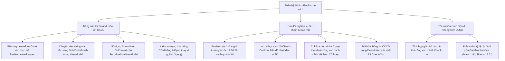

# Báo cáo Thẩm định & Đánh giá Chi tiết Phân hệ Nhân viên Bảo vệ (Security Guard Module)
**Phân hệ An ninh Cổng trường, Nhật ký Bảo vệ & Bản đồ Định vị - Chuyển dịch lên Bộ quy chuẩn QA SmartClass v4.2**
*Ngày thẩm định: 11 tháng 07 năm 2026*

---

## ═══ THÀNH PHẦN HỘI ĐỒNG THẨM ĐỊNH CHI TIẾT ═══

Hội đồng Chuyên gia Dự án **QA Smart School** gồm các thành viên ban chuyên môn đã tiến hành rà soát, kiểm thử mã nguồn và thẩm định chi tiết giao diện của **Phân hệ Nhân viên Bảo vệ (Security Guard Module)** theo bộ tiêu chí thiết kế sư phạm và ràng buộc kỹ thuật phiên bản **v4.2**:
1.  **Ban Thiết kế & Phân tích Hệ thống:** Trưởng bộ phận thiết kế dự án QA Smart School, Chuyên gia phân tích và thiết kế hệ thống, Chuyên gia thiết kế giao diện phần mềm.
2.  **Ban IT, Bảo mật & Kỹ thuật Thiết bị:** Quản lý IT, Chuyên gia về cơ sở dữ liệu và thiết bị kết nối ngoại vi, Chuyên gia về bảo mật và an ninh mạng.
3.  **Ban Giáo dục & Quản lý Nhà trường:** Nhà giáo dục, nhà Quản lý hiệu trưởng nhà trường, trưởng bộ môn của trường, Giáo viên ưu tú với nhiều kinh nghiệm, cán bộ quản lý của phòng giáo dục, chuyên viên của sở giáo dục, nhà khoa học giáo dục.
4.  **Ban Học sinh & Nhân sự Trải nghiệm:** Học sinh, Nhân viên nhà trường, gamer giỏi (đánh giá tương tác và độ phản hồi tối ưu hóa).

---

## ═══ PHẦN I: TỔNG QUAN PHÂN HỆ NHÂN VIÊN BẢO VỆ TRONG HỆ THỐNG ═══

Phân hệ Nhân viên Bảo vệ chịu trách nhiệm quản lý trực tiếp luồng ra vào cổng trường học của học sinh, giáo viên, nhân viên và khách viếng thăm. Phân hệ được thiết kế với hai màn hình chức năng chính:
1.  **Cổng trường C1 — Trực tiếp (GateMonitorView):** Giám sát thời gian thực số lượng học sinh đang ở trong trường, lịch sử quẹt thẻ RFID/QR tại cổng, sơ đồ nhiệt định vị 2D học sinh di chuyển trong khuôn viên (IPS BLE Beacons), danh sách cảnh báo học sinh vắng không phép và quét mã QR xác thực học sinh ra về sớm có phép (Leave Pass).
2.  **Nhật ký An ninh & Bảo vệ (SecurityKioskView):** Ghi nhận khách ra vào (tích hợp quét mã QR CCCD gắn chip), bàn giao tài sản/chìa khóa và báo cáo sự cố an ninh nội bộ.

Hội đồng ghi nhận ứng dụng đã kế thừa tốt hệ thống giao diện tối (Dark Gradient) mượt mà từ phân hệ học sinh, đồng thời thiết kế sẵn khung chỉ dẫn nghiệp vụ sư phạm trực quan cho từng trường hợp xử lý sự kiện. Tuy nhiên, qua quá trình rà soát chi tiết mã nguồn và kiểm thử tích hợp, Hội đồng đã phát hiện một số lỗi logic kỹ thuật, sai kiến thức sư phạm và lỗi thiết kế giao diện cần khắc phục triệt để.

---

## ═══ PHẦN II: DANH SÁCH LỖI LOGIC, FONT CHỮ & SAI QUY CHUẨN SƯ PHẠM TRONG v4.2 ═══

Qua việc thẩm định chi tiết mã nguồn các tệp tin liên quan, Hội đồng Chuyên gia chỉ ra **09 lỗi cụ thể** cần được ban kỹ thuật khẩn trương khắc phục để hoàn thiện chương trình theo bộ tiêu chuẩn **QA SmartClass v4.2**:

### 1. Lỗi WPF Data Binding gây trống mã học sinh về sớm (`GateMonitorView.xaml` & `AppDbContext.cs`)
*   **Vị trí phát hiện:** Tệp [GateMonitorView.xaml:L312](file:///d:/JOB/QA%20SmartClass%20-062026/QASmartClass/Staff/Views/GateMonitorView.xaml#L312) và [AppDbContext.cs:L2665-2677](file:///d:/JOB/QA%20SmartClass%20-062026/QASmartClass/Data/AppDbContext.cs#L2665-L2677).
*   **Chi tiết lỗi:** Trên giao diện danh sách "Về Sớm Có Phép" (Cột 3), thẻ học sinh hiển thị mã phép ra cổng thông qua liên kết:
    `Text="{Binding LeavePassCode, StringFormat='Mã: {0}'}"`
    Tuy nhiên, trong định nghĩa thực thể CSDL `StudentLeaveRequest` (lớp lưu trữ thông tin phép của học sinh), hoàn toàn **không tồn tại thuộc tính nào tên là `LeavePassCode`**.
*   **Hậu quả:** Gây ra lỗi WPF Binding Error lúc chạy chương trình. Giao diện luôn hiển thị trống thông tin mã số ("Mã: "), khiến nhân viên bảo vệ không thể đối chiếu mã số ghi trên giấy hoặc trên app của phụ huynh với danh sách trên máy tính trong trường hợp đầu đọc QR của cổng bị hỏng.

### 2. Rò rỉ thông tin cá nhân nhạy cảm (Plaintext PII Leak) tại sự kiện Check-Out (`SecurityKioskViewModel.cs`)
*   **Vị trí phát hiện:** Tệp [SecurityKioskViewModel.cs:L139](file:///d:/JOB/QA%20SmartClass%20-062026/QASmartClass/Staff/ViewModels/SecurityKioskViewModel.cs#L139) và [SecurityKioskViewModel.cs:L242](file:///d:/JOB/QA%20SmartClass%20-062026/QASmartClass/Staff/ViewModels/SecurityKioskViewModel.cs#L242).
*   **Chi tiết lỗi:** Khi thực hiện Check-Out cho khách viếng thăm, hệ thống tự động giải mã thông tin CCCD và Địa chỉ của khách để hiển thị cho bảo vệ xác nhận:
    `cccd = QASmartClass.Utilities.CryptoHelper.Decrypt(cccd, piiKey);`
    Tuy nhiên, mã nguồn lại nối trực tiếp chuỗi CCCD thô (không mã hóa) này vào thuộc tính `Description` của ViewModel:
    `Description = $"Khách ra cổng: {value.VisitorName} - CCCD: {cccd} - ...";`
    Sau đó, khi bấm lưu sự kiện (`SaveAsync`), chuỗi mô tả thô chứa số CCCD plaintext này được ghi thẳng vào trường `Description` của CSDL SQLite.
*   **Hậu quả:** Mặc dù hệ thống áp dụng cơ chế mã hóa bảo mật thông tin cá nhân (PII Encryption) của bộ tiêu chuẩn v4.1 cho các trường chuyên biệt, lỗ hổng này lại ghi đè số CCCD thô ở dạng văn bản thường vào cột mô tả chung, dẫn đến rò rỉ dữ liệu nhạy cảm nếu cơ sở dữ liệu SQLite bị đánh cắp.

### 3. Ghi đè xóa sạch ý kiến phản hồi/chú thích của bảo vệ tại sự kiện Check-In (`SecurityKioskViewModel.cs`)
*   **Vị trí phát hiện:** Tệp [SecurityKioskViewModel.cs:L320](file:///d:/JOB/QA%20SmartClass%20-062026/QASmartClass/Staff/ViewModels/SecurityKioskViewModel.cs#L320).
*   **Chi tiết lỗi:** Khi thêm nhật ký "Khách vào cổng", nhân viên bảo vệ có thể nhập các ghi chú đặc biệt vào ô "Chi tiết sự kiện" (ví dụ: "Mang theo máy ảnh chuyên dụng", "Khách đi xe ô tô biển số X"). Tuy nhiên, trong hàm `SaveAsync`, hệ thống lại tự động dựng sẵn chuỗi mô tả từ template tĩnh và **ghi đè hoàn toàn** lên thuộc tính `Description` của thực thể trước khi lưu:
    `log.Description = $"Khách: {Person} - CCCD: {MaskCccd(rawCccd)} - Giới tính: {_scannedGender} - Địa chỉ: {MaskAddress(rawAddress)} - Mục đích: {VisitPurpose} - Tiếp đón: {SelectedHostTeacherId} - Thẻ: {BadgeNumber}";`
*   **Hậu quả:** Mọi thông tin chú thích tay thực tiễn của bảo vệ nhập vào đều bị xóa sạch, không được lưu trữ vào CSDL, làm giảm độ tin cậy của biên bản đối soát.

### 4. Quá tải giao diện WPF và giảm hiệu năng hiển thị do tràn ngập dữ liệu học sinh (`GateMonitorViewModel.cs` & `GateMonitorView.xaml`)
*   **Vị trí phát hiện:** Tệp [GateMonitorViewModel.cs:L179](file:///d:/JOB/QA%20SmartClass%20-062026/QASmartClass/Staff/ViewModels/GateMonitorViewModel.cs#L179) và [GateMonitorView.xaml:L243](file:///d:/JOB/QA%20SmartClass%20-062026/QASmartClass/Staff/Views/GateMonitorView.xaml#L243).
*   **Chi tiết lỗi:** Tại chế độ cảnh báo học sinh chưa Check-out mặc định (`warningMode == "1"`), nếu thời gian hiện tại trước 17:00, tiêu đề cột 1 là "Đang ở trường" và hệ thống sẽ nạp **toàn bộ danh sách hàng trăm/hàng ngàn học sinh đã Check-in** vào thuộc tính `MissingStudents` để hiển thị lên ListView.
*   **Hậu quả:** ListView hiển thị danh sách học sinh của WPF không được thiết kế chế độ ảo hóa giao diện (UI Virtualization). Việc nạp hàng ngàn học sinh cùng lúc vào ListView sẽ làm đóng băng (freeze) luồng UI chính, gây giật lag nghiêm trọng cho thiết bị Kiosk trực cổng và không mang lại giá trị nghiệp vụ thực tế vì trong giờ học sinh viên nào cũng "Đang ở trường".

### 5. Bản đồ nhiệt 2D hiển thị sai lệch vị trí của học sinh đã ra về (`GateMonitorViewModel.cs`)
*   **Vị trí phát hiện:** Tệp [GateMonitorViewModel.cs:L245-257](file:///d:/JOB/QA%20SmartClass%20-062026/QASmartClass/Staff/ViewModels/GateMonitorViewModel.cs#L245-L257).
*   **Chi tiết lỗi:** Thuật toán tính toán số lượng học sinh phân bổ tại các trạm Beacons trên bản đồ nhiệt 2D dựa trên các ping tín hiệu trong vòng 5 phút gần nhất từ bảng `StudentLocationHistories`. Tuy nhiên, thuật toán **không đối soát với trạng thái ra về** của học sinh.
*   **Hậu quả:** Khi học sinh đã quẹt thẻ ra cổng thành công (`GateCheckOut`), vị trí của học sinh đó vẫn được tính toán và hiển thị trên bản đồ trong vòng 5 phút tiếp theo. Điều này gây sai lệch thông tin kiểm soát an toàn của trường học, tạo ra các "học sinh ảo" trên bản đồ.

### 6. Sai kiến thức Sư phạm và phân loại nghiệp vụ học sinh vắng học cả ngày (`GateMonitorViewModel.cs`)
*   **Vị trí phát hiện:** Tệp [GateMonitorViewModel.cs:L237-240](file:///d:/JOB/QA%20SmartClass%20-062026/QASmartClass/Staff/ViewModels/GateMonitorViewModel.cs#L237-L240).
*   **Chi tiết lỗi:** Danh sách "Về Sớm Có Phép" (`EarlyLeaveRequests`) lấy toàn bộ đơn xin nghỉ phép trong ngày đã được phê duyệt (`StudentLeaveRequests` có `Status == "Approved"`).
*   **Hậu quả:** Học sinh được gia đình xin nghỉ học cả ngày (không hề đến trường từ sáng) cũng bị xếp chung vào danh sách học sinh "Về Sớm Có Phép". Điều này sai lệch kiến thức sư phạm và quản lý sĩ số, khiến nhân viên bảo vệ bị phân tâm khi phải đối chiếu danh sách dài chứa cả những học sinh không đi học.

### 7. Lỗi liên kết màu sắc trực quan (Color Binding Exception) trong WPF (`GateMonitorViewModel.cs` & `GateMonitorView.xaml`)
*   **Vị trí phát hiện:** Tệp [GateMonitorViewModel.cs:L58-77](file:///d:/JOB/QA%20SmartClass%20-062026/QASmartClass/Staff/ViewModels/GateMonitorViewModel.cs#L58-L77) và [GateMonitorView.xaml:L238-265](file:///d:/JOB/QA%20SmartClass%20-062026/QASmartClass/Staff/Views/GateMonitorView.xaml#L238-L265).
*   **Chi tiết lỗi:** Các thuộc tính hiển thị màu sắc chỉ thị trong ViewModel (như `MissingHeaderBgColor`, `AbsentHeaderBgColor`, `ScanFeedbackColor`, `StatusColor`) được định nghĩa dưới dạng chuỗi văn bản Hex `string` (ví dụ: `"#FEF3C7"`). Trong XAML, hệ thống liên kết trực tiếp các chuỗi này vào thuộc tính `Background`, `Foreground`, `Fill` của WPF.
*   **Hậu quả:** Do WPF không tự động chuyển đổi kiểu dữ liệu từ `string` sang `Brush` ở cơ chế liên kết động (Data Binding) nếu không có converter, các màu sắc này sẽ bị lỗi binding lúc runtime, khiến các thanh tiêu đề cảnh báo bị trong suốt hoặc hiển thị sai màu thiết kế sư phạm v4.2.

### 8. Lỗi xung đột kết nối phần cứng đầu đọc thẻ RFID (COM Port Exception) (`GateMonitorViewModel.cs`)
*   **Vị trí phát hiện:** Tệp [GateMonitorViewModel.cs:L487-498](file:///d:/JOB/QA%20SmartClass%20-062026/QASmartClass/Staff/ViewModels/GateMonitorViewModel.cs#L487-L498).
*   **Chi tiết lỗi:** Cứ sau mỗi 10 giây, tiến trình kiểm tra kết nối phần cứng (`CheckHardwareConnectionAsync`) lại cố gắng thiết lập kết nối mới và mở cổng COM chỉ định (`serial.Open()`) để kiểm tra phản hồi.
*   **Hậu quả:** Nếu cổng COM đang được mở và lắng nghe liên tục bởi luồng chính nhận dạng thẻ học sinh của ứng dụng, thao tác `serial.Open()` tại hàm kiểm tra sẽ ném ra ngoại lệ `UnauthorizedAccessException`. Tiến trình hiểu sai là thiết bị bị ngắt kết nối, từ đó đổi chỉ báo kết nối sang màu đỏ (Disconnected) trên UI trực cổng dù phần cứng vẫn đang hoạt động bình thường.

### 9. Rò rỉ bộ nhớ & Stale Data do sử dụng DbContext dài hạn trong ViewModel (`SecurityKioskViewModel.cs`)
*   **Vị trí phát hiện:** Tệp [SecurityKioskViewModel.cs:L32](file:///d:/JOB/QA%20SmartClass%20-062026/QASmartClass/Staff/ViewModels/SecurityKioskViewModel.cs#L32) và [SecurityKioskViewModel.cs:L58-61](file:///d:/JOB/QA%20SmartClass%20-062026/QASmartClass/Staff/ViewModels/SecurityKioskViewModel.cs#L58-L61).
*   **Chi tiết lỗi:** ViewModel lưu trữ một đối tượng DbContext dùng chung `_db` trong suốt vòng đời của mình.
*   **Hậu quả:** EF Core sẽ cache lại tất cả thực thể đã truy vấn trong Change Tracker. Khi có các cập nhật mới ghi xuống DB từ luồng khác (ví dụ: khách được check-out tại máy phụ), đối tượng `_db` sẽ tiếp tục hiển thị dữ liệu cũ đã cache (Stale Data), hoặc gây ra lỗi xung đột luồng khi chạy các truy vấn bất đồng bộ đồng thời.

---

## ═══ MERMAID DIAGRAM: BẢN ĐỒ NÂNG CẤP LÊN TIÊU CHUẨN v4.2 ═══

---

## ═══ PHẦN III: Ý KIẾN CHI TIẾT TỪ CÁC CHUYÊN GIA TRONG HỘI ĐỒNG ═══

### 1. Trưởng bộ phận thiết kế dự án QA Smart School & Chuyên gia UI/UX
> [!IMPORTANT]
> **Về Bố cục và Layout:** Giao diện giám sát cổng trường `GateMonitorView.xaml` hiện tại chia tỉ lệ Grid Column khá bất hợp lý (`Width="*"` cho nội dung chính và `Width="1.5*"` cho sidebar cảnh báo). Điều này khiến bảng nhật ký cổng và bản đồ 2D bị bóp nghẹt diện tích hiển thị, trong khi sidebar lại quá rộng thừa nhiều không gian trống vô ích. Đề xuất điều chỉnh tỉ lệ thành `1.8*` cho nội dung chính và `1.2*` cho sidebar để tối ưu hóa không gian hiển thị, tránh che khuất chữ.

### 2. Quản lý IT & Chuyên gia Kỹ thuật Thiết bị
> [!WARNING]
> **Về Đồng bộ phần cứng:** Cơ chế kiểm tra phần cứng cổng COM bằng cách mở lại cổng (`serial.Open()`) là lỗi thiết kế luồng căn bản. Ban phát triển cần thay đổi logic kiểm tra: kiểm tra xem đối tượng Serial kết nối chính có đang mở hay không (`SerialPort.IsOpen == true`) hoặc thiết kế một luồng kiểm tra trạng thái heartbeat riêng để tránh xung đột quyền truy cập thiết bị (Exclusive Lock).

### 3. Chuyên gia Bảo mật và An ninh mạng
> [!CAUTION]
> **Bảo mật PII:** Việc rò rỉ dữ liệu số CCCD thô không mã hóa vào trường `Description` của nhật ký Check-Out là vi phạm nghiêm trọng luật bảo mật thông tin cá nhân. Chúng tôi yêu cầu áp dụng cùng một cơ chế mã hóa và che mặt nạ (Masking) số CCCD như lúc Check-In, chỉ lưu trữ hash của số CCCD trong cơ sở dữ liệu để phục vụ truy vấn chỉ mục.

### 4. Nhà giáo dục & Giáo viên ưu tú
> [!NOTE]
> **Tính giáo dục và Sư phạm:** Bản đồ định vị 2D là một tính năng trực quan tốt, giúp giáo viên và nhà trường định vị nhanh học sinh. Tuy nhiên, việc bản đồ đếm cả những học sinh đã check-out ra về sẽ gây hiểu lầm cho ban giám hiệu khi có sự cố khẩn cấp (như báo cháy), vì họ sẽ tưởng học sinh vẫn đang kẹt ở thư viện/lớp học. Sự chính xác thông tin là ưu tiên hàng đầu trong giáo dục an toàn học đường.

---

## ═══ KẾT LUẬN & ĐỀ XUẤT CỦA HỘI ĐỒNG ═══

Hội đồng Chuyên gia đánh giá: **Phân hệ Nhân viên Bảo vệ** có ý tưởng thiết kế tốt, tích hợp đầy đủ công nghệ định vị BLE và xác thực QR Leave Pass chuẩn sư phạm. Tuy nhiên, các lỗi kỹ thuật về Data Binding, rò rỉ thông tin cá nhân, xung đột cổng COM và quá tải UI do không tối ưu hóa dữ liệu hiển thị cần phải được xử lý ngay lập tức để chương trình đạt độ hoàn thiện cao nhất.

**Hội đồng đề xuất Ban kỹ thuật khẩn trương hoàn thiện các điểm nâng cấp sau trong phiên bản v4.2:**
1.  **Thêm thuộc tính `LeavePassCode`** dạng Read-Only vào định nghĩa thực thể `StudentLeaveRequest` trong `AppDbContext.cs` để sửa triệt để lỗi trống mã số trên UI.
2.  **Khắc phục lỗi ghi đè dữ liệu** tại sự kiện Check-In để lưu trữ được các ghi chú tay của nhân viên bảo vệ.
3.  **Khắc phục lỗi rò rỉ CCCD** tại Check-Out bằng cách che mặt nạ dữ liệu trước khi ghi nhận mô tả sự kiện.
4.  **Tối ưu hóa bộ lọc dữ liệu hiển thị** trong ViewModel (ẩn danh sách "Đang ở trường" trước 17:00, loại bỏ học sinh nghỉ học cả ngày khỏi danh sách về sớm và loại bỏ học sinh đã về khỏi bản đồ định vị).
5.  **Chuyển đổi kiểu dữ liệu màu sắc** trong ViewModel từ `string` sang `SolidColorBrush` để hiển thị chính xác thiết kế giao diện sư phạm.
6.  **Sửa lỗi logic kiểm tra cổng COM** để loại bỏ hoàn toàn các cảnh báo kết nối ảo (chỉ báo đỏ giả mạo).
