# Báo cáo Thẩm định & Đánh giá Chi tiết Phân hệ Nhân viên Quản lý Thiết bị Trường học (School Equipment Staff)
**Phân hệ Quản lý Tài sản, Đăng ký Mượn & Bảo trì Thiết bị - Chuyển dịch lên Bộ quy chuẩn QA SmartClass v4.2**
*Ngày thẩm định: 11 tháng 07 năm 2026*

---

## ═══ THÀNH PHẦN HỘI ĐỒNG THẨM ĐỊNH CHI TIẾT ═══

Hội đồng Chuyên gia Dự án **QA Smart School** gồm các thành viên ban chuyên môn đã tiến hành rà soát, kiểm thử mã nguồn và thẩm định chi tiết giao diện của **Phân hệ Nhân viên Quản lý Thiết bị (School Asset Management Module)** theo bộ tiêu chí thiết kế sư phạm và ràng buộc kỹ thuật phiên bản **v4.2**:
1.  **Ban Thiết kế & Phân tích Giao diện (UI/UX):** Trưởng bộ phận thiết kế dự án QA Smart School, Chuyên gia phân tích và thiết kế hệ thống, Chuyên gia thiết kế giao diện phần mềm học đường.
2.  **Ban Kỹ thuật, CSDL & Thiết bị:** Quản lý IT dự án, Chuyên gia cơ sở dữ liệu SQLite, Chuyên gia phát triển ứng dụng WPF/C# và đồng bộ hóa phần cứng.
3.  **Ban Giáo dục & Sư phạm:** Cán bộ quản lý cơ sở vật chất Sở GD&ĐT, Hiệu trưởng trường học thành viên, Cán bộ quản lý thiết bị dạy học giàu kinh nghiệm.
4.  **Ban Trải nghiệm Nhân viên:** Cán bộ phụ trách quản lý thiết bị phòng Lab, Cán bộ quản lý thư viện và thiết bị dạy học.

---

## ═══ PHẦN I: TỔNG QUAN PHÂN HỆ QUẢN LÝ THIẾT BỊ TRONG HỆ THỐNG ═══

Phân hệ Nhân viên Quản lý Thiết bị chịu trách nhiệm theo dõi toàn bộ cơ sở vật chất, thiết bị dạy học của nhà trường (như bảng thông minh, máy chiếu, máy tính bảng, camera, bàn ghế, thiết bị điện tử). Phân hệ hỗ trợ hai nghiệp vụ cốt lõi:
1.  **Quản lý Danh sách Thiết bị (SchoolAssetManagementView):** Theo dõi mã thiết bị, tên thiết bị, phân loại, vị trí phòng học, trạng thái hoạt động (Đang hoạt động, Cần sửa chữa, Đã hỏng/Thanh lý), hạn bảo trì định kỳ và thực hiện các hành động nhanh như Báo hỏng, Bảo trì, Hoàn tất sửa, Thanh lý thiết bị.
2.  **Đăng ký Mượn Thiết bị:** Hỗ trợ giáo viên đăng ký mượn thiết bị phục vụ giảng dạy theo ngày và tiết học cụ thể (từ tiết 1 đến tiết 10), hỗ trợ đăng ký mượn lặp lại hàng tuần (tối đa 10 tuần), tự động kiểm tra trùng lịch mượn và tự động xử lý lịch mượn (hủy lịch hoặc đổi thiết bị thay thế) khi một thiết bị được báo hỏng.

Qua quá trình rà soát chi tiết mã nguồn và kiểm thử tích hợp, Hội đồng ghi nhận giao diện được tổ chức gọn gàng dạng TabControl. Tuy nhiên, Hội đồng đã phát hiện **10 lỗi logic kỹ thuật, sai kiến thức sư phạm và điểm bất hợp lý trong giao diện** cần được khắc phục triệt để.

---

## ═══ PHẦN II: DANH SÁCH LỖI LOGIC, FONT CHỮ & SAI QUY CHUẨN SƯ PHẠM TRONG v4.2 ═══

Qua việc thẩm định chi tiết mã nguồn các tệp tin liên quan, Hội đồng Chuyên gia chỉ ra **10 lỗi cụ thể** sau:

### 1. Lỗi Logic nghiêm trọng trong hàm Hoàn tất sửa chữa (`FixAsync` trong `SchoolAssetManagementViewModel.cs`)
*   **Vị trí phát hiện:** Tệp [SchoolAssetManagementViewModel.cs:L288-300](file:///d:/JOB/QA%20SmartClass%20-062026/QASmartClass/Staff/ViewModels/SchoolAssetManagementViewModel.cs#L288-L300).
*   **Chi tiết lỗi:** Khi thiết bị hoàn thành sửa chữa và bấm "Hoàn tất sửa" (`FixAsync`), hệ thống đưa trạng thái về `"Active"` nhưng lại gán ngày bảo trì tiếp theo là ngày hôm nay:
    `asset.NextMaintenanceDate = DateTime.Now;`
*   **Hậu quả:** Khi gán ngày bảo trì tiếp theo là hôm nay, chỉ cần bước sang ngày hôm sau, thuộc tính `IsMaintenanceOverdue` sẽ lập tức đánh giá là `true`. Thiết bị vừa được sửa chữa xong sẽ ngay lập tức bị hệ thống báo động đỏ là "Quá hạn bảo trì!" trên giao diện, buộc nhân viên phải bảo trì lại hoặc gây nhiễu loạn thông tin quản lý. Ngày bảo trì tiếp theo phải được cộng thêm số tháng định kỳ theo cấu hình hệ thống `IT_Asset_MaintenanceIntervalMonths`.

### 2. Thiếu kiểm tra ngày mượn ở quá khứ (`SaveBookingAsync` trong `SchoolAssetManagementViewModel.cs`)
*   **Vị trí phát hiện:** Tệp [SchoolAssetManagementViewModel.cs:L361-505](file:///d:/JOB/QA%20SmartClass%20-062026/QASmartClass/Staff/ViewModels/SchoolAssetManagementViewModel.cs#L361-L505).
*   **Chi tiết lỗi:** Trong hàm đăng ký mượn thiết bị `SaveBookingAsync`, hệ thống hoàn toàn không kiểm tra xem ngày đăng ký mượn `BookingDate` có nằm trong quá khứ hay không.
*   **Hậu quả:** Người dùng có thể chọn bất kỳ ngày nào trong quá khứ (ví dụ: ngày của năm ngoái) để đăng ký mượn thiết bị. CSDL sẽ ghi nhận các giao dịch mượn thiết bị phi thực tế này, làm sai lệch báo cáo kiểm kê tài sản và gây lỗi logic quản lý lịch sử.

### 3. Thiếu kiểm tra mã giáo viên hợp lệ khi đăng ký mượn (`SaveBookingAsync` trong `SchoolAssetManagementViewModel.cs`)
*   **Vị trí phát hiện:** Tệp [SchoolAssetManagementViewModel.cs:L473](file:///d:/JOB/QA%20SmartClass%20-062026/QASmartClass/Staff/ViewModels/SchoolAssetManagementViewModel.cs#L473) và [SchoolAssetManagementViewModel.cs:L221](file:///d:/JOB/QA%20SmartClass%20-062026/QASmartClass/Staff/ViewModels/SchoolAssetManagementViewModel.cs#L221).
*   **Chi tiết lỗi:** Khi người dùng nhập thủ công mã giáo viên mượn thiết bị ở ô `BookedBy`, hệ thống lưu trực tiếp vào CSDL mà không kiểm tra xem mã giáo viên này có tồn tại trong hệ thống (`TeacherProfiles`) hay không.
*   **Hậu quả:** 
    *   Người dùng có thể nhập các mã giáo viên không tồn tại (ví dụ: `GV-FAKE`), làm giảm độ tin cậy của biên bản đối soát mượn trả.
    *   Nghiêm trọng hơn, khi thiết bị đó bị báo hỏng (`ReportAsync`), hàm tự động xử lý lịch mượn `ProcessBookingsOnAssetFailureAsync` sẽ tìm kiếm profile giáo viên để gửi thông báo đẩy:
        `var teacher = await _db.TeacherProfiles.FirstOrDefaultAsync(t => t.TeacherCode == booking.BookedBy);`
        `int teacherId = teacher?.Id ?? 1;`
        Nếu mã giáo viên không tồn tại, `teacherId` sẽ mặc định lấy là `1` (tài khoản Hiệu trưởng/Admin hệ thống). Hệ thống sẽ gửi thông báo đẩy hủy lịch hoặc đổi thiết bị của giáo viên ảo này tới thiết bị của Hiệu trưởng, gây phiền hà và vi phạm an ninh thông tin.

### 4. Lỗi hiển thị hạn bảo trì cho thiết bị đã hỏng/thanh lý (`AssetDisplayModel.cs`)
*   **Vị trí phát hiện:** Tệp [SchoolAssetManagementViewModel.cs:L28-29](file:///d:/JOB/QA%20SmartClass%20-062026/QASmartClass/Staff/ViewModels/SchoolAssetManagementViewModel.cs#L28-L29).
*   **Chi tiết lỗi:** Với các thiết bị đã bị đánh dấu là hỏng hoặc chờ thanh lý (`StatusText == "Broken"`), thuộc tính `MaintenanceStatusText` vẫn hiển thị hạn bảo trì tiếp theo dưới dạng:
    `Hạn: dd/MM/yyyy` hoặc cảnh báo `Quá hạn bảo trì!` (nếu ngày bảo trì trong quá khứ).
*   **Hậu quả:** Gây rối loạn thông tin hiển thị trên bảng dữ liệu. Thiết bị đã hỏng/chờ thanh lý thì không cần lập lịch bảo trì nữa, cột này nên hiển thị trạng thái "Không áp dụng" (N/A) với màu xám nhạt để bảo vệ thị giác người dùng.

### 5. Dữ liệu mẫu (Seeded Data) sai định dạng gây trùng lặp thông tin và tê liệt thuật toán tự động đổi thiết bị (`StaffDataSeeder.cs`)
*   **Vị trí phát hiện:** Tệp [StaffDataSeeder.cs:L218-223](file:///d:/JOB/QA%20SmartClass%20-062026/QASmartClass/Staff/Services/StaffDataSeeder.cs#L218-L223) và [SchoolAssetManagementViewModel.cs:L107-112](file:///d:/JOB/QA%20SmartClass%20-062026/QASmartClass/Staff/ViewModels/SchoolAssetManagementViewModel.cs#L107-L112).
*   **Chi tiết lỗi:** CSDL mẫu được khởi tạo trong `StaffDataSeeder.cs` lưu trường `AssetType` dưới dạng chuỗi thô (ví dụ: `"Bảng Tương Tác 86''"`, `"Máy chiếu Epson EB-X51"`) mà không tuân thủ định dạng `"Phân loại - Tên thiết bị"` (ví dụ: `"Bảng tương tác - Bảng Tương Tác 86''"`). Khi tải dữ liệu, ViewModel thực hiện phân tách:
    `int idx = a.AssetType.IndexOf(" - ");`
    Nếu không tìm thấy chuỗi `" - "`, cả thuộc tính `Category` (Phân loại) và `AssetName` (Tên thiết bị) đều nhận chung giá trị là `AssetType` (ví dụ: `Category = "Máy chiếu Epson EB-X51"`, `AssetName = "Máy chiếu Epson EB-X51"`).
*   **Hậu quả:** 
    *   **Trùng lặp giao diện:** Trên DataGrid, hai cột "Tên thiết bị" và "Phân loại" hiển thị dữ liệu giống hệt nhau, gây mất mỹ quan và không tối ưu thông tin.
    *   **Tê liệt logic tự động thay thế:** Khi thiết bị hỏng, thuật toán tự động đổi thiết bị `ProcessBookingsOnAssetFailureAsync` sẽ lấy phần phân loại để quét thiết bị thay thế cùng nhóm. Vì phân loại của thiết bị mẫu bị gán thành tên đầy đủ (ví dụ: `"Máy chiếu Epson EB-X51"`), hệ thống sẽ không thể đối sánh và tìm thấy thiết bị thay thế cùng loại khác (ví dụ: `"Máy chiếu Panasonic"`), dẫn đến hủy lịch mượn của giáo viên một cách vô lý.

### 6. Sử dụng từ ngữ tiếng Anh vi phạm ràng buộc ngôn ngữ tiếng Việt của bộ quy chuẩn v4.2 (`SchoolAssetManagementView.xaml`)
*   **Vị trí phát hiện:** Tệp [SchoolAssetManagementView.xaml:L86-92](file:///d:/JOB/QA%20SmartClass%20-062026/QASmartClass/Staff/Views/SchoolAssetManagementView.xaml#L86-L92).
*   **Chi tiết lỗi:** Danh sách các phân loại thiết bị khi thêm mới được viết hoàn toàn bằng tiếng Anh:
    `<ComboBoxItem Content="Smartboard"/>`
    `<ComboBoxItem Content="Projector"/>`
    `<ComboBoxItem Content="Tablet"/>`
    `<ComboBoxItem Content="Electronics"/>`
    `<ComboBoxItem Content="Furniture"/>`
*   **Hậu quả:** Vi phạm nghiêm trọng ràng buộc kỹ thuật của QA SmartClass v4.2: *"Tất cả nội dung sử dụng phải là tiếng Việt"*. Gây khó khăn cho nhân viên thiết bị lớn tuổi khi thao tác.

### 7. Lỗi liên kết kiểu dữ liệu WPF (WPF Binding Type Mismatch) gây mất tác dụng của Combobox Tiết học và Số tuần lặp lại (`SchoolAssetManagementView.xaml`)
*   **Vị trí phát hiện:** Tệp [SchoolAssetManagementView.xaml:L125-136](file:///d:/JOB/QA%20SmartClass%20-062026/QASmartClass/Staff/Views/SchoolAssetManagementView.xaml#L125-L136) và [SchoolAssetManagementView.xaml:L155-166](file:///d:/JOB/QA%20SmartClass%20-062026/QASmartClass/Staff/Views/SchoolAssetManagementView.xaml#L155-L166).
*   **Chi tiết lỗi:** Ở các Combobox chọn Tiết học và Số tuần lặp lại, XAML sử dụng liên kết:
    `SelectedValue="{Binding BookingTimeSlot}" SelectedValuePath="Content"`
    Ở đây, `BookingTimeSlot` và `RecurringWeeks` trong ViewModel được khai báo kiểu số nguyên `int`. Tuy nhiên, thuộc tính `Content` của `ComboBoxItem` trong XAML lại trả về kiểu chuỗi ký tự `string` (ví dụ: `"1"`, `"2"`). Do không có ValueConverter, cơ chế WPF Binding sẽ phát sinh cảnh báo lỗi chuyển đổi kiểu dữ liệu ngầm (Type Mismatch), khiến dữ liệu được chọn trên giao diện không thể truyền về ViewModel.
*   **Hậu quả:** Giá trị trong ViewModel luôn giữ nguyên giá trị khởi tạo mặc định là `1`. Bất kể người dùng chọn tiết học nào (ví dụ: Tiết 5) hoặc số tuần lặp lại nào (ví dụ: 4 tuần), hệ thống vẫn luôn thực hiện đăng ký mượn cho Tiết 1 và chỉ lặp lại 1 tuần.

### 8. Thiếu bảng chỉ dẫn nghiệp vụ từng bước chuẩn sư phạm v4.2 (`SchoolAssetManagementView.xaml`)
*   **Vị trí phát hiện:** Tệp [SchoolAssetManagementView.xaml](file:///d:/JOB/QA%20SmartClass%20-062026/QASmartClass/Staff/Views/SchoolAssetManagementView.xaml).
*   **Chi tiết lỗi:** Phân hệ quản lý thiết bị hoàn toàn không có khung hướng dẫn nghiệp vụ/sử dụng từng bước cho nhân viên (các phân hệ khác như Bảo vệ, Căn tin đều có).
*   **Hậu quả:** Người dùng mới hoặc nhân viên thiết bị có thể thao tác sai quy trình đăng ký mượn dài hạn hoặc xử lý hỏng hóc, làm tăng tỉ lệ lỗi nghiệp vụ thực tế.

### 9. Chưa đồng bộ thiết kế giao diện điều khiển DatePicker và lỗi sử dụng thuật ngữ cột bảng DataGrid (`SchoolAssetManagementView.xaml`)
*   **Vị trí phát hiện:** Tệp [SchoolAssetManagementView.xaml:L121](file:///d:/JOB/QA%20SmartClass%20-062026/QASmartClass/Staff/Views/SchoolAssetManagementView.xaml#L121) và [SchoolAssetManagementView.xaml:L220](file:///d:/JOB/QA%20SmartClass%20-062026/QASmartClass/Staff/Views/SchoolAssetManagementView.xaml#L220).
*   **Chi tiết lỗi:** 
    *   Hộp chọn ngày `DatePicker` sử dụng style mặc định thô sơ của Windows, không có bo tròn góc và màu sắc đồng điệu với các hộp nhập liệu khác (như `StaffTextBox` và `StaffComboBox`).
    *   Trên DataGrid danh sách thiết bị, tiêu đề cột vị trí lắp đặt được ghi là `"Phòng ban"`.
*   **Hậu quả:** 
    *   Giao diện thiếu sự liền mạch, giảm trải nghiệm cao cấp (Premium Aesthetics) của phần mềm học đường.
    *   Thuật ngữ `"Phòng ban"` gây hiểu lầm cho nhân viên vì thiết bị trường học thường được phân bổ trực tiếp cho các lớp học/phòng học cụ thể (ví dụ: Phòng 10A1, Phòng IT) chứ không đặt tại phòng ban hành chính. Cột này nên được sửa thành `"Vị trí / Phòng học"`.

### 10. Rò rỉ bộ nhớ & nguy cơ hiển thị dữ liệu cũ (Stale Data) do sử dụng DbContext dài hạn trong ViewModel (`SchoolAssetManagementViewModel.cs`)
*   **Vị trí phát hiện:** Tệp [SchoolAssetManagementViewModel.cs:L42](file:///d:/JOB/QA%20SmartClass%20-062026/QASmartClass/Staff/ViewModels/SchoolAssetManagementViewModel.cs#L42) và [SchoolAssetManagementViewModel.cs:L63-66](file:///d:/JOB/QA%20SmartClass%20-062026/QASmartClass/Staff/ViewModels/SchoolAssetManagementViewModel.cs#L63-L66).
*   **Chi tiết lỗi:** ViewModel khởi tạo và giữ duy nhất một đối tượng `AppDbContext _db` trong suốt thời gian tồn tại của mình.
*   **Hậu quả:** 
    *   Đối tượng `_db` sẽ cache lại toàn bộ thực thể được truy vấn thông qua Change Tracker. Khi có các thay đổi dữ liệu từ các máy trạm khác hoặc phân hệ khác (ví dụ: giáo viên gửi yêu cầu mượn thiết bị từ Mobile App), ViewModel này sẽ tiếp tục đọc dữ liệu cũ trong bộ nhớ đệm (Stale Data), dẫn đến việc hiển thị lịch mượn không chính xác.
    *   Gây rò rỉ bộ nhớ đối với các ứng dụng Desktop chạy lâu dài. Tốt nhất nên sử dụng các kết nối ngắn hạn (Short-lived DbContext) hoặc giải phóng/tải lại cache khi làm mới dữ liệu.

---

## ═══ MERMAID DIAGRAM: BẢN ĐỒ NÂNG CẤP LÊN TIÊU CHUẨN v4.2 ═══

```mermaid
graph TD
    A["Phân hệ Thiết bị Trường học v4.1"] --> B["Nâng cấp Kỹ thuật & CSDL"]
    A --> C["Sửa lỗi Nghiệp vụ Sư phạm & Ngôn ngữ"]
    A --> D["Đồng bộ UI/UX & Chỉ dẫn Sư phạm"]

    B --> B1["Tính NextMaintenanceDate trong FixAsync dựa trên IT_Asset_MaintenanceIntervalMonths"]
    B --> B2["Chuyển BookingTimeSlot & RecurringWeeks sang kiểu string trong ViewModel"]
    B --> B3["Chuyển BookingDate sang DateTime? để hỗ trợ validation giá trị rỗng"]
    B --> B4["Sử dụng Short-Lived DbContext cho các thao tác truy vấn và cập nhật CSDL"]

    C --> C1["Ràng buộc BookingDate không được nhỏ hơn ngày hiện tại"]
    C --> C2["Kiểm tra sự tồn tại của mã giáo viên mượn thiết bị trong TeacherProfiles"]
    C --> C3["Đồng bộ định dạng 'Phân loại - Tên' cho dữ liệu mẫu trong StaffDataSeeder.cs"]
    C --> C4["Việt hóa toàn bộ phân loại thiết bị (Máy chiếu, Máy tính bảng, ...)"]

    D --> D1["Bổ sung Khung Chỉ dẫn Nghiệp vụ từng bước cho Thêm thiết bị & Đăng ký mượn"]
    D --> D2["Thiết lập hiển thị hạn bảo trì 'Không áp dụng' cho thiết bị Broken"]
    D --> D3["Định nghĩa StaffDatePicker Style đồng bộ giao diện bo tròn góc"]
    D --> D4["Đổi tên tiêu đề cột DataGrid từ 'Phòng ban' thành 'Vị trí / Phòng học'"]
```

---

## ═══ PHẦN III: Ý KIẾN CHI TIẾT TỪ CÁC CHUYÊN GIA TRONG HỘI ĐỒNG ═══

### 1. Trưởng ban UI/UX & Thiết kế Giao diện
> [!IMPORTANT]
> **Về Đồng bộ thẩm mỹ:** Việc sử dụng điều khiển DatePicker mặc định là điểm trừ lớn về mặt giao diện trực quan cao cấp của SmartClass. Chúng tôi đề xuất định nghĩa bổ sung một Style chuẩn tên là `StaffDatePicker` trong tệp tài nguyên `StaffTheme.xaml` để bo tròn góc và tùy chỉnh màu sắc đường viền giống như `StaffTextBox`. Đồng thời, tiêu đề cột của DataGrid phải được sửa đổi để phản ánh chính xác ngữ cảnh thực tế của cơ sở vật chất học đường Việt Nam (sử dụng cụm từ "Vị trí / Phòng học" thay vì "Phòng ban").

### 2. Chuyên gia CSDL & Hệ thống IT
> [!WARNING]
> **Về Quản lý kết nối dữ liệu:** Giữ kết nối DbContext quá lâu trong ứng dụng Desktop là lỗi thiết kế hệ thống thường thấy. Thiết bị trường học có tần suất tương tác và thay đổi lịch mượn liên tục từ phía giáo viên qua thiết bị di động. Để tránh xung đột dữ liệu và giải phóng Change Tracker của EF Core, chúng tôi đề xuất giải phóng đối tượng DbContext cũ và khởi tạo đối tượng mới mỗi khi làm mới dữ liệu (`LoadDataAsync`, `LoadBookingsAsync`), hoặc sử dụng mẫu thiết kế DbContextFactory.

### 3. Chuyên gia Bảo mật & An ninh Thông tin
> [!CAUTION]
> **Về Ràng buộc dữ liệu & Tránh spam thông tin:** Lỗi không kiểm tra mã giáo viên khi đăng ký mượn sẽ dẫn đến việc rác hóa cơ sở dữ liệu. Nguy hiểm hơn, việc mặc định gửi thông báo đẩy tới `teacherId = 1` khi mã giáo viên sai sẽ làm lộ lọt thông tin lịch học đường cho sai đối tượng, và gây spam thông tin không liên quan tới Ban giám hiệu. Cần chặn đứng lỗi này ngay tại bước xác thực biểu mẫu mượn thiết bị.

### 4. Nhà Quản lý Giáo dục & Cán bộ Thiết bị
> [!NOTE]
> **Về Tính sư phạm và Tiện ích thực tế:** Việc để các thuật ngữ phân loại thiết bị bằng tiếng Anh không những vi phạm tiêu chuẩn ngôn ngữ tiếng Việt của bộ quy chuẩn v4.2 mà còn làm giảm hiệu quả làm việc của các nhân viên thiết bị vốn không quen thuộc với thuật ngữ ngoại ngữ. Hơn nữa, việc hiển thị hạn bảo trì cho các máy tính hoặc bảng thông minh đã bị thanh lý/hỏng hóc là không cần thiết, làm bảng dữ liệu trở nên rối mắt. Thiết bị đã hỏng chỉ cần ghi rõ "Không áp dụng" để nhân viên tập trung tối đa vào các thiết bị đang hoạt động.

---

## ═══ KẾT LUẬN & ĐỀ XUẤT CỦA HỘI ĐỒNG ═══

Hội đồng Chuyên gia đánh giá: **Phân hệ Nhân viên Quản lý Thiết bị** đóng vai trò cực kỳ quan trọng trong việc số hóa vận hành nhà trường, tuy nhiên hiện tại đang tồn tại nhiều lỗi kỹ thuật (Data Binding Combobox, logic ngày bảo trì khi sửa xong, thiếu xác thực dữ liệu đầu vào) và lỗi sư phạm (ngôn ngữ tiếng Anh, thiếu bảng chỉ dẫn, sai lệch dữ liệu mẫu). 

**Hội đồng đề xuất Ban Kỹ thuật khẩn trương hoàn thiện các điểm nâng cấp sau trong phiên bản v4.2:**
1.  **Sửa đổi hàm `FixAsync`:** Lấy giá trị định kỳ bảo trì `IT_Asset_MaintenanceIntervalMonths` từ hệ thống và gán ngày bảo trì tiếp theo bằng `DateTime.Today.AddMonths(months)` thay vì `DateTime.Now`.
2.  **Sửa lỗi Data Binding Combobox trong XAML:** Thay đổi kiểu dữ liệu của `BookingTimeSlot` và `RecurringWeeks` trong ViewModel từ `int` sang `string` để tương thích hoàn toàn với liên kết chuỗi của `ComboBoxItem` mà không gây lỗi binding lúc runtime.
3.  **Tăng cường xác thực đầu vào khi đăng ký mượn:** Chặn đăng ký ngày mượn ở quá khứ (`BookingDate < DateTime.Today`), đổi kiểu `BookingDate` sang `DateTime?` để validate rỗng, và kiểm tra sự tồn tại của mã giáo viên mượn thiết bị trong bảng `TeacherProfiles`.
4.  **Việt hóa toàn bộ danh sách phân loại thiết bị** trong Combobox thêm mới và trên DataGrid hiển thị.
5.  **Bổ sung Khung Chỉ dẫn nghiệp vụ** từng bước chi tiết trực quan cho hai nghiệp vụ cốt lõi ngay trong giao diện điều khiển.
6.  **Đồng bộ dữ liệu mẫu trong `StaffDataSeeder.cs`** sang định dạng chuẩn `"Phân loại - Tên"` bằng tiếng Việt để sửa triệt để lỗi trùng lặp thông tin và tối ưu hóa thuật toán tự động thay thế thiết bị khi hỏng.
7.  **Định nghĩa `StaffDatePicker` style** trong `StaffTheme.xaml` để đồng bộ thẩm mỹ hiện đại cho ứng dụng.
8.  **Sửa hiển thị hạn bảo trì của thiết bị Broken** thành "Không áp dụng" và màu sắc tương ứng.
9.  **Sử dụng Short-Lived DbContext** để đảm bảo dữ liệu luôn được cập nhật mới nhất, tránh cache lỗi thời.
