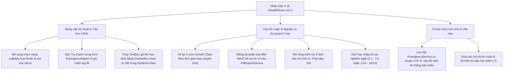

# Báo cáo Thẩm định & Đánh giá Chi tiết Phân hệ Nhân viên Y tế (Health Room Module)
**Phân hệ Y tế Học đường & Vệ sinh An toàn Thực phẩm - Chuyển dịch lên Bộ quy chuẩn QA SmartClass v4.2**
*Ngày thẩm định: 11 tháng 07 năm 2026*

---

## ═══ THÀNH PHẦN HỘI ĐỒNG THẨM ĐỊNH CHI TIẾT ═══

Hội đồng Chuyên gia Dự án **QA Smart School** gồm các thành viên ban chuyên môn đã tiến hành rà soát, kiểm thử mã nguồn và thẩm định chi tiết giao diện của **Phân hệ Nhân viên Y tế (HealthRoom Module)** theo bộ tiêu chí thiết kế sư phạm và ràng buộc kỹ thuật phiên bản **v4.2**:
1.  **Ban Thiết kế & Phân tích Hệ thống:** Trưởng bộ phận thiết kế dự án QA Smart School, Chuyên gia phân tích và thiết kế hệ thống, Chuyên gia thiết kế giao diện phần mềm.
2.  **Ban IT, Bảo mật & Kỹ thuật Thiết bị:** Quản lý IT, Chuyên gia về cơ sở dữ liệu và thiết bị kết nối ngoại vi, Chuyên gia về bảo mật và an ninh mạng.
3.  **Ban Giáo dục & Quản lý Nhà trường:** Nhà giáo dục, nhà Quản lý hiệu trưởng nhà trường, trưởng bộ môn của trường, Giáo viên ưu tú với nhiều kinh nghiệm, cán bộ quản lý của phòng giáo dục, chuyên viên của sở giáo dục, nhà khoa học giáo dục.
4.  **Ban Học sinh & Nhân sự Trải nghiệm:** Học sinh, Nhân viên nhà trường, gamer giỏi (đánh giá tương tác và độ phản hồi tối ưu hóa).

---

## ═══ PHẦN I: TỔNG QUAN CÁC ĐIỂM ĐÃ NÂNG CẤP & KHẮC PHỤC (TỪ v4.1) ═══

Hội đồng ghi nhận ban phát triển dự án đã nghiêm túc tiếp thu các khuyến nghị từ phiên bản v4.1 và đã triển khai thành công một số nâng cấp nền tảng quan trọng trong mã nguồn hiện tại:

1.  **Tách cấu trúc Popup nhập liệu khám sức khỏe:** Đã thay thế việc tạo giao diện động bằng mã C# (code-behind) ở v4.1 bằng tệp thiết kế XAML chuẩn [HealthRecordInputDialog.xaml](file:///d:/JOB/QA%20SmartClass%20-062026/QASmartClass/HealthRoom/Views/HealthRecordInputDialog.xaml), kế thừa các style hệ thống và tối ưu hóa trải nghiệm nhập liệu.
2.  **Cải thiện bảng màu y tế:** Form báo cáo sơ cứu khẩn cấp đã chuyển từ màu hồng cảnh báo căng thẳng sang gam màu xanh Teal dịu nhẹ (`#E0F2F1`, `#B2DFDB`), mang lại cảm giác an tâm, giảm bớt căng thẳng tâm lý theo đúng tiêu chuẩn sư phạm.
3.  **Hội nhập CSDL kiểm thực Canteen:** Đã kết nối tự động thực đơn canteen hàng ngày (`SchoolMenus`) vào màn hình kiểm thực thực phẩm, hỗ trợ chức năng tự điền thực đơn khi chọn ngày khám.
4.  **Gộp kho dược thông minh:** Hàm `AddSupply` trong `MedicalInventoryService.cs` đã tích hợp logic so khớp tên và hạn sử dụng để tự động cộng dồn số lượng thuốc thay vì tạo các bản ghi trùng lặp gây rác cơ sở dữ liệu.
5.  **Tích hợp ValueConverters chuẩn hóa ngôn ngữ:** Đã xây dựng và áp dụng [MedicalValueConverters.cs](file:///d:/JOB/QA%20SmartClass%20-062026/QASmartClass/Converters/MedicalValueConverters.cs) để chuyển đổi toàn bộ các trạng thái thô từ tiếng Anh trong CSDL sang tiếng Việt rõ ràng trên giao diện (ví dụ: *RequiresAttention* -> *Chờ xử lý*, *Home* -> *Cách ly tại nhà*).

---

## ═══ PHẦN II: DANH SÁCH LỖI LOGIC, FONT CHỮ & SAI QUY CHUẨN SƯ PHẠM TRONG v4.2 ═══

Mặc dù có nhiều cải tiến, qua việc rà soát chi tiết mã nguồn, Hội đồng Chuyên gia đã phát hiện **08 lỗi nghiêm trọng** liên quan đến logic nghiệp vụ, sai kiến thức sư phạm/y khoa, lỗi font chữ và cấu trúc dữ liệu cần phải xử lý triệt để để đạt chuẩn **QA SmartClass v4.2**:

### 1. Lỗi vỡ Font chữ / Mã hóa Tiếng Việt trong Push Notification (`EmergencyService.cs`)
*   **Vị trí phát hiện:** Tệp [EmergencyService.cs:L31-32](file:///d:/JOB/QA%20SmartClass%20-062026/QASmartClass/Services/EmergencyService.cs#L31-L32).
*   **Chi tiết lỗi:** Chuỗi tiêu đề và nội dung thông báo khẩn cấp đẩy đi cho giáo viên và phụ huynh đang bị lỗi font nghiêm trọng do lưu sai encoding (raw question marks):
    *   `Title = $"C?nh báo Y t?: {log.StudentName} g?p s? c? ({log.IncidentType})."`
    *   `Content = $"Chi ti?t: {log.Description}. Đang x? lư: {log.FirstAidApplied}"`
*   **Hậu quả:** Khi xảy ra sự cố cấp cứu, phụ huynh và giáo viên nhận được các chuỗi ký tự lỗi font không thể đọc được thông tin quan trọng. Điều này vi phạm nghiêm trọng quy chuẩn Việt hóa hiển thị và giao tiếp của QA SmartClass.

### 2. Trục hoành đồ thị tăng trưởng WHO bị méo mó, phi tuyến tính (`HealthRecordView.xaml.cs`)
*   **Vị trí phát hiện:** Tệp [HealthRecordView.xaml.cs:L170-174](file:///d:/JOB/QA%20SmartClass%20-062026/QASmartClass/HealthRoom/Views/HealthRecordView.xaml.cs#L170-L174).
*   **Chi tiết lỗi:** Hàm tính toán tọa độ X (`ScaleX`) cho các điểm trên đồ thị chiều cao WHO được tính dựa trên **chỉ số (index) trong danh sách lịch sử** thay vì tính tuyến tính theo **thời gian/tuổi thực**:
    `return leftMargin + ((double)idx / (history.Count - 1)) * drawW;`
*   **Hậu quả về mặt khoa học/sư phạm:** Nếu một học sinh khám ở tuổi 6, 7 và 17, khoảng cách giữa tuổi 6-7 (1 năm) trên đồ thị sẽ bằng hệt khoảng cách giữa 7-17 (10 năm). Đồ thị tăng trưởng bị méo mó hoàn toàn, các đường xu hướng cong của WHO bị bẻ gãy phi lý, làm sai lệch kết quả chẩn đoán phát triển thể chất của học sinh.

### 3. Bất nhất thuật toán phân loại BMI giữa màn hình UI và file xuất PDF (`PdfExportService.cs`)
*   **Vị trí phát hiện:** Đối chiếu giữa [HealthRecordView.xaml.cs:L91-129](file:///d:/JOB/QA%20SmartClass%20-062026/QASmartClass/HealthRoom/Views/HealthRecordView.xaml.cs#L91-L129) và [PdfExportService.cs:L664-665](file:///d:/JOB/QA%20SmartClass%20-062026/QASmartClass/Services/PdfExportService.cs#L664-L665).
*   **Chi tiết lỗi:** 
    *   Tại màn hình giao diện chính, hệ thống kiểm tra cấu hình `Medical_BmiCalculationStandard` để áp dụng bảng phân vị BMI trẻ em WHO linh hoạt theo tuổi và giới tính.
    *   Tuy nhiên, tại tệp xuất file PDF, hệ thống lại **bỏ qua hoàn toàn cấu hình này** và áp dụng cứng nhắc công thức BMI của người lớn:
        `string bmiCategory = bmi < 18.5 ? "Gầy" : bmi > 25.0 ? (bmi > 30.0 ? "Béo phì" : "Thừa cân") : "Bình thường";`
*   **Hậu quả:** File PDF in ra gửi về phụ huynh sẽ hiển thị kết quả phân loại BMI **mâu thuẫn** với kết quả trên phần mềm (VD: Trên ứng dụng báo học sinh thừa cân, nhưng in PDF lại báo bình thường).

### 4. Lỗ hổng toàn vẹn dữ liệu: Nhập thủ công Tên và Lớp học sinh (`EpidemicMonitorView.xaml`)
*   **Vị trí phát hiện:** Tệp [EpidemicMonitorView.xaml:L110-113](file:///d:/JOB/QA%20SmartClass%20-062026/QASmartClass/HealthRoom/Views/EpidemicMonitorView.xaml#L110-L113) và [EpidemicMonitorView.xaml.cs:L111-112](file:///d:/JOB/QA%20SmartClass%20-062026/QASmartClass/HealthRoom/Views/EpidemicMonitorView.xaml.cs#L111-L112).
*   **Chi tiết lỗi:** Khi ghi nhận ca dịch bệnh truyền nhiễm, giao diện yêu cầu nhân viên y tế tự gõ thủ công họ tên (`TxtStudentName`) và lớp (`TxtClassName`) bằng text thô. Nếu gõ sai hoặc gõ tắt, truy vấn tìm kiếm học sinh sẽ thất bại và hệ thống sẽ tự động gán mặc định `studentId = 1` (thuộc về một học sinh ngẫu nhiên khác).
*   **Hậu quả:** Gây sai lệch nghiêm trọng hồ sơ bệnh án cá nhân, gán nhầm ca dịch bệnh nguy hiểm (ví dụ: Sốt xuất huyết, Thủy đậu) cho học sinh khác, phá vỡ tính bảo mật và độ tin cậy của cơ sở dữ liệu.

### 5. Thuật toán phát hiện ổ dịch bỏ quên các dịch bệnh truyền nhiễm khác (`EpidemicMonitorView.xaml.cs`)
*   **Vị trí phát hiện:** Tệp [EpidemicMonitorView.xaml.cs:L51-53](file:///d:/JOB/QA%20SmartClass%20-062026/QASmartClass/HealthRoom/Views/EpidemicMonitorView.xaml.cs#L51-L53).
*   **Chi tiết lỗi:** Thuật toán kích hoạt cảnh báo ổ dịch đỏ chỉ quét duy nhất số ca mắc bệnh "Sốt xuất huyết" (>= 3 ca trong 7 ngày):
    `int dengueCases = cases.Count(c => c.Disease == "Sốt xuất huyết" && c.OnsetDate >= DateTime.Today.AddDays(-7));`
    Trong khi đó, các bệnh truyền nhiễm nguy hiểm khác có trong dropdown như **Cúm A, Thủy đậu, Sởi** lại hoàn toàn bị bỏ qua, không kích hoạt cảnh báo dù có số lượng ca tương tự hoặc lớn hơn.
*   **Hậu quả về mặt sư phạm & an toàn:** Trường học có nguy cơ bùng phát ổ dịch Cúm A hoặc Thủy đậu trên diện rộng mà hệ thống không hề đưa ra cảnh báo khử trùng hay khoanh vùng lớp học.

### 6. Thiếu Try-Catch và xử lý ngoại lệ khi gửi thông báo cấp cứu (`EmergencyReportView.xaml.cs`)
*   **Vị trí phát hiện:** Tệp [EmergencyReportView.xaml.cs:L92-140](file:///d:/JOB/QA%20SmartClass%20-062026/QASmartClass/HealthRoom/Views/EmergencyReportView.xaml.cs#L92-L140).
*   **Chi tiết lỗi:** Sự kiện `BtnSave_Click` thực hiện đồng thời việc thêm nhật ký cấp cứu vào DB (`_emergencyService.AddEmergency`) và gọi API đẩy tin nhắn push khẩn cấp (`mobileApi.SendPushNotification`). Tuy nhiên, toàn bộ đoạn mã này **không nằm trong bất kỳ khối try-catch nào**.
*   **Hậu quả:** Nếu kết nối mạng chập chờn khi gọi dịch vụ thông báo hoặc CSDL SQLite tạm thời bị khóa (database is locked), ứng dụng sẽ lập tức bị crash (văng ứng dụng), gián đoạn công tác sơ cứu khẩn cấp.

### 7. Phân hệ quản lý vật tư y tế thiếu chức năng tiêu thụ/trừ kho (`MedicalInventoryView.xaml`)
*   **Vị trí phát hiện:** Toàn bộ tệp [MedicalInventoryView.xaml](file:///d:/JOB/QA%20SmartClass%20-062026/QASmartClass/HealthRoom/Views/MedicalInventoryView.xaml) và [MedicalInventoryView.xaml.cs](file:///d:/JOB/QA%20SmartClass%20-062026/QASmartClass/HealthRoom/Views/MedicalInventoryView.xaml.cs).
*   **Chi tiết lỗi:** Giao diện kho thuốc chỉ thiết kế form nhập vật tư mới mà không hề có bất kỳ chức năng nào cho phép nhân viên y tế sửa thông tin, xóa hoặc **khấu trừ số lượng vật tư tiêu hao** (như khi phát thuốc cho học sinh hoặc sử dụng băng gạc).
*   **Hậu quả:** Kho dược chỉ có thể tăng số lượng mà không thể giảm, khiến việc theo dõi lượng tồn kho thực tế trở nên vô nghĩa, không thể áp dụng vào thực tiễn vận hành của y tế học đường.

### 8. Quy chuẩn đo lường thị lực hỗn loạn, thiếu tính chuẩn hóa y khoa (`HealthRecordInputDialog.xaml.cs`)
*   **Vị trí phát hiện:** Tệp [HealthRecordInputDialog.xaml.cs:L79-92](file:///d:/JOB/QA%20SmartClass%20-062026/QASmartClass/HealthRoom/Views/HealthRecordInputDialog.xaml.cs#L79-L92) và [HealthRecordInputDialog.xaml:L73-78](file:///d:/JOB/QA%20SmartClass%20-062026/QASmartClass/HealthRoom/Views/HealthRecordInputDialog.xaml#L73-L78).
*   **Chi tiết lỗi:** Giao diện hướng dẫn và kiểm tra dữ liệu thị lực cho phép nhập dải giá trị cực rộng từ `0.1` đến `10.0`. 
*   **Hậu quả về mặt y khoa:** Thang đo thị lực chuẩn decimal quốc tế chỉ chạy tối đa đến `2.0` (trong đó `1.0` là mắt bình thường 10/10). Việc cho phép dải đo tới `10.0` là sự nhầm lẫn giữa hệ thập phân (`0.1` đến `1.0` hoặc `2.0`) và hệ phân số viết dưới dạng số nguyên (`1` đến `10` phần mười). Sự hỗn loạn này dẫn đến việc dữ liệu trong CSDL mất đi tính nhất quán (người nhập `0.7`, người nhập `7.0` để cùng biểu đạt thị lực 7/10), khiến biểu đồ sức khỏe học sinh vẽ sai hoàn toàn.

---

## ═══ MERMAID DIAGRAM: BẢN ĐỒ CẢI TIẾN LÊN TIÊU CHUẨN v4.2 ═══

---

## ═══ PHẦN III: Ý KIẾN CHI TIẾT TỪ CÁC CHUYÊN GIA TRONG HỘI ĐỒNG ═══

### 1. Trưởng bộ phận thiết kế dự án QA Smart School & Chuyên gia UI/UX
> [!IMPORTANT]
> **Về Layout & Màu sắc:** Giao diện chi tiết hồ sơ sức khỏe (`HealthRecordView.xaml`) sử dụng duy nhất một mã màu xanh lá cây `#10B981` cho chỉ số BMI. Điều này hoàn toàn phản sư phạm trực quan! Khi một học sinh rơi vào trạng thái "Gầy" hoặc "Béo phì", màu sắc của chỉ số phải tự động chuyển sang màu vàng cảnh báo hoặc màu đỏ nguy cấp để nhân viên y tế chú ý ngay lập tức, thay vì luôn hiển thị xanh như một trạng thái thành công.

### 2. Quản lý IT & Chuyên gia Cơ sở Dữ liệu
> [!WARNING]
> **Về Integrity dữ liệu:** Việc để nhân viên tự gõ tên và lớp học sinh ở phần Dịch bệnh là một lỗ hổng thiết kế hệ thống nghiêm trọng. Dữ liệu học sinh bắt buộc phải được chọn trực tiếp thông qua ComboBox liên kết khóa ngoại (`StudentId`) trỏ đến bảng `Students`. Tôi yêu cầu sửa đổi màn hình nhập ca bệnh dịch để bảo vệ tính toàn vẹn của dữ liệu trước khi nghiệm thu bản v4.2.

### 3. Chuyên gia Bảo mật và An ninh mạng
> [!CAUTION]
> **Bảo mật Y tế:** Thông tin về bệnh mãn tính và đặc biệt là tiền sử dị ứng thực phẩm (`FoodAllergies`) cần được kết xuất chéo sang cả giao diện của Giáo viên chủ nhiệm và Canteen nhà trường. Tuy nhiên, dữ liệu này chỉ được hiển thị dưới dạng đọc (Read-only) và có phân quyền truy cập nghiêm ngặt để đảm bảo an toàn thông tin sức khỏe học sinh.

### 4. Nhà giáo dục & Giáo viên ưu tú
> [!NOTE]
> **Tính giáo dục y khoa:** Biểu đồ tăng trưởng chiều cao là công cụ trực quan hóa giáo dục tuyệt vời cho phụ huynh và học sinh cùng theo dõi thể chất. Khi biểu đồ bị méo mó trục hoành và không hiển thị các đường biên phân vị chuẩn của WHO (P5, P50, P95) khi học sinh chỉ có 1 ca khám, nó làm giảm đi 90% giá trị giáo dục sức khỏe chủ động của phần mềm. Cần sửa đổi trục hoành thành tuyến tính theo thời gian và luôn hiển thị các đường tham chiếu WHO.

### 5. Nhà Quản lý Hiệu trưởng Nhà trường
> [!IMPORTANT]
> **Ứng phó sự cố thức ăn:** Phần Kiểm thực 3 bước của canteen cần phải có logic cảnh báo khẩn cấp. Nếu kết quả kiểm thực được ghi nhận là "Không đạt chuẩn" (`Fail`), hệ thống phải gửi thông báo khẩn cấp ngay lập tức tới tài khoản của Hiệu trưởng và Quản lý bếp ăn để đình chỉ phục vụ, phòng ngừa ngộ độc thực phẩm tập thể. Việc chỉ lưu dữ liệu vào DB như hiện tại là vô cùng nguy hiểm.

### 6. Học sinh & Gamer giỏi
> [!TIP]
> **Trải nghiệm chuyển động:** Popup ghi nhận ca bệnh mới (`PopupAddCase`) và thêm nhật ký kiểm thực (`PopupAddRecord`) hiển thị bật lên/tắt đi đột ngột (`Visibility = Visible/Collapsed`). Để phần mềm mượt mà và cao cấp hơn, nên tích hợp hiệu ứng hoạt họa mờ dần (Fade-in) kết hợp dịch chuyển tịnh tiến nhẹ (Slide) khi đóng/mở popup.

---

## ═══ KẾT LUẬN & ĐỀ XUẤT CỦA HỘI ĐỒNG ═══

Hội đồng Chuyên gia thống nhất đánh giá: **Phân hệ Nhân viên Y tế** đã đạt được các bước tiến tốt về mỹ thuật giao diện và cấu trúc form nhập liệu theo chuẩn v4.1. Tuy nhiên, để chuyển dịch hoàn hảo lên **phiên bản QA SmartClass v4.2**, hệ thống vẫn còn tồn tại các lỗi logic nghiệp vụ sâu sắc, sai quy chuẩn biểu đồ và lỗi hiển thị thông báo.

**Hội đồng đề xuất Ban kỹ thuật khẩn trương hoàn thiện các điểm nâng cấp sau trong phiên bản v4.2:**
1.  **Sửa lỗi mã hóa (UTF-8)** trong `EmergencyService.cs` để sửa triệt để lỗi hiển thị tiếng Việt trên thiết bị của GVCN & Phụ huynh.
2.  **Đồng bộ công thức tính BMI** giữa PDF xuất bản và giao diện theo tiêu chuẩn WHO.
3.  **Vẽ lại trục hoành đồ thị tăng trưởng** theo giá trị thời gian thực (tuyến tính) và bổ sung hiển thị các đường tham chiếu WHO ngay cả khi chỉ có 1 bản ghi khám.
4.  **Chuyển đổi các TextBox nhập liệu tự do** sang ComboBox chọn học sinh liên kết khóa ngoại.
5.  **Bổ sung chức năng khấu trừ kho vật tư y tế** và cảnh báo khi bếp ăn kiểm thực thất bại.
