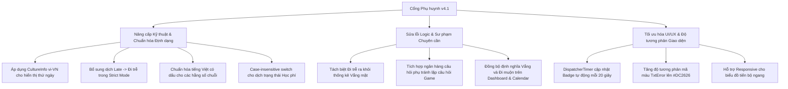

# Báo cáo Thẩm định & Đánh giá Chi tiết Phân hệ Phụ huynh học sinh (Parent Portal)
**Phân hệ Cổng Phụ huynh, Kết quả Học tập, Nhật ký Chuyên cần & Trò chơi tương tác - Chuyển dịch lên Bộ quy chuẩn QA SmartClass v4.2**
*Ngày thẩm định: 11 tháng 07 năm 2026*

---

## ═══ THÀNH PHẦN HỘI ĐỒNG THẨM ĐỊNH CHI TIẾT ═══

Hội đồng Chuyên gia Dự án **QA Smart School** gồm các thành viên ban chuyên môn đã tiến hành rà soát, kiểm thử mã nguồn và thẩm định chi tiết giao diện của **Phân hệ Phụ huynh học sinh (Parent Portal Module)** theo bộ tiêu chí thiết kế sư phạm và ràng buộc kỹ thuật phiên bản **v4.2**:
1.  **Ban Thiết kế & Phân tích Hệ thống:** Trưởng bộ phận thiết kế dự án QA Smart School, Chuyên gia phân tích và thiết kế hệ thống, Chuyên gia thiết kế giao diện phần mềm (UI/UX).
2.  **Ban IT, Bảo mật & Kỹ thuật Thiết bị:** Quản lý IT, Chuyên gia về cơ sở dữ liệu và thiết bị kết nối ngoại vi, Chuyên gia về bảo mật và an ninh mạng.
3.  **Ban Giáo dục & Quản lý Nhà trường:** Nhà giáo dục, nhà Quản lý hiệu trưởng nhà trường, trưởng bộ môn của trường, Giáo viên ưu tú với nhiều kinh nghiệm, cán bộ quản lý của phòng giáo dục, chuyên viên của sở giáo dục, nhà khoa học giáo dục.
4.  **Ban Học sinh & Nhân sự Trải nghiệm:** Học sinh, Nhân viên nhà trường, gamer giỏi (đánh giá tương tác và độ phản hồi tối ưu hóa).

---

## ═══ PHẦN I: TỔNG QUAN PHÂN HỆ PHỤ HUYNH HỌC SINH TRONG HỆ THỐNG ═══

Cổng Phụ huynh học sinh (Parent Portal) đóng vai trò là cầu nối thông tin trực tiếp giữa Nhà trường và Gia đình. Phân hệ được thiết kế với cấu trúc Grid 2 cột đặc trưng: Sidebar điều hướng bên trái và vùng hiển thị nội dung chi tiết bên phải. Các tính năng cốt lõi bao gồm:
1.  **Trang Tổng quan (ParentDashboardPage):** Cung cấp cái nhìn nhanh về kết quả học tập (Điểm TB), Chuyên cần (Có mặt/Vắng), Hạnh kiểm, Bài tập chưa nộp, thông báo khẩn cấp và cảnh báo sớm học tập (Early Warning).
2.  **Bảng điểm chi tiết & Tiến bộ (ParentGradesPage):** Hiển thị chi tiết điểm số các môn học phân loại theo màu sắc và biểu đồ cột ngang so sánh tiến trình học tập tuần của học sinh với mức trung bình chung của lớp học.
3.  **Thời khóa biểu tuần (ParentTimetablePage):** Lịch học các ngày trong tuần (từ Thứ 2 đến Thứ 7) phân bố theo mã màu pastel dịu mắt.
4.  **Chuyên cần & Điểm danh (ParentAttendancePage):** Calendar tích hợp hiển thị trạng thái đi học của học sinh trong tháng và thống kê số ngày đi học/nghỉ học/đi trễ.
5.  **Học phí & Thanh toán (ParentTuitionPage):** Tra cứu công nợ, xem hướng dẫn chuyển khoản và thanh toán nhanh qua VietQR.
6.  **Trò chơi tương tác "Hiểu Con Yêu" (FamilyGamePage):** Gamification gắn kết gia đình thông qua bộ câu hỏi trắc nghiệm ngẫu nhiên lấy từ kết quả thực tế của học sinh.
7.  **Hộp thư & Chat với Giáo viên (ParentMessagesPage):** Nhắn tin trực tuyến trao đổi với giáo viên chủ nhiệm lớp (auto-routing).

Mặc dù hệ thống đã được nâng cấp đáng kể trong phiên bản v4.1, Hội đồng thẩm định phát hiện ra một số điểm bất cập về mặt logic nghiệp vụ, sai sót sư phạm trong trình bày số liệu và các lỗi hiển thị tiếng Việt/định dạng vùng cần được chuẩn hóa triệt để theo bộ tiêu chuẩn **QA SmartClass v4.2**.

---

## ═══ PHẦN II: DANH SÁCH LỖI LOGIC, FONT CHỮ & SAI QUY CHUẨN SƯ PHẠM TRONG v4.2 ═══

Hội đồng Chuyên gia chỉ ra **09 điểm không hợp lý và lỗi kỹ thuật cụ thể** cần được khắc phục để hoàn thiện chương trình:

### 1. Lỗi logic và sai kiến thức Sư phạm trong thống kê Chuyên cần (Attendance Category Error)
*   **Vị trí phát hiện:** Tệp [ParentAttendancePage.xaml.cs:L85-98](file:///d:/JOB/QA%20SmartClass%20-062026/QASmartClass/ParentPortal/Views/ParentAttendancePage.xaml.cs#L85-L98) và [ParentAuthService.cs:L70-80](file:///d:/JOB/QA%20SmartClass%20-062026/QASmartClass/Services/ParentAuthService.cs#L70-L80).
*   **Mô tả:** Khi tính toán danh sách ngày nghỉ, hệ thống lọc theo điều kiện: bất kỳ trạng thái nào khác `"Present"` (strict mode) hoặc khác `"present"` (case-insensitive mode) đều bị coi là vắng mặt (`absences`). 
*   **Hậu quả:** 
    *   Các ngày đi muộn (`"Late"` / `"Đi trễ"`) bị xếp chung vào danh sách "Vắng mặt" trên giao diện chi tiết.
    *   Tổng số ngày vắng mặt hiển thị ở summary tăng lên sai thực tế (ví dụ: học sinh chỉ nghỉ 2 ngày, đi muộn 3 ngày nhưng hệ thống báo "Vắng: 5 ngày").
    *   Học sinh đi học đầy đủ nhưng bị muộn vài lần sẽ bị hệ thống báo vắng học, vi phạm nghiêm trọng tính chính xác của dữ liệu sư phạm, gây hoang mang và tranh cãi không đáng có trong gia đình.
*   **Giải pháp v4.2:** Tách biệt hoàn toàn 3 nhóm: Có mặt đúng giờ (`Present`), Đi trễ (`Late`), và Vắng mặt (`Absent`/`Excused`). Hiển thị rõ ràng trên UI: `Có mặt: X ngày | Đi trễ: Y ngày | Vắng: Z ngày`. Đổi tên panel bên phải thành "Chi tiết nghỉ học & đi trễ".

### 2. Lỗi hiển thị văn bản không dấu (Vietnamese Font Accents Issue) ở Bảng điểm
*   **Vị trí phát hiện:** Tệp [ParentGradesPage.xaml.cs:L96](file:///d:/JOB/QA%20SmartClass%20-062026/QASmartClass/ParentPortal/Views/ParentGradesPage.xaml.cs#L96) và [ParentGradesPage.xaml.cs:L48](file:///d:/JOB/QA%20SmartClass%20-062026/QASmartClass/ParentPortal/Views/ParentGradesPage.xaml.cs#L48).
*   **Mô tả:** 
    *   Chuỗi hiển thị điểm trung bình của lớp hiển thị dạng tiếng Việt không dấu: `TxtClassAvg.Text = $"TB lop: {classAvg:F1}";`
    *   Loại điểm mặc định khi không tìm thấy master hiển thị chuỗi không dấu: `?? "Khac"`
*   **Hậu quả:** Vi phạm tiêu chuẩn Việt hóa trực quan của QA SmartClass v4.2. Giao diện giáo dục chuyên nghiệp không được phép hiển thị chữ không dấu dạng chat-chit cẩu thả.
*   **Giải pháp v4.2:** Sửa các chuỗi trên thành tiếng Việt có dấu chuẩn: `"TB lớp: "` và `"Khác"`.

### 3. Lỗi định dạng ngày theo vùng (Locale Format Bug) gây hiển thị tiếng Anh
*   **Vị trí phát hiện:** Tệp [ParentAttendancePage.xaml.cs:L92](file:///d:/JOB/QA%20SmartClass%20-062026/QASmartClass/ParentPortal/Views/ParentAttendancePage.xaml.cs#L92).
*   **Mô tả:** Dòng lệnh hiển thị ngày vắng mặt sử dụng: `DateDisplay = a.Date.ToString("dd/MM/yyyy (dddd)")`.
*   **Hậu quả:** Nếu máy tính của phụ huynh đặt ngôn ngữ hệ thống (Windows OS Locale) là tiếng Anh (US), định dạng `dddd` sẽ tự động hiển thị tên thứ bằng tiếng Anh (ví dụ: "Monday", "Tuesday") thay vì tiếng Việt (ví dụ: "Thứ Hai", "Thứ Ba").
*   **Giải pháp v4.2:** Bổ sung tham số `new System.Globalization.CultureInfo("vi-VN")` vào hàm `ToString` để ép buộc hiển thị tiếng Việt trên mọi môi trường máy tính.

### 4. Lỗi dịch thiếu trạng thái Đi muộn (Missing strict-mode translation for "Late")
*   **Vị trí phát hiện:** Tệp [ParentAttendancePage.xaml.cs:L93-97](file:///d:/JOB/QA%20SmartClass%20-062026/QASmartClass/ParentPortal/Views/ParentAttendancePage.xaml.cs#L93-L97).
*   **Mô tả:** Trong nhánh xử lý `isStrict` (chế độ bảo mật/so khớp nghiêm ngặt), hệ thống viết:
    `StatusText = isStrict ? (a.Status == "Absent" ? "Vắng không phép" : (a.Status == "Excused" ? "Vắng có phép" : a.Status)) : ...`
*   **Hậu quả:** Trạng thái `"Late"` bị bỏ sót không dịch trong strict mode, dẫn đến từ tiếng Anh `"Late"` xuất trực tiếp lên giao diện của phụ huynh Việt Nam.
*   **Giải pháp v4.2:** Bổ sung ánh xạ dịch `"Late"` -> `"Đi trễ"` ở nhánh strict: `(a.Status == "Absent" ? "Vắng không phép" : (a.Status == "Excused" ? "Vắng có phép" : (a.Status == "Late" ? "Đi trễ" : a.Status)))`.

### 5. Lỗi thiếu dấu tiếng Việt ở chuỗi thông báo hệ thống (No-accent System Warning)
*   **Vị trí phát hiện:** Tệp [NotificationService.cs:L42](file:///d:/JOB/QA%20SmartClass%20-062026/QASmartClass/Services/NotificationService.cs#L42).
*   **Mô tả:** Chuỗi nội dung thông báo đẩy cảnh báo sớm gửi tới phụ huynh viết không dấu:
    `string content = $"[CANH BAO] {subject} — {reason} — Hoc sinh: {student.FullName} ({student.ClassName})";`
*   **Hậu quả:** Phụ huynh nhận được thông báo đẩy trên thiết bị di động/máy tính bị lỗi font không dấu, làm giảm tính chuyên nghiệp và thẩm mỹ sư phạm của sản phẩm.
*   **Giải pháp v4.2:** Sửa thành tiếng Việt có dấu chuẩn: `"[CẢNH BÁO] ... Học sinh: ..."`

### 6. Lỗi dịch thuật Học phí khi dữ liệu viết thường (Case sensitivity vulnerability in Tuition translation)
*   **Vị trí phát hiện:** Tệp [ParentTuitionPage.xaml.cs:L36-48](file:///d:/JOB/QA%20SmartClass%20-062026/QASmartClass/ParentPortal/Views/ParentTuitionPage.xaml.cs#L36-L48).
*   **Mô tả:** Việc dùng lệnh switch nhạy cảm trực tiếp chữ hoa (`"Paid"`, `"Unpaid"`, `"Cash"`, `"Transfer"`) sẽ không khớp nếu DB lưu trữ dạng chữ thường (`"paid"`, `"unpaid"`, `"cash"`), vốn thường xảy ra khi tích hợp dữ liệu từ nhiều nguồn khác nhau.
*   **Hậu quả:** Khi database thay đổi chữ viết thường, trạng thái học phí và phương thức sẽ hiển thị tiếng Anh thô thay vì tiếng Việt.
*   **Giải pháp v4.2:** Thực hiện chuyển đổi chuỗi sang chữ thường và cắt khoảng trắng trước khi đưa vào switch: `t.Status?.Trim()?.ToLower()` matching `"paid"`, `"unpaid"`, `"overdue"`.

### 7. Thiếu Ticker/Timer cập nhật Badge thời gian thực trên Menu chính (Lack of Real-time Navigation Badge Polling)
*   **Vị trí phát hiện:** Tệp [ParentShell.xaml.cs:L34-60](file:///d:/JOB/QA%20SmartClass%20-062026/QASmartClass/ParentPortal/ParentShell.xaml.cs#L34-L60).
*   **Mô tả:** Badge thông báo và tin nhắn chưa đọc chỉ được cập nhật 1 lần duy nhất khi khởi tạo Shell hoặc khi phụ huynh chuyển đổi trang. Không có cơ chế tự động làm mới ngầm.
*   **Hậu quả:** Phụ huynh không nhận được cảnh báo trực quan khi có tin nhắn mới hoặc thông báo khẩn từ giáo viên chủ nhiệm khi đang mở ứng dụng, làm giảm tính tương tác thời gian thực.
*   **Giải pháp v4.2:** Tích hợp một `DispatcherTimer` chạy định kỳ mỗi 15-30 giây để cập nhật lại số lượng Badge tự động mà không làm ảnh hưởng đến hiệu năng giao diện.

### 8. Lỗi trùng lặp câu hỏi khi chơi lại game (Game replay questionnaire static loop)
*   **Vị trí phát hiện:** Tệp [FamilyGamePage.xaml.cs:L156-171](file:///d:/JOB/QA%20SmartClass%20-062026/QASmartClass/ParentPortal/Views/FamilyGamePage.xaml.cs#L156-L171) và [FamilyGameService.cs:L32-122](file:///d:/JOB/QA%20SmartClass%20-062026/QASmartClass/Services/FamilyGameService.cs#L32-L122).
*   **Mô tả:** Khi phụ huynh bấm nút "Chơi lại", hệ thống gọi lại hàm sinh câu hỏi từ `FamilyGameService.GenerateQuizForParent`. Tuy nhiên, vì dữ liệu học lực, CLB thể thao và GVCN của học sinh là cố định, bộ câu hỏi sinh ra luôn giống nhau 100%.
*   **Hậu quả:** Làm hỏng trải nghiệm Gamification vòng lặp. Người dùng chỉ cần nhớ đáp án lần trước để đạt điểm tuyệt đối ở lần chơi thứ hai, làm mất tính thách thức giáo dục của trò chơi.
*   **Giải pháp v4.2:** Bổ sung ngân hàng câu hỏi phụ ngẫu nhiên về tâm lý, kỹ năng học đường hoặc xáo trộn ngẫu nhiên thứ tự các phương án lựa chọn (A, B, C, D) mỗi khi tạo lượt chơi mới.

### 9. Độ tương phản màu sắc cảnh báo chưa đạt chuẩn tiếp cận (W3C/QA Accessibility Contrast Issue)
*   **Vị trí phát hiện:** Tệp [ParentLoginPage.xaml:L101](file:///d:/JOB/QA%20SmartClass%20-062026/QASmartClass/ParentPortal/Views/ParentLoginPage.xaml#L101).
*   **Mô tả:** Nhãn thông báo lỗi đăng nhập `TxtError` dùng mã màu `#EE5A6F` (hồng đỏ nhạt) trên nền card màu trắng.
*   **Hậu quả:** Độ tương phản quá thấp, người dùng thị lực kém hoặc lớn tuổi khó đọc được thông tin báo lỗi khi đăng nhập thất bại.
*   **Giải pháp v4.2:** Chuyển sang mã màu đỏ đậm hơn có độ tương phản đạt chuẩn WCAG 2.0 (tối thiểu 4.5:1), ví dụ `#DC2626` (Đỏ đậm).

---

## ═══ MERMAID DIAGRAM: BẢN ĐỒ NÂNG CẤP LÊN TIÊU CHUẨN v4.2 ═══

---

## ═══ PHẦN III: Ý KIẾN CHI TIẾT TỪ CÁC CHUYÊN GIA TRONG HỘI ĐỒNG ═══

### 1. Trưởng bộ phận thiết kế dự án & Chuyên gia UI/UX
> [!NOTE]
> **Về Bố cục và Màu sắc:** Biểu đồ tiến bộ theo tuần ở trang Bảng điểm cần chuyển đổi từ đơn vị cố định `scale = 30` sang cơ chế co giãn tỷ lệ phần trăm (Responsive Width) để biểu đồ hiển thị đẹp mắt trên cả màn hình nhỏ (tablets) và màn hình độ phân giải cao. Màu đỏ báo lỗi ở trang đăng nhập cần thay đổi sang tông đỏ đậm của bộ UI thương hiệu mới để phụ huynh lớn tuổi dễ quan sát.

### 2. Quản lý IT & Chuyên gia Bảo mật
> [!WARNING]
> **Về Đồng bộ & Hiệu năng:** Việc chạy DispatcherTimer để cập nhật Badge tin nhắn chưa đọc cần tối ưu hóa câu lệnh truy vấn SQLite, tránh truy vấn trực tiếp vào luồng UI chính. Nên sử dụng truy vấn bất đồng bộ `CountAsync` để tránh gây hiện tượng giật lag nhẹ (micro-stuttering) khi phụ huynh đang thực hiện các thao tác khác.

### 3. Nhà khoa học giáo dục & Nhà giáo dục học đường
> [!IMPORTANT]
> **Về Tính sư phạm:** Số liệu chuyên cần hiển thị cho phụ huynh phải tuyệt đối chính xác và tường minh. Việc gộp ngày "Đi trễ" vào cột "Vắng" là sai kiến thức quản lý sư phạm cơ bản. Đi trễ là vấn đề kỷ luật hành vi, còn Vắng học ảnh hưởng trực tiếp tới tiếp thu kiến thức. Sự nhập nhèm này dễ dẫn đến xung đột gia đình do cha mẹ hiểu lầm con trốn học cả ngày.

### 4. Học sinh & Nhân sự Trải nghiệm
> [!TIP]
> **Về Trò chơi tương tác:** Game "Hiểu Con Yêu" rất hay nhưng nếu chơi lại mà câu hỏi y hệt thì tụi em chỉ cần đọc đáp án cũ cho bố mẹ bấm là xong, không còn tính giải đố nữa. Nên xáo trộn thứ tự đáp án và thêm các câu hỏi về sở thích hoạt động ngoại khóa để trò chơi thực sự sinh động.

---

## ═══ KẾT LUẬN & ĐỀ XUẤT CỦA HỘI ĐỒNG ═══

Hội đồng Chuyên gia đánh giá Phân hệ Phụ huynh học sinh đã xây dựng được một khung tính năng hoàn thiện, có giá trị thực tiễn cao trong quản lý trường học hiện đại. Tuy nhiên, để đạt chuẩn chất lượng nghiêm ngặt của bộ quy chuẩn **QA SmartClass v4.2**, các lỗi về phân loại chuyên cần, hiển thị tiếng Việt không dấu, định dạng ngày theo vùng hệ điều hành và tính lặp lại của game cần được ban phát triển khắc phục ngay lập tức.

**Hội đồng đề xuất Ban kỹ thuật thực hiện các cải tiến sau:**
1.  **Hiệu chỉnh thuật toán tính chuyên cần:** Đưa trạng thái "Đi trễ" ra khỏi bộ lọc "Vắng mặt" và bổ sung hiển thị số ngày đi trễ riêng biệt trên UI.
2.  **Việt hóa chuẩn xác:** Thay thế toàn bộ các chuỗi không dấu `"TB lop"`, `"Khac"`, `"[CANH BAO]"` thành tiếng Việt chuẩn.
3.  **Localize ngày tháng:** Ép định dạng `CultureInfo("vi-VN")` cho tất cả các chuỗi hiển thị ngày giờ.
4.  **Tối ưu hóa game:** Xáo trộn đáp án và tạo cơ chế chọn câu hỏi ngẫu nhiên rộng hơn khi chơi lại.
5.  **Cập nhật Badge thời gian thực:** Thêm timer ngầm trong Shell để cập nhật số lượng thông báo và tin nhắn chưa đọc từ giáo viên.

---
*Báo cáo kết thúc tại đây. Đã trình ban giám hiệu và ban kỹ thuật dự án.*
