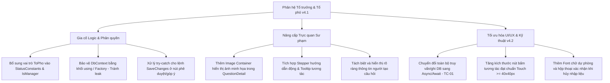

# Báo cáo Thẩm định & Đánh giá Chi tiết Phân hệ Tổ trưởng & Tổ phó chuyên môn
**Phân hệ Quản lý Sinh hoạt tổ, Kiểm định Ngân hàng câu hỏi và Bình duyệt đề thi - Chuyển dịch lên Bộ quy chuẩn QA SmartClass v4.2**
*Ngày thẩm định: 11 tháng 07 năm 2026*

---

## ═══ THÀNH PHẦN HỘI ĐỒNG THẨM ĐỊNH CHI TIẾT ═══

Hội đồng Chuyên gia Dự án **QA Smart School** gồm các thành viên ban chuyên môn đã tiến hành rà soát, kiểm thử mã nguồn và thẩm định chi diện của **Phân hệ Tổ trưởng & Tổ phó chuyên môn** theo bộ tiêu chí thiết kế sư phạm và ràng buộc kỹ thuật phiên bản **v4.2**:
1.  **Ban Thiết kế & Phân tích Hệ thống:** Trưởng bộ phận thiết kế dự án QA Smart School, Chuyên gia phân tích và thiết kế hệ thống, Chuyên gia thiết kế giao diện phần mềm (UI/UX).
2.  **Ban IT, Bảo mật & Kỹ thuật Thiết bị:** Quản lý IT, Chuyên gia về cơ sở dữ liệu và thiết bị kết nối ngoại vi, Chuyên gia về bảo mật và an ninh mạng.
3.  **Ban Giáo dục & Quản lý Nhà trường:** Nhà giáo dục, nhà Quản lý hiệu trưởng nhà trường, trưởng bộ môn của trường, Giáo viên ưu tú với nhiều kinh nghiệm, cán bộ quản lý của phòng giáo dục, chuyên viên của sở giáo dục, nhà khoa học giáo dục.
4.  **Ban Học sinh & Nhân sự Trải nghiệm:** Học sinh, Nhân viên nhà trường, gamer giỏi (đánh giá tương tác và độ phản hồi tối ưu hóa).

---

## ═══ PHẦN I: TỔNG QUAN PHÂN HỆ TỔ TRƯỞNG & TỔ PHÓ CHUYÊN MÔN ═══

Trong hệ thống **QA SmartClass**, Tổ trưởng và Tổ phó chuyên môn đóng vai trò quan trọng trong việc kiểm soát chất lượng giảng dạy, quản lý các cuộc họp chuyên môn và kiểm định ngân hàng câu hỏi/đề thi. Phân hệ của Tổ trưởng & Tổ phó chuyên môn bao gồm 2 nhóm chức năng cốt lõi:
1.  **Sinh hoạt Tổ chuyên môn (DeptMeetingView):** Cho phép ghi chép biên bản cuộc họp, theo dõi tiến độ các đầu việc được giao, phân công nhanh công việc cho giáo viên trong tổ và tạo biên bản mới thông qua hộp thoại `AddMeetingWindow`.
2.  **Kiểm định Ngân hàng câu hỏi (DeptHeadReviewView):** Hỗ trợ duyệt câu hỏi, yêu cầu hiệu chỉnh (từ chối kèm góp ý qua `RejectCommentWindow`), xem chi tiết câu hỏi qua `QuestionDetailWindow` và lọc câu hỏi theo môn học/trạng thái.

Tuy nhiên, qua rà soát chi tiết mã nguồn và kiểm thử giao diện thực tế, Hội đồng thẩm định phát hiện một số lỗi nghiêm trọng về logic phân quyền, thiếu sót hiển thị trực quan sư phạm, rò rỉ bộ nhớ, và các điểm chưa tối ưu về trải nghiệm người dùng cảm ứng (Touch) cần được khắc phục theo bộ tiêu chuẩn **QA SmartClass v4.2**.

---

## ═══ PHẦN II: DANH SÁCH LỖI LOGIC, FONT CHỮ & SAI QUY CHUẨN SƯ PHẠM TRONG v4.2 ═══

Hội đồng Chuyên gia chỉ ra **09 điểm lỗi cụ thể** cần được khắc phục và cải tiến:

### 1. Lỗi logic phân quyền chặn vai trò "Tổ phó chuyên môn" phê duyệt (IsManager Logic Defect)
*   **Vị trí phát hiện:** Tệp [UserSessionService.cs:L71-75](file:///d:/JOB/QA%20SmartClass%20-062026/QASmartClass/Services/UserSessionService.cs#L71-L75) và [StatusConstants.cs:L39-47](file:///d:/JOB/QA%20SmartClass%20-062026/QASmartClass/Data/StatusConstants.cs#L39-L47).
*   **Mô tả:** Trong `StatusConstants.cs`, lớp `TeacherRole` không định nghĩa vai trò `"Tổ phó chuyên môn"` (ví dụ: `ToPho` hoặc `ToPhoCM`). Do đó, thuộc tính `IsManager` trong `UserSessionService.cs` chỉ kiểm tra:
    ```csharp
    public bool IsManager =>
        Role == StatusConstants.TeacherRole.ToTruong ||
        Role == StatusConstants.TeacherRole.HieuPho ||
        Role == StatusConstants.TeacherRole.HieuTruong ||
        Role == StatusConstants.TeacherRole.Admin;
    ```
*   **Hậu quả:** 
    *   Khi giáo viên có vai trò Tổ phó chuyên môn đăng nhập, thuộc tính `IsManager` trả về `false`.
    *   Họ sẽ bị ẩn cột hành động duyệt câu hỏi ở [DeptHeadReviewView.xaml.cs:L31](file:///d:/JOB/QA%20SmartClass%20-062026/QASmartClass/TeacherHub/Views/DeptHeadReviewView.xaml.cs#L31) và bị chặn phê duyệt/góp ý ở [DeptHeadReviewView.xaml.cs:L149](file:///d:/JOB/QA%20SmartClass%20-062026/QASmartClass/TeacherHub/Views/DeptHeadReviewView.xaml.cs#L149) và [QuestionDetailWindow.xaml.cs:L21](file:///d:/JOB/QA%20SmartClass%20-062026/QASmartClass/TeacherHub/Views/QuestionDetailWindow.xaml.cs#L21).
    *   Tổ phó chuyên môn hoàn toàn không thể thực hiện nhiệm vụ kiểm định ngân hàng câu hỏi khi được Tổ trưởng ủy quyền, gây gián đoạn quy trình nghiệp vụ sư phạm thực tế.
*   **Giải pháp v4.2:** Bổ sung hằng số `ToPho` trong `TeacherRole` và cập nhật `IsManager` để hỗ trợ vai trò này.

### 2. Thiếu hiển thị Hình ảnh minh họa câu hỏi trong Thẩm định chi tiết (Missing Illustrative Image Rendering)
*   **Vị trí phát hiện:** Tệp [QuestionDetailWindow.xaml](file:///d:/JOB/QA%20SmartClass%20-062026/QASmartClass/TeacherHub/Views/QuestionDetailWindow.xaml).
*   **Mô tả:** Cửa sổ thẩm định chi tiết câu hỏi `QuestionDetailWindow` hoàn toàn không có control hiển thị hình ảnh minh họa (`Image` hoặc `MediaElement`).
*   **Hậu quả:** 
    *   Đối với các môn khoa học tự nhiên (Toán, Lý, Hóa, Sinh) và Địa lý, các câu hỏi chứa biểu đồ, đồ thị, hình vẽ hình học hoặc sơ đồ phản ứng sẽ không thể hiển thị hình ảnh đi kèm.
    *   Tổ trưởng/Tổ phó chuyên môn phải phê duyệt câu hỏi một cách "mù", không thể phát hiện lỗi vỡ hình, ký hiệu đè lên đồ thị hay ảnh che khuất thông tin như bộ tiêu chuẩn yêu cầu.
*   **Giải pháp v4.2:** Thiết kế thêm khu vực hiển thị hình ảnh minh họa lớn, rõ ràng ở giữa đề bài và các phương án lựa chọn trong `QuestionDetailWindow.xaml`, hỗ trợ phóng to (Zoom) khi nhấp chuột.

### 3. Thực thi đồng bộ gây nghẽn UI Thread (Synchronous DB Query on UI Thread - Vi phạm TC-01)
*   **Vị trí phát hiện:** Tệp [DeptMeetingView.xaml.cs:L34-90](file:///d:/JOB/QA%20SmartClass%20-062026/QASmartClass/TeacherHub/Views/DeptMeetingView.xaml.cs#L34-L90), [DeptHeadReviewView.xaml.cs:L88-134](file:///d:/JOB/QA%20SmartClass%20-062026/QASmartClass/TeacherHub/Views/DeptHeadReviewView.xaml.cs#L88-L134) và [AddMeetingWindow.xaml.cs:L89-158](file:///d:/JOB/QA%20SmartClass%20-062026/QASmartClass/TeacherHub/Views/AddMeetingWindow.xaml.cs#L89-L158).
*   **Mô tả:** Các thao tác đọc danh sách biên bản họp, danh sách công việc theo dõi, và danh sách câu hỏi cần duyệt đều gọi trực tiếp database đồng bộ (ví dụ: `_db.DeptMeetings.ToList()`, `_db.SaveChanges()`).
*   **Hậu quả:** Gây ra hiện tượng đơ cứng (freeze) giao diện khi cơ sở dữ liệu phình to hoặc khi ổ đĩa ghi chậm, vi phạm trực tiếp ràng buộc kỹ thuật **TC-01** (Không treo UI Thread).
*   **Giải pháp v4.2:** Chuyển đổi toàn bộ các hàm đọc/ghi dữ liệu DB sang bất đồng bộ (`async` / `await`), sử dụng `ToListAsync()` và `SaveChangesAsync()`.

### 4. Rò rỉ bộ nhớ & Crash do vòng đời DbContext không chuẩn (DbContext Lifecycle Issue - Vi phạm TC-02)
*   **Vị trí phát hiện:** Tệp [DeptMeetingView.xaml.cs:L22-32](file:///d:/JOB/QA%20SmartClass%20-062026/QASmartClass/TeacherHub/Views/DeptMeetingView.xaml.cs#L22-L32) và [DeptHeadReviewView.xaml.cs:L20-33](file:///d:/JOB/QA%20SmartClass%20-062026/QASmartClass/TeacherHub/Views/DeptHeadReviewView.xaml.cs#L20-L33).
*   **Mô tả:** Đối tượng `_db` (AppDbContext) được khởi tạo khi trang `Loaded` và bị giải phóng (`Dispose`) khi trang `Unloaded`. Do lớp `TeacherHubWindow.xaml.cs` sử dụng cơ chế lưu bộ nhớ đệm (`_viewCache`), trang không thực sự bị giải phóng khi người dùng chuyển tab.
*   **Hậu quả:** 
    *   Khi chuyển tab và quay lại, trang kích hoạt lại sự kiện `Loaded`, khởi tạo lại `_db` mới đè lên cái cũ chưa thu hồi hiệu quả, gây rò rỉ bộ nhớ (Memory Leak).
    *   Trong một số trường hợp, nếu sự kiện ngầm hoặc luồng phụ tương tác với `_db` sau khi trang bị ẩn (Unloaded), ứng dụng sẽ crash ngay lập tức do lỗi `ObjectDisposedException`.
*   **Giải pháp v4.2:** Tuân thủ quy chuẩn **TC-02**: Sử dụng các phiên làm việc DbContext ngắn hạn trong các block `using` hoặc sử dụng `IDbContextFactory` để tạo ngữ cảnh khi cần thiết.

### 5. Lỗi Parse văn bản khi phân công nhanh công việc (Fragile Action Item Parser Bug)
*   **Vị trí phát hiện:** Tệp [AddMeetingWindow.xaml.cs:L112-127](file:///d:/JOB/QA%20SmartClass%20-062026/QASmartClass/TeacherHub/Views/AddMeetingWindow.xaml.cs#L112-L127).
*   **Mô tả:** 
    *   Phân tách dòng công việc sử dụng lệnh `Split('\n')` mà không xử lý ký tự `\r` (Windows line endings), dẫn đến chuỗi nội dung công việc lưu trong DB bị thừa ký tự đặc biệt phá vỡ bố cục hiển thị.
    *   Hệ thống tự động cắt chuỗi dạng `[Tên Người]` thô sơ. Nếu người dùng nhập `[Cô Thảo]: Soạn đề đề thi` thì ký tự dấu hai chấm `:` vẫn bị giữ lại trong nội dung công việc.
*   **Hậu quả:** Dữ liệu hiển thị trên bảng theo dõi công việc bị xấu, lỗi xuống dòng không mong muốn, gây mất mỹ quan sư phạm.
*   **Giải pháp v4.2:** Thay thế bằng `Split(new[] { "\r\n", "\r", "\n" }, StringSplitOptions.RemoveEmptyEntries)`, sử dụng Regex để tách tên người nhận và nội dung công việc chuẩn xác hơn.

### 6. Không có cảnh báo mất dữ liệu khi nhấn Hủy bỏ (Missing Confirmation on Cancel)
*   **Vị trí phát hiện:** Tệp [AddMeetingWindow.xaml.cs:L161-165](file:///d:/JOB/QA%20SmartClass%20-062026/QASmartClass/TeacherHub/Views/AddMeetingWindow.xaml.cs#L161-L165).
*   **Mô tả:** Khi người dùng đang nhập dở biên bản chi tiết cuộc họp rất dài trong `TxtMinutes` mà vô tình nhấn nút "Hủy bỏ" (Cancel), cửa sổ đóng lập tức mà không có bất kỳ xác nhận nào.
*   **Hậu quả:** Giáo viên mất toàn bộ dữ liệu biên bản họp đã nhập, tạo trải nghiệm sử dụng tồi tệ và mất thời gian nhập lại.
*   **Giải pháp v4.2:** Kiểm tra nếu các trường dữ liệu (`TxtAgenda`, `TxtMinutes`) đã có văn bản thì khi nhấn Hủy bỏ phải hiển thị hộp thoại xác nhận: *"Bạn có chắc chắn muốn hủy bỏ? Mọi thay đổi chưa lưu sẽ bị mất."*

### 7. Kích thước nút chạm chưa đạt chuẩn touch màn hình lớn (Touch Target Size Defect - Vi phạm SP-05)
*   **Vị trí phát hiện:** Nút hành động "Duyệt" và "Góp ý" trong [DeptHeadReviewView.xaml:L92-109](file:///d:/JOB/QA%20SmartClass%20-062026/QASmartClass/TeacherHub/Views/DeptHeadReviewView.xaml#L92-L109), và nút "Tạo biên bản" trong [DeptMeetingView.xaml:L16-27](file:///d:/JOB/QA%20SmartClass%20-062026/QASmartClass/TeacherHub/Views/DeptMeetingView.xaml#L16-L27).
*   **Mô tả:** Các nút này có chiều cao thực tế dưới 40px (thường chỉ đạt 30-34px tùy thuộc vào padding và font size mặc định).
*   **Hậu quả:** Gây khó khăn lớn cho giáo viên khi tương tác bằng ngón tay trên màn hình cảm ứng của Tivi tương tác thông minh (Smart Board) ở lớp học, vi phạm quy chuẩn **SP-05** (Vùng chạm >= 40x40px).
*   **Giải pháp v4.2:** Thiết lập thuộc tính `MinHeight="40"` và `MinWidth="80"` cho toàn bộ các nút bấm tương tác trên giao diện.

### 8. Lỗi thiếu Font chữ dự phòng và lỗi hiển thị chữ tiếng Việt (Font Fallback & Accent Issues)
*   **Vị trí phát hiện:** Thuộc tính `FontFamily="{StaticResource InterFont}"` và `{StaticResource OutfitFont}` ở tất cả các trang XAML chuyên môn.
*   **Mô tả:** Việc ép buộc sử dụng font tĩnh không kèm cơ chế dự phòng sẽ khiến phần mềm bị lỗi hiển thị nếu hệ điều hành máy tính của trường học chưa cài hoặc lỗi tệp font Inter/Outfit.
*   **Hậu quả:** Giao diện hiển thị font chữ hệ thống mặc định không tối ưu, có thể gây ra hiện tượng chữ có dấu tiếng Việt bị lệch dòng, méo mó hoặc mất nét thông tin.
*   **Giải pháp v4.2:** Thiết lập lại font family dạng danh sách dự phòng: `FontFamily="Inter, Segoe UI, Arial, sans-serif"`.

### 9. Thiếu chỉ dẫn từng bước trực quan cho nghiệp vụ phê duyệt (Missing Interactive Stepper/Guide)
*   **Vị trí phát hiện:** Trang [DeptHeadReviewView.xaml](file:///d:/JOB/QA%20SmartClass%20-062026/QASmartClass/TeacherHub/Views/DeptHeadReviewView.xaml) và [DeptMeetingView.xaml](file:///d:/JOB/QA%20SmartClass%20-062026/QASmartClass/TeacherHub/Views/DeptMeetingView.xaml).
*   **Mô tả:** Giao diện duyệt câu hỏi chỉ có cột hướng dẫn bằng chữ tĩnh ở góc phải màn hình. Giao diện sinh hoạt tổ không có hướng dẫn. Người dùng mới gặp khó khăn khi thao tác lần đầu.
*   **Hậu quả:** Tăng khả năng bấm nhầm nút phê duyệt hoặc từ chối, gây lỗi dữ liệu và mất thời gian chỉnh sửa lại.
*   **Giải pháp v4.2:** Tích hợp tooltip hướng dẫn động khi di chuột qua các nút hành động, hoặc thiết kế một Stepper chỉ dẫn 3 bước trực quan nổi bật hơn ở thanh công cụ.

---

## ═══ MERMAID DIAGRAM: BẢN ĐỒ NÂNG CẤP LÊN TIÊU CHUẨN v4.2 ═══



---

## ═══ PHẦN III: Ý KIẾN CHI TIẾT TỪ CÁC CHUYÊN GIA TRONG HỘI ĐỒNG ═══

### 1. Trưởng bộ phận thiết kế dự án & Chuyên gia UI/UX
> [!NOTE]
> **Về Bố cục và Touch Target:** Khoảng cách lề (Margin) giữa danh sách biên bản họp và bảng công việc theo dõi hiện tại là `8px`, khá hẹp và dễ tạo cảm giác rối mắt. Cần tăng khoảng trống đệm hợp lý lên `16px`. Tất cả các nút hành động dạng text-icon trên lưới cần có kích thước tối thiểu `40px` để dễ bấm bằng tay trên màn hình tương tác thông minh.

### 2. Quản lý IT & Chuyên gia Cơ sở dữ liệu
> [!WARNING]
> **Về An toàn dữ liệu & Luồng xử lý:** Việc lưu trữ các công việc giao đi kèm trong cuộc họp cần được bọc trong DB Transaction như hiện tại là rất tốt. Tuy nhiên, việc thực thi đồng bộ trên luồng chính (Main UI Thread) là điểm trừ lớn. Hãy lập tức chuyển đổi sang `SaveChangesAsync()` và `BeginTransactionAsync()` để giải phóng UI thread hoàn toàn.

### 3. Nhà khoa học giáo dục & Trưởng bộ môn trường
> [!IMPORTANT]
> **Về Tính sư phạm và Trực quan học liệu:** Một câu hỏi kiểm định không thể chỉ xem mỗi phần chữ. Hình vẽ đồ thị toán học, sơ đồ điện vật lý hay cấu trúc hóa học là linh hồn của câu hỏi trắc nghiệm tự nhiên. Việc thiếu mất khung ảnh minh họa trong giao diện kiểm định chi tiết của Tổ trưởng là một lỗi sư phạm rất nặng. Cần phải bổ sung ngay lập tức!

### 4. Học sinh & gamer giỏi
> [!TIP]
> **Về Trải nghiệm tương tác:** Font chữ không chân (sans-serif) của hệ thống hiển thị tốt nhưng nếu không có font dự phòng thì đôi khi ở các máy tính cấu hình tối giản của trường sẽ bị lỗi ký tự tiếng Việt dạng ô vuông. Giao diện nên có nút "Xem thử đề thi dưới góc nhìn học sinh" để Tổ trưởng đánh giá độ trực quan của câu hỏi trước khi duyệt.

---

## ═══ KẾT LUẬN & ĐỀ XUẤT CỦA HỘI ĐỒNG ═══

Hội đồng Chuyên gia kết luận Phân hệ Tổ trưởng & Tổ phó chuyên môn hiện tại đã đáp ứng được các luồng nghiệp vụ cơ bản nhưng chưa hoàn thiện để chạy thực tế trên hạ tầng trường học thông minh tiêu chuẩn **QA SmartClass v4.2**. Việc chặn phân quyền Tổ phó, thiếu khung ảnh minh họa câu hỏi và xử lý DB đồng bộ gây treo UI là các lỗi nghiêm trọng cần ưu tiên xử lý trước tiên.

**Hội đồng đề xuất Ban phát triển phần mềm thực hiện gấp các cải tiến sau:**
1.  **Cập nhật vai trò:** Bổ sung Tổ phó chuyên môn vào danh sách quản lý để mở khóa quyền kiểm định câu hỏi.
2.  **Bổ sung hình ảnh:** Thêm khung hiển thị ảnh minh họa (Image) trong `QuestionDetailWindow`.
3.  **Tối ưu hóa kỹ thuật:** Chuyển đổi toàn bộ mã nguồn DB sang bất đồng bộ (Async/Await) để tránh treo ứng dụng.
4.  **Cải thiện tương tác Touch:** Nâng kích thước nút bấm lên `>=40px` và thiết lập cảnh báo khi người dùng nhấn hủy bỏ nhập biên bản họp.

---
*Báo cáo kết thúc tại đây. Đã trình ban giám hiệu và ban kỹ thuật dự án.*
