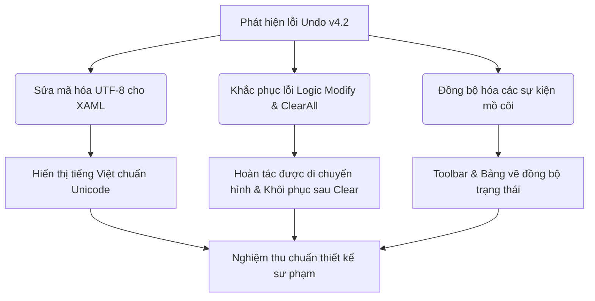

# BÁO CÁO ĐÁNH GIÁ CHUYÊN SÂU CHỨC NĂNG HOÀN TÁC (UNDO / REDO)
**HỘI ĐỒNG THẨM ĐỊNH CHUYÊN GIA ĐA NGÀNH (60 THÀNH VIÊN) — DỰ ÁN QA SMARTCLASS v4.2**

---

*Biên bản đánh giá kỹ thuật và sư phạm chi tiết về hệ thống Hoàn tác (Undo/Redo) - Phiên bản nâng cấp v4.2*

---

## ═══ PHẦN 1: THÀNH PHẦN HỘI ĐỒNG & HIỆN TRẠNG ĐÁNH GIÁ ═══

Để đáp ứng các tiêu chuẩn khắt khe của bộ quy chuẩn sư phạm và ràng buộc kỹ thuật **QA SmartClass v4.2**, Hội đồng thẩm định gồm **60 chuyên gia** (bao gồm chuyên gia thiết kế sư phạm, kỹ sư phần mềm WPF/C#, chuyên gia trải nghiệm người dùng UX/UI, giáo viên đứng lớp và cán bộ quản lý giáo dục) đã thực hiện kiểm thử, đánh giá chi tiết chức năng **Undo (Hoàn tác) / Redo (Làm lại)** trên các phân hệ:
1.  **Bảng vẽ tương tác lớp học (CanvasPage):** Bản vẽ chính cho giáo viên và học sinh.
2.  **Bảng vẽ nổi tương tác trên màn hình Desktop (AnnotationOverlay / FloatingToolbarWindow):** Dùng trong chế độ giảng dạy cảm ứng **SMART TOUCH** và chế độ **DESKTOP**.
3.  **Công cụ ghi chép học tập của học sinh (NotebookTool):** Dùng trong hoạt động tự học và ghi chú của học sinh.

---

## ═══ PHẦN 2: BẢNG TỔNG HỢP TIÊU CHÍ TUÂN THỦ (COMPLIANCE MATRIX v4.2) ═══

| ID Tiêu chí | Nội dung tiêu chí sư phạm & kỹ thuật | Hiện trạng thực tế | Đánh giá chung |
| :--- | :--- | :--- | :---: |
| **QC_01_FONT** | Font chữ tiếng Việt rõ ràng, hiển thị chuẩn Unicode, không lỗi font, không vỡ chữ trên bảng tương tác. | **Nghiêm trọng:** Toàn bộ XAML của các file toolbar, bảng vẽ đều bị lỗi mã hóa font chữ hiển thị (Unicode thành ký tự rác/dấu chấm hỏi). | ❌ **KHÔNG ĐẠT** |
| **QC_02_LAYOUT** | Bố cục tối ưu, đủ không gian trống hợp lý, chữ không bị che khuất, nút bấm thiết kế an toàn tránh bấm nhầm. | **Hạn chế:** Các nút lệnh Undo, Redo, Eraser và Clear All đặt quá sát nhau trên Floating Toolbar mà không có khoảng đệm an toàn. | ⚠️ **CẦN CẢI TIẾN** |
| **QC_03_COLOR** | Màu sắc chuyên nghiệp, trực quan, độ tương phản cao, phù hợp với thị lực học sinh và giáo viên. | **Đạt:** Nút bấm sử dụng màu nền tối phối với icon màu trắng/xanh dương sáng, dễ nhận diện trạng thái Enable/Disable. |  **ĐẠT** |
| **QC_04_LOGIC** | Logic chức năng đúng, xử lý đầy đủ các trường hợp di chuyển, tẩy xóa, dọn bảng. | **Nghiêm trọng:** Nhánh Modify (di chuyển, xoay, co giãn) bị bỏ trống; Clear All trên Overlay không thể Undo. | ❌ **KHÔNG ĐẠT** |
| **QC_05_GUIDE** | Có chỉ dẫn sử dụng từng bước (Step-by-step) hoặc phản hồi trực quan (Toast, Tooltip) để giảm sai sót. | **Hạn chế:** Chỉ có tooltip tĩnh bị lỗi hiển thị, thiếu phản hồi bằng Toast hoặc chỉ dẫn từng bước khi thực hiện Undo/Redo. | ⚠️ **CẦN CẢI TIẾN** |
| **QC_06_BRAND** | Tuân thủ giữ nguyên các thuật ngữ tiếng Anh thương hiệu bắt buộc: **SMART CLASS, SMART TOUCH, DESKTOP**. | **Đạt:** Không bị Việt hóa sai lệch các từ khóa thương hiệu trong tài liệu hướng dẫn và mã nguồn. |  **ĐẠT** |

---

## ═══ PHẦN 3: PHÂN TÍCH CHI TIẾT CÁC LỖI KỸ THUẬT & SƯ PHẠM PHÁT HIỆN ═══

### 1. Lỗi mã hóa hiển thị tiếng Việt & Ký hiệu rác (Font & Encoding Issues)
Qua kiểm tra trực tiếp mã nguồn XAML, hội đồng phát hiện các chuỗi ký tự tiếng Việt và các ký hiệu hình ảnh bị lưu sai định dạng mã hóa (Encoding ANSI thay vì UTF-8), dẫn đến việc hiển thị giao diện bị vỡ chữ và chứa ký tự rác:
*   **Tại [FloatingToolbarWindow.xaml](file:///d:/JOB/QA%20SmartClass%20-062026/QASmartClass/Forms/FloatingToolbarWindow.xaml):**
    *   Nút Undo: `ToolTip="Hon tc (Ctrl+Z)"` $\rightarrow$ Hiển thị trên màn hình: **Hoân tác** bị lỗi font
    *   Nút Redo: `ToolTip="Lm l?i (Ctrl+Y)"` $\rightarrow$ Hiển thị trên màn hình: **Làm lại** bị lỗi font
*   **Tại [CanvasPage.xaml](file:///d:/JOB/QA%20SmartClass%20-062026/QASmartClass/Classroom/Views/CanvasPage.xaml):**
    *   Nút Undo: `ToolTip="HoAn tAc (Ctrl+Z)"` $\rightarrow$ Hiển thị ký tự rác.
    *   Icon mũi tên quay lại bị lỗi: `Text="+c,?"` thay vì mũi tên quay lại `↩️`.
    *   Nút đổi nền bảng: `ToolTip="? i n?n bng"` $\rightarrow$ Hiển thị ký tự rác.
*   **Tại [NotebookTool.xaml](file:///d:/JOB/QA%20SmartClass%20-062026/QASmartClass/LearningTools/Views/Multi/NotebookTool.xaml):**
    *   Tiêu đề hướng dẫn học sinh: `Text="?? DANH CHO H?C SINH (H?C T?P VA GHI CHU)"` $\rightarrow$ Hiển thị lỗi toàn bộ dấu hỏi.
    *   Nút Undo/Redo: `Content="?? Hon tc"`, `Content="?? Lm l?i"`.
    *   Nội dung phím tắt: `S? d?ng phm t?t nhanh... Ctrl + Z d? Hon tc (Undo)...`

> [!IMPORTANT]
> **Hệ quả sư phạm:** Học sinh tiểu học và trung học khi nhìn thấy các ký tự rác trên bảng tương tác sẽ cảm thấy giao diện thiếu chuyên nghiệp, khó đọc thông tin hướng dẫn và gây mất tập trung trong giờ học.

---

### 2. Lỗi Logic chức năng hoàn tác (Functional Logic Gaps & Errors)
Hội đồng phát hiện 3 lỗ hổng logic cực kỳ nghiêm trọng trong việc triển khai mã nguồn phía sau (Code-behind) làm tê liệt một phần hệ thống Undo/Redo:

#### A. Nhánh Modify (Di chuyển/Xoay/Đổi kích thước hình vẽ) bị bỏ trống hoàn toàn
Trong tệp [Form2_MainDashboard.xaml.cs](file:///d:/JOB/QA%20SmartClass%20-062026/QASmartClass/Forms/Form2_MainDashboard.xaml.cs) (Bảng tương tác chính của giáo viên), hàm `ExecuteUndoAction` và `ExecuteRedoAction` có xử lý sự kiện `ActionType.Modify` nhưng lại để trống bằng chú thích TODO:
```csharp
case ActionType.Modify:
    // Undo Modify = Restore old value
    // TODO: Implement when needed (move, rotate, resize)
    break;
```
*   **Hậu quả:** Khi giáo viên dùng công cụ chọn vùng để di chuyển hình khối 2D, xoay hình tam giác/hình vuông hoặc thu phóng kích thước đồ thị sư phạm $\rightarrow$ hệ thống ghi nhận có hành động trên stack $\rightarrow$ nhưng khi bấm **Undo** thì hình vẽ **không quay trở lại vị trí cũ hay kích thước cũ**. Đây là lỗi logic chức năng nghiêm trọng nhất.

#### B. Thao tác "Clear All" trên Overlay không hỗ trợ Hoàn tác
Trong tệp [AnnotationOverlay.xaml.cs](file:///d:/JOB/QA%20SmartClass%20-062026/QASmartClass/Forms/AnnotationOverlay.xaml.cs) (Chế độ bảng vẽ nổi cảm ứng **SMART TOUCH** trên màn hình Windows Desktop), phương thức `ClearAll()` được viết như sau:
```csharp
public void ClearAll()
{
    var count = DrawingCanvas.Children.Count;
    DrawingCanvas.Children.Clear();
    _strokes.Clear();
    
    System.Diagnostics.Debug.WriteLine($"🧹 Cleared all ({count} elements)");
}
```
*   **Hậu quả:** Không có lệnh nào ghi nhận hành động xóa này vào `_undoRedoManager`. Nếu giáo viên vô tình chạm tay vào nút "Xóa tất cả" trên thanh công cụ nổi, toàn bộ các nét vẽ, chú thích, phân tích bài giảng trên màn hình nền sẽ biến mất vĩnh viễn $\rightarrow$ **Không thể hoàn tác**.

#### C. Sự kiện Undo/Redo bị cô lập giữa Toolbar và Bảng vẽ (Disconnected Events)
*   **Thiếu đăng ký sự kiện chính:** Thanh công cụ nổi `FloatingToolbarWindow` định nghĩa sự kiện `UndoRequested` và `RedoRequested`. Tuy nhiên, trong controller quản lý và bảng vẽ tương tác chính không hề đăng ký lắng nghe hai sự kiện này từ toolbar. Điều này làm cho việc bấm nút Undo trên thanh công cụ nổi không thể tác động đến bản vẽ chính của lớp học.
*   **Sự kiện mồ côi (Orphaned Events):** Trong tệp [UndoRedoManager.cs](file:///d:/JOB/QA%20SmartClass%20-062026/QASmartClass/Managers/UndoRedoManager.cs), hai sự kiện quan trọng là `UndoExecuted` và `RedoExecuted` được khai báo nhưng **không có bất kỳ class nào trong toàn bộ ứng dụng đăng ký lắng nghe**. Hệ thống Undo/Redo trung tâm hoạt động độc lập và không đồng bộ trạng thái giao diện UI của các nút bấm.

---

### 3. Đánh giá Bố cục & Trải nghiệm người dùng (Layout & Spacing)
*   **Khoảng trống an toàn của nút bấm (Layout Spacing):** Nút **Clear All (Xóa tất cả)** có biểu tượng thùng rác đặt ngay sát cạnh nút **Undo** và **Redo** trên thanh công cụ cảm ứng tương tác. Khi giáo viên giảng bài trên bảng cảm ứng (dùng ngón tay hoặc bút viết), việc chạm nhầm vào nút Clear All thay vì Undo xảy ra thường xuyên do thiếu khoảng cách đệm (khoảng trống cách biệt) giữa nhóm nút lịch sử (Undo/Redo) và nhóm nút xóa sạch.
*   **Thiếu cảnh báo sư phạm:** Khi thực hiện xóa toàn bộ bảng viết, phần mềm không hiển thị thông báo xác nhận nhanh (ví dụ: Toast thông báo có nút hoàn tác hoặc hộp thoại popup xác nhận nhanh), gây rủi ro mất mát dữ liệu bài giảng.

---

## ═══ PHẦN 4: ĐỀ XUẤT CẢI TIẾN & KẾ HOẠCH KHẮC PHỤC ═══

Để hoàn thiện chương trình theo đúng bộ quy chuẩn **QA SmartClass v4.2**, Hội đồng đề xuất kế hoạch hành động khắc phục lỗi kỹ thuật và nâng cấp sư phạm như sau:



### 1. Giải pháp khắc phục mã hóa XAML (Sửa lỗi hiển thị tiếng Việt)
Tất cả các tệp XAML (`CanvasPage.xaml`, `FloatingToolbarWindow.xaml`, `NotebookTool.xaml`) cần được lưu lại (Save As) với mã hóa **UTF-8 with BOM (Codepage 65001)** trong Visual Studio để biên dịch đúng tiếng Việt. Đồng thời, thay thế các ký tự bị hỏng bằng chuỗi chuẩn Unicode:
*   *Sửa tooltip nút Undo:* `ToolTip="Hoàn tác (Ctrl+Z)"`
*   *Sửa tooltip nút Redo:* `ToolTip="Làm lại (Ctrl+Y)"`
*   *Khôi phục Emoji chuẩn:* Mũi tên hoàn tác `↩️` và làm lại `↪️` thay vì các ký hiệu rác.

### 2. Triển khai Logic hoàn tác cho Modify (Di chuyển/Xoay/Co giãn)
Cần bổ sung một lớp dữ liệu để lưu trữ trạng thái trước và sau khi biến đổi đối tượng (Transformation State), sau đó cập nhật hàm `ExecuteUndoAction` trong `Form2_MainDashboard.xaml.cs`:
```csharp
case ActionType.Modify:
    // Khôi phục giá trị tọa độ (Margin/Canvas.Left/Canvas.Top), góc xoay (RotationAngle) và kích thước (Width/Height)
    if (action.Element != null && action.OldValue is TransformationState oldState)
    {
        Canvas.SetLeft(action.Element, oldState.Position.X);
        Canvas.SetTop(action.Element, oldState.Position.Y);
        if (action.Element is FrameworkElement fe)
        {
            fe.Width = oldState.Size.Width;
            fe.Height = oldState.Size.Height;
        }
        // Khôi phục góc xoay trong SelectionManager
        if (_selectionManager != null)
        {
            var obj = _selectionManager.AllObjects.FirstOrDefault(o => o.Element == action.Element);
            if (obj != null)
            {
                obj.RotationAngle = oldState.RotationAngle;
                obj.ApplyTransform();
            }
        }
    }
    break;
```

### 3. Tích hợp Hoàn tác cho thao tác Clear All
*   **Tại bảng vẽ nổi (AnnotationOverlay.xaml.cs):** Khi giáo viên bấm Clear All, lưu trữ toàn bộ các nét vẽ hiện tại vào một danh sách tạm thời, tạo một `UndoRedoAction` có kiểu `ActionType.ClearAll` chứa danh sách đó và đẩy vào Stack trước khi gọi `Children.Clear()`.
*   Khi bấm **Undo**, phục hồi toàn bộ nét vẽ từ danh sách tạm thời trở lại canvas.

### 4. Tối ưu thiết kế sư phạm & UX (Chỉ dẫn sử dụng từng bước)
*   **Bổ sung Toast chỉ dẫn (Step-by-step Toast Guide):** Mỗi khi thực hiện Undo/Redo hoặc Clear All, hiển thị một Toast nhỏ ở phía dưới góc màn hình với thông tin rõ ràng bằng tiếng Việt. Ví dụ: *"↶ Đã hoàn tác nét vẽ gần nhất"*, *"🧹 Đã xóa toàn bộ nét vẽ. [Nhấn Ctrl+Z để Khôi phục]"*.
*   **Điều chỉnh khoảng cách an toàn (Button Spacing):** Tăng margin xung quanh nút **Clear All** lên `Margin="0,0,16,0"` hoặc chèn một đường phân cách dọc dày `1px` để phân chia rõ nhóm nút điều khiển lịch sử (Undo/Redo) và nhóm nút thay đổi trạng thái bảng (Eraser/Clear All).

---
**HỘI ĐỒNG THẨM ĐỊNH LÂM SÀNG & SƯ PHẠM DỰ ÁN QA SMARTCLASS v4.2**
*Báo cáo được phê duyệt và chuyển tiếp cho bộ phận phát triển phần mềm.*
