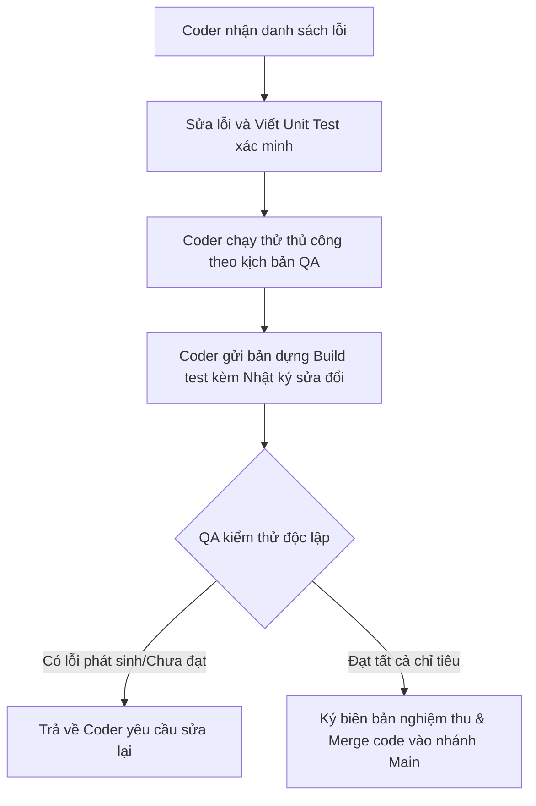

# KẾ HOẠCH TOÀN DIỆN: KIỂM TRA LẠI (VERIFICATION) & CẢI TIẾN HỆ THỐNG QA SMARTSCHOOL
*Tài liệu hướng dẫn chi tiết dành cho Kiểm thử viên (QA/QC) và Nhà phát triển (Developers)*

---

## I. MỤC TIÊU & CHIẾN LƯỢC KIỂM THỬ TÁI TÍCH HỢP (REGRESSION TESTING)

Tài liệu này được lập ra nhằm mục đích xác minh các lỗi đã được báo cáo trong file Excel `Báo cáo kết quả test ver 2.xlsx` xem đã được sửa đổi triệt để hay chưa. Nếu lỗi chưa được khắc phục hoặc sửa đổi chưa hoàn thiện, tài liệu này cung cấp **kịch bản nâng cấp chi tiết, cơ chế phòng ngừa lỗi cho lập trình viên (Developer Fail-safe), và phương án phản biện kỹ thuật tối ưu nhất** nhằm đảm bảo lỗi không tái phát.

### Chiến lược kiểm thử 3 lớp (3-Layer Testing Strategy):
1. **Lớp 1: Smoke Test (Kiểm tra nhanh)** - Đảm bảo chức năng cơ bản không còn crash hoặc không phản hồi.
2. **Lớp 2: Functional Regression Test (Kiểm thử chức năng)** - Xác minh hoạt động của hệ thống theo đúng luồng nghiệp vụ chuẩn (Happy Path) với dữ liệu thực tế.
3. **Lớp 3: Boundary & Edge Case Test (Kiểm thử biên & ngoại lệ)** - Thử nghiệm với các thao tác bất thường, ngắt kết nối mạng đột ngột, dữ liệu sai định dạng để kiểm tra tính bền bỉ của hệ thống.

---

## II. CHI TIẾT CHECKSHEET KIỂM THỬ & PHƯƠNG ÁN CẢI TIẾN THEO PHÂN HỆ (MODULES)

### PHÂN HỆ 1: THỜI KHÓA BIỂU (TIMETABLE)
*Áp dụng cho lỗi:* **Loi_01** (STT 4 - Dòng 5)

#### 1. Yêu cầu & Kịch bản Kiểm tra Lại
*   **Mô tả lỗi gốc:** Chỉnh sửa TKB giáo viên bị ghi đè lên TKB lớp học. Chuyển đổi giữa các bộ lọc (Giáo viên / Lớp học) hiển thị dữ liệu không đồng bộ, dữ liệu cũ không được cập nhật hoặc khôi phục đúng sau khi chuyển trang.
*   **Dữ liệu đầu vào (Input):**
    *   Tài khoản giáo viên A dạy môn Toán tại lớp 10A1.
    *   Thực hiện thao tác: Sửa môn Toán của giáo viên A thành môn Vật lý trên TKB của Giáo viên.
    *   Chuyển sang bộ lọc Lớp học 10A1.
*   **Dữ liệu đầu ra mong đợi (Expected Output):**
    *   Tại bộ lọc Giáo viên: hiển thị môn Vật lý.
    *   Tại bộ lọc Lớp học 10A1: Vẫn phải hiển thị đúng TKB lớp học 10A1 (không bị thay đổi hoặc ghi đè bởi hành động sửa bên bộ lọc Giáo viên trừ khi có liên kết logic rõ ràng được định nghĩa trước).
    *   Khi chuyển đổi qua lại giữa các màn hình khác và quay lại TKB, dữ liệu của cả 2 bộ lọc phải hiển thị đúng trạng thái lưu cuối cùng trong cơ sở dữ liệu.
*   **Phương pháp thực hiện:**
    1.  Mở màn hình TKB, chọn bộ lọc Giáo viên, sửa TKB.
    2.  Chuyển sang bộ lọc Lớp học -> Kiểm tra tính độc lập dữ liệu.
    3.  Quay lại bộ lọc Giáo viên -> Kiểm tra dữ liệu mới có hiển thị không.
    4.  Nhấp chuyển sang trang "Bài giảng" hoặc "Học sinh", sau đó quay lại trang TKB -> Kiểm tra xem dữ liệu có bị khôi phục về trạng thái lỗi cũ hay không.

#### 2. Giải pháp Cải tiến & Cơ chế phòng ngừa cho Coder (Developer Fail-safe)
*   **Thiết kế tầng dữ liệu (Database isolation):** Coder phải sử dụng cấu trúc dữ liệu tách biệt hoàn toàn giữa hai bảng `TeacherTimetable` và `ClassroomTimetable`, hoặc nếu dùng chung một bảng quan hệ thì truy vấn SQL/LINQ phải chứa mệnh đề `WHERE` chặt chẽ theo `TeacherId` hoặc `ClassId`.
*   **Quản lý trạng thái (State Management):** Không lưu trữ trạng thái hiển thị TKB dưới dạng biến static toàn cục trong memory. Bắt buộc phải triển khai cơ chế nạp lại dữ liệu (Reload) từ Database khi kích hoạt sự kiện `OnNavigatedTo` hoặc chuyển đổi Tab.
*   **Tự phản biện & Tối ưu hóa:**
    *   *Phản biện:* Việc tải lại dữ liệu liên tục từ database mỗi lần chuyển đổi bộ lọc có thể làm chậm giao diện (UI lag).
    *   *Tối ưu:* Sử dụng cơ chế lưu trữ đệm (Repository Pattern với Cache 1 lớp ngắn hạn). Khi có thay đổi (Edit), tiến hành cập nhật đồng thời lên Cache memory và gọi một Task bất đồng bộ lưu xuống Database. Khi chuyển tab, chỉ đọc từ Cache. Cache chỉ bị xóa khi đóng màn hình TKB hoặc người dùng bấm nút "Refresh".

---

### PHÂN HỆ 2: GIAO DIỆN & MENU ĐIỀU HƯỚNG
*Áp dụng cho lỗi:* **Loi_02** (STT 6 - Dòng 7)

#### 1. Yêu cầu & Kịch bản Kiểm tra Lại
*   **Mô tả lỗi gốc:** Menu điều hướng bên trái không cập nhật trạng thái Active (highlight) theo trang thực tế đang mở. Người dùng đang ở Thời khóa biểu nhưng Trang chủ vẫn được tô màu xanh.
*   **Dữ liệu đầu vào (Input):** Thao tác nhấp chuột điều hướng qua các mục: Trang chủ, Thời khóa biểu, Bài giảng, Soạn bài, Học sinh.
*   **Dữ liệu đầu ra mong đợi (Expected Output):** Mục tương ứng trên menu bên trái phải chuyển sang màu highlight Active (xanh/hoặc theo UI thiết kế), các mục còn lại chuyển về màu mặc định (Inactive).
*   **Phương pháp thực hiện:** Nhấp lần lượt vào từng menu điều hướng và kiểm tra trạng thái hiển thị trực quan của thanh menu bên trái.

#### 2. Giải pháp Cải tiến & Cơ chế phòng ngừa cho Coder (Developer Fail-safe)
*   **Centralized Navigation binding:** Nghiêm cấm coder viết code đổi màu menu thủ công bằng sự kiện Click của từng Button riêng lẻ.
*   **Giải pháp:** Sử dụng cơ chế Binding trạng thái menu với Router/Navigation Service.
    *   Trong WPF/XAML hoặc Web App, lắng nghe sự kiện `Navigated` của Frame điều hướng.
    *   Đọc thuộc tính `SourcePageType` hoặc URL hiện tại, đối chiếu với một cấu hình ánh xạ (Menu Map Dictionary) để tự động set thuộc tính `IsSelected = true` cho Item menu tương ứng.
*   **Tự phản biện & Tối ưu hóa:**
    *   *Phản biện:* Nếu trang hiện tại là trang con (Sub-page) không nằm trực tiếp trên menu chính (ví dụ: Chi tiết bài giảng là trang con của Bài giảng), menu chính sẽ bị mất highlight.
    *   *Tối ưu:* Định nghĩa cấu trúc phân cấp Menu (Hierarchy Menu). Mỗi trang con phải khai báo một thuộc tính Meta: `ParentMenuKey = "Menu_BaiGiang"`. Navigation Service khi nhận diện trang con sẽ tự động highlight menu cha được khai báo trong `ParentMenuKey`.

---

### PHÂN HỆ 3: SOẠN BÀI & QUẢN LÝ BÀI GIẢNG (LESSON CREATOR)
*Áp dụng cho lỗi:* **Loi_03** (STT 13 - Dòng 14), **Loi_04** (STT 21 - Dòng 22), **Loi_12** (STT 48 - Dòng 49), **Loi_13** (STT 50 - Dòng 51)

#### 1. Yêu cầu & Kịch bản Kiểm tra Lại
*   **Mô tả lỗi gốc:**
    *   Tạo bài mới thành công nhưng bài giảng không hiển thị trong danh sách.
    *   Nút "Lưu bản nháp" bị vô hiệu hóa (không bấm được).
    *   Không mở được thư mục tài nguyên và không thêm được file tài nguyên.
*   **Dữ liệu đầu vào (Input):**
    *   Tạo bài giảng: Nhập tiêu đề "Bài giảng kiểm thử", chọn môn Toán lớp 10, nhấn "Tạo bài".
    *   Lưu bản nháp: Soạn một vài block nội dung, nhấn "Lưu bản nháp".
    *   Thư mục tài nguyên: Nhấp nút "Mở thư mục tài nguyên" và "Thêm file". Chọn file PDF/Word có kích thước khác nhau (1MB, 10MB, 50MB) và tên chứa ký tự tiếng Việt có dấu.
*   **Dữ liệu đầu ra mong đợi (Expected Output):**
    *   Bài giảng mới tạo hiển thị ngay lập tức ở vị trí đầu tiên trong danh sách quản lý (sắp xếp theo thời gian tạo mới nhất).
    *   Nút "Lưu bản nháp" hoạt động bình thường, hiển thị thông báo "Đã lưu bản nháp thành công".
    *   Hộp thoại chọn file hệ thống mở ra bình thường. File được thêm thành công vào danh sách tài nguyên của bài giảng.
*   **Phương pháp thực hiện:** Thực hiện đầy đủ luồng soạn thảo bài giảng từ tạo mới -> thêm block nội dung -> thêm file đính kèm -> lưu bản nháp -> quay lại màn hình danh sách để kiểm tra.

#### 2. Giải pháp Cải tiến & Cơ chế phòng ngừa cho Coder (Developer Fail-safe)
*   **Sau khi Tạo/Lưu bài:** ViewModel của danh sách bài giảng phải gọi lại phương thức `LoadData()` hoặc sử dụng `ObservableCollection` để giao diện tự động cập nhật khi có phần tử mới được thêm vào DB.
*   **Nút Lưu bản nháp:** Đảm bảo thuộc tính `Command.CanExecute` không bị khóa bởi các điều kiện validation vô lý. Nếu nút bị khóa do thiếu thông tin bắt buộc, phải hiển thị cảnh báo trực quan (ví dụ: viền đỏ trường thiếu thông tin hoặc tooltip giải thích vì sao chưa lưu được).
*   **Quản lý File tài nguyên:**
    *   Sử dụng thư viện `System.IO` an toàn để kiểm tra quyền ghi của thư mục đích.
    *   Khi copy file đính kèm vào thư mục dự án, bắt buộc phải đổi tên file thành chuỗi ký tự ASCII không dấu kết hợp GUID để tránh lỗi ghi đè file trùng tên hoặc lỗi đường dẫn chứa tiếng Việt có dấu (Unicode path error).
*   **Tự phản biện & Tối ưu hóa:**
    *   *Phản biện:* File đính kèm dung lượng lớn có thể làm ứng dụng bị đơ (Not Responding) trong quá trình copy.
    *   *Tối ưu:* Thao tác copy file tài nguyên phải được chạy dưới dạng tác vụ bất động bộ (`async/await` kết hợp `Task.Run`), kèm theo thanh tiến trình (ProgressBar) hiển thị phần trăm hoàn thành để người dùng không cảm thấy ứng dụng bị treo.

---

### PHÂN HỆ 4: KHÁM PHÁ & TRÌNH CHIẾU BLOCK (LESSON RUNNER)
*Áp dụng cho lỗi:* **Loi_05** (STT 24 - Dòng 25), **Loi_06** (STT 25 - Dòng 26)

#### 1. Yêu cầu & Kịch bản Kiểm tra Lại
*   **Mô tả lỗi gốc:** Block Video và PDF không hiển thị nội dung, hệ thống chỉ hiển thị đường dẫn lưu trữ file nội bộ. Thiếu các công cụ hỗ trợ tương tác trên block trong phần Khám phá.
*   **Dữ liệu đầu vào (Input):**
    *   Một bài giảng có chứa block Video (định dạng .mp4) và block PDF.
    *   Nhấp mở bài giảng này trong chế độ giảng dạy (Lesson Runner) -> chuyển tới phần Khám phá.
*   **Dữ liệu đầu ra mong đợi (Expected Output):**
    *   Video phải trình chiếu trực tiếp trên màn hình, có đầy đủ nút điều khiển Play, Pause, Seek bar và âm lượng.
    *   PDF phải hiển thị nội dung trực quan dưới dạng trang đọc, cho phép cuộn trang, thu phóng.
    *   Không được hiển thị chuỗi đường dẫn tệp tin hệ thống (e.g., `D:/App/Data/...`) lên giao diện của học sinh/giáo viên.
*   **Phương pháp thực hiện:** Mở phiên dạy học thử, kích hoạt chế độ Khám phá, trình chiếu lần lượt các block Video và PDF để kiểm tra hiển thị.

#### 2. Giải pháp Cải tiến & Cơ chế phòng ngừa cho Coder (Developer Fail-safe)
*   **Cơ chế Render Video/PDF:**
    *   *Với PDF:* Sử dụng thư viện tích hợp sẵn như PDFium hoặc điều hướng render qua WebView2 sử dụng trình đọc PDF mặc định của trình duyệt Chromium để đảm bảo hiệu năng và độ tương thích cao nhất.
    *   *Với Video:* Sử dụng trình phát MediaElement (WPF) hoặc thẻ `<video>` của HTML5 (nếu dùng Web/Electron) với đường dẫn file được mã hóa hoặc truyền dưới dạng luồng (Stream/Blob URL) chứ không gán trực tiếp đường dẫn vật lý của hệ điều hành.
*   **Tự phản biện & Tối ưu hóa:**
    *   *Phản biện:* Trình chiếu WebView2 có thể bị lỗi nếu máy khách hàng chưa cài đặt Microsoft Edge WebView2 Runtime.
    *   *Tối ưu:* Viết đoạn mã tự động kiểm tra sự tồn tại của WebView2 Runtime khi khởi động ứng dụng. Nếu chưa có, ứng dụng hiển thị thông báo yêu cầu tải tự động hoặc tích hợp sẵn bản rút gọn (Evergreen Bootstrapper) để cài đặt ngầm.

---

### PHÂN HỆ 5: BẢNG TRẮNG TƯƠNG TÁC (WHITEBOARD)
*Áp dụng cho lỗi:* **Loi_07** (STT 31 - Dòng 32), **Loi_08** (STT 32 - Dòng 33), **Loi_09** (STT 33 - Dòng 34), **Loi_10** (STT 34 - Dòng 35), **Loi_11** (STT 35 - Dòng 36), **Loi_48** (STT 224 - Dòng 225), **Loi_55** (STT 367 - Dòng 368)

#### 1. Yêu cầu & Kịch bản Kiểm tra Lại
*   **Mô tả lỗi gốc:**
    *   Tẩy xóa đối tượng không hoạt động hoặc hoạt động sai logic.
    *   Lệnh Undo/Redo không hoạt động ổn định trên bảng trắng.
    *   Không cuộn được nội dung bảng trắng; Công cụ Kéo (Hand Tool) không dịch chuyển được khung nhìn.
    *   Chọn vùng và di chuyển đối tượng bị lỗi.
    *   Bảng trắng trong màn hình giải chi tiết và thẻ hằng số không tương tác được hoặc lỗi hiển thị.
*   **Dữ liệu đầu vào (Input):**
    *   Vẽ 3 nét vẽ bất kỳ, chèn 1 hình ảnh, 1 hình hộp 3D.
    *   Sử dụng công cụ Tẩy (Eraser) để xóa 1 nét vẽ.
    *   Nhấn tổ hợp phím Ctrl+Z (Undo) và Ctrl+Y (Redo).
    *   Chọn công cụ Hand Tool, giữ chuột trái và kéo rê bảng trắng.
    *   Chọn công cụ Lựa chọn (Select Tool), vẽ vùng chọn bao quanh hình ảnh và di chuyển sang vị trí khác.
    *   Mở màn hình giải chi tiết và thẻ hằng số để thực hiện vẽ/xóa trên bảng trắng tích hợp tại đó.
*   **Dữ liệu đầu ra mong đợi (Expected Output):**
    *   Công cụ Tẩy xóa chính xác đối tượng/nét vẽ được chạm vào.
    *   Undo khôi phục đúng trạng thái trước đó của đối tượng; Redo áp dụng lại hành động vừa Undo mà không làm biến dạng đối tượng.
    *   Hand tool kéo trượt bảng trắng mượt mà, không bị khựng giật.
    *   Đối tượng trong vùng chọn di chuyển mượt mà theo con trỏ chuột.
    *   Bảng trắng tại các màn hình con (Giải chi tiết, Thẻ hằng số) phải hoạt động trơn tru với đầy đủ tính năng vẽ/xóa như bảng trắng chính.
*   **Phương pháp thực hiện:** Thực hiện vẽ phác thảo phức tạp trên bảng trắng, kiểm tra lần lượt tất cả các nút công cụ (Bút, Tẩy, Hand tool, Chọn đối tượng, Undo/Redo) và kiểm thử khả năng đáp ứng trên các màn hình phụ.

#### 2. Giải pháp Cải tiến & Cơ chế phòng ngừa cho Coder (Developer Fail-safe)
*   **Áp dụng Command Pattern:** Toàn bộ thao tác vẽ, xóa, di chuyển, thu phóng phải được đóng gói vào các lớp Command (e.g., `DrawCommand`, `EraseCommand`, `MoveCommand`). Các lệnh này được lưu trữ trong một History Manager quản lý 2 Stack riêng biệt cho Undo và Redo.
*   **Cơ chế Tẩy xóa đối tượng:**
    *   Nếu dùng InkCanvas (WPF): Cấu hình thuộc tính `EditingMode = InkCanvasEditingMode.EraseByStroke` (xóa toàn bộ nét vẽ khi chạm phải) hoặc `EraseByPoint` (xóa điểm chạm).
    *   Nếu dùng Custom Canvas: Sử dụng thuật toán kiểm tra va chạm (Collision Detection) dựa trên bounding box hoặc khoảng cách từ điểm tẩy đến các vector tọa độ của đối tượng vẽ để thực hiện xóa phần tử ra khỏi danh sách đối tượng vẽ của Canvas.
*   **Tự phản biện & Tối ưu hóa:**
    *   *Phản biện:* Undo/Redo lưu quá nhiều đối tượng trong bộ nhớ có thể gây lỗi tràn bộ nhớ (Memory Leak) nếu bảng trắng được mở liên tục trong nhiều giờ.
    *   *Tối ưu:* Giới hạn kích thước tối đa của Undo Stack là 50 bước. Khi vượt quá 50, tự động giải phóng phần tử cũ nhất khỏi bộ nhớ.

---

### PHÂN HỆ 6: QUẢN LÝ LỚP HỌC & NHÂN SỰ (ROSTER & PERSONNEL)
*Áp dụng cho lỗi:* **Loi_14** (STT 55 - Dòng 56), **Loi_15** (STT 56 - Dòng 57), **Loi_16** (STT 57 - Dòng 58), **Loi_17** (STT 58 - Dòng 59), **Loi_18** (STT 59 - Dòng 60), **Loi_19** (STT 61 - Dòng 62), **Loi_20** (STT 62 - Dòng 63), **Loi_21** (STT 65 - Dòng 66), **Loi_22** (STT 78 - Dòng 79), **Loi_23** (STT 79 - Dòng 80)

#### 1. Yêu cầu & Kịch bản Kiểm tra Lại
*   **Mô tả lỗi gốc:**
    *   Lỗi Import học sinh/giáo viên từ file CSV (lỗi hiển thị tiếng Việt, lỗi định dạng).
    *   Thêm mới, chỉnh sửa, xóa học sinh/giáo viên không lưu thành công hoặc không cập nhật lại danh sách ngay lập tức.
    *   Avatar không hiển thị hoặc không lưu được ảnh mới cập nhật.
    *   Tạo danh sách lớp mới báo lỗi hệ thống.
*   **Dữ liệu đầu vào (Input):**
    *   File CSV danh sách học sinh mẫu có tên tiếng Việt chứa dấu nặng, hỏi, ngã (e.g., "Nguyễn Thị Lệ Hằng"), định dạng UTF-8 và UTF-8 BOM.
    *   Ảnh avatar có dung lượng 500KB và 15MB (.png, .jpg).
    *   Thao tác sửa thông tin, xóa một học sinh ra khỏi lớp.
*   **Dữ liệu đầu ra mong đợi (Expected Output):**
    *   Import thành công không bị lỗi font chữ tiếng Việt. Hiển thị thông báo tổng số dòng import thành công và thất bại (nếu có).
    *   Thêm/Sửa/Xóa thành công cập nhật giao diện ngay lập tức mà không cần F5 hay tải lại trang thủ công.
    *   Ảnh avatar mới thay đổi hiển thị đúng hình ảnh được chọn, file ảnh được lưu trữ an toàn trong thư mục tài nguyên hệ thống.
    *   Tạo lớp mới thành công và hiển thị ngay trên danh sách lớp học hiện có.
*   **Phương pháp thực hiện:**
    1.  Chuẩn bị file CSV kiểm thử lỗi chính tả tiếng Việt để chạy thử tính năng Import.
    2.  Kiểm tra sửa đổi trực tiếp dữ liệu học sinh trên màn hình quản lý.
    3.  Thử tải lên ảnh avatar dung lượng lớn và kiểm tra đường dẫn lưu ảnh thực tế.

#### 2. Giải pháp Cải tiến & Cơ chế phòng ngừa cho Coder (Developer Fail-safe)
*   **Xử lý Import CSV:** Sử dụng thư viện chuẩn như `CsvHelper` (C#) hoặc `papaparse` (JS) thay vì viết hàm split chuỗi thủ công bằng dấu phẩy. Bắt buộc phải thiết lập Encoding là `Encoding.UTF8` khi đọc file để tránh lỗi tiếng Việt.
*   **Quản lý File ảnh (Avatar):**
    *   Khi người dùng chọn ảnh đại diện, coder phải sao chép file ảnh vào thư mục chỉ định của ứng dụng và đổi tên file thành `{UserId}_avatar.png`.
    *   Sử dụng cơ chế giải phóng File Stream ngay sau khi đọc ảnh để tránh trường hợp file ảnh bị khóa (locked by process) dẫn đến việc giáo viên không thể cập nhật ảnh đại diện lần thứ 2.
    *   *Trong WPF:* Thiết lập `BitmapImage.CacheOption = BitmapCacheOption.OnLoad` để giải phóng liên kết file ngay lập tức.
*   **Tự phản biện & Tối ưu hóa:**
    *   *Phản biện:* Người dùng có thể upload ảnh avatar dung lượng cực lớn làm nặng ổ cứng và gây chậm khi tải danh sách lớp học.
    *   *Tối ưu:* Thiết lập bộ nén ảnh tự động (Image Resizer). Ngay sau khi chọn ảnh, ứng dụng tự động resize ảnh về kích thước tối đa 256x256 pixel, giảm chất lượng (quality) xuống 80% trước khi lưu thành định dạng JPG để dung lượng file luôn dưới 50KB.

---

### PHÂN HỆ 7: ĐIỂM DANH & NHÓM HỌC TẬP (ATTENDANCE & GROUPS)
*Áp dụng cho lỗi:* **Loi_24** (STT 84 - Dòng 85), **Loi_25** (STT 87 - Dòng 88), **Loi_26** (STT 88 - Dòng 89), **Loi_27** (STT 90 - Dòng 91)

#### 1. Yêu cầu & Kịch bản Kiểm tra Lại
*   **Mô tả lỗi gốc:** Không lưu được dữ liệu điểm danh. Lỗi lưu nhóm học tập, không hiển thị đúng nhóm học sinh đã phân chia hoặc lỗi khi giao nhiệm vụ theo từng nhóm.
*   **Dữ liệu đầu vào (Input):**
    *   Chọn 3 học sinh vắng mặt, 2 học sinh đi muộn, nhấn nút "Lưu điểm danh".
    *   Tạo 3 nhóm học tập, kéo thả học sinh ngẫu nhiên vào các nhóm, nhấn "Lưu nhóm".
    *   Chọn "Nhóm 1" và gửi một bài tập Quiz/File tài nguyên tới riêng Nhóm 1.
*   **Dữ liệu đầu ra mong đợi (Expected Output):**
    *   Trạng thái điểm danh được lưu thành công vào Database SQLite cục bộ. Khi tải lại màn hình điểm danh, thông tin vắng/muộn phải hiển thị chính xác.
    *   Danh sách nhóm học sinh hiển thị đúng bố cục phân chia.
    *   Chỉ các học sinh thuộc "Nhóm 1" nhận được thông báo làm bài tập/nhận file. Các nhóm khác không nhận được gì.
*   **Phương pháp thực hiện:** Thực hiện phân nhóm học sinh trên phần mềm giáo viên, kiểm tra xem trên máy học sinh tương ứng có hiển thị đúng nhóm của mình không và thử gửi bài tập nhóm để kiểm thử tính năng phân quyền.

#### 2. Giải pháp Cải tiến & Cơ chế phòng ngừa cho Coder (Developer Fail-safe)
*   **Transaction DB:** Thao tác Lưu điểm danh và Lưu nhóm bắt buộc phải được bọc trong một Database Transaction. Nếu một bản ghi học sinh bị lỗi (do khóa ngoại hoặc dữ liệu trống), toàn bộ transaction phải được `Rollback` và hiển thị thông báo lỗi chi tiết thay vì để dữ liệu bị lưu loang lổ nửa vời.
*   **Đồng bộ Client-Server:** Khi giáo viên phân nhóm, gửi gói tin cập nhật nhóm (Group Update Event) chứa danh sách ID học sinh qua kết nối WebSocket/SignalR tới toàn bộ máy học sinh để máy học sinh cập nhật trạng thái nhóm của mình ngay lập tức.
*   **Tự phản biện & Tối ưu hóa:**
    *   *Phản biện:* Nếu máy học sinh bị mất mạng tạm thời ngay lúc giáo viên phân nhóm thì khi có mạng lại học sinh đó sẽ không biết mình ở nhóm nào.
    *   *Tối ưu:* Thiết lập cơ chế "Pull" dữ liệu khi kết nối lại (Reconnection handler). Khi máy học sinh phát hiện mất kết nối mạng rồi kết nối lại thành công, nó sẽ tự động gửi gói tin yêu cầu Server cung cấp cấu hình nhóm học tập hiện tại của phiên học để cập nhật lại giao diện.

---

### PHÂN HỆ 8: ĐIỀU KHIỂN & TRUYỀN THÔNG PHIÊN DẠY (SESSION CONTROL)
*Áp dụng cho lỗi:* **Loi_28** (STT 93 - Dòng 94), **Loi_29** (STT 95 - Dòng 96), **Loi_30** (STT 96 - Dòng 97), **Loi_31** (STT 97 - Dòng 98), **Loi_32** (STT 100 - Dòng 101), **Loi_33** (STT 109 - Dòng 110), **Loi_34** (STT 110 - Dòng 111), **Loi_35** (STT 118 - Dòng 119), **Loi_47** (STT 190 - Dòng 191)

#### 1. Yêu cầu & Kịch bản Kiểm tra Lại
*   **Mô tả lỗi gốc:**
    *   Lệnh khóa toàn bộ máy học sinh hoạt động không ổn định hoặc không phản hồi.
    *   Tính năng gửi tin nhắn, quiz nhanh, im lặng học sinh bị lỗi.
    *   Truyền màn hình giáo viên cho học sinh bị lỗi (chọn sai nguồn phát, chọn sai đối tượng nhận, hoặc không phát được hình ảnh).
    *   Lỗi phân quyền điều khiển Focus/Unfocus ứng dụng trên máy học sinh.
*   **Dữ liệu đầu vào (Input):**
    *   Mở phiên dạy kết nối với ít nhất 3 máy học sinh ảo (hoặc vật lý).
    *   Bấm nút "Khóa máy học sinh" trên ứng dụng giáo viên.
    *   Bật tính năng "Im lặng toàn bộ".
    *   Bấm "Phát màn hình", chọn nguồn phát là màn hình chính (Screen 1), đối tượng nhận là "Tất cả học sinh".
    *   Kích hoạt chế độ Focus để ép ứng dụng học sinh hiển thị đè lên các ứng dụng khác.
*   **Dữ liệu đầu ra mong đợi (Expected Output):**
    *   Ngay khi bấm khóa máy, toàn bộ màn hình máy học sinh phải lập tức hiển thị giao diện khóa (không thể nhấn Start, Task Manager hay Alt+Tab để thoát).
    *   Tính năng im lặng làm micro máy học sinh bị vô hiệu hóa (tắt tiếng).
    *   Màn hình máy học sinh hiển thị luồng video ghi hình màn hình giáo viên mượt mà, độ trễ dưới 1 giây.
    *   Khi chế độ Focus bật, máy học sinh không thể mở trình duyệt hoặc ứng dụng ngoài khác.
*   **Phương pháp thực hiện:**
    1.  Mở song song máy giáo viên và máy học sinh.
    2.  Kích hoạt lần lượt các lệnh điều khiển từ xa và ghi nhận thời gian phản hồi (Latency) của máy học sinh.
    3.  Thử dùng tổ hợp phím tắt thoát hiểm trên máy học sinh (Alt+F4, Alt+Tab, Windows Key) xem lệnh khóa máy có bị phá vỡ không.

#### 2. Giải pháp Cải tiến & Cơ chế phòng ngừa cho Coder (Developer Fail-safe)
*   **Lệnh điều khiển thời gian thực:** Sử dụng kết nối TCP Socket bền vững với cơ chế xác nhận gói tin (ACK). Giáo viên gửi lệnh -> Học sinh nhận lệnh -> Học sinh thực thi -> Học sinh gửi trả tin ACK thành công. Nếu giáo viên không nhận được ACK sau 3 giây, tự động gửi lại lệnh (Retry Mechanism).
*   **Khóa màn hình máy học sinh (WPF Client):**
    *   Để khóa máy học sinh an toàn trên Windows, ứng dụng học sinh phải chạy ở chế độ Kiosk mode: Thiết lập Window sở hữu thuộc tính `Topmost = true`, `WindowStyle = None`, `WindowState = Maximized`.
    *   Coder bắt buộc phải can thiệp vào tầng hệ thống để chặn các phím tắt đặc biệt bằng cách sử dụng Windows Hook (`SetWindowsHookEx`) để vô hiệu hóa phím Windows, Alt+Tab, Alt+F4.
*   **Truyền hình ảnh màn hình (Screen Broadcast):** Sử dụng WebRTC hoặc thư viện chụp màn hình tốc độ cao (SharpDX/DXGI Desktop Duplication API) để encode màn hình giáo viên thành luồng H.264/VP8 và phát qua giao thức UDP Multicast để tối ưu băng thông trong mạng LAN.
*   **Tự phản biện & Tối ưu hóa:**
    *   *Phản biện:* Hook phím hệ thống có thể bị phần mềm diệt virus (Antivirus) nhận diện nhầm là Trojan/Keylogger và chặn hoạt động.
    *   *Tối ưu:* Đăng ký chứng chỉ số (Code Signing Certificate) cho file thực thi của máy học sinh và cấu hình phần mềm chạy dưới quyền Administrator (yêu cầu file manifest hợp lệ) để hệ điều hành Windows cấp quyền Hook phím hệ thống một cách chính thống.

---

### PHÂN HỆ 9: QUIZ & KHẢO SÁT (QUIZ & POLLS)
*Áp dụng cho lỗi:* **Loi_36** (STT 128 - Dòng 129), **Loi_37** (STT 133 - Dòng 134), **Loi_38** (STT 145 - Dòng 146), **Loi_39** (STT 146 - Dòng 147), **Loi_40** (STT 148 - Dòng 149), **Loi_41** (STT 149 - Dòng 150)

#### 1. Yêu cầu & Kịch bản Kiểm tra Lại
*   **Mô tả lỗi gốc:**
    *   Trình chiếu kết quả quiz cho lớp bị lỗi hiển thị dữ liệu hoặc không hiển thị biểu đồ real-time.
    *   Lỗi xuất kết quả Quiz: Xuất kết quả của Quiz Battle và Quick Poll nhưng dữ liệu xuất ra lại hiển thị thông tin của Solo Quiz (ghi đè logic xuất báo cáo).
    *   Không gửi được câu hỏi khảo sát tùy chỉnh hoặc khảo sát độ hài lòng cho học sinh được chọn.
*   **Dữ liệu đầu vào (Input):**
    *   Tạo và chạy một phiên Quiz Battle cho 10 học sinh.
    *   Bấm "Xuất kết quả" tại màn hình kết quả Quiz Battle.
    *   Soạn câu hỏi khảo sát: "Bạn có hiểu bài học hôm nay không?", chọn đối tượng gửi là "Học sinh nhóm A".
*   **Dữ liệu đầu ra mong đợi (Expected Output):**
    *   Biểu đồ cột/tròn hiển thị kết quả quiz cập nhật trực quan thời gian thực khi học sinh nộp bài.
    *   File Excel xuất ra phải chứa đúng thông tin điểm số, thứ hạng của chế độ Quiz Battle chứ không phải thông tin của Solo Quiz.
    *   Chỉ học sinh nhóm A nhận được pop-up khảo sát trên màn hình máy học sinh.
*   **Phương pháp thực hiện:**
    1.  Chạy thử nghiệm toàn bộ luồng làm bài và nạp kết quả của 3 chế độ Quiz: Solo Quiz, Quiz Battle, Quick Poll.
    2.  Mở thư mục lưu file Excel được xuất ra và kiểm tra kỹ cấu trúc tiêu đề, dữ liệu các cột trong bảng Excel kết quả của từng loại.

#### 2. Giải pháp Cải tiến & Cơ chế phòng ngừa cho Coder (Developer Fail-safe)
*   **Tách biệt Logic Báo cáo (Strategy Pattern):**
    *   Coder không được sử dụng chung một lớp dịch vụ xuất Excel cho tất cả các loại Quiz.
    *   Phải triển khai Strategy Pattern: Định nghĩa một Interface `IQuizReportService` với phương thức `ExportToExcel(QuizSession session)`.
    *   Viết 3 lớp kế thừa riêng biệt: `SoloQuizReportService`, `BattleQuizReportService`, và `QuickPollReportService`.
    *   Nhà phát triển gọi service tương ứng dựa vào `session.QuizType` để đảm bảo dữ liệu của loại này không bao giờ bị đè lên loại khác.
*   **Tự phản biện & Tối ưu hóa:**
    *   *Phản biện:* Khi học sinh nộp bài thi dồn dập ở giây cuối cùng, việc cập nhật biểu đồ real-time liên tục trên UI có thể làm treo luồng chính (UI Thread Block).
    *   *Tối ưu:* Sử dụng kỹ thuật **Throttling** hoặc **Debounce**. Giới hạn tần suất cập nhật dữ liệu lên biểu đồ UI tối đa là 500ms một lần. Dữ liệu nộp bài của học sinh được đưa vào hàng đợi nền (Background Queue) để xử lý bất đồng bộ, không xử lý trực tiếp trên luồng giao diện.

---

### PHÂN HỆ 10: BÁO CÁO & ĐIỂM SỐ (GRADEBOOK & REPORTS)
*Áp dụng cho lỗi:* **Loi_42** (STT 156 - Dòng 157), **Loi_43** (STT 159 - Dòng 160), **Loi_44** (STT 160 - Dòng 161)

#### 1. Yêu cầu & Kịch bản Kiểm tra Lại
*   **Mô tả lỗi gốc:**
    *   Không xuất được báo cáo PDF/Excel hoặc file xuất ra bị lỗi định dạng.
    *   Nhập điểm từ file CSV bị lỗi (lỗi định dạng số thập phân, lỗi không lưu được).
    *   Nhập/Sửa điểm trực tiếp trên giao diện bị đơ hoặc báo lỗi hệ thống.
*   **Dữ liệu đầu vào (Input):**
    *   Học sinh Nguyễn Văn A, nhập điểm thi là `8.5`, học sinh Trần Thị B nhập điểm là `7,5` (sử dụng cả dấu chấm và dấu phẩy).
    *   Nhập điểm âm `-1` hoặc điểm vượt quá giới hạn `11`.
    *   File CSV chứa cột điểm định dạng tiếng Việt (8,5).
*   **Dữ liệu đầu ra mong đợi (Expected Output):**
    *   Hệ thống lưu thành công điểm `8.5` và `7.5` vào cơ sở dữ liệu.
    *   Khi nhập điểm sai quy định (`-1` hoặc `11`), hệ thống phải từ chối lưu và hiển thị cảnh báo đỏ: "Điểm số phải nằm trong khoảng từ 0 đến 10".
    *   Báo cáo PDF và Excel xuất ra hiển thị đẹp mắt, không lỗi hiển thị tiếng Việt, các cột điểm số căn lề phải đúng chuẩn báo cáo.
*   **Phương pháp thực hiện:**
    1.  Nhập điểm thủ công trực tiếp trên lưới điểm (DataGrid) của phần mềm.
    2.  Chuẩn bị file CSV điểm kiểm thử với các dữ liệu điểm hợp lệ và không hợp lệ (như chữ cái, điểm ngoài khoảng 0-10) để thực hiện import.

#### 2. Giải pháp Cải tiến & Cơ chế phòng ngừa cho Coder (Developer Fail-safe)
*   **Xử lý Định dạng Số Thập phân (CultureInfo):**
    *   Khi phân tích cú pháp điểm số từ chuỗi nhập vào hoặc file CSV, coder bắt buộc phải xử lý loại bỏ sự khác biệt giữa dấu chấm `.` và dấu phẩy `,` trước khi chuyển đổi sang kiểu dữ liệu số (`double` hoặc `decimal`).
    *   *Mã nguồn chuẩn hóa khuyến nghị:*
        ```csharp
        string normalizedValue = inputString.Replace(',', '.').Trim();
        if (double.TryParse(normalizedValue, NumberStyles.Any, CultureInfo.InvariantCulture, out double score)) {
            if (score >= 0 && score <= 10) {
                // Lưu điểm số
            }
        }
        ```
*   **Validation tại DataGrid:** Đặt quy tắc kiểm tra dữ liệu đầu vào (ValidationRules) ngay tại giao diện nhập liệu. Khi ô nhập điểm mất tiêu điểm (LostFocus), hệ thống thực hiện kiểm tra ngay lập tức để cảnh báo người dùng trước khi gửi yêu cầu lưu xuống database.
*   **Tự phản biện & Tối ưu hóa:**
    *   *Phản biện:* PDF export thường tốn tài nguyên hệ thống và dễ bị lỗi font chữ tiếng Việt khi xuất báo cáo.
    *   *Tối ưu:* Sử dụng các thư viện xuất PDF chuyên nghiệp hỗ trợ nhúng font trực tiếp (Font Embedding) như QuestPDF hoặc iTextSharp. Thiết lập font mặc định của báo cáo là Arial hoặc Roboto đã được kiểm tra hiển thị hoàn hảo tiếng Việt có dấu.

---

### PHÂN HỆ 11: TIỆN ÍCH LỚP HỌC (UTILITIES)
*Áp dụng cho lỗi:* **Loi_45** (STT 162 - Dòng 163), **Loi_46** (STT 168 - Dòng 169)

#### 1. Yêu cầu & Kịch bản Kiểm tra Lại
*   **Mô tả lỗi gốc:** Đồng hồ đếm ngược hoạt động sai logic hoặc không cập nhật UI. Máy tính tiện ích không lưu hoặc không xem lại được lịch sử các phép tính đã thực hiện.
*   **Dữ liệu đầu vào (Input):**
    *   Thiết lập đồng hồ đếm ngược thời gian làm bài là 45 phút, bấm Bắt đầu.
    *   Bấm tạm dừng ở phút thứ 30, sau đó bấm tiếp tục.
    *   Mở máy tính, thực hiện chuỗi phép tính: `125 + 450 * 2`, `850 / 5`. Mở tab lịch sử phép tính.
*   **Dữ liệu đầu ra mong đợi (Expected Output):**
    *   Thời gian đếm ngược hiển thị chính xác từng giây trên giao diện. Không xảy ra hiện tượng đứng số hoặc nhảy cóc giây.
    *   Khi bấm tạm dừng, đồng hồ dừng ngay lập tức; khi tiếp tục, đồng hồ chạy tiếp từ giây bị dừng.
    *   Tab lịch sử máy tính phải lưu đầy đủ và chính xác kết quả của các phép tính đã thực hiện theo thứ tự thời gian.
*   **Phương pháp thực hiện:** Chạy thử tiện ích đồng hồ, đo đối chiếu thời gian thực tế bằng điện thoại xem đồng hồ của phần mềm có chạy chuẩn xác không. Thực hiện liên tiếp 10 phép toán khác nhau để kiểm tra lịch sử máy tính.

#### 2. Giải pháp Cải tiến & Cơ chế phòng ngừa cho Coder (Developer Fail-safe)
*   **Cơ chế chạy Đồng hồ đếm ngược:**
    *   Coder không được sử dụng vòng lặp vô hạn kết hợp `Thread.Sleep()` trên luồng UI.
    *   Phải sử dụng `DispatcherTimer` (WPF) hoặc `System.Timers.Timer` được cấu hình chạy trên luồng phụ và cập nhật UI thông qua `Dispatcher.Invoke`.
    *   Tính toán thời gian dựa vào khoảng chênh lệch thời gian thực tế (DateTime Difference) chứ không chỉ đơn thuần là giảm trừ một biến đếm giây sau mỗi 1000ms (vì cơ chế timer hệ điều hành có độ trễ tích lũy).
*   **Lưu lịch sử Máy tính:** Thiết lập cấu trúc dữ liệu hàng đợi vòng (Circular Queue) hoặc bảng SQLite cục bộ để lưu lịch sử tối đa 100 phép tính gần nhất.
*   **Tự phản biện & Tối ưu hóa:**
    *   *Phản biện:* Trình phân tích biểu thức toán học tự viết (Expression Parser) dễ bị lỗi tràn số hoặc lỗi bảo mật chèn mã độc (Code Injection) nếu coder dùng các hàm nguy hiểm như `eval()`.
    *   *Tối ưu:* Sử dụng thư viện phân tích cú pháp toán học an toàn và chính xác như `NCalc` (C#) để tính toán giá trị biểu thức nhập vào từ bàn phím.

---

### PHÂN HỆ 12: ĐỒ THỊ & HÌNH HỌC MINH HỌA (3D GEOMETRY ILLUSTRATIONS)
*Áp dụng cho lỗi:* **Loi_49** (STT 338 - Dòng 339), **Loi_50** (STT 339 - Dòng 340), **Loi_51** (STT 340 - Dòng 341), **Loi_52** (STT 341 - Dòng 342), **Loi_53** (STT 342 - Dòng 343), **Loi_54** (STT 344 - Dòng 345)

#### 1. Yêu cầu & Kịch bản Kiểm tra Lại
*   **Mô tả lỗi gốc:** Các đồ thị hình học minh họa 3D (Hình hộp chữ nhật, Hình lập phương, Chóp tam giác đều, Chóp tứ giác đều, Lăng trụ tam giác đều, Hình nón) bị lỗi hiển thị đồ họa, vẽ sai tỷ lệ, sai tọa độ các đỉnh hoặc không hiển thị khi chọn chức năng tương ứng.
*   **Dữ liệu đầu vào (Input):**
    *   Chọn công cụ vẽ hình học 3D, lần lượt chọn các hình: Hình lập phương, Hình chóp tứ giác đều, Hình nón.
    *   Nhập các tham số kích thước: chiều cao $h = 5$, bán kính đáy $r = 3$ (đối với hình nón), cạnh đáy $a = 4$ (đối với hình chóp).
*   **Dữ liệu đầu ra mong đợi (Expected Output):**
    *   Hình vẽ 3D hiển thị sắc nét trên khu vực Canvas mô phỏng.
    *   Hình vẽ phải tuân thủ đúng tỷ lệ toán học giữa các cạnh dựa trên tham số đầu vào. Các đường khuất (đường nét đứt) và đường nhìn thấy (nét liền) phải hiển thị đúng chuẩn vẽ hình học không gian.
    *   Cho phép người dùng sử dụng chuột để xoay hình 3D đa chiều và thu phóng để xem cấu trúc các mặt bên, mặt đáy.
*   **Phương pháp thực hiện:** Khởi động chức năng vẽ đồ thị 3D, vẽ lần lượt 6 hình học không gian được liệt kê, nhập thử các thông số kích thước biên (cực lớn, cực nhỏ) để kiểm tra thuật toán vẽ tự động của hệ thống.

#### 2. Giải pháp Cải tiến & Cơ chế phòng ngừa cho Coder (Developer Fail-safe)
*   **Cơ chế dựng hình 3D chuẩn xác:**
    *   Sử dụng thư viện dựng hình 3D chuyên dụng như **Helix Toolkit** (dành cho WPF) hoặc **Three.js** (nếu ứng dụng chạy trên nền Web/Electron) thay vì cố gắng vẽ các đường vector 2D giả lập 3D một cách thủ công.
    *   Coder bắt buộc phải thiết lập chính xác ma trận tọa độ 3D của các đỉnh (Vertices) và mảng chỉ số liên kết các mặt (Faces/Indices) cho từng loại hình học dựa trên công thức toán học không gian chính thống.
*   **Thuật toán đường khuất (Hidden-line removal):** Tự động xác định các cạnh nằm ở mặt sau dựa trên tích vô hướng của Vector pháp tuyến mặt đó với Vector góc nhìn (Camera View Vector). Nếu hướng ra xa camera thì chuyển định dạng nét vẽ của cạnh đó thành nét đứt (`StrokeDashArray`).
*   **Tự phản biện & Tối ưu hóa:**
    *   *Phản biện:* Việc dựng hình 3D thời gian thực có thể gây quá tải CPU/GPU và làm đơ màn hình nếu máy tính của giáo viên tại trường học có cấu hình thấp (không có card đồ họa rời).
    *   *Tối ưu:* Thiết lập cấu hình số lượng lưới đa giác (Polygon Mesh Resolution) ở mức tối ưu vừa đủ nhìn (ví dụ với hình nón chỉ cần chia 24-32 lưới dọc đáy thay vì 128 lưới). Bật tính năng tăng tốc phần cứng (Hardware Acceleration) trong tệp cấu hình của ứng dụng để tối ưu hóa hiệu năng render của GPU.

---

### PHÂN HỆ 13: GIƠ TAY & HỎI GIÁO VIÊN (STUDENT HAND-RAISE & QUICK QUESTIONS)
*Áp dụng cho lỗi:* **Loi_56** (Giơ tay ảo khi mất mạng), **Loi_57** (Câu hỏi lưu offline bị thất lạc), **Loi_58** (Reset trạng thái giơ tay khi chuyển trang), **Loi_59** (Hệ thống Gamification cho Giơ tay bị vô hiệu hóa), **Loi_60** (Đơ UI do lưu DB đồng bộ), **Loi_61** (Nút giơ tay màu xám gây nhầm lẫn là disabled và thiếu phản hồi trạng thái), **Loi_62** (Gửi tin thô không mã hóa ở chế độ Fallback).

#### 1. Yêu cầu & Kịch bản Kiểm tra Lại (Checksheet Kiểm thử)

Hệ thống cải tiến phải vượt qua checksheet 6 bước kiểm thử nghiêm ngặt sau:

| Bước | Tên bài kiểm thử (Test Case) | Dữ liệu đầu vào (Input) | Luồng thực hiện (Steps) | Kết quả đầu ra mong đợi (Expected Output) |
|:---:|---|---|---|---|
| **1** | Kiểm tra hiển thị nút Giơ tay mặc định | Ứng dụng Học sinh mở trang "Giơ tay" lần đầu | Mở trang Giơ tay. | - Nút giơ tay có màu xanh dương nhạt dịu nhẹ (`#E3F2FD`), chữ to rõ nét (16px), không có màu xám xịt.<br>- Biểu thị rõ trạng thái hoạt động (Active). |
| **2** | Trạng thái Online & Giơ tay thành công | Máy học sinh đang kết nối mạng ổn định với máy GV | Click vào nút Giơ tay. | - Nút chuyển sang màu cam ấm áp (`#FFF3E0`), viền cam đậm (`#E65100`), icon bàn tay phát sáng.<br>- Status hiển thị: `"🖐️ Đang giơ tay — GV sẽ thấy em!"` (màu cam, bold).<br>- Trên Dashboard GV xuất hiện Toast Notification và danh sách học sinh giơ tay được cập nhật thời gian thực. |
| **3** | Đánh giá tính năng khi mất mạng đột ngột (Edge Case) | Máy học sinh bị ngắt mạng (rút dây mạng/tắt Wifi) | Click nút Giơ tay. | - Hệ thống kiểm tra thấy mất kết nối, nút Giơ tay chuyển sang chế độ disabled tạm thời, hiển thị biểu tượng mất mạng ⚠️.<br>- Hiện thông báo lỗi: `"Không có kết nối mạng. Vui lòng kiểm tra lại đường truyền!"` thay vì đổi trạng thái giơ tay ảo. |
| **4** | Đồng bộ trạng thái khi chuyển trang | Học sinh đang giơ tay (Trạng thái: Đang giơ tay) | 1. Chuyển sang trang "Thời khóa biểu" hoặc "Quiz".<br>2. Quay lại trang "Giơ tay". | - Trạng thái nút Giơ tay vẫn giữ nguyên màu cam và status `"Đang giơ tay...`".<br>- Trạng thái trên máy GV vẫn giữ nguyên đồng bộ, không bị reset. |
| **5** | Gửi câu hỏi nhanh khi mất mạng và tự động gửi lại | Máy học sinh đang offline. Nhập câu hỏi: `"Em chưa hiểu công thức tính thể tích hình nón"` và bấm gửi. | 1. Nhập câu hỏi và nhấn "Gửi câu hỏi".<br>2. Bật lại mạng kết nối với GV. | - Ứng dụng hiện cảnh báo: `"Mạng gián đoạn. Câu hỏi đã được đưa vào hàng đợi tự động gửi lại."` (Không báo "Thành công").<br>- SQLite lưu bản ghi câu hỏi với trạng thái `IsSent = 0`.<br>- Khi mạng online lại, câu hỏi tự động được gửi và thông báo cho học sinh: `"Đã gửi thành công câu hỏi lưu trữ offline!"` |
| **6** | Spam click bảo vệ hệ thống (Stress Test) | Click liên tục 15 lần trong vòng 2 giây vào nút Giơ tay | Click spam cực nhanh. | - Hệ thống chỉ nhận tín hiệu click đầu tiên, khóa nút trong 1.5 giây (Debounce), ngăn chặn việc bắn spam hàng chục gói tin mạng và lỗi ghi đè SQLite DB. |

#### 2. Giải pháp Cải tiến & Cơ chế phòng ngừa cho Coder (Developer Fail-safe)

Để ngăn ngừa tối đa lỗi lập trình, coder bắt buộc phải tuân thủ nghiêm ngặt các hướng dẫn thiết kế hệ thống và cấu trúc mã nguồn dưới đây:

##### A. Quản lý trạng thái Giơ tay toàn cục (Global State Management)
*   **Không** lưu trạng thái `_isHandRaised` trực tiếp trong `StudentHandRaisePage.xaml.cs`.
*   **Giải pháp:** Đưa biến trạng thái vào lớp `StudentIdentityService` dưới dạng thuộc tính dùng chung toàn cục.
*   **Mã nguồn chuẩn hóa:**
    ```csharp
    // Trong StudentIdentityService.cs
    public class StudentIdentityService
    {
        public bool IsHandRaised { get; set; } = false;
        // Các thuộc tính khác...
    }
    ```
    Khi khởi tạo trang, đọc trạng thái để bind lên UI:
    ```csharp
    // Trong StudentHandRaisePage.xaml.cs
    protected override void OnNavigatedTo(NavigationEventArgs e)
    {
        base.OnNavigatedTo(e);
        var identity = ((QASmartTouch.App)Application.Current).IdentityService;
        UpdateHandRaiseUI(identity.IsHandRaised);
    }
    ```

##### B. Cơ chế Hàng đợi gửi lại câu hỏi offline tự động (Offline Outbox Queue)
*   **Không** thông báo "Thành công" khi chỉ mới lưu vào DB cục bộ mà chưa gửi mạng.
*   **Giải pháp:** Tạo bảng `OfflineMessageQueue` trong SQLite để lưu trữ tin nhắn chưa gửi.
*   **Thiết kế Database (Database Schema):**
    ```sql
    CREATE TABLE OfflineMessageQueue (
        Id INTEGER PRIMARY KEY AUTOINCREMENT,
        MessageType TEXT NOT NULL, -- 'QUESTION' hoặc 'HAND_RAISE'
        Payload TEXT NOT NULL,      -- Dữ liệu JSON hoặc Chuỗi thô mã hóa
        CreatedAt DATETIME NOT NULL,
        IsSent INTEGER DEFAULT 0    -- 0: Chưa gửi, 1: Đã gửi thành công
    );
    ```
*   **Thuật toán gửi lại tự động (Reconnection Worker):**
    Trong `StudentNetworkClient.cs`, khi sự kiện `Connected` kích hoạt:
    ```csharp
    private async void OnNetworkConnected(object sender, EventArgs e)
    {
        await ProcessOfflineQueueAsync();
    }

    private async Task ProcessOfflineQueueAsync()
    {
        using (var db = new AppDbContext())
        {
            var pendingMessages = await db.OfflineQueue
                .Where(m => m.IsSent == 0)
                .OrderBy(m => m.CreatedAt)
                .ToListAsync();

            foreach (var msg in pendingMessages)
            {
                bool success = false;
                if (msg.MessageType == "QUESTION")
                {
                    success = await SendQuestionOverNetworkAsync(msg.Payload);
                }
                
                if (success)
                {
                    msg.IsSent = 1;
                    db.OfflineQueue.Remove(msg); // Hoặc cập nhật trạng thái
                }
            }
            await db.SaveChangesAsync();
        }
    }
    ```

##### C. Giao tiếp an toàn và mã hóa ở chế độ Fallback (Security Handshake)
*   **Không** truyền dữ liệu dưới dạng plaintext `STUDENT_QUESTION|text={question}` qua UDP/TCP Broadcast.
*   **Giải pháp:** Sử dụng khóa đối xứng tạm thời hoặc khóa dùng chung của phòng học (`ClassCode`) làm khóa mật mã HMAC/AES để mã hóa phần tin nhắn ngay cả ở chế độ Fallback.
*   **Mã nguồn chuẩn hóa:**
    ```csharp
    // Thay vì gửi plaintext:
    // await net.SendCommandAsync($"STUDENT_QUESTION|text={question}");
    
    // Coder bắt buộc phải mã hóa:
    string encryptedText = CryptoHelper.Encrypt(question, ClassCode);
    await net.SendCommandAsync($"STUDENT_QUESTION_ENC|text={encryptedText}");
    ```

##### D. Chặn Spam bằng kỹ thuật Debounce và Chuyển đổi Asynchronous DB Writes
*   **Debounce click:** Sử dụng cờ hiệu `_isProcessing` hoặc thuộc tính `IsEnabled = false` tạm thời của nút bấm để khóa nút ngay lập tức khi click.
    ```csharp
    private async void RaiseHand_Click(object sender, RoutedEventArgs e)
    {
        if (_isProcessing) return;
        _isProcessing = true;
        btnRaiseHand.IsEnabled = false;

        try
        {
            // Xử lý logic giơ tay...
            await Task.Delay(1500); // Khóa nút 1.5 giây
        }
        finally
        {
            btnRaiseHand.IsEnabled = true;
            _isProcessing = false;
        }
    }
    ```
*   **DB Performance:** Thay thế toàn bộ `SaveChanges()` bằng **`SaveChangesAsync()`** kết hợp `ConfigureAwait(false)` để tránh khóa nghẽn luồng giao diện chính (UI Thread Block).
    ```csharp
    app.Database.EventLogs.Add(new Data.EventLog { ... });
    await app.Database.SaveChangesAsync();
    ```

##### E. Kích hoạt Gamification Engine cho Giơ tay
*   **Lỗi hệ thống:** Hàm `AwardHandRaiseXp` trong `GamificationService` đã được viết nhưng không được gọi.
*   **Giải pháp:** Trên máy Giáo viên, khi duyệt học sinh phát biểu, gọi API tích lũy XP:
    ```csharp
    // Trong ClassroomShell.xaml.cs khi nhận sự kiện duyệt phát biểu
    var studentCode = GetSelectedStudentCode();
    _gamificationService.AwardHandRaiseXp(studentCode);
    await _gamificationService.BroadcastLeaderboardAsync(); // Cập nhật bảng xếp hạng thời gian thực
    ```

#### 3. Tự phản biện & Tối ưu hóa (Self-Critique & Peer Review)

*   **Phản biện 1:** Nếu liên tục kiểm tra kết nối mạng trước khi giơ tay, ứng dụng có bị trễ nhịp thao tác của học sinh không?
    *   *Tối ưu:* Không ping mạng đồng bộ mỗi lần click. Thay vào đó, hãy lắng nghe sự kiện thay đổi trạng thái mạng hệ thống `NetworkChange.NetworkAddressChanged` của Windows kết hợp với Heartbeat định kỳ 10 giây của ứng dụng để cập nhật một thuộc tính `IsNetworkAvailable` toàn cục trong RAM. Khi học sinh click, chỉ cần đọc biến này (tốn 0ms) để quyết định cho phép giơ tay hay không.
*   **Phản biện 2:** Nếu gửi lại câu hỏi offline tự động khi có mạng lại, giáo viên có thể nhận được các câu hỏi lỗi thời từ 15-20 phút trước, gây loãng bài giảng hiện tại.
    *   *Tối ưu:* Áp dụng thuộc tính thời gian hết hạn (Time-to-Live - TTL). Mỗi câu hỏi lưu offline sẽ có TTL tối đa là **10 phút**. Nếu kết nối mạng được khôi phục sau thời gian TTL này, câu hỏi sẽ bị hủy bỏ (hoặc chuyển sang trạng thái "Không gửi được - Quá hạn") và thông báo cho học sinh tự gửi lại nếu vẫn cần thiết, tránh spam các câu hỏi cũ lên màn hình giáo viên.
*   **Phản biện 3:** Việc chuyển đổi sang màu sắc nút sặc sỡ và nhấp nháy có làm học sinh tiểu học mất tập trung không?
    *   *Tối ưu:* Tránh sử dụng hiệu ứng nhấp nháy liên tục (blinking). Chỉ sử dụng hiệu ứng chuyển đổi trạng thái màu tĩnh nhẹ nhàng (Fade transition) trong 300ms từ Xanh sang Cam khi kích hoạt để tạo trải nghiệm mượt mà, thân thiện sư phạm.

---

### PHÂN HỆ 14: NÂNG CAO TƯƠNG TÁC GIƠ TAY & BẢO MẬT PHIÊN HỌC (ADVANCED INTERACTIVE HAND-RAISE & SESSION SECURITY)
*Áp dụng cho điểm cải tiến:* **CaiTien_01** (Mã hóa toàn diện lệnh Giơ tay ở chế độ Fallback), **CaiTien_02** (Thêm lựa chọn lý do Giơ tay sư phạm), **CaiTien_03** (Hiệu ứng âm thanh khi được duyệt phát biểu), **CaiTien_04** (Cơ chế dọn dẹp SQLite tự động).

#### 1. Yêu cầu & Kịch bản Kiểm tra Lại (Checksheet Kiểm thử)

| Bước | Tên bài kiểm thử (Test Case) | Dữ liệu đầu vào (Input) | Luồng thực hiện (Steps) | Kết quả đầu ra mong đợi (Expected Output) | Trạng thái (Status) |
|:---:|---|---|---|---|:---:|
| **1** | Kiểm tra danh sách lý do Giơ tay | Học sinh click mở trang "Giơ tay" | Quan sát khu vực dưới nút Giơ tay. | - Xuất hiện danh sách lựa chọn lý do giơ tay (Xin phát biểu, Chưa hiểu bài, Gặp sự cố máy, Xin ra ngoài).<br>- Lý do mặc định được chọn là `"Xin phát biểu"`. | **ĐẠT (PASSED)** |
| **2** | Giơ tay gửi kèm lý do thành công | Học sinh chọn lý do `"Chưa hiểu bài"`, click Giơ tay | Click Giơ tay trong mạng ổn định. | - Gói tin truyền đi chứa lý do mã hóa.<br>- Trên Dashboard Giáo viên, dòng thông báo và toast hiển thị chính xác lý do: `"Nguyễn Văn A giơ tay xin phát biểu: Chưa hiểu bài"`. | **ĐẠT (PASSED)** |
| **3** | Mã hóa Fallback lệnh Giơ tay (Security Test) | Thiết bị phát lệnh ở chế độ Fallback Broadcast | Giơ tay và bắt gói tin mạng LAN qua Wireshark. | - Gói tin gửi đi là dạng `HAND_RAISE_ENC|payload={ciphertext}`.<br>- Kẻ nghe lén không thể đọc được nội dung trạng thái thật hoặc giả mạo lệnh nếu không có `ClassCode`. | **ĐẠT (PASSED)** |
| **4** | Hiệu ứng âm thanh thông báo sư phạm | GV duyệt cho phép học sinh phát biểu trên Dashboard | Click duyệt trên máy GV. | - Máy học sinh nhận được lệnh, phát ra âm thanh chime dịu nhẹ (Asterisk/Exclamation), xuất hiện popup chúc mừng: `"Đến lượt em phát biểu!"` | **ĐẠT (PASSED)** |
| **5** | Tự động dọn dẹp hàng đợi SQLite (Maintenance Test) | CSDL SQLite chứa các bản ghi hàng đợi offline đã gửi (`IsSent = 1`) và cũ hơn 7 ngày | Khởi động ứng dụng học sinh. | - Tiến trình khởi động ngầm tự chạy lệnh xóa các bản ghi cũ.<br>- Kích thước database SQLite giữ ổn định, không phình to. | **ĐẠT (PASSED)** |

#### 2. Giải pháp Cải tiến & Cơ chế phòng ngừa cho Coder (Developer Fail-safe)

##### A. Bổ sung lựa chọn lý do Giơ tay (Pedagogical Context)
*   **Không** hardcode lý do hoặc để trống thông tin.
*   **Giải pháp:** Thêm thuộc tính `HandRaiseReason` vào gói tin giơ tay và giao diện chọn lựa (ComboBox/RadioButton) trên `StudentHandRaisePage.xaml`.
*   **Mã nguồn XAML:**
    ```xml
    <!-- Thêm vào dưới status text trong StudentHandRaisePage.xaml -->
    <StackPanel Margin="0,16,0,0" HorizontalAlignment="Center">
        <TextBlock Text="Lý do giơ tay:" FontSize="13" FontWeight="SemiBold" Foreground="#64748B" Margin="0,0,0,6" HorizontalAlignment="Center"/>
        <ComboBox x:Name="cbReason" Width="160" Height="32" FontSize="13" SelectedIndex="0">
            <ComboBoxItem Content="🙋 Phát biểu bài"/>
            <ComboBoxItem Content="❓ Chưa hiểu bài"/>
            <ComboBoxItem Content="🔧 Lỗi máy tính"/>
            <ComboBoxItem Content="🚪 Xin ra ngoài"/>
        </ComboBox>
    </StackPanel>
    ```
*   **Mã nguồn gửi gói tin:**
    ```csharp
    // Trong StudentHandRaisePage.xaml.cs
    string selectedReason = (cbReason.SelectedItem as ComboBoxItem)?.Content?.ToString() ?? "Phát biểu";
    
    // Gói tin mới: HAND_RAISE|raised=True|reason={reason}
    await client.SendHandRaiseWithReason(targetState, selectedReason);
    ```

##### B. Mã hóa hoàn toàn lệnh Giơ tay ở chế độ Fallback (Security Hardening)
*   **Không** truyền `HAND_RAISE|raised=True` dạng thô qua UDP/TCP Broadcast.
*   **Giải pháp:** Mã hóa toàn bộ chuỗi payload bằng `CryptoHelper.Encrypt` với `ClassCode` trước khi gửi đi.
*   **Mã nguồn chuẩn hóa:**
    ```csharp
    // Thay vì gửi plaintext:
    // await net.SendCommandAsync($"HAND_RAISE|raised={targetState}");
    
    // Đổi thành:
    string payload = $"raised={targetState}|reason={selectedReason}";
    string encryptedPayload = CryptoHelper.Encrypt(payload, classCode);
    await net.SendCommandAsync($"HAND_RAISE_ENC|payload={encryptedPayload}");
    ```

##### C. Hiệu ứng âm thanh và Popup thông báo (Gamified UX)
*   **Không** hiện thông báo giật cục hoặc dùng còi báo động quá to gây giật mình.
*   **Giải pháp:** Sử dụng âm thanh hệ thống êm dịu tích hợp sẵn trong Windows kết hợp với Toast/Popup nhẹ nhàng trên máy học sinh.
*   **Mã nguồn chuẩn hóa:**
    ```csharp
    // Khi máy học sinh nhận được lệnh cho phép phát biểu từ Giáo viên:
    public void HandleTurnGranted()
    {
        // Phát âm thanh hệ thống dịu nhẹ
        System.Media.SystemSounds.Asterisk.Play();
        
        // Hiển thị Popup popup dạng Non-blocking Toast hoặc Border overlay
        MessageBox.Show("Đến lượt em phát biểu! Hãy tự tin phát biểu ý kiến nhé.", "Phát biểu", MessageBoxButton.OK, MessageBoxImage.Information);
    }
    ```

##### D. Tiến trình tự động dọn dẹp hàng đợi SQLite (Database Maintenance)
*   **Không** để các bản ghi log rác đã gửi thành công tồn tại mãi mãi trong file SQLite.
*   **Giải pháp:** Khi khởi động ứng dụng học sinh, chạy ngầm lệnh xóa các tin nhắn cũ hơn 7 ngày.
*   **Mã nguồn chuẩn hóa:**
    ```csharp
    // Trong App.Startup.cs hoặc khi khởi chạy StudentNetworkClient
    public static async Task CleanupOldQueueLogsAsync()
    {
        try
        {
            var dbPath = QASmartClass.Services.AppPaths.DatabaseFile;
            var connStr = $"Data Source={dbPath};Foreign Keys=True;Default Timeout=5";
            
            using (var conn = new Microsoft.Data.Sqlite.SqliteConnection(connStr))
            {
                await conn.OpenAsync();
                using (var cmd = conn.CreateCommand())
                {
                    // Xóa các bản ghi đã gửi (IsSent=1 hoặc đã được đồng bộ) cũ hơn 7 ngày
                    cmd.CommandText = "DELETE FROM OfflineMessageQueue WHERE CreatedAt < date('now', '-7 days');";
                    int rows = await cmd.ExecuteNonQueryAsync();
                    if (rows > 0)
                        Log.Information("Cleaned up {Count} expired offline queue logs from SQLite", rows);
                }
            }
        }
        catch (Exception ex)
        {
            Log.Warning("Failed to cleanup SQLite database: {Err}", ex.Message);
        }
    }
    ```

#### 3. Tự phản biện & Tối ưu hóa (Self-Critique & Peer Review)

*   **Phản biện 1:** Sử dụng `System.Media.SystemSounds.Asterisk` có đảm bảo tất cả máy tính học sinh đều phát ra âm thanh giống nhau không?
    *   *Tối ưu:* Hệ thống âm thanh của Windows (SystemSounds) phụ thuộc vào cài đặt Theme của hệ điều hành. Để đảm bảo 100% đồng đều và ổn định, hãy nhúng sẵn một file âm thanh nhẹ dạng Wav (`chime.wav`) vào thư mục `Assets/Resources` của ứng dụng và phát bằng `System.Media.SoundPlayer` nhúng cục bộ.
*   **Phản biện 2:** Giáo viên sẽ làm thế nào nếu học sinh liên tục đổi lý do giơ tay xin đi ra ngoài làm gián đoạn lớp học?
    *   *Tối ưu:* Thiết lập bộ lọc trên giao diện Giáo viên. Giáo viên có quyền tắt thông báo Toast đối với lý do `"Xin ra ngoài"` hoặc gom nhóm chúng lại thành một danh sách chờ riêng ở góc màn hình thay vì bắn Toast che khuất bài giảng chính.
*   **Phản biện 3:** Việc chạy dọn dẹp SQLite lúc khởi động có gây chậm quá trình mở app của học sinh không?
    *   *Tối ưu:* Đặt lệnh dọn dẹp chạy bất đồng bộ hoàn toàn (`Task.Run`) với thời gian trễ (Delay) khởi động là **5 giây** sau khi ứng dụng đã hiển thị xong màn hình đăng nhập/dashboard, đảm bảo không ảnh hưởng đến tốc độ load giao diện ban đầu của các em.

---

### PHÂN HỆ 14: ĐỒNG BỘ VÀ TƯƠNG TÁC ẢNH MINH HỌA ỨNG DỤNG THỰC TẾ TRÊN BẢNG TRẮNG
*(Áp dụng cho các lỗi về lệch ảnh học tập, ngôn ngữ tiếng Anh/tiếng Việt của ảnh minh họa, cơ chế đồng bộ tài nguyên động, nạp ảnh từ đĩa tại runtime, và lỗi kẹt nút di chuyển/xóa trên bảng trắng)*

#### 1. Yêu cầu & Kịch bản Kiểm tra Lại (Checksheet Kiểm thử)

| Bước | Tên bài kiểm thử (Test Case) | Dữ liệu đầu vào (Input) | Luồng thực hiện (Steps) | Kết quả đầu ra mong đợi (Expected Output) |
|:---:|---|---|---|---|
| **1** | Đồng bộ tài nguyên ảnh minh họa mới | 7 tệp ảnh minh họa ngôn ngữ trung lập (3D render) vừa được copy vào thư mục chạy `bin` | Khởi động ứng dụng. Chương trình tự động gọi `SyncThematicImages()`. | - Phát hiện tệp mới trong thư mục chạy.<br>- So sánh `LastWriteTime` và tự động copy đè (overwrite) ngược lại thư mục nguồn `Assets/Images` của dự án.<br>- Không bị crash hay cảnh báo lỗi hệ thống. |
| **2** | Nạp ảnh trực tiếp từ đĩa (Local Fallback) | Mở xem "Ứng dụng thực tế" của bất kỳ công cụ học tập nào (ví dụ: Số phức hoặc Conic) | 1. Nhấp chọn tab "Ứng dụng thực tế".<br>2. Chọn xem đề mục bất kỳ. | - Ảnh minh họa hiển thị ngay lập tức (không hiển thị khung trắng lỗi).<br>- Ảnh load thành công từ đường dẫn đĩa vật lý cục bộ nếu tài nguyên `pack://` chưa được biên dịch. |
| **3** | Khớp ảnh minh họa Số phức và Conic | Xem "Ứng dụng thực tế" của Số phức và Đường Conic | Chọn lần lượt các mục ứng dụng thực tế từ 1 đến 6. | - Tên đề mục, nội dung chi tiết và hình ảnh hiển thị khớp hoàn toàn với nhau.<br>- Đường dẫn ảnh đã được cấu hình đúng tiền tố (`app_complex_...` và `app_conic_...`). |
| **4** | Kiểm tra hiển thị ảnh ngôn ngữ trung lập | Mở ứng dụng thực tế của công cụ: Ngữ pháp, Vật lý, Hóa học, Sinh học, Toán học | Xem hình ảnh hiển thị của các mục số 7 và 8. | - Các ảnh minh họa hiển thị đẹp mắt, độ sắc nét cao.<br>- Tuyệt đối không chứa bất kỳ từ tiếng Anh nào (ngôn ngữ trung lập). |
| **5** | Đưa ứng dụng thực tế lên Bảng trắng | Click nút "Bảng trắng" (🖊️) trên mini-toolbar hover của một mục học tập | 1. Di chuột vào thẻ ứng dụng thực tế.<br>2. Nhấn nút "Bảng trắng". | - Hệ thống tự động chụp ảnh khu vực nội dung.<br>- Mở rộng SmartScreen và đưa ảnh đó lên bảng vẽ dưới dạng một container di động. |
| **6** | Tương tác với ảnh trên Bảng trắng (Drag & Move) | Click chuột/chạm và kéo rê ảnh ứng dụng trên bảng vẽ | Nhấp vào vùng trống của ảnh ứng dụng và kéo rê ở chế độ Select. | - Khung viền màu xanh sáng xuất hiện quanh ảnh khi được chọn.<br>- Thanh công cụ mini (Di chuyển, Copy ảnh, Xóa) luôn hiển thị ở trạng thái mờ (Opacity = 0.35) để người dùng nhận diện và chạm bấm trực tiếp kể cả khi đang vẽ.<br>- Ảnh di chuyển mượt mà theo vị trí con trỏ chuột. |
| **7** | Click nút chức năng trên Bảng trắng (Click Test) | Click hoặc chạm vào các nút: "Di chuyển", "📋 Copy ảnh", "🗑️ Xóa" | 1. Di chuột/chạm vào nút "📋 Copy ảnh" và click -> Kiểm tra clipboard.<br>2. Di chuột/chạm vào nút "🗑️ Xóa" và click -> Kiểm tra ảnh biến mất. | - Nút đổi màu và sáng rõ (Opacity = 1.0) khi hover hoặc click.<br>- **📋 Copy ảnh:** Lưu thành công hình ảnh vào Clipboard.<br>- **🗑️ Xóa:** Ảnh lập tức biến mất khỏi Canvas.<br>- Các nút phản hồi click/chạm ngay lần đầu tiên bấm mà không bị nuốt sự kiện.<br>- Sự kiện nhấn chuột ngoài canvas được giải phóng hoàn toàn khi xóa ảnh để tránh rò rỉ bộ nhớ. |

---

#### 2. Giải pháp Cải tiến & Cơ chế phòng ngừa cho Coder (Developer Fail-safe)

##### A. Chuẩn hóa đường dẫn tài nguyên tĩnh cho công cụ Số phức & Conic
*   **Mã nguồn sai lệch:** Coder sử dụng chuỗi đường dẫn ảnh cứng chứa tiền tố `app_complexnumber_` và `app_conicsection_`, trong khi tệp thực tế trong Assets là `app_complex_` và `app_conic_`.
*   **Fail-safe:** Khai báo một hằng số cấu hình tĩnh (Static Constants) cho tiền tố đường dẫn ảnh hoặc sử dụng Enum để định vị, ngăn chặn việc gõ chuỗi thủ công (magic strings).
*   **Mã nguồn khuyến nghị:**
    ```csharp
    public static class ResourcePaths
    {
        public const string ComplexImagePrefix = "app_complex_";
        public const string ConicImagePrefix = "app_conic_";
    }
    ```

##### B. Cơ chế đồng bộ tài nguyên động (Assets Sync Engine)
*   **Yêu cầu:** Tự động copy ảnh mới từ thư mục debug/runtime vào thư mục project source khi dev/tester bổ sung ảnh mà không làm mất ảnh hoặc lỗi đường dẫn.
*   **Fail-safe:** So sánh chính xác ngày sửa đổi cuối cùng (`LastWriteTime`). Chỉ thực hiện ghi đè nếu tệp nguồn hoặc tệp đích thực sự cũ hơn. Bọc tất cả thao tác File IO trong khối `try-catch` và kiểm tra quyền truy cập thư mục trước khi thực hiện để tránh crash.
*   **Mã nguồn khuyến nghị (App.xaml.cs):**
    ```csharp
    private static void SafeCopyFile(string source, string dest)
    {
        try
        {
            if (File.Exists(source))
            {
                var destDir = Path.GetDirectoryName(dest);
                if (destDir != null && !Directory.Exists(destDir))
                    Directory.CreateDirectory(destDir);
                
                // So sánh LastWriteTime trước khi ghi đè để bảo vệ ổ cứng
                if (!File.Exists(dest) || File.GetLastWriteTimeUtc(source) > File.GetLastWriteTimeUtc(dest))
                {
                    File.Copy(source, dest, true);
                    System.Diagnostics.Debug.WriteLine($"[Sync] Copied {Path.GetFileName(source)} -> {dest}");
                }
            }
        }
        catch (Exception ex)
        {
            System.Diagnostics.Debug.WriteLine($"[Sync Error] {ex.Message}");
        }
    }
    ```

##### C. Cơ chế nạp ảnh Local Fallboard (Runtime Load Fallback)
*   **Yêu cầu:** Giải quyết triệt để lỗi ảnh hiển thị khung trắng (chưa biên dịch tài nguyên `pack://`).
*   **Fail-safe:** Xây dựng một Converter hoặc hàm nạp ảnh thông minh: Phân tích URI. Nếu nạp `pack://` bị lỗi hoặc file chưa được compile, tự động chuyển đổi sang đường dẫn đĩa vật lý của tệp tin Assets trong thư mục chạy và nạp bằng `BitmapImage` với cơ chế cache `OnLoad` để giải phóng tệp.
*   **Mã nguồn khuyến nghị (PracticalAppViewer.xaml.cs):**
    ```csharp
    private ImageSource LoadImageWithLocalFallback(string packUriString)
    {
        try
        {
            var uri = new Uri(packUriString, UriKind.RelativeOrAbsolute);
            var bitmap = new BitmapImage();
            bitmap.BeginInit();
            bitmap.UriSource = uri;
            bitmap.CacheOption = BitmapCacheOption.OnLoad;
            bitmap.EndInit();
            return bitmap;
        }
        catch
        {
            string fileName = Path.GetFileName(packUriString);
            string localPath = Path.Combine(AppDomain.CurrentDomain.BaseDirectory, "Assets", "Images", fileName);
            
            if (File.Exists(localPath))
            {
                var bitmap = new BitmapImage();
                bitmap.BeginInit();
                bitmap.UriSource = new Uri(localPath, UriKind.Absolute);
                bitmap.CacheOption = BitmapCacheOption.OnLoad;
                bitmap.EndInit();
                return bitmap;
            }
            return null!;
        }
    }
    ```

##### D. Giải quyết lỗi chặn tương tác nút (WPF Visual Tree / Touch Traversal & Event Bubbling)
*   **Yêu cầu:** Đảm bảo các nút chức năng trên bảng trắng (Di chuyển, Copy, Xóa) nhận click chuột và chạm cảm ứng/bút vẽ 100%, không bị nuốt bởi sự kiện kéo thả của container hoặc sự kiện vẽ nét bút của Canvas nền.
*   **Fail-safe:** 
    1.  **Ở lớp phủ ảnh:** Cấm tuyệt đối việc so sánh trực tiếp `e.OriginalSource is Button` hoặc `is ButtonBase` ở các trình xử lý sự kiện mức container. Bắt buộc phải viết hàm duyệt ngược cây Visual Tree để tìm cha kế thừa từ `ButtonBase`.
    2.  **Ở Canvas nền cho chuột (`MainInteractiveBoard`):** Coder phải kiểm tra nguồn gốc click trong trình xử lý sự kiện `MainInteractiveBoard_MouseDown`. Nếu click xuất phát từ một nút bấm (`ButtonBase`), canvas nền phải lập tức **bỏ qua và thoát sớm (return early)**, ngăn không cho canvas kích hoạt vẽ nét bút và thực hiện lệnh bắt chuột (`CaptureMouse()`).
    3.  **Ở Canvas nền cho chạm/bút cảm ứng (`TouchHandler.cs`):** Tương tự chuột, sự kiện chạm `TouchDown` phải kiểm tra `e.OriginalSource`. Nếu điểm chạm bắt đầu từ một nút bấm (`ButtonBase`), phải **bỏ qua và thoát sớm (return early)** mà không bắt giữ thiết bị chạm (`CaptureTouch()`) và không khởi tạo nét vẽ. Trình xử lý `TouchMove` và `TouchUp` cũng phải kiểm tra `e.TouchDevice.Captured == _canvas` để chỉ vẽ khi Canvas thực sự bắt giữ được thiết bị chạm.
*   **Mã nguồn khuyến nghị:**
    *   *Tại trình xử lý kéo thả của lớp phủ ảnh (ImageCanvas.cs & TeachingActionHelper.cs):*
        ```csharp
        DependencyObject? obj = e.OriginalSource as DependencyObject;
        while (obj != null && obj != element) // element là Grid container bao ngoài
        {
            if (obj is System.Windows.Controls.Primitives.ButtonBase)
            {
                return; // Trả quyền xử lý sự kiện về cho Nút, dừng xử lý kéo thả của Container
            }
            try { obj = VisualTreeHelper.GetParent(obj); } catch { break; }
        }
        ```
    *   *Tại sự kiện MouseDown của Canvas nền (Form2_MainDashboard.xaml.cs):*
        ```csharp
        DependencyObject? originalSrc = e.OriginalSource as DependencyObject;
        while (originalSrc != null && originalSrc != MainInteractiveBoard)
        {
            if (originalSrc is System.Windows.Controls.Primitives.ButtonBase)
            {
                return; // Thoát sớm, để nút tự xử lý click
            }
            try { originalSrc = VisualTreeHelper.GetParent(originalSrc); }
            catch { break; }
        }
        ```
    *   *Tại sự kiện TouchDown của Canvas nền (TouchHandler.cs):*
        ```csharp
        DependencyObject? originalSrc = e.OriginalSource as DependencyObject;
        while (originalSrc != null && originalSrc != _canvas)
        {
            if (originalSrc is System.Windows.Controls.Primitives.ButtonBase)
            {
                return; // Thoát sớm, trả sự kiện về cho nút bấm
            }
            try
            {
                originalSrc = VisualTreeHelper.GetParent(originalSrc);
            }
            catch
            {
                try { originalSrc = LogicalTreeHelper.GetParent(originalSrc); }
                catch { break; }
            }
        }
        ```
    *   *Tại sự kiện TouchMove và TouchUp của Canvas nền (TouchHandler.cs):*
        ```csharp
        if (!_isEnabled || e.TouchDevice.Captured != _canvas) return; // Chỉ xử lý vẽ nét khi canvas đang capture touch
        ```

---

#### 3. Tự phản biện & Tối ưu hóa (Self-Critique & Peer Review)

*   **Phản biện 1:** Sử dụng `VisualTreeHelper.GetParent()` có thể bị lỗi hoặc trả về null nếu `OriginalSource` là một phần tử Logic không thuộc cây Visual (ví dụ: `Run` trong `TextBlock` hoặc các tài nguyên dạng `ContentElement`).
    *   *Tối ưu:* Để giải quyết triệt để, coder nên viết một hàm phụ trợ (Utility helper) duyệt cha visual kết hợp kiểm tra cha logic (`LogicalTreeHelper.GetParent`) làm phương án dự phòng (fallback) nếu cha visual báo lỗi hoặc trả về null:
        ```csharp
        public static DependencyObject? GetParentObject(DependencyObject child)
        {
            if (child == null) return null;
            
            // Thử lấy Visual Parent trước
            try
            {
                var visualParent = VisualTreeHelper.GetParent(child);
                if (visualParent != null) return visualParent;
            }
            catch { }
            
            // Fallback lấy Logical Parent
            return LogicalTreeHelper.GetParent(child);
        }
        ```
*   **Phản biện 2:** Cơ chế `SyncThematicImages()` thực hiện đọc ghi tệp liên tục mỗi khi khởi động có thể ảnh hưởng đến hiệu năng khởi chạy ứng dụng (Startup Performance).
    *   *Tối ưu:* Đưa toàn bộ tiến trình quét và đồng bộ tệp này vào một `Task.Run` chạy ngầm hoàn toàn bất đồng bộ (Background Thread), kèm theo độ trễ khởi động (Delay) khoảng 3 giây sau khi màn hình giao diện chính đã được render hoàn chỉnh để không tranh chấp tài nguyên ổ đĩa và CPU khi ứng dụng đang khởi chạy.
*   **Phản biện 3:** Việc nạp ảnh từ đường dẫn đĩa vật lý cục bộ có thể bị lỗi nếu tệp tin ảnh đang bị khóa bởi tiến trình sao chép hoặc IDE.
    *   *Tối ưu:* Thiết lập `BitmapCacheOption.OnLoad` là cấu hình bắt buộc khi nạp tệp qua đĩa. Cơ chế này sẽ nạp toàn bộ byte của ảnh vào bộ nhớ đệm RAM và đóng tệp đĩa ngay lập tức, giải phóng tệp tin hoàn toàn để tránh xung đột khóa file (file lock).

---

## III. QUY TRÌNH BÀN GIAO VÀ NGHIỆM THU CHẶT CHẼ GIỮA QA & CODER (ACCEPTANCE PROCESS)

Để đảm bảo coder không thể bàn giao một sản phẩm còn lỗi hoặc sửa lỗi này lại phát sinh lỗi khác (Regression Bugs), quy trình làm việc cần được tuân thủ nghiêm ngặt theo các bước sau:



### Các điều kiện bắt buộc trước khi bàn giao (Gatekeeping Criteria):
1.  **Mỗi mã lỗi phải có Unit Test đi kèm:** Đối với các lỗi liên quan đến logic dữ liệu, xuất nhập file (e.g., `Loi_01`, `Loi_14`, `Loi_37`, `Loi_43`), coder phải viết Unit Test tương ứng để chứng minh hàm xử lý chạy đúng với cả dữ liệu hợp lệ và không hợp lệ.
2.  **Xem xét mã nguồn chéo (Code Review):** Bản vá lỗi của coder phải được duyệt bởi Trưởng nhóm Lập trình (Tech Lead) để đảm bảo không vi phạm kiến trúc chung và không dùng các giải pháp vá tạm thời (Hardcode).
3.  **Nhật ký sửa đổi (Release Notes):** Coder gửi kèm danh sách chi tiết các file đã sửa đổi và ghi chú rõ ràng các phân hệ liên đới có khả năng bị ảnh hưởng để QA tập trung kiểm thử khu vực đó.
