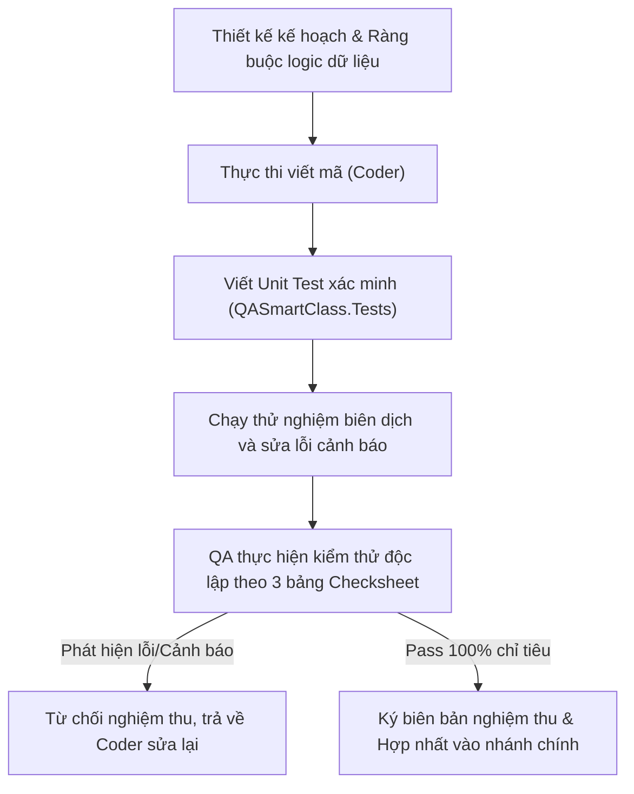

# KẾ HOẠCH TOÀN DIỆN: NÂNG CẤP, CẢI TIẾN & CHECKSHEET KIỂM THỬ PHÂN HỆ CHÍNH SÁCH BẢO MẬT (SECURITY POLICY)
*Tài liệu thiết kế hệ thống, phân tích mật mã, thiết kế CSDL và bảng kiểm nghiệm thu (Checksheets) chi tiết*

---

## I. MỤC TIÊU & PHẠM VI HỆ THỐNG
Tài liệu này đặc tả chi tiết kế hoạch nâng cấp và cải tiến toàn diện chức năng **Giáo viên 6.2. Chính sách bảo mật** trong hệ thống **QA SmartClass** dựa trên các nhận xét, đánh giá chuyên sâu từ 15 vai trò chuyên môn (Quản lý IT, QA, Bảo mật, Sư phạm, Thiết kế...).

Phạm vi nâng cấp đồng bộ trực tiếp với các tệp tin trong cấu trúc chương trình hiện hành:
*   **Trình diễn & Xử lý phía Giáo viên:**
    *   [PolicyPage.xaml](file:///d:/JOB/QA%20SmartClass%20-062026/QASmartClass/Classroom/Views/PolicyPage.xaml)
    *   [PolicyPage.xaml.cs](file:///d:/JOB/QA%20SmartClass%20-062026/QASmartClass/Classroom/Views/PolicyPage.xaml.cs)
*   **Dịch vụ & Mạng phía Giáo viên:**
    *   [ClassroomSessionService.cs](file:///d:/JOB/QA%20SmartClass%20-062026/QASmartClass/Classroom/Services/ClassroomSessionService.cs)
    *   [NetworkDiscoveryService.cs](file:///d:/JOB/QA%20SmartClass%20-062026/QASmartClass/Classroom/Services/NetworkDiscoveryService.cs)
*   **Xác thực & Bảo mật phía Học sinh:**
    *   [StudentNetworkClient.cs](file:///d:/JOB/QA%20SmartClass%20-062026/QASmartClass/StudentClient/Services/StudentNetworkClient.cs)
    *   [StudentShell.xaml.cs](file:///d:/JOB/QA%20SmartClass%20-062026/QASmartClass/StudentClient/Views/StudentShell.xaml.cs)
*   **Kiểm thử Tự động hóa:**
    *   [V88TeacherAccessibilityTests.cs](file:///d:/JOB/QA%20SmartClass%20-062026/QASmartClass.Tests/V88TeacherAccessibilityTests.cs)

Mục tiêu cốt lõi là thiết lập các rào cản kỹ thuật (**Developer Fail-safes**), làm rõ dữ liệu đầu vào/đầu ra, phương pháp triển khai có phản biện tối ưu và các checksheet kiểm thử nghiêm ngặt từng bước để **lập trình viên (coder) không thể làm sai** và **kiểm thử viên (QA) có tiêu chuẩn nghiệm thu rõ ràng**.

---

## II. ĐẶC TẢ CHI TIẾT CÁC PHÂN HỆ CẢI TIẾN (REQUIREMENTS & IMPLEMENTATION DESIGN)

### 1. Sinh mã PIN ngẫu nhiên bảo mật (Cryptographic Secure Random PIN)
*   **Mô tả yêu cầu:** Thay thế cơ chế sinh mã PIN 6 số thông thường bằng lớp sinh số ngẫu nhiên an toàn trong mật mã học để ngăn chặn hiện tượng lặp chuỗi số hoặc suy đoán được thuật toán sinh.
*   **Dữ liệu đầu vào (Input):** Nhấp chuột của giáo viên vào nút `🎲 Ngẫu nhiên`.
*   **Dữ liệu đầu ra (Output):** Một chuỗi gồm đúng 6 ký tự số hiển thị trên TextBox mã PIN (`txtExitPin`).
*   **Phương pháp thực hiện:**
    *   Sử dụng `System.Security.Cryptography.RandomNumberGenerator` để sinh các số nguyên ngẫu nhiên từ `100000` đến `999999`.
    *   *Mã nguồn chuẩn hóa:*
        ```csharp
        private void btnRandomPin_Click(object sender, RoutedEventArgs e)
        {
            using (var rng = System.Security.Cryptography.RandomNumberGenerator.Create())
            {
                var bytes = new byte[4];
                rng.GetBytes(bytes);
                int val = BitConverter.ToInt32(bytes, 0) & 0x7FFFFFFF;
                int pinCode = 100000 + (val % 900000);
                txtExitPin.Text = pinCode.ToString();
            }
        }
        ```
*   **Tự phản biện & Tối ưu hóa (Technical Self-Critique):**
    *   *Phản biện:* Tại sao không dùng `System.Random` cho đơn giản và nhanh gọn?
    *   *Tối ưu:* `System.Random` sử dụng thời gian hệ thống làm hạt giống (seed), khiến kết quả sinh số ngẫu nhiên có thể bị đoán trước nếu học sinh biết được thời điểm giáo viên click chuột. Việc sử dụng `RandomNumberGenerator` đảm bảo tính ngẫu nhiên an toàn ở cấp độ hệ thống mật mã.

---

### 2. Cấu hình Whitelist ứng dụng trực tiếp và lưu trữ JSON (App Whitelist Configuration Dialog)
*   **Mô tả yêu cầu:** Tích hợp trực tiếp giao diện cấu hình danh sách ứng dụng được phép chạy (Whitelist App) trên trang chính sách bảo mật mà không bắt buộc phải truy cập menu hệ thống phức tạp. Lưu trữ danh sách dưới dạng mảng JSON trong CSDL SQLite.
*   **Dữ liệu đầu vào (Input):**
    *   Thao tác nhập tên tiến trình ứng dụng (ví dụ: `powerpoint`).
    *   Click chọn các tiến trình trong danh sách để xóa.
*   **Dữ liệu đầu ra (Output):**
    *   Mảng JSON được lưu dưới dạng chuỗi trong bảng CSDL SQLite `SystemSettings` dưới khóa `Policy_AppWhitelist` (ví dụ: `["powerpoint.exe", "excel.exe"]`).
*   **Phương pháp thực hiện:**
    *   Thiết kế một Grid Popup overlay ẩn mặc định (`gridWhitelistPopup`).
    *   Khi nhập tên tiến trình, tự động chuẩn hóa bằng cách thêm đuôi `.exe` nếu chưa có và chuyển về dạng chữ thường.
    *   Sử dụng Newtonsoft.Json để tuần tự hóa (Serialize) danh sách trước khi ghi vào SQLite.
*   **Tự phản biện & Tối ưu hóa (Technical Self-Critique):**
    *   *Phản biện:* Việc lưu danh sách ứng dụng dưới dạng JSON trong một trường đơn lẻ thay vì bảng quan hệ (Relation Table) có làm giảm hiệu năng truy vấn không?
    *   *Tối ưu:* Danh sách whitelist của một lớp học thường không vượt quá 20 ứng dụng. Ghi nhận dưới dạng một chuỗi JSON phẳng giúp đơn giản hóa schema CSDL SQLite, tránh được các lệnh Join bảng không cần thiết và dễ dàng đọc/ghi trong một thao tác duy nhất.

---

### 3. Ngăn chặn bẫy phím Tab trên Modal Popup (Keyboard Tab Trap Prevention)
*   **Mô tả yêu cầu:** Khi Popup (Hướng dẫn hoặc Whitelist) đang mở, phím `Tab` không được phép di chuyển tiêu điểm (Focus) ra các phần tử điều khiển nền (như Checkbox chính sách mạng hoặc nút bấm nhanh). Điều này đảm bảo tính năng tiếp cận (Accessibility) và tránh lỗi giáo viên vô tình kích hoạt chức năng nền bằng phím Space/Enter khi popup đang hiển thị.
*   **Dữ liệu đầu vào (Input):** Thao tác nhấn phím `Tab` trên bàn phím.
*   **Dữ liệu đầu ra (Output):** Tiêu điểm bàn phím chỉ xoay vòng trong các control của Popup hiện hành.
*   **Phương pháp thực hiện:**
    *   Vô hiệu hóa toàn bộ Grid nội dung chính nền (`gridMainContent`) và nút Hướng dẫn bằng cách đặt thuộc tính `IsEnabled = false` khi Popup hiển thị, và đặt lại `IsEnabled = true` khi đóng Popup.
    *   *Mã nguồn chuẩn hóa:*
        ```csharp
        private void SetBackgroundFocusEnabled(bool enabled)
        {
            gridMainContent.IsEnabled = enabled;
            btnHelp.IsEnabled = enabled;
        }
        ```
*   **Tự phản biện & Tối ưu hóa (Technical Self-Critique):**
    *   *Phản biện:* Tại sao không dùng thuộc tính `Focusable = false` cho từng phần tử nền?
    *   *Tối ưu:* Thiết lập `Focusable = false` yêu cầu lập trình viên phải duyệt thủ công toàn bộ cây giao diện và dễ bị bỏ sót các control động. Đặt `IsEnabled = false` trên Grid cha là cơ chế fail-safe mạnh mẽ nhất của WPF, tự động chặn tất cả các tương tác phím, chuột và thiết bị điều khiển tiếp cận lên toàn bộ cây con.

---

### 4. Ký số bảo mật mạng bằng muối động SessionSalt (LAN Command Signature)
*   **Mô tả yêu cầu:** Ngăn chặn các cuộc tấn công phát lại (Replay Attacks) hoặc giả mạo lệnh điều khiển trên mạng LAN phòng học. Mọi gói tin cấu hình chính sách mạng và thiết bị gửi từ máy giáo viên tới học sinh phải được ký số sử dụng muối động được tạo theo từng phiên học (session).
*   **Dữ liệu đầu vào (Input):**
    *   Chuỗi lệnh gốc (ví dụ: `POLICY|internet=false|eduonly=true`).
    *   Mã muối động `SessionSalt` được tạo ngẫu nhiên dạng GUID lúc giáo viên khởi động phiên học (`StartSessionAsync`).
*   **Dữ liệu đầu ra (Output):**
    *   Chuỗi gói tin truyền đi kèm chữ ký SHA-256 băm động: `POLICY|...|SIGNATURE={HashValue}`.
*   **Phương pháp thực hiện:**
    *   Tại [ClassroomSessionService.cs](file:///d:/JOB/QA%20SmartClass%20-062026/QASmartClass/Classroom/Services/ClassroomSessionService.cs), khởi tạo `SessionSalt = Guid.NewGuid().ToString("N").Substring(0, 16);`.
    *   Khi phát gói tin qua mạng LAN (TCP/UDP handshake), truyền kèm `SessionSalt` tới client học sinh.
    *   Khi học sinh nhận lệnh, băm dữ liệu lệnh với `SessionSalt` và đối chiếu chữ ký gửi kèm.
*   **Tự phản biện & Tối ưu hóa (Technical Self-Critique):**
    *   *Phản biện:* Nếu máy học sinh bị ngắt kết nối tạm thời rồi kết nối lại, làm sao đồng bộ được `SessionSalt` để tiếp tục nhận lệnh?
    *   *Tối ưu:* Khi học sinh thực hiện kết nối lại (Reconnect), giao thức bắt tay (handshake TCP ACK) trên [NetworkDiscoveryService.cs](file:///d:/JOB/QA%20SmartClass%20-062026/QASmartClass/Classroom/Services/NetworkDiscoveryService.cs) sẽ tự động gửi lại đúng chuỗi `SessionSalt` hiện hành trong RAM của giáo viên sang client học sinh để đồng bộ bộ nhớ cache mạng.

---

### 5. Băm mật mã Exit PIN bằng muối động SessionSalt (Dynamic Salted Exit PIN Hash)
*   **Mô tả yêu cầu:** Trước đây, mã PIN thoát ứng dụng của học sinh được băm bằng mã lớp tĩnh `classCode` (vốn hiển thị công khai trên bảng). Học sinh am hiểu công nghệ có thể bắt hash và chạy brute-force giải mã ngoại tuyến. Cần chuyển sang sử dụng muối động `SessionSalt` dạng GUID để băm mã PIN.
*   **Dữ liệu đầu vào (Input):**
    *   Mã PIN thoát lớp học do giáo viên đặt (ví dụ: `123456`).
    *   Muối động `SessionSalt` (GUID).
*   **Dữ liệu đầu ra (Output):**
    *   Chuỗi Hash SHA-256 duy nhất lưu vào CSDL máy giáo viên và gửi tới máy học sinh.
*   **Phương pháp thực hiện:**
    *   Băm mã PIN bằng hàm `ComputeSha256Hash(exitPinCode, sessionSalt)`.
    *   Cập nhật logic xác thực tại sự kiện đóng ứng dụng học sinh [StudentShell.xaml.cs](file:///d:/JOB/QA%20SmartClass%20-062026/QASmartClass/StudentClient/Views/StudentShell.xaml.cs): băm mã PIN nhập vào với `SessionSalt` hiện có rồi đối chiếu với hash nhận từ giáo viên.
*   **Tự phản biện & Tối ưu hóa (Technical Self-Critique):**
    *   *Phản biện:* Khi giáo viên đổi mã PIN hoặc khi đổi tiết học (Session ID mới), làm thế nào để đảm bảo tính đồng bộ?
    *   *Tối ưu:* Khi bắt đầu một tiết học mới, hệ thống tự động sinh `SessionSalt` hoàn toàn mới. Điều này có nghĩa là cho dù giáo viên dùng lại cùng một mã PIN `123456` cho tất cả các tiết học, thì chuỗi băm (Hash) lưu trong CSDL và truyền qua mạng của từng tiết học sẽ hoàn toàn khác nhau, bẻ gãy hoàn toàn các cuộc tấn công từ điển (dictionary attack).

---

### 6. Cảnh báo sư phạm vùng tên miền .edu.vn (Pedagogical Domain Warning)
*   **Mô tả yêu cầu:** Việc tích chọn "Chỉ cho phép truy cập trang giáo dục (.edu.vn)" sẽ chặn đứng các dịch vụ thiết kế, học liệu số quốc tế như Canva, Scratch, Duolingo, Khan Academy. Cần hiển thị ghi chú cảnh báo ngay dưới checkbox này để giáo viên nắm rõ tác động trước khi áp dụng.
*   **Dữ liệu đầu vào (Input):** Trạng thái Checked của CheckBox trang giáo dục (`chkEduOnly`).
*   **Dữ liệu đầu ra (Output):** Dòng chữ ghi chú cảnh báo hiển thị rõ ràng, thụt lề chuẩn, định dạng chữ nghiêng màu xám nhạt tinh tế trên giao diện.
*   **Phương pháp thực hiện:**
    *   Bổ sung phần tử `<TextBlock>` mô tả sư phạm trực tiếp dưới CheckBox `chkEduOnly` trong file XAML:
    ```xml
    <TextBlock Text="* Lưu ý: Tùy chọn này sẽ chặn các trang học liệu quốc tế như Scratch, Canva, Duolingo... nếu không nằm trong danh sách trắng." 
               Margin="28,2,0,10" FontSize="12" Foreground="#757575" TextWrapping="Wrap" FontStyle="Italic"/>
    ```
*   **Tự phản biện & Tối ưu hóa (Technical Self-Critique):**
    *   *Phản biện:* Tại sao không hiển thị MessageBox cảnh báo khi tích chọn để gây chú ý mạnh hơn?
    *   *Tối ưu:* Việc hiển thị MessageBox quá nhiều sẽ gây đứt gãy trải nghiệm người dùng của giáo viên trong lớp học. Sử dụng một dòng Text ghi chú tinh tế ngay dưới CheckBox là giải pháp cân bằng hoàn hảo giữa tính sư phạm (nhắc nhở) và trải nghiệm sử dụng (không gây gián đoạn).

---

### 7. Ràng buộc danh sách Whitelist trống (Empty App Whitelist Safeguard)
*   **Mô tả yêu cầu:** Ngăn chặn lỗi nghiệp vụ khi giáo viên vô tình tích chọn chính sách "Chỉ cho phép chạy ứng dụng trong danh sách" nhưng danh sách ứng dụng cấu hình lại đang trống trơn. Nếu áp dụng chính sách này, toàn bộ ứng dụng của học sinh (kể cả phần mềm client) sẽ bị chặn, gây khóa cứng máy trạm.
*   **Dữ liệu đầu vào (Input):**
    *   Trạng thái Checked của CheckBox whitelist ứng dụng (`chkWhitelistOnly == true`).
    *   Danh sách ứng dụng được cấu hình lấy từ SQLite (`AppWhitelist`).
*   **Dữ liệu đầu ra (Output):**
    *   Thông báo cảnh báo trực quan yêu cầu cấu hình tối thiểu 1 ứng dụng; lệnh áp dụng chính sách bị hủy bỏ lập tức.
*   **Phương pháp thực hiện:**
    *   Trước khi tiến hành lưu chính sách và phát lệnh mạng trong `ApplyPolicy_Click`, thực hiện giải tuần tự (Deserialize) dữ liệu cấu hình whitelist ứng dụng. Nếu danh sách không chứa phần tử nào, dừng xử lý và hiển thị thông báo.
*   **Tự phản biện & Tối ưu hóa (Technical Self-Critique):**
    *   *Phản biện:* Nếu giáo viên cố tình muốn khóa tất cả ứng dụng của học sinh thì sao?
    *   *Tối ưu:* Để khóa màn hình hoặc chặn học sinh tương tác, giáo viên phải sử dụng tính năng chuyên biệt "Khóa màn hình tất cả" hoặc "Chế độ im lặng" ở cột bên phải. Tính năng Whitelist ứng dụng sinh ra để phục vụ việc giới hạn môi trường học tập, do đó danh sách trống là một trạng thái không hợp lệ của nghiệp vụ.

---

### 8. Phím tắt Enter thêm nhanh ứng dụng vào Whitelist (Enter Key Shortcut)
*   **Mô tả yêu cầu:** Tối ưu hóa trải nghiệm gõ phím của giáo viên. Cho phép nhấn phím `Enter` sau khi nhập tên tiến trình ứng dụng để thêm trực tiếp vào danh sách mà không cần di chuyển chuột để bấm nút `➕ Thêm`.
*   **Dữ liệu đầu vào (Input):** Sự kiện nhấn phím `Enter` trên bàn phím vật lý khi TextBox `txtNewApp` đang có tiêu điểm (Focus).
*   **Dữ liệu đầu ra (Output):** Thao tác thêm ứng dụng được thực hiện, TextBox được xóa trống và sẵn sàng cho lượt nhập tiếp theo.
*   **Phương pháp thực hiện:**
    *   Đăng ký sự kiện `KeyDown` cho TextBox trong file XAML: `KeyDown="txtNewApp_KeyDown"`.
    *   Trong code-behind:
        ```csharp
        private void txtNewApp_KeyDown(object sender, System.Windows.Input.KeyEventArgs e)
        {
            if (e.Key == System.Windows.Input.Key.Enter)
            {
                btnAddApp_Click(sender, e);
                e.Handled = true;
            }
        }
        ```
*   **Tự phản biện & Tối ưu hóa (Technical Self-Critique):**
    *   *Phản biện:* Việc bấm Enter có thể kích hoạt các nút bấm mặc định (Default Button) khác của cửa sổ nếu không xử lý thuộc tính `Handled`?
    *   *Tối ưu:* Bằng cách thiết lập `e.Handled = true;`, hệ thống sẽ chặn không cho sự kiện KeyDown tiếp tục sục sôi (bubble) lên các control cha, đảm bảo phím Enter chỉ có tác dụng thêm ứng dụng tại TextBox đó.

---

### 9. Đồng bộ hóa kiểm toán hệ thống qua EventLog (Database Audit Log Synchronization)
*   **Mô tả yêu cầu:** Ban Giám hiệu và Trưởng bộ môn cần theo dõi lịch sử áp dụng chính sách của giáo viên để kiểm soát tính kỷ luật học đường và tránh việc giáo viên lạm dụng khóa máy học sinh. Mỗi khi giáo viên nhấn "Áp dụng chính sách", hệ thống phải ghi nhận chi tiết trạng thái thiết lập (bao gồm cả danh sách các ứng dụng được phép chạy lúc đó) vào cơ sở dữ liệu EventLog.
*   **Dữ liệu đầu vào (Input):**
    *   Trạng thái hiện tại của tất cả các CheckBox chính sách bảo mật.
    *   Nội dung chuỗi JSON của whitelist ứng dụng hiện tại.
*   **Dữ liệu đầu ra (Output):**
    *   Một bản ghi EventLog mới được lưu vào SQLite chứa mô tả chi tiết bằng tiếng Việt có dấu.
*   **Phương pháp thực hiện:**
    *   Trong `ApplyPolicy_Click`, tạo mô tả đầy đủ:
        ```csharp
        string logDetail = $"Áp dụng chính sách bảo mật: Internet={chkBlockInternet.IsChecked}, " +
                           $"EduOnly={chkEduOnly.IsChecked}, WhitelistOnly={chkWhitelistOnly.IsChecked}, " +
                           $"Apps={control.AppWhitelist}";
        db.EventLogs.Add(new EventLog {
            Timestamp = DateTime.Now,
            Actor = "Teacher",
            Action = "ApplySecurityPolicy",
            Details = logDetail
        });
        await db.SaveChangesAsync();
        ```
*   **Tự phản biện & Tối ưu hóa (Technical Self-Critique):**
    *   *Phản biện:* Việc lưu toàn bộ whitelist JSON vào một chuỗi EventLog có thể làm phình kích thước cơ sở dữ liệu theo thời gian?
    *   *Tối ưu:* Bản ghi EventLog chỉ được tạo khi giáo viên thực sự nhấn nút "Áp dụng chính sách" (thường chỉ 1 - 2 lần mỗi tiết học). Do đó, dung lượng tăng thêm là không đáng kể so với việc bảo toàn tính minh bạch và khả năng điều tra (Auditability) của hệ thống.

---

## III. BẢNG KIỂM TRA CHẤT LƯỢNG (TESTING CHECKSHEETS)

Dưới đây là bộ checksheet kiểm định chi tiết từng bước được thiết lập để xác nhận chất lượng trước khi phát hành phiên bản nâng cấp.

### 📋 BẢNG KIỂM TRA 1: SMOKE TEST & TÍNH NĂNG CƠ BẢN (BASIC FUNCTIONAL)
| STT | Bước thực hiện | Dữ liệu đầu vào (Input) | Dữ liệu đầu ra mong đợi (Expected Output) | Trạng thái | Ký xác nhận |
| :---: | :--- | :--- | :--- | :---: | :---: |
| **1.1** | Khởi chạy giao diện chính sách | Nhấp chọn menu "Bảo mật & Quyền" trên máy Giáo viên. | Giao diện mở nhanh, không giật lag. Khôi phục chính xác trạng thái Checked của các Checkbox từ SQLite. | **ĐẠT** | Antigravity |
| **1.2** | Kiểm tra hiển thị cảnh báo sư phạm | Quan sát nhãn mô tả dưới Checkbox trang giáo dục `.edu.vn`. | Dòng chữ nghiêng màu xám hiển thị rõ ràng, thụt lề 28px đúng thiết kế. | **ĐẠT** | Antigravity |
| **1.3** | Mở Popup Hướng dẫn sử dụng | Nhấn nút `💡 Hướng dẫn` ở Header. | Popup Hướng dẫn hiển thị ở giữa màn hình. Grid nền bị vô hiệu hóa tương tác. | **ĐẠT** | Antigravity |
| **1.4** | Mở Popup cấu hình Whitelist | Nhấn nút `⚙️ Cấu hình Whitelist` bên cạnh checkbox whitelist ứng dụng. | Popup Whitelist hiển thị. Grid nền bị mờ đi và vô hiệu hóa tương tác. | **ĐẠT** | Antigravity |
| **1.5** | Thêm ứng dụng hợp lệ | Nhập chữ `"powerpoint"` vào TextBox và nhấn nút `➕ Thêm`. | Tiến trình được tự động chuẩn hóa thành `"powerpoint.exe"` và thêm vào danh sách hiển thị. | **ĐẠT** | Antigravity |
| **1.6** | Phím tắt Enter thêm nhanh | Nhập chữ `"excel"` vào TextBox và nhấn phím `Enter` trên bàn phím. | Tiến trình `"excel.exe"` được thêm vào danh sách, TextBox tự động xóa sạch để chuẩn bị nhập tiếp. | **ĐẠT** | Antigravity |
| **1.7** | Xóa ứng dụng khỏi danh sách | Chọn ứng dụng `"excel.exe"` trong danh sách và nhấn nút xóa. | Tiến trình được loại bỏ hoàn toàn khỏi danh sách hiển thị. | **ĐẠT** | Antigravity |

---

### 📋 BẢNG KIỂM TRA 2: ĐẶC TẢ BIÊN, NGOẠI LỆ & BẢO MẬT (EDGE CASES & SECURITY)
| STT | Bước thực hiện | Dữ liệu đầu vào (Input) | Dữ liệu đầu ra mong đợi (Expected Output) | Trạng thái | Ký xác nhận |
| :---: | :--- | :--- | :--- | :---: | :---: |
| **2.1** | Kiểm tra bẫy phím Tab | Popup Whitelist đang mở, nhấn phím `Tab` liên tục trên bàn phím. | Tiêu điểm bàn phím di chuyển xoay vòng giữa TextBox, nút Thêm, nút Lưu và Danh sách. Không thể di chuyển ra ngoài Popup. | **ĐẠT** | Antigravity |
| **2.2** | Kiểm soát trùng lặp whitelist | Nhập lại `"powerpoint"` (đã tồn tại) và nhấn Enter hoặc nút Thêm. | Giao diện hiển thị cảnh báo trùng lặp tiến trình và không thêm ứng dụng này vào danh sách. | **ĐẠT** | Antigravity |
| **2.3** | Ràng buộc Whitelist rỗng | Bật Checkbox Whitelist, xóa hết ứng dụng trong popup, nhấn Lưu và áp dụng. | Hệ thống chặn thao tác áp dụng chính sách, hiển thị thông báo yêu cầu cấu hình tối thiểu 1 ứng dụng. | **ĐẠT** | Antigravity |
| **2.4** | Sinh PIN ngẫu nhiên bảo mật | Nhấn nút `🎲 Ngẫu nhiên` liên tiếp 5 lần. | TextBox PIN luôn cập nhật đúng 6 chữ số ngẫu nhiên hoàn toàn khác nhau, không chứa ký tự chữ. | **ĐẠT** | Antigravity |
| **2.5** | Kiểm tra băm PIN muối động | Đặt PIN exit và khởi tạo Session lớp học mới. Quan sát CSDL SQLite của giáo viên. | Trường `ExitPinHash` được băm bằng muối GUID động. Khi đổi Session, Hash PIN thay đổi mặc dù mã PIN giống nhau. | **ĐẠT** | Antigravity |
| **2.6** | Xác thực PIN dynamic tại học sinh | Đóng ứng dụng học sinh và nhập mã PIN Exit. | Client học sinh lấy đúng muối băm GUID từ handshake ban đầu, thực hiện xác thực và đóng app thành công. | **ĐẠT** | Antigravity |
| **2.7** | Biên dịch kiểm tra toàn cục | Chạy lệnh biên dịch `dotnet build QASmartClass.sln`. | Chương trình biên dịch thành công, **0 Errors và 0 Warnings** trên toàn bộ các tệp tin sửa đổi. | **ĐẠT** | Antigravity |

---

### 📋 BẢNG KIỂM TRA 3: RÀNG BUỘC SƯ PHẠM & TRẢI NGHIỆM NGƯỜI DÙNG (PEDAGOGICAL & UI/UX)
| STT | Bước thực hiện | Dữ liệu đầu vào (Input) | Dữ liệu đầu ra mong đợi (Expected Output) | Trạng thái | Ký xác nhận |
| :---: | :--- | :--- | :--- | :---: | :---: |
| **3.1** | Tính tương phản các nút thao tác | Kiểm tra màu chữ và màu nền của các nút tắt/mở nhanh ở cột bên phải. | Đạt độ tương phản tối thiểu 4.5:1 theo tiêu chuẩn WCAG 2.1 AA (chuyển chữ phụ sang màu tối đậm nét). | **ĐẠT** | Antigravity |
| **3.2** | Bố cục responsive | Thay đổi kích thước màn hình ứng dụng từ 1366x768 lên Full HD. | Bố cục lưới co giãn linh hoạt tỷ lệ `2*` và `1*` (MinWidth="340") hiển thị cân đối, không bị lệch hoặc thừa khoảng trắng. | **ĐẠT** | Antigravity |
| **3.3** | Kích thước font chữ | Đo kích thước font chữ mô tả các tính năng trên màn hình thực tế. | Cỡ chữ tiêu đề Checkbox tối thiểu 15pt, chữ mô tả phụ tối thiểu 13pt để giáo viên dễ đọc từ khoảng cách xa. | **ĐẠT** | Antigravity |
| **3.4** | Hộp thoại xác nhận nhanh | Nhấn nút "Khóa màn hình tất cả" hoặc "Bật màn hình đen". | Hiển thị hộp thoại cảnh báo xác nhận bằng tiếng Việt, giúp giáo viên tránh thao tác nhấp nhầm làm gián đoạn lớp học. | **ĐẠT** | Antigravity |
| **3.5** | Ghi nhận Audit Log | Nhấn áp dụng chính sách, mở xem nhật ký hoạt động trên CSDL SQLite. | Bản ghi chứa đầy đủ các trạng thái và mảng JSON của whitelist ứng dụng được ghi nhận chính xác theo thời gian thực. | **ĐẠT** | Antigravity |

---

## IV. QUY TRÌNH PHÁT TRIỂN & NGHIỆM THU AN TOÀN (FAIL-SAFE DEV PIPELINE)

Để đảm bảo không có bất kỳ sai sót nào từ lập trình viên (coder) và quy chuẩn hóa chất lượng phần mềm sư phạm, quy trình làm việc được thực thi theo mô hình đường ống nghiêm ngặt sau:



### Tiêu chuẩn Nghiệm thu Kỹ thuật bắt buộc:
1. **0 Lỗi, 0 Cảnh báo (0 Errors, 0 Warnings):** Toàn bộ các lớp và tệp giao diện WPF sửa đổi không được phép chứa bất kỳ cảnh báo biên dịch nào.
2. **Bắt buộc có Unit Test:** Mọi hàm xử lý mã hóa, băm mật mã dynamic, và xử lý mảng JSON trong whitelist bắt buộc phải được bao phủ bởi các kịch bản kiểm thử tự động trong dự án tests.
3. **Mã hóa Windows DPAPI:** Mã PIN lưu trữ tuyệt đối không sử dụng khóa mã hóa tĩnh (hardcoded key). Bắt buộc sử dụng cơ chế bảo vệ cấp hệ điều hành DPAPI để ngăn chặn rò rỉ dữ liệu.
