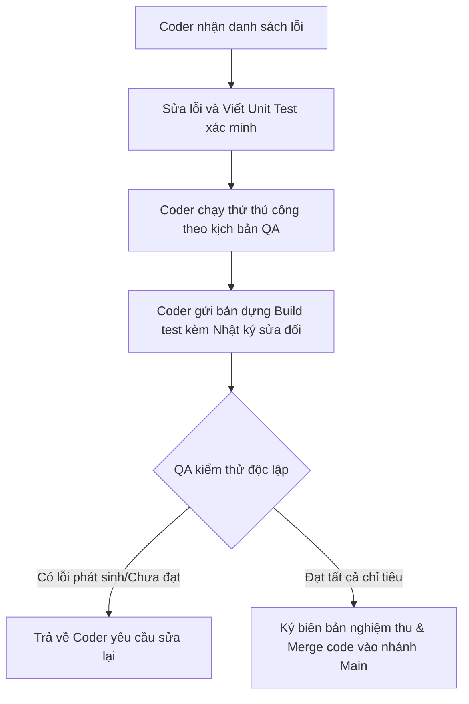

# KẾ HOẠCH TOÀN DIỆN: KIỂM TRA LẠI (VERIFICATION) & CẢI TIẾN HỆ THỐNG QA SMARTSCHOOL (BẢN VER 2.1)
*Tài liệu hướng dẫn chi tiết dành cho Kiểm thử viên (QA/QC) và Nhà phát triển (Developers)*

---

## I. MỤC TIÊU & CHIẾN LƯỢC KIỂM THỬ TÁI TÍCH HỢP (REGRESSION TESTING)

Tài liệu này được lập ra nhằm mục đích xác minh các lỗi đã được báo cáo trong file Excel `Báo cáo kết quả test ver 2.1.xlsx` xem đã được sửa đổi triệt để hay chưa. Nếu lỗi chưa được khắc phục hoặc sửa đổi chưa hoàn thiện, tài liệu này cung cấp **kịch bản nâng cấp chi tiết, cơ chế phòng ngừa lỗi cho lập trình viên (Developer Fail-safe), và phương án phản biện kỹ thuật tối ưu nhất** nhằm đảm bảo lỗi không tái phát.

### Chiến lược kiểm thử 3 lớp (3-Layer Testing Strategy):
1. **Lớp 1: Smoke Test (Kiểm tra nhanh)** - Đảm bảo chức năng cơ bản không còn crash hoặc không phản hồi.
2. **Lớp 2: Functional Regression Test (Kiểm thử chức năng)** - Xác minh hoạt động của hệ thống theo đúng luồng nghiệp vụ chuẩn (Happy Path) với dữ liệu thực tế.
3. **Lớp 3: Boundary & Edge Case Test (Kiểm thử biên & ngoại lệ)** - Thử nghiệm với các thao tác bất thường, ngắt kết nối mạng đột ngột, dữ liệu sai định dạng để kiểm tra tính bền bỉ của hệ thống.

---

## II. CHI TIẾT CHECKSHEET KIỂM THỬ & PHƯƠNG ÁN CẢI TIẾN THEO PHÂN HỆ (MODULES)

### PHÂN HỆ 1: THỜI KHÓA BIỂU (TIMETABLE)
*Áp dụng cho lỗi:* **Loi_01** (STT 4 - Sheet 1)

#### 1. Yêu cầu & Kịch bản Kiểm tra Lại
*   **Mô tả lỗi gốc:** Chỉnh sửa TKB giáo viên bị ghi đè lên TKB lớp học. Chuyển đổi giữa các bộ lọc (Giáo viên / Lớp học) hiển thị dữ liệu không đồng bộ, dữ liệu cũ không được cập nhật hoặc khôi phục đúng sau khi chuyển trang.
*   **Dữ liệu đầu vào (Input):**
    *   Tài khoản giáo viên A dạy môn Toán tại lớp 10A1.
    *   Thực hiện thao tác: Sửa môn Toán của giáo viên A thành môn Vật lý trên TKB của Giáo viên.
    *   Chuyển sang bộ lọc Lớp học 10A1.
*   **Dữ liệu đầu ra mong đợi (Expected Output):**
    *   Tại bộ lọc Giáo viên: hiển thị môn Vật lý.
    *   Tại bộ lọc Lớp học 10A1: Vẫn phải hiển thị đúng TKB lớp học 10A1 (không bị thay đổi hoặc ghi đè bởi hành động sửa bên bộ lọc Giáo viên trừ khi có liên kết logic rõ ràng được định nghĩa trước).
    *   Khi chuyển đổi qua lại giữa các màn hình khác và quay lại TKB, dữ liệu của cả 2 bộ lọc phải hiển thị đúng trạng thái lưu cuối cùng trong cơ sở dữ liệu.
*   **Phương pháp thực hiện:**
    1.  Mở màn hình TKB, chọn bộ lọc Giáo viên, sửa TKB.
    2.  Chuyển sang bộ lọc Lớp học -> Kiểm tra tính độc lập dữ liệu.
    3.  Quay lại bộ lọc Giáo viên -> Kiểm tra dữ liệu mới có hiển thị không.
    4.  Nhấp chuyển sang trang "Bài giảng" hoặc "Học sinh", sau đó quay lại trang TKB -> Kiểm tra xem dữ liệu có bị khôi phục về trạng thái lỗi cũ hay không.

#### 2. Giải pháp Cải tiến & Cơ chế phòng ngừa cho Coder (Developer Fail-safe)
*   **Thiết kế tầng dữ liệu (Database isolation):** Coder phải sử dụng cấu trúc dữ liệu tách biệt hoàn toàn giữa hai bảng `TeacherTimetable` và `ClassroomTimetable`, hoặc nếu dùng chung một bảng quan hệ thì truy vấn SQL/LINQ phải chứa mệnh đề `WHERE` chặt chẽ theo `TeacherId` hoặc `ClassId`.
*   **Quản lý trạng thái (State Management):** Không lưu trữ trạng thái hiển thị TKB dưới dạng biến static toàn cục trong memory. Bắt buộc phải triển khai cơ chế nạp lại dữ liệu (Reload) từ Database khi kích hoạt sự kiện `OnNavigatedTo` hoặc chuyển đổi Tab.
*   **Tự phản biện & Tối ưu hóa:**
    *   *Phản biện:* Việc tải lại dữ liệu liên tục từ database mỗi lần chuyển đổi bộ lọc có thể làm chậm giao diện (UI lag).
    *   *Tối ưu:* Sử dụng cơ chế lưu trữ đệm (Repository Pattern với Cache 1 lớp ngắn hạn). Khi có thay đổi (Edit), tiến hành cập nhật đồng thời lên Cache memory và gọi một Task bất đồng bộ lưu xuống Database. Khi chuyển tab, chỉ đọc từ Cache. Cache chỉ bị xóa khi đóng màn hình TKB hoặc người dùng bấm nút "Refresh".

---

### PHÂN HỆ 2: GIAO DIỆN & MENU ĐIỀU HƯỚNG
*Áp dụng cho lỗi:* **Loi_02** (STT 6 - Sheet 1), **Loi_58** (STT 76 - Sheet 2)

#### 1. Yêu cầu & Kịch bản Kiểm tra Lại
*   **Mô tả lỗi gốc:**
    *   Menu điều hướng bên trái không cập nhật trạng thái Active (highlight) theo trang thực tế đang mở.
    *   Tên template "Văn học" của sơ đồ tư duy bị nút/chức năng "Đổi cấu trúc" che khuất một phần.
*   **Dữ liệu đầu vào (Input):**
    *   Thao tác nhấp chuột điều hướng qua các mục menu.
    *   Chọn Template mẫu sơ đồ tư duy "Văn học".
*   **Dữ liệu đầu ra mong đợi (Expected Output):**
    *   Mục tương ứng trên menu bên trái phải chuyển sang màu highlight Active.
    *   Chữ "Văn học" hiển thị đầy đủ, không bị nút "Đổi cấu trúc" che khuất ở bất kỳ độ phân giải màn hình nào (từ 1366x768 trở lên).
*   **Phương pháp thực hiện:**
    1.  Nhấp lần lượt vào từng menu điều hướng và kiểm tra trạng thái hiển thị trực quan.
    2.  Mở sơ đồ tư duy "Văn học", thay đổi kích thước cửa sổ ứng dụng và kiểm tra xem chữ có bị đè/che khuất không.

#### 2. Giải pháp Cải tiến & Cơ chế phòng ngừa cho Coder (Developer Fail-safe)
*   **WPF Grid Layout & Auto-Sizing:** Coder tuyệt đối không sử dụng định vị Margin tuyệt đối để căn chỉnh text và nút bấm bên cạnh nhau. Bắt buộc sử dụng `Grid` với các cột định nghĩa `Width="Auto"` hoặc `Width="*"` để hệ thống tự căn chỉnh vị trí động theo chiều dài của văn bản.
*   **Tự phản biện & Tối ưu hóa:**
    *   *Phản biện:* Nếu tên template quá dài (ví dụ: "Lịch sử văn học Việt Nam thời kỳ đổi mới"), dù dùng Grid tự động cũng có thể đẩy toolbar ra ngoài màn hình.
    *   *Tối ưu:* Áp dụng thuộc tính `TextTrimming="CharacterEllipsis"` và gắn kèm một `ToolTip` hiển thị đầy đủ tên template khi di chuột qua, đảm bảo giao diện luôn gọn gàng và không bị tràn.

---

### PHÂN HỆ 3: SOẠN BÀI & QUẢN LÝ BÀI GIẢNG (LESSON CREATOR)
*Áp dụng cho lỗi:* **Loi_03** (STT 13 - Sheet 1), **Loi_04** (STT 21 - Sheet 1), **Loi_12** (STT 48 - Sheet 1), **Loi_13** (STT 50 - Sheet 1)

#### 1. Yêu cầu & Kịch bản Kiểm tra Lại
*   **Mô tả lỗi gốc:** Tạo bài mới thành công nhưng bài giảng không hiển thị; Nút "Lưu bản nháp" bị vô hiệu hóa; Không mở được thư mục tài nguyên và không thêm được file tài nguyên.
*   **Dữ liệu đầu vào (Input):** Nhập tiêu đề "Bài giảng kiểm thử", nhấn "Tạo bài". Nhấp nút "Mở thư mục tài nguyên" và "Thêm file".
*   **Dữ liệu đầu ra mong đợi (Expected Output):** Bài giảng mới tạo hiển thị ở vị trí đầu tiên; Nút "Lưu bản nháp" hoạt động bình thường; File được thêm thành công vào danh sách tài nguyên.
*   **Phương pháp thực hiện:** Thực hiện luồng soạn thảo bài giảng từ tạo mới -> thêm block -> thêm file đính kèm -> lưu bản nháp -> quay lại kiểm tra danh sách.

#### 2. Giải pháp Cải tiến & Cơ chế phòng ngừa cho Coder (Developer Fail-safe)
*   ViewModel của danh sách bài giảng phải sử dụng `ObservableCollection` để giao diện tự động cập nhật khi có phần tử mới được thêm vào DB. Thao tác copy file tài nguyên phải được chạy dưới dạng tác vụ bất động bộ (`async/await` kết hợp `Task.Run`).

---

### PHÂN HỆ 4: KHÁM PHÁ & TRÌNH CHIẾU BLOCK (LESSON RUNNER)
*Áp dụng cho lỗi:* **Loi_05** (STT 24 - Sheet 1), **Loi_06** (STT 25 - Sheet 1), **Loi_56** (STT 15 - Sheet 2)

#### 1. Yêu cầu & Kịch bản Kiểm tra Lại
*   **Mô tả lỗi gốc:** Block Video và PDF không hiển thị nội dung, chỉ hiện đường dẫn lưu file nội bộ. Khi bấm Focus trên một thẻ ngữ pháp tiếng Anh, hệ thống thực hiện giống Focus tổng thể (không hiển thị riêng biệt nội dung của thì được chọn tới học sinh).
*   **Dữ liệu đầu vào (Input):**
    *   Trình chiếu block Video/PDF trong phần Khám phá.
    *   Mở bảng ngữ pháp tiếng Anh, chọn thẻ "Thì Hiện tại đơn", bấm "Focus".
*   **Dữ liệu đầu ra mong đợi (Expected Output):**
    *   Video/PDF trình chiếu trực quan mượt mà.
    *   Khi giáo viên bấm Focus thẻ ngữ pháp, máy học sinh chỉ hiển thị nội dung chi tiết của thì Hiện tại đơn (phóng to toàn màn hình). Các nội dung khác bị ẩn đi để học sinh tập trung.
*   **Phương pháp thực hiện:** Chạy thử phiên dạy học, trình chiếu video/PDF và kích hoạt nút Focus trên từng thẻ ngữ pháp để kiểm tra màn hình học sinh.

#### 2. Giải pháp Cải tiến & Cơ chế phòng ngừa cho Coder (Developer Fail-safe)
*   **Giao thức truyền thông điệp Focus thẻ (Targeted Focus):** Coder không được dùng chung lệnh `CMD|FOCUS|SCREEN` (chụp/phát màn hình giáo viên). Phải sử dụng giao thức truyền lệnh cụ thể: `CMD|FOCUS_GRAMMAR|{GrammarId}`. Client học sinh khi nhận được lệnh này sẽ hiển thị một cửa sổ popup phóng to (`Dialog` hoặc `Window` không viền) hiển thị đúng nội dung XML/JSON của thì ngữ pháp được chỉ định.
*   **Tự phản biện & Tối ưu hóa:**
    *   *Phản biện:* Học sinh có thể tự ý tắt màn hình Focus thẻ ngữ pháp để làm việc khác.
    *   *Tối ưu:* Thiết lập thuộc tính `Window.Topmost = true` trên máy học sinh và ẩn nút đóng (Close/X) của popup Focus thẻ. Chỉ cho phép đóng khi giáo viên gửi lệnh `CMD|UNFOCUS_GRAMMAR`.

---

### PHÂN HỆ 5: BẢNG TRẮNG TƯƠNG TÁC (WHITEBOARD)
*Áp dụng cho lỗi:* **Loi_07** (STT 31 - Sheet 1), **Loi_08** (STT 32 - Sheet 1), **Loi_09** (STT 33 - Sheet 1), **Loi_10** (STT 34 - Sheet 1), **Loi_11** (STT 35 - Sheet 1), **Loi_48** (STT 224 - Sheet 1), **Loi_55** (STT 367 - Sheet 1), **Loi_57** (STT 44 - Sheet 2), **Loi_59** (STT 82 - Sheet 2), **Loi_60** (STT 86 - Sheet 2)

#### 1. Yêu cầu & Kịch bản Kiểm tra Lại
*   **Mô tả lỗi gốc:** Tẩy xóa, Undo/Redo, cuộn di chuyển bảng trắng lỗi. Bảng trắng trong giải chi tiết, thẻ hằng số lỗi.
    *   *Loi_57:* Bảng trắng mở từ thẻ công thức tham khảo bị mất chữ hoặc cắt góc nội dung.
    *   *Loi_59 & Loi_60:* Không có bảng trắng để nháp trong công cụ Luyện IQ & Logic và Tính nhẩm nhanh.
*   **Dữ liệu đầu vào (Input):**
    *   Mở bảng trắng từ thẻ công thức tham khảo bất kỳ.
    *   Mở công cụ Luyện IQ & Logic và Tính nhẩm nhanh, bấm vào biểu tượng Bảng trắng.
*   **Dữ liệu đầu ra mong đợi (Expected Output):**
    *   Toàn bộ nội dung của thẻ công thức tham khảo hiển thị đầy đủ, sắc nét làm hình nền của bảng trắng (không bị cắt lề).
    *   Nút Bảng trắng xuất hiện trên thanh công cụ của Luyện IQ và Tính nhẩm nhanh, khi bấm sẽ mở ra một bảng nháp (overlay hoặc chia đôi màn hình) hoạt động trơn tru.
*   **Phương pháp thực hiện:**
    1.  Mở bảng trắng từ thẻ công thức, kiểm tra xem hình nền công thức hiển thị đủ nét không.
    2.  Mở các công cụ học tập Luyện IQ, Tính nhẩm nhanh và vẽ thử trên bảng nháp tích hợp.

#### 2. Giải pháp Cải tiến & Cơ chế phòng ngừa cho Coder (Developer Fail-safe)
*   **Auto-scaling Background Image (Loi_57):** Khi load hình ảnh từ thẻ nội dung làm hình nền bảng trắng, sử dụng thuộc tính `Stretch="Uniform"` hoặc `Stretch="UniformToFill"` kết hợp với việc gán hình ảnh vào một lớp `ImageBrush` làm nền cho `InkCanvas`. Tính toán độ phân giải gốc của ảnh và tự động co giãn Canvas theo tỷ lệ màn hình thực tế.
*   **Reusable Overlay Window (Loi_59, Loi_60):** Đóng gói bảng trắng thành một UserControl (`ScratchpadControl`). Khi tích hợp vào công cụ mới, chỉ cần khai báo control này và bật/tắt hiển thị (`Visibility = Collapsed / Visible`) thay vì viết lại mã vẽ/xóa.
*   **Tự phản biện & Tối ưu hóa:**
    *   *Phản biện:* Việc mở bảng trắng overlay có thể che khuất đề bài của câu hỏi IQ hoặc tính nhẩm nhanh.
    *   *Tối ưu:* Thiết lập chế độ bán trong suốt (Opacity = 0.75) hoặc cung cấp nút "Thu nhỏ/Phóng to" để người dùng có thể nháp ở một nửa màn hình và xem đề bài ở nửa còn lại.

---

### PHÂN HỆ 6: QUẢN LÝ LỚP HỌC & NHÂN SỰ (ROSTER & PERSONNEL)
*Áp dụng cho lỗi:* **Loi_14** (STT 55 - Sheet 1), **Loi_15** (STT 56 - Sheet 1), **Loi_16** (STT 57 - Sheet 1), **Loi_17** (STT 58 - Sheet 1), **Loi_18** (STT 59 - Sheet 1), **Loi_19** (STT 61 - Sheet 1), **Loi_20** (STT 62 - Sheet 1), **Loi_21** (STT 65 - Sheet 1), **Loi_22** (STT 78 - Sheet 1), **Loi_23** (STT 79 - Sheet 1)

#### 1. Yêu cầu & Kịch bản Kiểm tra Lại
*   **Mô tả lỗi gốc:** Lỗi Import học sinh/giáo viên từ file CSV; Thêm/Sửa/Xóa dữ liệu không cập nhật ngay lập tức; Avatar lỗi; Tạo danh sách lớp mới báo lỗi hệ thống.
*   **Dữ liệu đầu vào (Input):** File CSV danh sách học sinh mẫu UTF-8 tiếng Việt; Ảnh avatar lớn; Thao tác sửa thông tin, xóa một học sinh.
*   **Dữ liệu đầu ra mong đợi (Expected Output):** Import thành công không lỗi font chữ; Thêm/Sửa/Xóa thành công cập nhật giao diện ngay lập tức; Ảnh avatar hiển thị đúng; Tạo lớp mới thành công.

#### 2. Giải pháp Cải tiến & Cơ chế phòng ngừa cho Coder (Developer Fail-safe)
*   Sử dụng thư viện `CsvHelper` thiết lập Encoding là `Encoding.UTF8`. Thao tác cập nhật ảnh đại diện học sinh phải giải phóng File Stream ngay sau khi đọc ảnh (`BitmapImage.CacheOption = BitmapCacheOption.OnLoad`).

---

### PHÂN HỆ 7: ĐIỂM DANH & NHÓM HỌC TẬP (ATTENDANCE & GROUPS)
*Áp dụng cho lỗi:* **Loi_24** (STT 84 - Sheet 1), **Loi_25** (STT 87 - Sheet 1), **Loi_26** (STT 88 - Sheet 1), **Loi_27** (STT 90 - Sheet 1)

#### 1. Yêu cầu & Kịch bản Kiểm tra Lại
*   **Mô tả lỗi gốc:** Không lưu được dữ liệu điểm danh. Lỗi lưu nhóm học tập, không hiển thị đúng nhóm học sinh hoặc lỗi khi giao nhiệm vụ theo từng nhóm.
*   **Dữ liệu đầu vào (Input):** Chọn học sinh vắng/muộn, lưu điểm danh; Tạo nhóm, kéo thả học sinh, lưu nhóm và gửi bài tập nhóm.
*   **Dữ liệu đầu ra mong đợi (Expected Output):** Trạng thái điểm danh lưu thành công; Giao diện nhóm học sinh hiển thị đúng bố cục phân chia; Chỉ nhóm được chọn nhận được bài tập.

#### 2. Giải pháp Cải tiến & Cơ chế phòng ngừa cho Coder (Developer Fail-safe)
*   Sử dụng Database Transaction (`BeginTransaction`) cho thao tác lưu. Thiết lập cơ chế "Pull" dữ liệu khi kết nối lại mạng (Reconnection handler) để học sinh tự động nhận lại thông tin nhóm từ server.

---

### PHÂN HỆ 8: ĐIỀU KHIỂN & TRUYỀN THÔNG PHIÊN DẠY (SESSION CONTROL)
*Áp dụng cho lỗi:* **Loi_28** (STT 93 - Sheet 1), **Loi_29** (STT 95 - Sheet 1), **Loi_30** (STT 96 - Sheet 1), **Loi_31** (STT 97 - Sheet 1), **Loi_32** (STT 100 - Sheet 1), **Loi_33** (STT 109 - Sheet 1), **Loi_34** (STT 110 - Sheet 1), **Loi_35** (STT 118 - Sheet 1), **Loi_47** (STT 190 - Sheet 1)

#### 1. Yêu cầu & Kịch bản Kiểm tra Lại
*   **Mô tả lỗi gốc:** Khóa máy học sinh lỗi; Tin nhắn, quiz nhanh, im lặng học sinh lỗi; Phát màn hình giáo viên lỗi; Phân quyền điều khiển Focus/Unfocus ứng dụng lỗi.
*   **Dữ liệu đầu vào (Input):** Mở phiên dạy kết nối với máy học sinh; Khóa máy học sinh; Phát màn hình; Bật chế độ Focus.
*   **Dữ liệu đầu ra mong đợi (Expected Output):** Màn hình máy học sinh lập tức bị khóa cứng; Micro học sinh tắt tiếng; Phát màn hình mượt mà; Học sinh không thể thoát khỏi chế độ Focus.

#### 2. Giải pháp Cải tiến & Cơ chế phòng ngừa cho Coder (Developer Fail-safe)
*   Sử dụng kết nối TCP Socket bền vững với cơ chế xác nhận gói tin (ACK) và tự động thử lại (Retry). Triển khai Windows Hooks (`SetWindowsHookEx`) để chặn phím nóng hệ thống trên máy học sinh.

---

### PHÂN HỆ 9: QUIZ & KHẢO SÁT (QUIZ & POLLS)
*Áp dụng cho lỗi:* **Loi_36** (STT 128 - Sheet 1), **Loi_37** (STT 133 - Sheet 1), **Loi_38** (STT 145 - Sheet 1), **Loi_39** (STT 146 - Sheet 1), **Loi_40** (STT 148 - Sheet 1), **Loi_41** (STT 149 - Sheet 1)

#### 1. Yêu cầu & Kịch bản Kiểm tra Lại
*   **Mô tả lỗi gốc:** Trình chiếu kết quả quiz lỗi; Xuất kết quả Quiz Battle và Quick Poll bị ghi đè dữ liệu Solo Quiz; Không gửi được câu hỏi khảo sát tùy chỉnh/độ hài lòng.
*   **Dữ liệu đầu vào (Input):** Tạo và chạy một phiên Quiz Battle; Bấm "Xuất kết quả"; Soạn câu hỏi khảo sát và chọn đối tượng nhận.
*   **Dữ liệu đầu ra mong đợi (Expected Output):** Biểu đồ hiển thị kết quả quiz cập nhật trực quan; File Excel xuất ra chứa đúng thông tin điểm số của Quiz Battle; Học sinh được chọn nhận được khảo sát.

#### 2. Giải pháp Cải tiến & Cơ chế phòng ngừa cho Coder (Developer Fail-safe)
*   Áp dụng Strategy Pattern (`IQuizReportService`) để viết các dịch vụ xuất Excel riêng biệt cho từng loại Quiz. Áp dụng kỹ thuật Throttling (tần suất cập nhật tối đa 500ms) khi vẽ biểu đồ real-time.

---

### PHÂN HỆ 10: BÁO CÁO & ĐIỂM SỐ (GRADEBOOK & REPORTS)
*Áp dụng cho lỗi:* **Loi_42** (STT 156 - Sheet 1), **Loi_43** (STT 159 - Sheet 1), **Loi_44** (STT 160 - Sheet 1)

#### 1. Yêu cầu & Kịch bản Kiểm tra Lại
*   **Mô tả lỗi gốc:** Không xuất được báo cáo PDF/Excel; Nhập điểm từ CSV lỗi; Nhập/Sửa điểm trực tiếp trên giao diện bị đơ/lỗi.
*   **Dữ liệu đầu vào (Input):** Nhập điểm số thập phân dùng dấu chấm `.` và dấu phẩy `,`; Nhập điểm ngoài khoảng 0-10; Import file CSV điểm tiếng Việt.
*   **Dữ liệu đầu ra mong đợi (Expected Output):** Hệ thống lưu thành công điểm số; Hiển thị cảnh báo đỏ khi nhập sai khoảng quy định; File báo cáo xuất ra đẹp mắt, không lỗi hiển thị font.

#### 2. Giải pháp Cải tiến & Cơ chế phòng ngừa cho Coder (Developer Fail-safe)
*   Coder bắt buộc phải xử lý loại bỏ sự khác biệt giữa dấu chấm `.` và dấu phẩy `,` trước khi chuyển đổi sang kiểu số (sử dụng `CultureInfo.InvariantCulture`).

---

### PHÂN HỆ 11: TIỆN ÍCH LỚP HỌC (UTILITIES)
*Áp dụng cho lỗi:* **Loi_45** (STT 162 - Sheet 1), **Loi_46** (STT 168 - Sheet 1), **Loi_61** (STT 88 - Sheet 2)

#### 1. Yêu cầu & Kịch bản Kiểm tra Lại
*   **Mô tả lỗi gốc:** Đồng hồ đếm ngược hoạt động sai logic; Máy tính tiện ích không xem được lịch sử phép tính.
    *   *Loi_61:* Nhập số thập phân bằng phím "." trên bàn phím ảo hoặc bàn phím số vật lý không hoạt động (không phản hồi).
*   **Dữ liệu đầu vào (Input):**
    *   Kích hoạt đồng hồ đếm ngược, thực hiện tạm dừng và tiếp tục.
    *   Nhập số "3.5" bằng cách nhấn phím "3", nhấn phím ".", rồi nhấn phím "5" trên bàn phím số.
*   **Dữ liệu đầu ra mong đợi (Expected Output):**
    *   Thời gian đếm ngược chính xác từng giây.
    *   Khi người dùng nhấn phím ".", dấu chấm thập phân hiển thị đúng trên ô đáp án (ví dụ: `3.`). Nhập tiếp số "5" hiển thị đúng `3.5`.
*   **Phương pháp thực hiện:**
    1.  Mở máy tính hoặc ô nhập kết quả tính nhẩm, dùng phím "." trên bàn phím vật lý hoặc bàn phím ảo để nhập số thực.
    2.  Nhập các chuỗi không hợp lệ như nhấn phím "." hai lần liên tiếp (kết quả mong đợi: chỉ hiển thị một dấu chấm thập phân).

#### 2. Giải pháp Cải tiến & Cơ chế phòng ngừa cho Coder (Developer Fail-safe)
*   **TextBox Decimal Input Validation (Loi_61):**
    *   Trong sự kiện `PreviewTextInput` hoặc `PreviewKeyDown` của TextBox nhập đáp án, coder không được viết code chặn mọi ký tự không phải là số. Phải cho phép ký tự `.` (hoặc `,` tùy cấu hình) nếu TextBox chưa chứa ký tự này.
    *   *Đoạn mã mẫu phòng ngừa lỗi:*
        ```csharp
        private void AnswerTextBox_PreviewTextInput(object sender, TextCompositionEventArgs e)
        {
            var textBox = sender as TextBox;
            if (textBox == null) return;

            if (e.Text == ".")
            {
                // Cho phép nhập dấu chấm nếu chưa có dấu chấm nào trong chuỗi
                e.Handled = textBox.Text.Contains(".");
            }
            else
            {
                // Chặn nếu không phải là số
                e.Handled = !e.Text.All(char.IsDigit);
            }
        }
        ```
*   **Tự phản biện & Tối ưu hóa:**
    *   *Phản biện:* Ở một số vùng, người dùng Windows quen dùng dấu phẩy `,` làm dấu phân cách thập phân. Nhấn phím "." có thể không được chấp nhận nếu chỉ cho phép dấu `.`.
    *   *Tối ưu:* Thiết lập bộ lọc thông minh cho phép cả phím `.` và `,` nhưng tự động quy chuẩn hóa ký tự dấu phẩy thành dấu chấm trong TextBox để tránh lỗi tính toán.

---

### PHÂN HỆ 12: ĐỒ THỊ & HÌNH HỌC MINH HỌA (3D GEOMETRY ILLUSTRATIONS)
*Áp dụng cho lỗi:* **Loi_49** (STT 338 - Sheet 1), **Loi_50** (STT 339 - Sheet 1), **Loi_51** (STT 340 - Sheet 1), **Loi_52** (STT 341 - Sheet 1), **Loi_53** (STT 342 - Sheet 1), **Loi_54** (STT 344 - Sheet 1)

#### 1. Yêu cầu & Kịch bản Kiểm tra Lại
*   **Mô tả lỗi gốc:** Các đồ thị hình học minh họa 3D hiển thị lỗi, vẽ sai tỷ lệ, sai tọa độ hoặc không hiển thị.
*   **Dữ liệu đầu vào (Input):** Vẽ hình lập phương, hình nón; Nhập tham số kích thước.
*   **Dữ liệu đầu ra mong đợi (Expected Output):** Hình vẽ 3D hiển thị sắc nét; Vẽ đúng tỷ lệ; Hỗ trợ xoay hình 3D đa chiều bằng chuột.

#### 2. Giải pháp Cải tiến & Cơ chế phòng ngừa cho Coder (Developer Fail-safe)
*   Sử dụng thư viện **Helix Toolkit** (WPF) hoặc **Three.js** (Web) thay vì vẽ vector 2D giả lập. Bật tính năng tăng tốc phần cứng (Hardware Acceleration) trong tệp cấu hình của ứng dụng để tối ưu hóa hiệu năng render của GPU.

---

## III. QUY TRÌNH BÀN GIAO VÀ NGHIỆM THU CHẶT CHẼ GIỮA QA & CODER (ACCEPTANCE PROCESS)

Để đảm bảo coder không thể bàn giao một sản phẩm còn lỗi hoặc sửa lỗi này lại phát sinh lỗi khác (Regression Bugs), quy trình làm việc cần được tuân thủ nghiêm ngặt theo các bước sau:



### Các điều kiện bắt buộc trước khi bàn giao (Gatekeeping Criteria):
1.  **Mỗi mã lỗi phải có Unit Test đi kèm:** Đối với các lỗi liên quan đến logic dữ liệu, xuất nhập file (e.g., `Loi_01`, `Loi_14`, `Loi_37`, `Loi_43`), coder phải viết Unit Test tương ứng để chứng minh hàm xử lý chạy đúng với cả dữ liệu hợp lệ và không hợp lệ.
2.  **Xem xét mã nguồn chéo (Code Review):** Bản vá lỗi của coder phải được duyệt bởi Trưởng nhóm Lập trình (Tech Lead) để đảm bảo không vi phạm kiến trúc chung và không dùng các giải pháp vá tạm thời (Hardcode).
3.  **Nhật ký sửa đổi (Release Notes):** Coder gửi kèm danh sách chi tiết các file đã sửa đổi và ghi chú rõ ràng các phân hệ liên đới có khả năng bị ảnh hưởng để QA tập trung kiểm thử khu vực đó.
