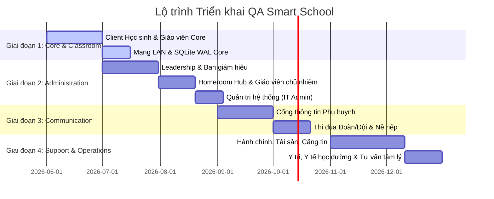

# BẢNG PHÂN TÍCH HỆ SINH THÁI CÁC CHỨC NĂNG & LỘ TRÌNH TRIỂN KHAI QA SMART SCHOOL

*Biên soạn bởi Trưởng bộ phận thiết kế hệ thống QA Smart School*
*Tài liệu phân cấp các form chức năng theo từng chủ thể và hoạch định các giai đoạn thực hiện dự án*

---

## 🏛️ TỔNG QUAN HỆ SINH THÁI QA SMART SCHOOL
QA Smart School là hệ thống quản lý và tương tác trường học thông minh toàn diện, tích hợp trực tiếp giữa các thiết bị trạm Windows Presentation Foundation (WPF) chạy trong mạng LAN trường học và cổng liên kết đa kênh. 

Hệ thống được chia thành **10 chủ thể tương tác chính**, tương ứng với các thư mục module và phân hệ chức năng cụ thể trong mã nguồn dự án.

---

## ══ PHẦN 1: DANH SÁCH FORM CHỨC NĂNG THEO CHỦ THỂ ══

### 1. 🧑‍🎓 Chủ thể: Học sinh (Student Client)
*Thư mục nguồn ảnh hưởng: `QASmartClass/StudentClient/Views/`*
Giao diện trung tâm kết nối trực tiếp với bài học trên lớp và các công cụ bổ trợ học tập cá nhân hóa.
*   **StudentLoginWindow**: Cửa sổ đăng nhập bảo mật của học sinh.
*   **StudentDashboardPage**: Trang tổng quan hiển thị thông số học tập, bảng tin nội bộ và lối tắt nhanh.
*   **StudentLessonPage**: Giao diện bài học trực tiếp (theo dõi giáo án giáo viên chiếu, download tài liệu).
*   **StudentSubmitPage**: Phân hệ Soạn bài viết tự do và Nộp file bài tập (chứa các tính năng đếm từ, cảnh báo tệp rỗng, tự động lưu nháp, nộp file kéo thả).
*   **StudentQuizPage**: Làm bài trắc nghiệm nhanh và kiểm tra định kỳ ngay tại lớp.
*   **StudentLocalWhiteboardPage**: Bảng vẽ phác thảo cá nhân, giải bài tập vẽ hình học/vectơ.
*   **StudentHandRaisePage**: Giao diện giơ tay phát biểu ý kiến trực tuyến trên lớp.
*   **AnalyticsPage**: Phân tích cá nhân hóa (biểu đồ số từ, thống kê số bài nộp, biểu đồ xu hướng học tập).
*   **CareerTestPage & CareerDetailWindow**: Bài trắc nghiệm tính cách định hướng nghề nghiệp.
*   **GoalSettingPage & SelfEvalPage**: Thiết lập mục tiêu học tập và tự đánh giá năng lực theo kỳ học.
*   **DiaryPage & AnonymousChatPage**: Nhật ký học tập cá nhân và góc tư vấn tâm lý ẩn danh với chuyên gia trường học.
*   **PortfolioPage**: Hồ sơ năng lực học sinh (lưu trữ chứng nhận, sản phẩm học tập xuất sắc).
*   **GameHubPage & MIGames**: Kho trò chơi trí tuệ phát triển đa trí thông minh (Multiple Intelligences).
*   **ClubListView & LeaderboardView**: Danh sách câu lạc bộ ngoại khóa và bảng xếp hạng thi đua lớp học.

---

### 2. 👩‍🏫 Chủ thể: Giáo viên Bộ môn (Subject Teacher)
*Thư mục nguồn ảnh hưởng: `QASmartClass/TeacherHub/Views/`*
Hỗ trợ giáo viên soạn bài giảng, kiểm soát lớp học và chấm điểm thông minh.
*   **TeacherHubWindow**: Khung giao diện làm việc chính của giáo viên bộ môn.
*   **TeacherDashboardView**: Tổng quan thông số các lớp dạy, danh sách nhiệm vụ và chấm bài trong ngày.
*   **LessonPlanPage**: Quản lý thiết kế bài dạy (giáo án điện tử), hỗ trợ import tài liệu.
*   **QuestionBankView**: Ngân hàng câu hỏi trắc nghiệm/tự luận, biên soạn đề kiểm tra.
*   **TeacherAssignmentsView**: Giao bài tập về nhà trực tiếp hoặc tự động qua file Word.
*   **TeacherGradingView**: Phân hệ chấm bài, nhận xét chi tiết bài làm tự luận/nộp file của học sinh.
*   **ClassMIDashboardView**: Bảng phân tích trí tuệ đa diện của học sinh trong lớp dạy.
*   **AiAssistantPage & AiCopilotWindow**: Trợ lý AI hỗ trợ soạn giáo án và chấm bài tự luận tự động.
*   **SoftSkillRubricWindow**: Tiêu chí đánh giá kỹ năng mềm của học sinh trong giờ học.
*   **DeptMeetingView & DeptHeadReviewView**: Biên bản họp tổ chuyên môn và gửi duyệt giáo án lên tổ trưởng.
*   **SkknView & RemedialPlanView**: Quản lý Sáng kiến kinh nghiệm và lập kế hoạch phụ đạo học sinh yếu/ bồi dưỡng học sinh giỏi.

---

### 3. 🧑‍🏫 Chủ thể: Trưởng / Phó Bộ môn (Head / Deputy Head of Department)
*Thư mục nguồn ảnh hưởng: `QASmartClass/TeacherHub/Views/`*
Quản lý chuyên môn, phân công giảng dạy, dự giờ và duyệt giáo án của giáo viên thuộc tổ bộ môn.
*   **DeptHeadReviewView**: Tiếp nhận và phê duyệt giáo án (Lesson Plan Review) của các giáo viên thuộc tổ bộ môn quản lý.
*   **DeptMeetingView**: Tổ chức và lưu vết biên bản họp tổ chuyên môn định kỳ (về nội dung giảng dạy, đổi mới phương pháp).
*   **SkknView**: Đánh giá, xếp loại các Sáng kiến kinh nghiệm (SKKN) của các giáo viên thuộc tổ bộ môn.
*   **RemedialPlanView**: Thống nhất, phê duyệt và theo dõi các Kế hoạch phụ đạo học sinh yếu kém / bồi dưỡng học sinh giỏi của tổ.
*   **TeacherGradingView** (ở mức độ giám sát): Xem báo cáo thống kê tình hình chấm điểm, tiến độ của giáo viên trong tổ bộ môn.

---

### 4. 👩‍🏫 Chủ thể: Giáo viên Chủ nhiệm (Homeroom Teacher)
*Thư mục nguồn ảnh hưởng: `QASmartClass/TeacherHub/Views/`*
*   **HomeroomDiaryPage**: Sổ tay nhật ký chủ nhiệm (quản lý học sinh cá biệt, nề nếp lớp học, danh sách cán bộ lớp).
*   **ParentApprovalView**: Tiếp nhận và duyệt đơn xin nghỉ phép từ cổng phụ huynh.
*   **MyTasksView**: Lịch công tác chủ nhiệm, nhắc nhở họp phụ huynh và đại hội lớp.
*   **BulletinBoardPage & BulletinDetailWindow & BulletinSlideshowWindow & BulletinTemplateView**: Quản lý bảng tin điện tử của lớp học, cập nhật nội dung sinh hoạt lớp hàng tuần.

---

### 5. 👑 Chủ thể: Ban Giám hiệu / Hiệu trưởng (Leadership)
*Thư mục nguồn ảnh hưởng: `QASmartClass/Leadership/Views/`*
Giám sát toàn diện chất lượng dạy và học, quản lý thi đua khen thưởng và phê duyệt trực tuyến.
*   **LeadershipDashboardWindow**: Giao diện chính dành cho ban giám hiệu.
*   **PrincipalDashboardPage**: Thống kê thời gian thực về sĩ số toàn trường, tình trạng dạy học của các lớp.
*   **KpiDashboardPage**: Bảng chỉ số hiệu suất KPI giảng dạy của giáo viên và chất lượng điểm số học sinh.
*   **ClassObservationView**: Sổ tay dự giờ đánh giá giáo viên trực tiếp trên lớp.
*   **EmulationBoardPage**: Bảng xếp hạng thi đua tuần/tháng/kỳ của các lớp học toàn trường.
*   **ApprovalQueueView**: Hàng đợi phê duyệt trực tuyến các đề xuất, kế hoạch tổ chuyên môn, dự trù ngân sách.
*   **AwardManagementView**: Quản lý các chuyên đề thi đua khen thưởng cán bộ, giáo viên và học sinh xuất sắc.
*   **ProfessionalTopicView**: Quản lý các chuyên đề nghiên cứu chuyên môn cấp trường/quận.
*   **SchoolCalendarView & SchoolEventCalendarView**: Lịch công tác chung của nhà trường và kế hoạch sự kiện lớn.
*   **StaffPerformanceTrackerView**: Theo dõi đánh giá hiệu suất giảng dạy và nề nếp công tác của nhân sự.
*   **Evaluation360Page**: Module tự đánh giá và đánh giá chéo năng lực cán bộ quản lý, giáo viên.
*   **AppUsageAnalyticsView**: Phân tích chỉ số tương tác công nghệ của toàn trường để cải tiến phần mềm.

---

### 6. 👥 Chủ thể: Cán bộ Đoàn / Đội thi đua (Youth Union Officer)
*Thư mục nguồn ảnh hưởng: `QASmartClass/YouthUnion/Views/`*
Tổ chức các phong trào thi đua nề nếp học sinh và hoạt động Đoàn/Đội.
*   **YouthUnionDashboard**: Bảng thông số thi đua, các hoạt động Đoàn/Đội đang diễn ra.
*   **MemberListView**: Danh sách quản lý hồ sơ Đoàn viên / Đội viên.
*   **EmulationScoreView**: Phân hệ chấm điểm thi đua nề nếp (cờ đỏ trực tuần chấm điểm đồng phục, đi muộn, vệ sinh).
*   **ActivityManagementView & EventRegistrationView**: Thiết lập hoạt động phong trào và tiếp nhận đăng ký tham gia của học sinh.
*   **PlanBudgetView**: Lập kế hoạch và dự trù ngân sách tổ chức đại hội, cắm trại, hội diễn văn nghệ.
*   **FeeTrackerView**: Theo dõi đóng đoàn phí, quỹ Đội, các khoản quyên góp tình nguyện.
*   **AwardProposalView**: Đề xuất danh sách khen thưởng học sinh tích cực lên Ban Giám hiệu.
*   **VotingView**: Tổ chức bỏ phiếu, bầu cử Ban chấp hành Đoàn/Đội trực tuyến.
*   **DocumentView**: Lưu trữ các công văn, hướng dẫn từ Đoàn/Đội cấp trên.
*   **YouthBchChatView**: Kênh liên lạc nội bộ của Ban chấp hành Đoàn/Đội trường học.

---

### 7. 💼 Chủ thể: Nhân viên Hành chính & Hỗ trợ (Administrative & Support Staff)
*Thư mục nguồn ảnh hưởng: `QASmartClass/Staff/Views/`*
Quản lý vận hành tài sản, cơ sở vật chất, tài chính và hậu cần trường học.
*   **StaffLoginWindow & StaffDashboardWindow**: Cửa sổ đăng nhập và giao diện làm việc chung của cán bộ hành chính.
*   **StaffOverviewView & PayrollView**: Quản lý thông tin trích ngang nhân viên trường học và tính lương định kỳ.
*   **SchoolAssetManagementView**: Quản lý tài sản, cơ sở vật chất và thiết bị dạy học (mượn/trả đồ dùng thí nghiệm, thiết bị phòng học).
*   **CleaningScheduleView**: Lập lịch trực nhật phòng học, lịch vệ sinh chung toàn trường.
*   **DocumentManagerView & DocumentRoutingView**: Quản lý văn thư lưu trữ, luân chuyển công văn đi/đến.
*   **CanteenPosView & CanteenReceiptWindow & KitchenDashboardView**: Quản lý căng-tin trường học, bán vé ăn bán trú, nhật ký nhập kho thực phẩm an toàn và xây dựng thực đơn nhà bếp.
*   **GateMonitorView & SecurityKioskView**: Theo dõi camera an ninh cổng trường, quản lý khách ra vào trường và giám sát học sinh đưa đón bằng xe bus.
*   **IncidentManagementView**: Tiếp nhận và điều phối xử lý sự cố cơ sở vật chất (hỏng điện nước, sự cố cháy nổ, hỏng máy chiếu).
*   **MoetReportView**: Tổng hợp xuất dữ liệu báo cáo thống kê định kỳ gửi Bộ Giáo dục và Đào tạo (MOET).

---

### 8. 🩺 Chủ thể: Cán bộ Y tế Học đường (School Nurse)
*Thư mục nguồn ảnh hưởng: `QASmartClass/HealthRoom/Views/`*
*   **HealthRecordView**: Hồ sơ theo dõi sức khỏe học sinh định kỳ (chiều cao, cân nặng, thị lực, tiêm chủng).
*   **MedicalInventoryView**: Quản lý kho thuốc y tế học đường (nhập thuốc, theo dõi hạn sử dụng, xuất thuốc cấp phát).
*   **EpidemicMonitorView**: Giám sát dịch bệnh học đường (báo cáo số lượng ca sốt, cúm, cách ly phòng chống dịch).
*   **EmergencyReportView**: Ghi nhận và theo dõi các ca sơ cứu tai nạn thương tích tại trường.
*   **FoodSafetyView**: Nhật ký kiểm thực ba bước mẫu thức ăn bán trú hàng ngày, đảm bảo an toàn thực phẩm.

---

### 9. 🧠 Chủ thể: Cán bộ Tư vấn Tâm lý & Hướng nghiệp (School Counselor)
*Thư mục nguồn ảnh hưởng: `QASmartClass/Counseling/Views/`*
*   **SchoolCounselingView**: Tiếp nhận các yêu cầu trợ giúp, tư vấn tâm lý hoặc hướng nghiệp từ học sinh (kết nối trực tiếp với hòm thư ẩn danh `AnonymousChatPage` của học sinh).
*   **CounselingProfileView**: Quản lý hồ sơ tư vấn tâm lý học sinh (bảo mật nghiêm ngặt theo phân quyền đặc biệt).

---

### 10. 🚸 Chủ thể: Phụ huynh Học sinh (Parents)
*Thư mục nguồn ảnh hưởng: `QASmartClass/ParentPortal/Views/`*
Kết nối gia đình và nhà trường thông qua cổng thông tin trực tuyến.
*   **ParentLoginPage & ParentShell**: Đăng nhập và giao diện chính của Phụ huynh.
*   **ParentDashboardPage**: Tổng quan tình hình học tập và hoạt động của con tại trường.
*   **ParentAttendancePage**: Theo dõi chi tiết điểm danh hàng ngày của con (vào lớp, nghỉ học, đi muộn).
*   **ParentGradesPage**: Xem bảng điểm chi tiết các môn học và nhận xét từ giáo viên bộ môn/chủ nhiệm.
*   **ParentTimetablePage**: Thời khóa biểu học tập, lịch kiểm tra và lịch hoạt động ngoại khóa của con.
*   **ParentTuitionPage**: Xem chi tiết học phí, các khoản đóng góp và tích hợp cổng thanh toán trực tuyến.
*   **ParentMessagesPage**: Kênh gửi tin nhắn trao đổi, xin nghỉ phép cho con với giáo viên chủ nhiệm.
*   **ParentNotificationPage**: Nhận thông báo tự động (thông báo khẩn, kết quả học tập đột xuất, thư mời họp).
*   **FamilyGamePage**: Chuyên mục trò chơi tương tác giáo dục gắn kết cha mẹ và con cái tại nhà.

---

### 11. ⚙️ Chủ thể: Quản trị Hệ thống (System Administrator)
*Thư mục nguồn ảnh hưởng: `QASmartClass/Leadership/Views/`*
*   **SystemSettingsView**: Cấu hình các tham số hệ thống toàn trường (IP Server, Database Connection String, Mail Server).
*   **RolePermissionManagerView**: Phân quyền chi tiết vai trò người dùng (Hiệu trưởng, GV, Nhân viên, Học sinh).
*   **BackupRestoreView**: Quản lý sao lưu dữ liệu tự động và phục hồi hệ thống khi có sự cố.
*   **SystemAuditLogView**: Xem nhật ký thao tác hệ thống, phát hiện các truy cập bất thường.
*   **SystemDataExporterView**: Xuất dữ liệu thô phục vụ liên kết các phần mềm quản lý của Sở/Phòng Giáo dục.
*   **PushNotificationCenterView & MobileAppManagementView**: Quản lý phân phối thông báo đẩy toàn trường và cấu hình các phiên bản ứng dụng di động liên kết.

---

## ══ PHẦN 2: HOẠCH ĐỊNH LỘ TRÌNH 4 GIAI ĐOẠN TRIỂN KHAI ══

Để triển khai hệ sinh thái khổng lồ này một cách an toàn, tránh đè nén tài nguyên mạng LAN và đảm bảo tính thích ứng cao của giáo viên/học sinh, dự án được đề xuất chia làm **4 Giai đoạn phát triển**:

### 📍 Giai đoạn 1: Thiết lập Core và Tương tác Lớp học Cốt lõi (Classroom Interaction)
*Trọng tâm: Đưa phần mềm vào giảng dạy trực tiếp tại lớp.*
*   **Phân hệ thực hiện**:
    *   *Student Client*: Login, Dashboard, LessonPage, SubmitPage (Bài viết/Nộp file), QuizPage.
    *   *Teacher Client*: HubWindow, Dashboard, LessonPlan, Assignments, Grading (Chấm điểm), QuestionBank.
    *   *Database*: Cấu hình SQLite WAL, mã hóa tệp nháp, hàng đợi nộp bài offline.
*   **Kết quả đạt được**: Giáo viên giao được bài, chiếu được tài liệu; học sinh làm được bài viết trực tiếp, nộp được file qua mạng LAN phòng máy không lỗi, lưu vết đầy đủ trong SQLite cục bộ.

### 📍 Giai đoạn 2: Quản lý Hành chính lớp học và Ban Giám hiệu (Administration)
*Trọng tâm: Số hóa công tác quản lý của Ban giám hiệu, Tổ trưởng chuyên môn và Giáo viên chủ nhiệm.*
*   **Phân hệ thực hiện**:
    *   *Leadership Client*: PrincipalDashboard, KPI Dashboard, ClassObservation (Dự giờ), ApprovalQueue (Phê duyệt trực tuyến), ReportExport (Xuất báo cáo MOET/Trường).
    *   *Tổ chuyên môn (Dept Head)*: DeptHeadReviewView (Duyệt giáo án), DeptMeetingView (Biên bản họp tổ), SkknView (Quản lý sáng kiến), RemedialPlanView (Phụ đạo & bồi dưỡng).
    *   *Homeroom Hub*: Sổ chủ nhiệm điện tử, Bảng tin lớp học, Xử lý đơn nghỉ học.
    *   *IT Admin*: Phân quyền người dùng, Sao lưu CSDL, Xem Audit Log bảo mật.
*   **Kết quả đạt được**: Ban giám hiệu xem được báo cáo trực quan về tình hình dạy học; tổ trưởng/phó bộ môn duyệt giáo án và theo dõi chất lượng dạy học của tổ viên trực tuyến; giáo viên chủ nhiệm giảm bớt hồ sơ sổ sách giấy; hệ thống hoạt động phân quyền chặt chẽ.

### 📍 Giai đoạn 3: Cổng kết nối Phụ huynh và Thi đua Đoàn/Đội (Communication)
*Trọng tâm: Mở rộng kết nối ra ngoài trường học và đẩy mạnh phong trào thi đua.*
*   **Phân hệ thực hiện**:
    *   *Parent Portal*: Theo dõi điểm danh của con, tra cứu bảng điểm, xem lịch thi, thanh toán học phí trực tuyến, liên lạc GV.
    *   *Youth Union*: Chấm điểm nề nếp thi đua các lớp trực tuần, Quản lý Đoàn viên/Đội viên, Tổ chức hoạt động tình nguyện dã ngoại.
*   **Kết quả đạt được**: Phụ huynh nắm bắt tức thời tình hình học tập của con; chấm điểm thi đua trực tuần của học sinh cờ đỏ minh bạch, tự động hóa tính điểm thi đua lớp gửi lên Ban giám hiệu.

### 📍 Giai đoạn 4: Vận hành Dịch vụ phụ trợ học đường (Support & Operations)
*Trọng tâm: Hoàn thiện hệ sinh thái thông minh, hỗ trợ toàn diện các phòng ban hậu cần.*
*   **Phân hệ thực hiện**:
    *   *Hành chính (Staff)*: Quản lý thiết bị dạy học, tài sản trường học; vệ sinh trực nhật; quản lý căng tin trường học (Pos, hóa đơn ăn bán trú); an ninh cổng trường và xe đưa đón.
    *   *Y tế học đường (HealthRoom)*: Sổ sức khỏe điện tử, giám sát dịch bệnh, kiểm thực ba bước nhà bếp.
    *   *Tư vấn tâm lý (Counseling)*: Kênh tiếp nhận và hỗ trợ tư vấn tâm lý học sinh ẩn danh.
*   **Kết quả đạt được**: Trường học vận hành không giấy tờ (Paperless); kiểm soát an toàn thực phẩm, y tế học đường chặt chẽ; hỗ trợ tâm lý kịp thời cho học sinh.
