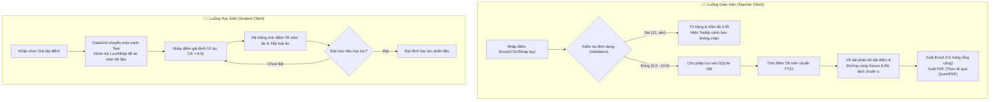

# 📖 HƯỚNG DẪN TRỰC QUAN & DỮ LIỆU MẪU: BÁO CÁO & THỐNG KÊ (REPORT & STATISTICS)
## HỆ THỐNG QA SMARTCLASS (PHASE 2 UPGRADE)

Tài liệu này cung cấp hướng dẫn trực quan, sơ đồ quy trình và các mẫu dữ liệu thực tế giúp **Giáo viên** và **Học sinh** sử dụng phân hệ **4.5. Báo cáo & Thống kê** sau khi được nâng cấp toàn diện theo chuẩn Thông tư 22/2021/TT-BGDĐT, tích hợp mô hình bảo mật chữ ký số DPAPI, hệ thống ràng buộc nhập liệu thông minh và đường cong phân bố Gauss.

---

## 📊 1. Quy Trình Tổng Quan Đánh Giá & Thống Kê Điểm Số

Sơ đồ dưới đây mô tả luồng xử lý dữ liệu điểm số, từ khâu nhập liệu của giáo viên, qua bộ kiểm tra ràng buộc nhập liệu, tính toán thống kê và biểu đồ Gauss, cho tới khâu giả lập của học sinh và xuất báo cáo:

---

## 👨‍🏫 2. DÀNH CHO GIÁO VIÊN: NHẬP VÀ XUẤT BÁO CÁO CHUẨN THÔNG TƯ 22

### A. Định dạng Tệp Điểm mẫu (CSV/Excel) để Import nhanh
Hệ thống hỗ trợ nhập liệu nhanh từ tệp CSV. Khi chuẩn bị tệp tin, Giáo viên cần tuân thủ cấu trúc bảng dữ liệu mẫu sau (hệ thống tự nhận diện dấu phân tách cột `;` hoặc `,` và tự động đổi dấu phẩy điểm thập phân của Việt Nam sang dấu chấm hệ thống):

| STT | HoTen | TX1 | TX2 | TX3 | GK | CK | TB | XepLoai |
| :---: | :--- | :---: | :---: | :---: | :---: | :---: | :---: | :---: |
| 1 | Nguyễn Văn An | 8,0 | 9,0 | 8,5 | 7,5 | 8,0 | *(tự tính)* | *(tự tính)* |
| 2 | Trần Thị Bình | 7,0 | 6,5 | 8,0 | 5,5 | 4,0 | *(tự tính)* | *(tự tính)* |
| 3 | Lê Hoàng Giang | 9,0 | 8,5 | | 8,0 | | **CDD** | Chưa đạt |

> [!IMPORTANT]
> - Cột **TB** (Trung bình) và **XepLoai** sẽ được hệ thống tính tự động. Giáo viên có thể để trống khi import.
> - Học sinh thứ 3 (Lê Hoàng Giang) thiếu điểm **CK** (Thi cuối kỳ) nên điểm trung bình hiển thị là **CDD** (Chưa đủ điểm) theo đúng quy chế sư phạm Thông tư 22 của Bộ GD&ĐT.

### B. Cơ chế Ràng buộc & Cảnh báo Nhập liệu Thông minh (Validation Rules)
Để ngăn ngừa sai sót, hệ thống tích hợp bộ kiểm tra dữ liệu điểm số động:
1. **Kiểm tra giới hạn**: Chỉ cho phép điểm số nằm trong khoảng `[0.0 - 10.0]`.
2. **Không chặn giao diện (Non-blocking)**: Khi nhập sai (ví dụ: gõ chữ `9a`, `12` hoặc bỏ trống sai quy định), ô DataGrid sẽ tự động **tô màu hồng nhạt và viền đỏ**.
3. **Hiển thị lỗi**: Di chuột qua ô lỗi sẽ hiển thị Tooltip thông báo: *"Điểm số phải nằm trong khoảng từ 0.0 đến 10.0 (chấp nhận dấu phẩy hoặc chấm)"*.
4. **Khóa chức năng lưu**: Nút **Lưu tất cả** sẽ bị vô hiệu hóa tạm thời cho tới khi tất cả lỗi nhập liệu được sửa xong. Dữ liệu cũ được giữ nguyên, không bị xóa trắng.

---

## 🧑‍🎓 3. DÀNH CHO HỌC SINH: HƯỚNG DẪN GIẢ LẬP ĐIỂM SỐ (GRADE SIMULATOR)

Tính năng giả lập điểm giúp học sinh tự do thử nghiệm các điểm số kỳ vọng cuối học kỳ mà không làm ảnh hưởng đến cơ sở dữ liệu thật của lớp học.

### 💡 Các bước thực hiện giả lập:
1. Nhấp chọn nút **🔍 Giả lập điểm** trên bảng điều khiển.
2. Hệ thống sẽ:
   - Chuyển màu nền bảng điểm sang **màu xanh Teal dịu mát** để báo hiệu trạng thái giả lập.
   - Ẩn toàn bộ nút **Lưu tất cả**, **Tải form mẫu**, **Nhập điểm từ CSV** để bảo vệ dữ liệu gốc khỏi việc lưu đè ngoài ý muốn.
3. Học sinh nhấp đúp vào ô điểm muốn giả định (ví dụ: Điểm thi Cuối kỳ môn Toán) để nhập giá trị mới.
4. Hệ thống sẽ lập tức tính toán lại Điểm trung bình môn ảo và Xếp loại ảo trên dòng đó.
5. Khi hoàn thành, nhấp chọn **🛑 Dừng giả lập** để khôi phục giao diện điểm số gốc của lớp học.

#### 📝 Ví dụ thực tế:
* **Điểm hiện tại**: Thường xuyên 1 = `6.0`, Thường xuyên 2 = `7.0`, Giữa kỳ = `5.5`.
* **Mục tiêu học lực**: Bạn mong muốn đạt điểm môn học mức **Khá (>= 6.5)**.
* **Quy trình giả lập**:
  - Nhập điểm thi cuối kỳ (CK) giả định = `7.0`. Điểm trung bình môn ảo được tính như sau:
    \[\text{TB} = \frac{6.0 + 7.0 + (5.5 \times 2) + (7.0 \times 3)}{7} = 6.43 \rightarrow \text{Đạt (Chưa đạt Khá)}\]
  - Bạn tiếp tục nâng điểm giả định CK lên `7.5`. Hệ thống tính lại:
    \[\text{TB} = \frac{6.0 + 7.0 + (5.5 \times 2) + (7.5 \times 3)}{7} = 6.64 \rightarrow \text{Khá (Đạt mục tiêu!)}\]
  - *Kết luận*: Bạn cần đạt tối thiểu **7.5 điểm** ở kỳ thi Cuối kỳ để đạt học lực Khá.

---

## 🔬 4. PHÂN TÍCH THỐNG KÊ NÂNG CAO (DÀNH CHO BAN GIÁM HIỆU & TỔ TRƯỞNG)

Hệ thống cung cấp dải phân tích chất lượng sư phạm nâng cao phục vụ công tác nghiên cứu giáo dục:

### A. Độ Lệch Chuẩn (\(\sigma\)) & Điểm Trung Bình (\(\mu\))
- **Điểm trung bình (\(\mu\))**: Phản ánh mức độ học tập trung bình của cả tập thể lớp học.
- **Độ lệch chuẩn (\(\sigma\))**: Phản ánh mức độ phân hóa học lực trong lớp học.
  - \(\sigma\) thấp (\(< 1.0\)): Điểm số của học sinh đồng đều, lớp học có trình độ tương đương nhau.
  - \(\sigma\) cao (\(> 2.0\)): Có sự phân hóa sâu sắc giữa nhóm học lực giỏi và nhóm học tập yếu/chưa đạt.

### B. Biểu đồ hình chuông Gauss (Normal Distribution Bell Curve)
Đồ thị biểu diễn hàm mật độ xác suất phân bố điểm số thực tế của lớp học dưới dạng đường cong Gauss:
\[f(x) = \frac{1}{\sigma\sqrt{2\pi}} e^{-\frac{1}{2}\left(\frac{x-\mu}{\sigma}\right)^2}\]
- Đường cong trơn và đạt đỉnh tại trung vị giúp Giáo viên và Ban giám hiệu nhận diện nhanh chóng lớp học có đang phát triển theo đúng chuẩn phân phối chuẩn sư phạm hay không.
- Đường cong tự động điều chỉnh tỷ lệ mượt mà và co giãn theo kích thước của cửa sổ phần mềm khi phóng to/thu nhỏ.
