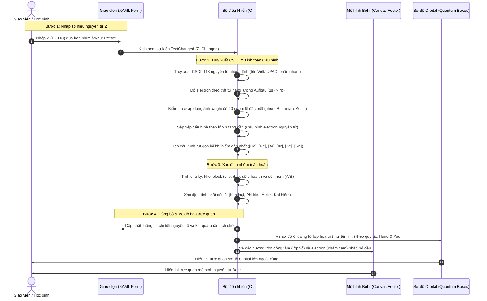

# ⚛️ HƯỚNG DẪN TRỰC QUAN & DỮ LIỆU MẪU: CÔNG CỤ CẤU HÌNH ELECTRON

Tài liệu này cung cấp hướng dẫn chi tiết từng bước, sơ đồ tương tác hệ thống, dữ liệu thực nghiệm mẫu và các kịch bản sư phạm sinh động giúp **Giáo viên** và **Học sinh** sử dụng tối ưu công cụ **Cấu hình Electron** trên hệ thống học tập tương tác thông minh QA SmartClass.

---

## 🗺️ Quy trình tương tác dữ liệu (Data Workflow)

Sơ đồ tuần tự thể hiện luồng xử lý từ lúc người dùng nhập liệu, đi qua các bộ lọc kiểm thử logic hóa học và quy tắc đặc lệ bền vững (half-filled/filled d/f subshell), đồng bộ hóa giao diện và vẽ đồ thị trực quan song song:

---

## 📊 Bảng dữ liệu thực nghiệm mẫu tiêu biểu (Sample Datasets)

Dưới đây là danh sách các nguyên tố tiêu biểu, bao gồm cả các nguyên tố cơ bản và các trường hợp ngoại lệ đặc biệt được giảng dạy trong chương trình Hóa học phổ thông:

| Số hiệu Z | Kí hiệu | Tên tiếng Việt | Tên IUPAC | Cấu hình e nguyên tử (Sắp xếp theo lớp) | Cấu hình rút gọn | Chu kỳ | Nhóm | Tính chất cốt lõi | Ý nghĩa Sư phạm / Trường hợp đặc biệt |
| :--- | :---: | :--- | :--- | :--- | :--- | :---: | :---: | :--- | :--- |
| **1** | H | Hydro | Hydrogen | $1s^1$ | $1s^1$ | 1 | IA | Phi kim | Có 1e hóa trị nhưng không thuộc nhóm kim loại kiềm. |
| **2** | He | Heli | Helium | $1s^2$ | $1s^2$ | 1 | VIIIA | Khí hiếm | Chỉ có 2e ngoài cùng nhưng đạt trạng thái bão hòa bền vững nên xếp vào nhóm khí hiếm. |
| **5** | B | Bo | Boron | $1s^2 2s^2 2p^1$ | $[He] 2s^2 2p^1$ | 2 | IIIA | Á kim | Nguyên tố bán dẫn điển hình ở nhóm IIIA. |
| **6** | C | Cacbon | Carbon | $1s^2 2s^2 2p^2$ | $[He] 2s^2 2p^2$ | 2 | IVA | Phi kim | Nền tảng của hóa học hữu cơ và sự sống. |
| **24** | Cr | Crom | Chromium | $1s^2 2s^2 2p^6 3s^2 3p^6 3d^5 4s^1$ | $[Ar] 3d^5 4s^1$ | 4 | VIB | Kim loại | **Ngoại lệ**: Sự chuyển electron từ $4s$ sang $3d$ để đạt trạng thái bán bão hòa $3d^5$ bền vững hơn. |
| **26** | Fe | Sắt | Iron | $1s^2 2s^2 2p^6 3s^2 3p^6 3d^6 4s^2$ | $[Ar] 3d^6 4s^2$ | 4 | VIIIB | Kim loại | Kim loại chuyển tiếp d-block điển hình nhất trong đời sống. |
| **29** | Cu | Đồng | Copper | $1s^2 2s^2 2p^6 3s^2 3p^6 3d^{10} 4s^1$ | $[Ar] 3d^{10} 4s^1$ | 4 | IB | Kim loại | **Ngoại lệ**: Electron chuyển từ $4s$ sang $3d$ để đạt cấu hình bão hòa $3d^{10}$ bền vững tuyệt đối. |
| **46** | Pd | Palladi | Palladium | $1s^2 2s^2 2p^6 3s^2 3p^6 3d^{10} 4s^2 4p^6 4d^{10}$ | $[Kr] 4d^{10}$ | 5 | VIIIB | Kim loại | **Ngoại lệ cực đoan**: Mất hoàn toàn electron ở phân lớp ngoài cùng $5s$ ($5s^0$) để đạt $4d^{10}$. |
| **57** | La | Lantan | Lanthanum | $[Xe] 5d^1 6s^2$ | $[Xe] 5d^1 6s^2$ | 6 | IIIB | Kim loại | **Ngoại lệ**: Electron điền vào $5d$ trước khi điền vào $4f$. |
| **58** | Ce | Cer | Cerium | $[Xe] 4f^1 5d^1 6s^2$ | $[Xe] 4f^1 5d^1 6s^2$ | 6 | IIIB (Lantan) | Kim loại | Nguyên tố mở đầu họ đất hiếm Lantanide. |

---

## 👩‍🏫 DÀNH CHO GIÁO VIÊN: KỊCH BẢN GIẢNG DẠY TRỰC QUAN

### Kịch bản 1: Giảng dạy về "Sự chuyển e để đạt cấu hình bán bão hòa / bão hòa d-block" (Ví dụ Crom và Đồng)
1. **Chuẩn bị**: Bật màn hình tương tác cảm ứng ($55" - 86"$). Mở thẻ **Tab 1: ⚛️ Trình mô phỏng**.
2. **Thao tác thực hiện**:
   * Nhấp chọn nút Preset nhanh **Fe (26)**: Học sinh quan sát thấy cấu hình sắt bình thường $[Ar] 3d^6 4s^2$. Phân lớp $3d$ có 1 ô e ghép đôi và 4 ô e độc thân.
   * Tiếp tục nhấp chọn nút Preset nhanh **Cr (24)**: Yêu cầu học sinh nhận xét cấu hình electron.
   * **Phân tích sư phạm**:
     * Cấu hình thực tế là $[Ar] 3d^5 4s^1$ (Cấu hình hiển thị to đậm ở dòng đầu tiên).
     * Chỉ ra cho học sinh thấy ở ô lượng tử phía dưới: cả 5 ô của phân lớp $3d$ đều có 1 mũi tên đi lên màu xanh dương (`↑`), và ô của phân lớp $4s$ cũng chỉ có 1 e độc thân (`↑`).
     * Giải thích cho học sinh: *"Các em thấy đấy, nếu theo trật tự năng lượng Aufbau, electron phải điền đầy $4s^2$ trước rồi mới đến $3d^4$. Nhưng vì cấu hình bán bão hòa $3d^5$ có tính đối xứng cao và bền vững hơn rất nhiều, nên 1 electron ở lớp $4s$ đã tự động chuyển sang phân lớp $3d$. Phần mềm đã mô phỏng trực quan chính xác cấu hình thực tế này."*
3. **Thao tác kiểm chứng tiếp theo**: Nhấp chọn Preset nhanh **Cu (29)** để giảng giải tương tự về quy luật bão hòa $3d^{10} 4s^1$.

### Kịch bản 2: Dạy học sinh xác định vị trí nguyên tố trong Bảng tuần hoàn từ cấu hình e
1. **Thao tác**: Yêu cầu một học sinh lên bảng nhập số hiệu nguyên tử bất kỳ (ví dụ $Z=17$) vào ô nhập liệu.
2. **Hướng dẫn học sinh quan sát**:
   * Xem dòng **Cấu hình e nguyên tử**: `1s² 2s² 2p⁶ 3s² 3p⁵`.
   * **Cách xác định Chu kỳ**: Số lớp electron lớn nhất là 3 (lớp ngoài cùng chứa $3s^2 3p^5$). Do đó nguyên tố thuộc **Chu kỳ 3**.
   * **Cách xác định Nhóm**: Phân lớp ngoài cùng nhận electron cuối cùng là phân lớp $p$ (Block $p$). Số electron ở lớp ngoài cùng là $2 (ở 3s) + 5 (ở 3p) = 7$. Do đó nguyên tố thuộc nhóm phân nhóm chính nhóm A, cụ thể là **Nhóm VIIA**.
   * **Cách xác định Block**: Nhìn dòng **Khối nguyên tố (Block)**: hiển thị chữ `p`.
   * **Cách xác định tính chất**: Nguyên tố có 7e lớp ngoài cùng $\rightarrow$ thuộc loại **Phi kim** (Halogen).
3. **Phản hồi từ công cụ**: Học sinh đối chiếu các phán đoán trên với các kết quả hiển thị tự động trên thẻ **📊 Kết quả phân tích**:
   * Chu kỳ: 3 (do có 3 lớp electron).
   * Nhóm: VIIA.
   * Khối nguyên tố (Block): p.
   * Tính chất: Phi kim.

---

## 🧑‍🎓 DÀNH CHO HỌC SINH: HƯỚNG DẪN TỰ HỌC TỪNG BƯỚC

### Bước 1: Khám phá cách biểu diễn mô hình vỏ nguyên tử Bohr
* Mở ứng dụng, chọn **Trình mô phỏng**. Nhập số hiệu nguyên tử $Z=11$ (Natri - Sodium).
* Nhìn xuống vùng **Mô hình lớp vỏ electron (Bohr)**:
  * Em sẽ nhìn thấy hạt nhân màu tím ở tâm ghi `Na 11+`.
  * Có 3 vòng tròn nét đứt biểu thị cho 3 lớp electron K, L, M.
  * Số hạt electron (chấm màu cam) phân bổ như sau: Vòng 1 trong cùng có 2 hạt e, vòng 2 có 8 hạt e và vòng ngoài cùng có đúng 1 hạt e.
  * Hãy đếm tổng số hạt e: $2 + 8 + 1 = 11$, hoàn toàn bằng số hiệu điện tích hạt nhân.

### Bước 2: Học cách đếm số electron độc thân bằng sơ đồ ô lượng tử
* Nhập số hiệu nguyên tử $Z=8$ (Oxy - Oxygen).
* Nhìn vào vùng **Sơ đồ orbital lớp ngoài cùng**:
  * Em thấy phân lớp $2s$ có 1 ô lượng tử chứa cặp e ghép đôi màu cam (`↑↓`).
  * Phân lớp $2p$ có 3 ô lượng tử. Ô thứ nhất chứa 1 cặp e ghép đôi màu cam (`↑↓`), hai ô còn lại chứa mỗi ô một electron độc thân màu xanh dương (`↑`).
  * Ghi nhớ: Khi làm bài kiểm tra viết, số electron độc thân của Oxy là 2.

### Bước 3: Tra cứu nhanh lý thuyết Hóa học
* Nếu em quên mất cách xác định số nhóm A hay nhóm B, hoặc quy luật phân bổ e vào ô lượng tử (nguyên lý vững bền Pauli, quy tắc Hund), hãy chuyển sang **Tab 2: 📖 Hướng dẫn & Ví dụ**.
* Tại đây, toàn bộ lý thuyết nền tảng đã được tóm tắt ngắn gọn và minh họa trực quan bằng các bảng mẫu để em tra cứu tức thời.

---

## 🌍 ỨNG DỤNG THỰC TẾ CỦA CÁC NGUYÊN TỐ (PRACTICAL APPLICATIONS)

Để làm cho bài học sinh động hơn, hãy chuyển sang **Tab 3: 🌍 Ứng dụng thực tế**. Hệ thống đã tích hợp 6 ví dụ trực quan về vai trò của các nguyên tố trong đời sống kỹ thuật gắn liền với cấu hình electron của chúng:

| Ứng dụng thực tế | Hình ảnh minh họa thư viện | Cơ sở khoa học / Cấu hình electron hóa trị |
| :--- | :---: | :--- |
| **1. Đèn phát sáng Neon** | `app_electron_1_VN/EN.png` | Khí hiếm Neon ($Z=10, 1s^2 2s^2 2p^6$) có lớp vỏ ngoài bão hòa bền vững. Khi có dòng điện kích thích, electron nhảy lên mức năng lượng cao và giải phóng ánh sáng đỏ-cam đặc trưng khi quay lại trạng thái cơ bản. |
| **2. Dây tóc bóng đèn Vonfram** | `app_electron_2_VN/EN.png` | Kim loại Vonfram ($Z=74, [Xe] 4f^{14} 5d^4 6s^2$) có liên kết kim loại cực bền nhờ sự tham gia của các electron hóa trị d và s, giúp nó có nhiệt độ nóng chảy cao nhất ($3422^\circ\text{C}$). |
| **3. Luyện sắt & thép chịu lực** | `app_electron_3_VN/EN.png` | Sắt ($Z=26, [Ar] 3d^6 4s^2$) là kim loại chuyển tiếp d-block có nhiều hóa trị, dễ dàng kết hợp với Cacbon để tạo ra hợp kim thép siêu bền trong xây dựng. |
| **4. Pin sạc Lithium-ion** | `app_electron_4_VN/EN.png` | Lithium ($Z=3, 1s^2 2s^1$) là kim loại kiềm nhẹ nhất, có duy nhất 1e ở lớp ngoài cùng cực kỳ dễ nhường, giúp pin đạt mật độ năng lượng và hiệu điện thế cao. |
| **5. Chip bán dẫn Silic** | `app_electron_5_VN/EN.png` | Silic ($Z=14, [Ne] 3s^2 3p^2$) là á kim nhóm IVA. Cấu hình 4 electron hóa trị giúp nó tạo mạng tinh thể cộng hóa trị vững chắc, đóng vai trò bán dẫn cốt lõi của mọi vi mạch. |
| **6. Trang sức Vàng không gỉ** | `app_electron_6_VN/EN.png` | Vàng ($Z=79, [Xe] 4f^{14} 5d^{10} 6s^1$) có phân lớp d và f bão hòa hoàn toàn che chắn tốt hạt nhân, làm cho electron lớp ngoài cùng liên kết chặt chẽ. Vàng cực kỳ trơ và không bị gỉ sét. |
