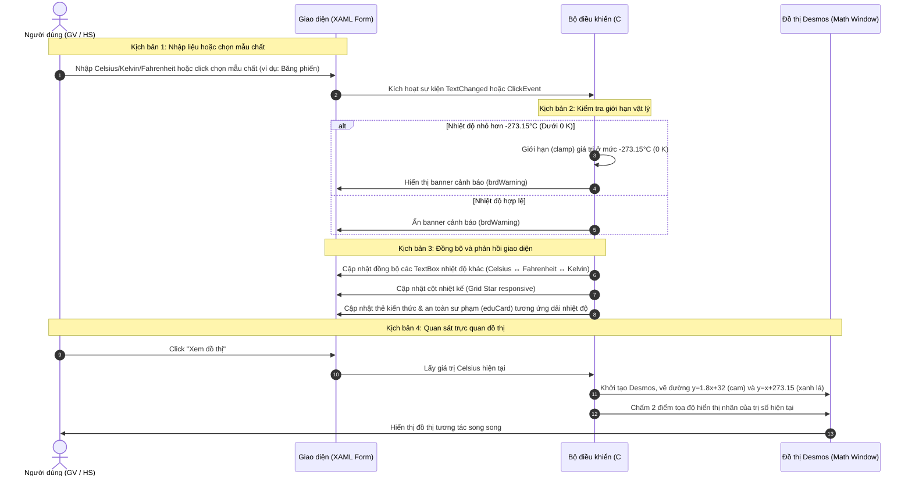

# 🌡️ HƯỚNG DẪN TRỰC QUAN & DỮ LIỆU MẪU: CÔNG CỤ NHIỆT ĐỘ SÔI / ĐÔNG ĐẶC

Tài liệu này cung cấp hướng dẫn chi tiết từng bước, sơ đồ tương tác, dữ liệu thực nghiệm mẫu và các kịch bản sư phạm giúp **Giáo viên** và **Học sinh** làm chủ công cụ **Nhiệt độ sôi / Đông đặc** trên hệ thống QA SmartClass.

---

## 🗺️ Quy trình tương tác dữ liệu (Data Workflow)

Sơ đồ tuần tự thể hiện cách hệ thống tiếp nhận thông tin đầu vào từ các nguồn khác nhau, xử lý logic vật lý (hạn định Không tuyệt đối), đồng bộ hóa giao diện và vẽ đồ thị chuyển đổi song song:

---

## 📋 Dữ liệu thực nghiệm mẫu (Sample Datasets)

Dưới đây là bảng dữ liệu chuẩn hóa về điểm nóng chảy, điểm sôi và ý nghĩa khoa học giáo dục của một số chất tiêu biểu được tích hợp trực tiếp trong công cụ:

| Nhóm chất | Tên chất | Điểm nóng chảy (°C) | Điểm sôi (°C) | Ghi chú Sư phạm / Ứng dụng thực tế |
| :--- | :--- | :--- | :--- | :--- |
| **Kim loại** | Vonfram (W) | $3422.0$ | $5555.0$ | Kim loại có nhiệt độ nóng chảy cao nhất, dùng làm dây tóc bóng đèn sợi đốt thế hệ cũ. |
| | Sắt (Fe) | $1538.0$ | $2862.0$ | Thành phần chính cấu tạo nên thép và lõi Trái Đất. |
| | Thủy ngân (Hg) | $-38.8$ | $356.7$ | Kim loại duy nhất ở thể lỏng ở nhiệt độ phòng, dùng chế tạo nhiệt kế thủy ngân cổ điển. |
| **Phi kim & Hợp chất** | Muối ăn (NaCl) | $801.0$ | $1413.0$ | Hợp chất ion bền vững, nóng chảy ở nhiệt độ rất cao. |
| | Băng phiến ($C_{10}H_8$) | $80.2$ | $217.9$ | Dùng phổ biến trong thí nghiệm thực hành vật lý lớp 6 và 8 để theo dõi chu kỳ đông đặc/nóng chảy. |
| | Axít axetic (Giấm) | $16.6$ | $117.9$ | Thành phần giấm ăn. Axít đóng băng ở nhiệt độ mát ($16.6^\circ\text{C}$) tạo thành các tinh thể giống nước đá. |
| **Khí (Hóa lỏng)** | Oxy ($O_2$) | $-219.0$ | $-183.0$ | Oxy hóa lỏng có màu xanh nhạt, sử dụng trong động cơ tên lửa hoặc y tế đặc biệt. |
| | Khí Argon (Ar) | $-189.3$ | $-185.8$ | Khí hiếm trơ, ứng dụng trong công nghiệp hàn kim loại hoặc làm lớp bảo vệ trong bóng đèn. |

---

## 👩‍🏫 DÀNH CHO GIÁO VIÊN: KỊCH BẢN GIẢNG DẠY TRỰC QUAN

### Kịch bản 1: Giảng dạy về "Độ không tuyệt đối" và giới hạn vật lý
1.  **Chuẩn bị**: Yêu cầu học sinh mở thẻ **🔄 Chuyển đổi**.
2.  **Thao tác**:
    *   Nhấp chọn nút tính nhanh **❄️ Không tuyệt đối** trên màn hình.
    *   **Quan sát**: Ô Celsius tự động điền `-273.15`, ô Kelvin điền `0.00`, ô Fahrenheit điền `-459.67`. Cột nhiệt kế rút sạch xuống đáy.
3.  **Thử thách tư duy**: Yêu cầu học sinh thử nhập vào ô Celsius số `-300` (hoặc ô Kelvin số `-10`).
    *   **Phản hồi hệ thống**: Hộp nhập liệu tự nhảy về số giới hạn vật lý (`-273.15°C` / `0 K`). Banner cảnh báo màu đỏ xuất hiện ghi: *"Nhiệt độ đã được giới hạn ở Không tuyệt đối!"*.
    *   **Lời giảng sư phạm**: *"Các em thấy đấy, nhiệt độ là thước đo chuyển động nhiệt của các hạt. Tại không tuyệt đối, mọi chuyển động nhiệt của hạt dừng lại. Do đó không tồn tại nhiệt độ nào lạnh hơn mức này. Phần mềm đã tự động bảo vệ dữ liệu để đúng với định luật vật lý."*

### Kịch bản 2: Thực hành vẽ đồ thị so sánh hai thang đo Celsius - Fahrenheit - Kelvin
1.  **Chuẩn bị**: Bật màn hình trình chiếu lớn lớp học ($55" - 86"$). Mở Tab **Chuyển đổi**.
2.  **Thao tác**:
    *   Nhập nhiệt độ phòng chuẩn của Việt Nam: `25` vào ô **Celsius**.
    *   Nhấn nút **📈 Xem đồ thị** (Màu xanh da trời nổi bật ở cột phải).
3.  **Quan sát đồ thị**:
    *   Một cửa sổ đồ thị Desmos hiện lên rõ ràng với hai đường thẳng: Đường cam biểu diễn mối quan hệ $y = 1.8x + 32$ (°F), đường xanh lá biểu diễn $y = x + 273.15$ (K).
    *   Có hai tọa độ chấm tròn lớn hiển thị nhãn: $(25^\circ\text{C}, 77^\circ\text{F})$ và $(25^\circ\text{C}, 298.15\text{ K})$. Các ký hiệu đồ thị được phân bố thưa thớt, rõ nét, không đè chồng lên nhau.
4.  **Tương tác giảng dạy**: Giáo viên có thể dùng bút cảm ứng của bảng tương tác viết đè lên đồ thị để giải thích hệ số góc và giao điểm trục tung ($32^\circ\text{F}$ và $273.15\text{ K}$).

---

## 🧑‍🎓 DÀNH CHO HỌC SINH: HƯỚNG DẪN TỰ HỌC TỪNG BƯỚC

### Bước 1: Tra cứu nhiệt độ sôi của các kim loại thông dụng
*   Mở thẻ **📊 Bảng nhiệt độ**.
*   Quan sát nhóm **Kim loại**: Tìm chất sắt (Fe) và đồng (Cu). Nhìn sang hai cột bên cạnh để ghi chép lại nhiệt độ nóng chảy và sôi của chúng.
*   **Mẹo gõ nhanh**: Nhấp chuột trái vào dòng **Sắt (Fe)**. Hệ thống sẽ tự động đưa em quay trở lại Tab 1 và điền sẵn nhiệt độ nóng chảy của Sắt ($1538^\circ\text{C}$) vào ô chuyển đổi thang đo.

### Bước 2: Khám phá dải kiến thức và chỉ dẫn an toàn
*   Tại cột bên phải thẻ **Chuyển đổi**, tìm mục **💡 Kiến Thức & An Toàn Sư Phạm**.
*   Nhập lần lượt các mốc nhiệt độ sau để đọc chỉ dẫn an toàn thực tế:
    *   `0°C`: Đọc lưu ý về độ giãn nở thể tích nước đá làm vỡ chai lọ chứa đầy nước.
    *   `37°C`: Đọc về cơ chế tự điều hòa thân nhiệt của bộ não.
    *   `70°C`: Đọc lưu ý phòng tránh bỏng da khi tiếp xúc với nước nóng.
    *   `1538°C`: Đọc về nhiệt độ nóng chảy của kim loại dùng trong lò luyện gang thép.

### Bước 3: So sánh trực quan độ chênh lệch nhiệt độ các chất trong vũ trụ
*   Mở thẻ **⚖️ So sánh**.
*   Giao diện hiển thị danh sách các mốc nhiệt độ xếp hạng từ thấp nhất (Không tuyệt đối) đến cao nhất (Bề mặt Mặt Trời).
*   Thanh đo có màu sắc tương ứng biểu diễn độ rộng nhiệt độ. Nhìn vào độ dài thanh để thấy nhiệt độ sôi của Mặt Trời vĩ đại thế nào so với nhiệt độ phòng thông thường.

### Bước 4: Khám phá ứng dụng thực tế sinh động trong đời sống & kỹ thuật
*   Mở thẻ **🌍 Ứng dụng thực tế**.
*   Quan sát 6 thẻ hình ảnh minh họa sống động mô tả các hiện tượng thực tế: bảo quản tế bào bằng Nitơ lỏng, sự giãn nở thể tích nước đá làm vỡ ống nước, công nghệ đúc khuôn luyện kim, đo nhiệt độ bằng thủy ngân, thăng hoa đá khô, và ép xung làm mát CPU.
*   **Tải ảnh thông minh theo ngôn ngữ**: Hệ thống sẽ tự động tải các hình ảnh có hậu tố `_VN` khi chạy giao diện tiếng Việt và `_EN` khi chạy giao diện tiếng Anh. Học sinh và giáo viên không cần thực hiện bất kỳ thao tác chuyển đổi thủ công nào.
