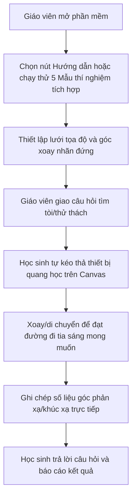

# 📖 HƯỚNG DẪN SỬ DỤNG PHÒNG THÍ NGHIỆM VẬT LÝ ẢO
## ⚛️ Công cụ Mô phỏng Quang học 2D (Optics Virtual Sandbox)

Tài liệu này cung cấp hướng dẫn chi tiết, hình ảnh minh họa quy trình, các mẫu thí nghiệm thực tế và phương pháp sư phạm giúp **Giáo viên** và **Học sinh** dễ dàng làm quen, thực hành và giảng dạy hiệu quả với mô-đun mô phỏng quang học 2D.

---

## 🗺️ QUY TRÌNH TƯƠNG TÁC TỔNG QUAN

Dưới đây là sơ đồ các bước tương tác từ khi thiết kế bài học đến khi học sinh thực hành trên bảng thí nghiệm ảo:



---

## I. GIAO DIỆN & CÁC CÔNG CỤ TƯƠNG TÁC TRỰC QUAN

Giao diện chính được thiết kế tối giản, trực quan và hỗ trợ cảm ứng (touch-friendly):

1. **Cột Dụng Cụ (Cột bên trái)**:
   - 🔦 **Laser**: Nguồn phát ra tia sáng đỏ cường độ cao dọc theo hướng súng. Có thể đặt nhiều laser cùng lúc.
   - 🪞 **Gương phẳng**: Phản xạ tia sáng tuân theo định luật phản xạ ánh sáng (góc phản xạ bằng góc tới).
   - 🔍 **Thấu kính hội tụ**: Khúc xạ chùm tia sáng đi qua và hội tụ chúng tại tiêu điểm.
   - 🔺 **Lăng kính**: Tán sắc chùm sáng đơn sắc đỏ ban đầu thành quang phổ 7 màu cầu vồng.
   - 🗑️ **Xóa hết**: Làm sạch hoàn toàn bảng tương tác để bắt đầu thí nghiệm mới.
2. **Bảng Thí Nghiệm (Vùng tối ở giữa)**:
   - Mặt phẳng tương tác chính với **lưới Grid 50px** chìm rất trực quan giúp học sinh căn thẳng hàng.
   - **Nhãn số liệu góc quay trực tiếp** ($0^\circ$ đến $359^\circ$) luôn hiển thị thẳng đứng dưới mỗi thiết bị (không bị ngược chữ khi xoay).
3. **Thanh Trạng Thái & Điều Khiển (Góc dưới cùng)**:
   - Hiển thị thông tin vật thể đang chọn (Ví dụ: `Đang chọn: Gương phẳng 🪞 (45°)`).
   - Hỗ trợ các phím thao tác nhanh bằng chuột/cảm ứng: **↺ Xoay trái (-15°)**, **↻ Xoay phải (+15°)**, **🗑️ Xóa vật** đơn lẻ và **🔄 Vẽ lại tia sáng**.

---

## II. HƯỚNG DẪN THAO TÁC CƠ BẢN

```text
[Chọn dụng cụ ở cột trái] ➔ [Click vào canvas để đặt] ➔ [Click chọn vật (viền vàng)] ➔ [Cuộn chuột để xoay]
```

*   **Đặt thiết bị**: Click chọn nút dụng cụ ở cột trái ➔ Click chuột trái vào vị trí muốn đặt trên canvas.
*   **Di chuyển (Drag)**: Click chuột trái và giữ trên vật thể để kéo đi. Vật thể tự động bắt dính lưới **10px** để dễ dàng căn chỉnh trục quang học.
*   **Xoay tự do 360°**: Nhấp chọn vật thể (viền vàng phát sáng) ➔ Cuộn bánh xe chuột (Mouse Wheel) để xoay.
    *   *Mẹo hay*: **Giữ phím `Shift`** khi cuộn chuột để bắt chẵn góc **15°** ($0^\circ, 15^\circ, 30^\circ, 45^\circ...$).
*   **Xóa thiết bị đơn lẻ**: Chọn vật thể ➔ Nhấp nút **🗑️ Xóa vật** ở góc dưới màn hình.

---

## III. DỮ LIỆU MẪU & 5 THÍ NGHIỆM TÍCH HỢP SẴN (PRESETS)

Giáo viên có thể khởi chạy nhanh 5 mô hình thí nghiệm quang học mẫu trên thanh Top Bar:

### 1. 🧪 Mẫu 1: Hiện tượng tán sắc ánh sáng qua lăng kính
*   **Mục tiêu**: Chứng minh ánh sáng trắng (phức tạp) đi qua lăng kính bị phân tách thành dải màu cầu vồng.
*   **Cách mở nhanh**: Nhấp nút **🧪 Mẫu 1: Tán sắc** ở thanh trên cùng.
*   **Sơ đồ bố trí**:
    ```text
      (Laser chéo 20°) ➔  [ Lăng kính chéo 15° ] ➔ (Quang phổ 7 màu cầu vồng phân kỳ)
    ```
*   **Câu hỏi gợi mở cho học sinh**: 
    1. Khi đi qua lăng kính, các tia màu bị lệch về phía nào (phía đỉnh hay đáy lăng kính)?
    2. Tia màu nào bị lệch nhiều nhất? Tia màu nào bị lệch ít nhất?

---

### 2. 🧪 Mẫu 2: Hiện tượng hội tụ ánh sáng qua thấu kính
*   **Mục tiêu**: Trực quan hóa đường đi của chùm sáng song song qua thấu kính hội tụ.
*   **Cách mở nhanh**: Nhấp nút **🧪 Mẫu 2: Hội tụ** ở thanh trên cùng.
*   **Sơ đồ bố trí**:
    ```text
      (Laser song song 0°) ➔  | Thấu kính đứng 0° | ➔ ⤗ (Hội tụ tại tiêu điểm F)
    ```
*   **Câu hỏi gợi mở cho học sinh**:
    1. Hãy di chuyển thấu kính sang trái/phải dọc theo trục nằm ngang. Khoảng cách từ thấu kính đến tiêu điểm hội tụ có thay đổi không?
    2. Hãy xoay nhẹ thấu kính một góc $15^\circ$ và quan sát chùm tia hội tụ bị lệch như thế nào.

---

### 3. 🧪 Mẫu 3: Đường truyền tia sáng qua hệ nhiều gương
*   **Mục tiêu**: Thực hành định luật phản xạ ánh sáng liên tục qua nhiều bề mặt gương phẳng.
*   **Cách mở nhanh**: Nhấp nút **🧪 Mẫu 3: Phản xạ** ở thanh trên cùng.
*   **Sơ đồ bố trí**:
    ```text
                            [ Gương 1 (nghiêng 100°) ] 
                          ➚                            ➘
      (Laser nghiêng 335°)                              [ Gương 2 (nghiêng 45°) ] ➔ (Tia ló ra ngoài)
    ```
*   **Câu hỏi gợi mở cho học sinh**:
    1. Đo góc tới và góc phản xạ trên gương 1. Định luật phản xạ ánh sáng có nghiệm đúng không?
    2. Xoay gương 2 từ từ và nhận xét về hướng của tia ló cuối cùng.

---

### 4. 🧪 Mẫu 4: Nguyên lý hoạt động của Kính tiềm vọng (Periscope)
*   **Mục tiêu**: Minh họa cách truyền ánh sáng qua góc khuất hoặc chướng ngại vật trong thực tế (như tàu ngầm).
*   **Cách mở nhanh**: Nhấp nút **🧪 Mẫu 4: Kính tiềm vọng** trên thanh trên cùng.
*   **Sơ đồ bố trí**:
    ```text
        Laser (bên dưới) ➔ [ Gương 1 (45°) ] ➔ (Tia sáng đi thẳng đứng lên)
                                                     ↓
                                             [ Gương 2 (45°) ] ➔ Tia ló (nằm ngang bên trên)
    ```
*   **Câu hỏi gợi mở cho học sinh**:
    1. Tại sao hai gương phẳng cần được đặt song song và nghiêng đúng $45^\circ$?
    2. Nếu xoay gương 1 lệch đi $5^\circ$, điều gì xảy ra với đường truyền tia sáng tới gương 2?

---

### 5. 🧪 Mẫu 5: Tổ hợp Hội tụ qua thấu kính & Phản xạ qua gương
*   **Mục tiêu**: Thí nghiệm nâng cao kết hợp khúc xạ qua thấu kính và phản xạ qua gương tại cùng một điểm.
*   **Cách mở nhanh**: Nhấp nút **🧪 Mẫu 5: Hội tụ & Phản xạ** trên thanh trên cùng.
*   **Sơ đồ bố trí**:
    ```text
      Laser 1 ➔ 
                 \
                  ➔ | Thấu kính | ➔ (Hội tụ chùm tia) ➔ [ Gương phẳng chéo (120°) ] ➔ (Phản xạ chéo)
                 /
      Laser 2 ➔ 
    ```
*   **Câu hỏi gợi mở cho học sinh**:
    1. Hai tia laser song song ban đầu hội tụ chính xác tại điểm nào? Điểm này nằm ở đâu so với gương phẳng?
    2. Hiện tượng gì xảy ra với chùm tia ló sau khi phản xạ qua gương chéo? Hãy mô tả độ loe (phân kỳ) của chùm tia phản xạ này.

---

## IV. PHƯƠNG PHÁP SƯ PHẠM DÀNH CHO GIÁO VIÊN

Giáo viên có thể sử dụng công cụ ảo này trong các bài học trên lớp hoặc giao bài tập về nhà:

1.  **Dùng giảng dạy trực quan (Lecture Demonstration)**:
    *   Trình chiếu màn hình mô phỏng lên bảng tương tác lớn trong lớp.
    *   Sử dụng các thí nghiệm mẫu 1, 2, 3 để giải thích lý thuyết trực quan thay cho dụng cụ thật dễ bị lệch hướng tia sáng do bụi bẩn hoặc ánh sáng phòng quá sáng.
2.  **Phương pháp học tập khám phá (Inquiry-Based Learning)**:
    *   Giáo viên đặt ra mục tiêu: *"Hãy tìm cách dẫn tia sáng từ điểm A đến điểm B mà không chạm vào vật cản ở giữa"*.
    *   Học sinh tự do tư duy, bố trí gương phẳng, tự đo đạc và điều chỉnh góc xoay thích hợp.
3.  **Thu thập dữ liệu thực nghiệm**:
    *   Yêu cầu học sinh sử dụng nhãn số liệu góc đứng hiển thị dưới mỗi vật để ghi chép bảng số liệu: Góc tới $i$ và góc phản xạ $i'$.
    *   Giúp học sinh rèn luyện kỹ năng thực hành vật lý thông qua môi trường số hóa an toàn.

---

## VI. THỬ THÁCH VÀ BÀI TẬP DÀNH CHO HỌC SINH

Học sinh hãy tự thực hiện các nhiệm vụ thử thách sau trên Canvas:

*   **🏆 Thử thách 1: Hệ thống chống trộm bằng tia Laser (Laser Security System)**:
    *   *Nhiệm vụ*: Đặt 1 nguồn Laser ở góc trái màn hình. Sử dụng tối thiểu **4 gương phẳng** để dẫn tia sáng đi vòng quanh màn hình theo hình chữ nhật và quay lại trúng vào súng laser ban đầu.
    *   *Kỹ năng rèn luyện*: Phản xạ liên tiếp, góc phản xạ cộng dồn.
*   **🏆 Thử thách 2: Tiêu điểm ảo của thấu kính**:
    *   *Nhiệm vụ*: Sử dụng 2 Laser song song bắn vào thấu kính hội tụ. Ghi nhận vị trí tiêu điểm hội tụ. Sau đó, thay đổi góc bắn của nguồn laser chéo đi $15^\circ$ và giải thích tại sao tiêu điểm ảnh bị dịch chuyển lên/xuống trên tiêu diện.
