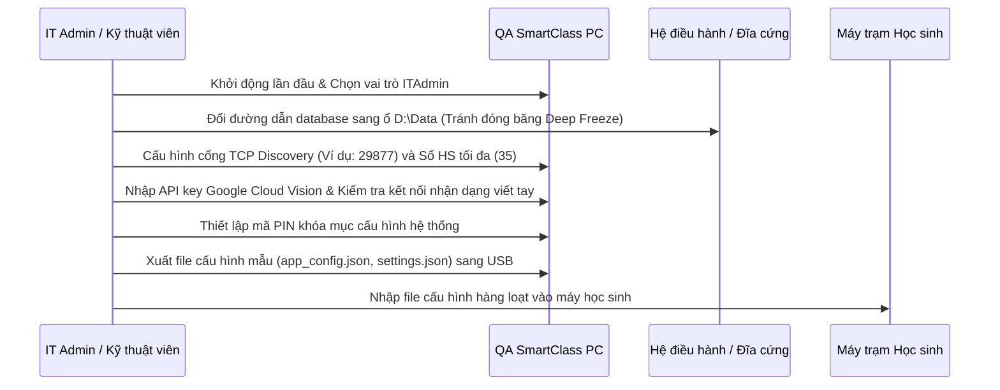

# TÀI LIỆU QUẢN TRỊ CẤU HÌNH & PHÂN QUYỀN HỆ THỐNG
## Chuẩn thiết kế sư phạm & Ràng buộc kỹ thuật QA SmartClass v4.1

Tài liệu này tập hợp toàn bộ thông tin về các tham số thiết lập hệ thống, sơ đồ phân quyền theo vai trò người dùng (Admin, Hiệu trưởng, Giáo viên, Học sinh...), đặc tả các tập tin cấu hình vật lý và cơ sở dữ liệu SQLite trong hệ sinh thái **QA SmartClass v4.1**.

---

## I. MA TRẬN PHÂN QUYỀN VAI TRÒ NGƯỜI DÙNG (ROLE-BASED PERMISSION MATRIX)

Mỗi vai trò (User Role) quyết định trực tiếp khả năng xem, chỉnh sửa các thẻ cài đặt tương ứng:

| Mã Vai trò | Tên Vai trò hiển thị | Thẻ cấu hình được phép Sửa (Write) | Thẻ cấu hình chỉ được Xem (Read-only) | Thẻ cấu hình bị Ẩn hoàn toàn (Hidden) |
| :--- | :--- | :--- | :--- | :--- |
| **ITAdmin** | Quản trị viên CNTT | Mạng & Kết nối, API & Tích hợp, Hiệu năng, Lưu trữ (Reset DB, Xóa cache) | Tất cả các thẻ | Không có |
| **SchoolAdmin**| Ban Giám hiệu / Hiệu trưởng | Cấu hình trường học (Xem), Nhật ký hệ thống | Mạng & Kết nối, Hiệu năng, Lưu trữ, Cấu hình điểm | API & Tích hợp, Đổi mật khẩu GV, Cấu hình điểm (Write) |
| **Teacher** | Giáo viên (Smart Class) | Tài khoản cá nhân, Đổi mật khẩu GV, Cấu hình điểm, Cấu hình trường (cục bộ) | Hiệu năng, Mạng & Kết nối, Lưu trữ (chỉ xem dung lượng) | API & Tích hợp (Ẩn khóa API), Reset DB |
| **Student** | Học sinh | Không có | Thông tin phần mềm, Giao diện (Cỡ chữ học sinh) | Tất cả các thẻ cấu hình hệ thống, quản trị |
| **Librarian** | Nhân viên thư viện | Cấu hình tài liệu, Danh mục sách mượn/trả | Thông tin phần mềm, Giao diện | Cấu hình mạng, Cấu hình điểm, API |

---

## II. ĐẶC TẢ TẬP TIN CẤU HÌNH VẬT LÝ (CONFIGURATION FILES SPECIFICATION)

Toàn bộ các tệp cấu hình được hệ thống sinh ra và quản lý tại đường dẫn gốc: `%LOCALAPPDATA%\QASmartClass\`

```
%LOCALAPPDATA%\QASmartClass\
├── smartclass.db                  (CSDL SQLite chính)
├── settings.json                  (Cấu hình ứng dụng chung)
├── user_role.json                 (Lưu vai trò người dùng hiện tại)
├── license.lic                    (Khóa bản quyền phần mềm)
└── Settings/
    ├── admin_security.json        (Mã PIN / Cấu hình bảo mật Admin)
    ├── app_config.json            (Chủ đề giao diện, Chế độ khởi động)
    ├── workstation.json           (Mã trạm, ID phòng Lab, IP máy trạm)
    └── camera_config.json         (Thông số thiết bị Camera & Microphone)
```

### 1. File `settings.json` (Cài đặt chung)
* **Đường dẫn:** `%LOCALAPPDATA%\QASmartClass\settings.json`
* **Cấu trúc dữ liệu mẫu:**
  ```json
  {
    "Theme": "Light",
    "Language": "vi",
    "FontSize": 14,
    "GraphicsQuality": "Auto",
    "TcpPort": 29877,
    "AutoReconnect": true,
    "MaxStudents": 35,
    "SavedAt": "2026-07-01T15:00:00.0000000+07:00"
  }
  ```

### 2. File `user_role.json` (Vai trò)
* **Đường dẫn:** `%LOCALAPPDATA%\QASmartClass\user_role.json`
* **Cấu trúc dữ liệu mẫu:**
  ```json
  {
    "Role": 2,
    "DisplayName": "Giáo viên",
    "SavedAt": "2026-07-01T15:00:00.0000000+07:00"
  }
  ```

### 3. File `workstation.json` (Định danh máy trạm trong phòng Lab)
* **Đường dẫn:** `%LOCALAPPDATA%\QASmartClass\Settings\workstation.json`
* **Mục đích:** Khai báo mã máy trạm để đồng bộ sơ đồ mạng phòng máy (Topology).
* **Cấu trúc dữ liệu mẫu:**
  ```json
  {
    "WorkstationId": "WS-CLASS01-05",
    "RoomId": "LAB01",
    "ServerIP": "192.168.1.100",
    "IsTeacherPC": false
  }
  ```

---

## III. THAM SỐ CẤU HÌNH TRONG CƠ SỞ DỮ LIỆU (DATABASE SYSTEM SETTINGS)

Các cấu hình mang tính chất Master điều khiển hoạt động trình chiếu và bảo mật tương tác giữa giáo viên và học sinh được lưu giữ trong bảng `SystemSettings` của CSDL SQLite `smartclass.db`.

```
Bảng [SystemSettings]
┌─────────────────────────────────┬──────────────┬──────────────┬────────────────────────────────────────────────────────────────────────┐
│ Id (Khóa chính)                 │ Value        │ Category     │ Description (Mô tả nghiệp vụ sư phạm)                                  │
├─────────────────────────────────┼──────────────┼──────────────┼────────────────────────────────────────────────────────────────────────┤
│ Broadcast_UdpHeartbeatTimeout   │ "15"         │ "Broadcast"  │ Thời gian (giây) tự động mở khóa máy học sinh khi mất tín hiệu UDP. (UPGRADE_07: 10→15s) │
│ Broadcast_EnableScreenExclusion │ "true"       │ "Broadcast"  │ Bật chế độ ẩn cửa sổ điều khiển của Giáo viên khi đang trình chiếu.     │
│ GoogleCloudVisionApiKey         │ "[Encrypted]"│ "API"        │ Khóa API Cloud Vision dùng cho nhận diện chữ viết tay học sinh.        │
└─────────────────────────────────┴──────────────┴──────────────┴────────────────────────────────────────────────────────────────────────┘
```

---

## IV. QUY TRÌNH THIẾT LẬP HỆ THỐNG TỪNG BƯỚC CHO IT ADMIN

Để triển khai hệ thống an toàn, IT Admin thực hiện theo các bước chuẩn hóa sau:



### Bước 1: Khởi động và thiết lập Vai trò
1. Chạy phần mềm lần đầu, chọn vai trò **Quản trị viên CNTT**.
2. Thiết lập mã PIN truy cập Admin tại thẻ *Bảo mật*.

### Bước 2: Cấu hình đường dẫn dữ liệu chống đóng băng đĩa (Bypass Deep Freeze)
1. Di chuyển file `smartclass.db` từ `%LOCALAPPDATA%` sang ổ đĩa `D:\QAData\`.
2. Khai báo đường dẫn lưu trữ mới trong phần mềm để trỏ chính xác CSDL sang ổ `D:`.

### Bước 3: Cài đặt kết nối Mạng & Livestream
1. Thiết lập cổng TCP (mặc định: `29877`). Nếu cổng bị trùng với phần mềm khác, đổi sang cổng trống lớn hơn `1024`.
2. Thiết lập giới hạn học sinh kết nối tối đa tùy thuộc vào sĩ số phòng Lab (mặc định: `35`).
3. Bật tính năng *Tự động kết nối lại* để ứng dụng tự sửa lỗi mất mạng tức thời.

### Bước 4: Tích hợp API trí tuệ nhân tạo (AI Features)
1. Nhập API Key Google Cloud Vision (được lưu mã hóa DPAPI an toàn).
2. Nhấn nút *Kiểm tra kết nối* để đảm bảo các tính năng dịch thuật, đọc văn bản và nhận diện chữ viết tay hoạt động chính xác.

---

## V. BẢNG KIỂM TRA ĐỊNH KỲ DÀNH CHO BAN GIÁM HIỆU & IT (AUDIT & MAINTENANCE CHECKLIST)

Định kỳ mỗi học kỳ (6 tháng một lần), cán bộ quản trị trường học cần thực hiện kiểm tra các thông số sau:

* **[ ] Kiểm tra Sao lưu CSDL:** Thực hiện bấm nút *Mở thư mục DB*, kiểm tra xem các file backup tự động (`smartclass_pre_phaseX.db`) có được sinh ra đầy đủ và lưu trữ ở phân vùng đĩa an toàn hay không.
* **[ ] Kiểm tra An toàn mật khẩu giáo viên:** Truy cập thẻ *Tài khoản*, thử nhập mật khẩu và đảm bảo màn hình chỉ hiển thị các ký tự che dấu `••••`, tuyệt đối không hiển thị plaintext.
* **[ ] Kiểm tra Độ trễ Trình chiếu:** Kết nối thử 5 máy học sinh, mở tính năng truyền màn hình và kiểm tra xem switch mạng LAN có bị quá tải hay không. Nếu có hiện tượng trễ hình vẽ, giảm chất lượng đồ họa 3D xuống mức *Trung bình* hoặc *Thấp*.
* **[ ] Kiểm toán Nhật ký (Audit Log):** Xem thẻ nhật ký để phát hiện các hành vi đăng nhập trái phép hoặc các thay đổi cấu hình hệ thống bất thường từ học sinh.
